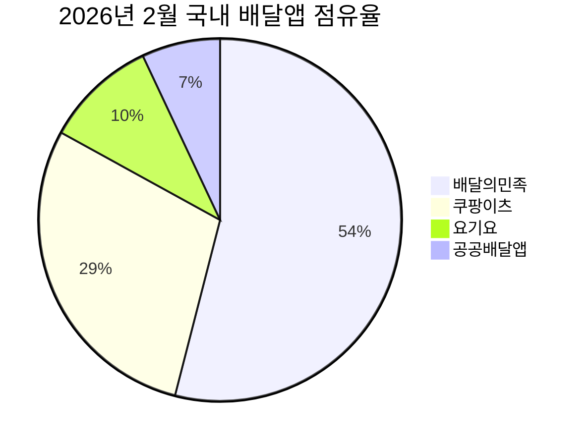
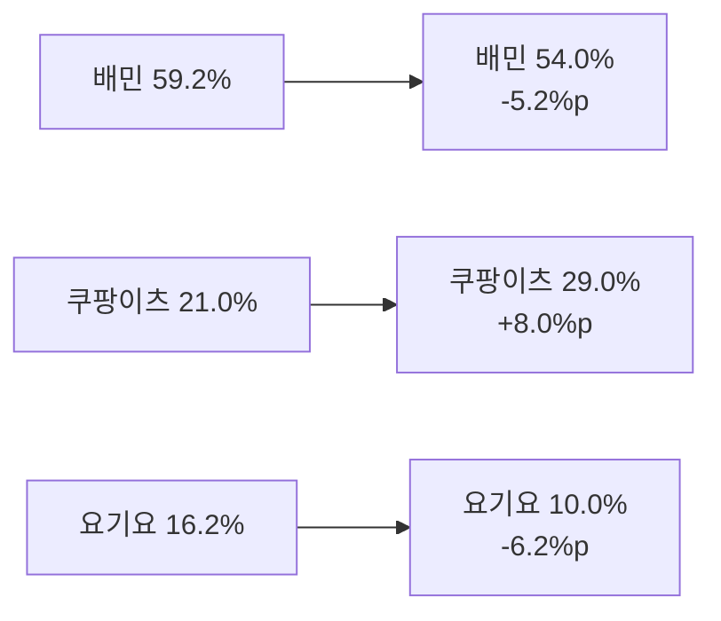

# 2026년 배달 시장 점유율 분석

**작성일**: 2026-07-28  
**Task Type**: research-report  
**생성 워크스페이스**: 2026-배달-시장-점유율-분석해줘

## 요약

2026년 2월 국내 배달앱 점유율은 배달의민족 54%, 쿠팡이츠 29%, 요기요 10%, 공공배달앱 약 7%로 파악된다. 출처는 매일경제(2026-03-30) 기사에 인용된 아이지에이웍스 수치다. 이 기준에서 시장은 여전히 배달의민족 우위지만, 쿠팡이츠가 29%까지 올라오며 추격이 실제 수치로 관찰되는 국면이다.

방향성 비교용 2024년 6월 수치인 배달의민족 59.2%, 쿠팡이츠 21.0%, 요기요 16.2%와 비교하면 배민-쿠팡이츠 격차는 38.2%p에서 25.0%p로 줄어든다. 다만 이 비교치는 나무위키 문서가 인용한 한국경제 링크를 따라간 2차 인용 체인이므로, 확정 예측값이 아니라 추세 해석용 참고치로만 봐야 한다.

## 핵심 인사이트

1. 국내 배달앱 시장은 `CR3 93%`, `HHI 3,906`의 고집중 시장이다. 계산 기준은 2026년 2월 점유율 `54 + 29 + 10 = 93`, `54^2 + 29^2 + 10^2 + 7^2 = 3,906`이다. 출처는 매일경제(2026-03-30).
2. 배달의민족과 쿠팡이츠의 격차는 방향성 비교 기준 `59.2 - 21.0 = 38.2%p`에서 `54.0 - 29.0 = 25.0%p`로 줄어들었다. 축소폭은 `13.2%p`다. 출처는 2024년 6월 보조 참고치(나무위키의 한국경제 재인용)와 2026년 2월 직접 확인치(매일경제 2026-03-30)다.
3. 사용자 수 흐름도 같은 방향을 가리킨다. 인더스트리뉴스(2024-11-13)에 따르면 2024년 10월 사용자 수는 배민 2,207만, 쿠팡이츠 883만, 요기요 497만, 땡겨요 84만이며 전월 대비 증감률은 배민 `-2.5%`, 쿠팡이츠 `+5.6%`, 땡겨요 `+13.5%`였다. 이 수치는 점유율과 다른 지표이므로 환산하지 않고 경쟁 방향성 확인용 보조 근거로만 사용한다.
4. 쿠팡이츠 상승 배경으로는 무료배달, 멤버십 연계, 퀵커머스 확장이 가장 설득력 있는 설명이다. 다만 현재 확보 자료만으로 각 요인의 기여도를 계량화할 수는 없다. 따라서 이는 `증거로 직접 확정된 사실`이 아니라 `점유율 상승과 시장 구조 변화 사이의 해석`으로 보는 것이 안전하다.
5. 공공배달앱 7%는 단일 사업자 수치가 아니라 `땡겨요 등`의 묶음 수치다. 따라서 시장은 `배민 vs 쿠팡이츠` 양강 경쟁에 `공공/저수수료 축`이 압박을 가하는 구조로 읽는 편이 적절하다.

## 추천 사항

1. 경영 보고의 핵심 지표를 절대 점유율 단일값보다 `배민-쿠팡이츠 격차`와 `격차 축소 폭`으로 재설정한다.
2. 무료배달, 멤버십, 배송시간 경쟁이 실제 점유율에 미치는 영향을 후속 업데이트에서 별도 추적한다.
3. 사용자 수, 점유율, 거래액, 퀵커머스 시장 규모를 같은 분모처럼 혼용하지 않는 보고 체계를 유지한다.
4. 공공배달앱은 아직 7% 수준의 묶음 수치지만 저수수료 축으로 별도 모니터링한다.
5. 다음 업데이트에서는 2026년 하반기 최신 점유율 원문과 지역별 침투 데이터를 우선 확보한다.

## 점유율 스냅샷

| 플랫폼 | 2026-02 점유율 | 출처 | 해석 |
|------|------:|------|------|
| 배달의민족 | 54% | 매일경제 2026-03-30 | 여전히 1위 |
| 쿠팡이츠 | 29% | 매일경제 2026-03-30 | 가장 강한 추격자 |
| 요기요 | 10% | 매일경제 2026-03-30 | 3위 약화 |
| 공공배달앱 | 7% | 매일경제 2026-03-30 | 저수수료 보조축 |

## 점유율 변화

| 플랫폼 | 2024-06 | 출처/신뢰도 | 2026-02 | 출처/신뢰도 | 변화 |
|------|------:|------|------:|------|------:|
| 배달의민족 | 59.2% | 나무위키 재인용, 보조 참고 | 54.0% | 매일경제 2026-03-30, 직접 확인 | -5.2%p |
| 쿠팡이츠 | 21.0% | 나무위키 재인용, 보조 참고 | 29.0% | 매일경제 2026-03-30, 직접 확인 | +8.0%p |
| 요기요 | 16.2% | 나무위키 재인용, 보조 참고 | 10.0% | 매일경제 2026-03-30, 직접 확인 | -6.2%p |

배달의민족과 쿠팡이츠의 격차는 2024년 6월 `38.2%p`에서 2026년 2월 `25.0%p`로 줄었다. 계산상 축소폭은 `13.2%p`다. 다만 출발점이 2차 인용 수치이므로 `격차 축소의 존재`는 참고할 수 있어도 `축소 속도의 정밀 추정`까지 단정해서는 안 된다.

## 시장 집중도

| 지표 | 값 | 계산 근거 | 의미 |
|------|---:|------|------|
| CR1 | 54% | 배달의민족 점유율 | 1위 사업자 우위 유지 |
| CR3 | 93% | 54 + 29 + 10 | 상위 3개 사업자 과점 |
| HHI | 3,906 | 54^2 + 29^2 + 10^2 + 7^2 | 고집중 시장 |

## 시각자료

## 구조적 해석

직접 확인 데이터만 놓고 보면 가장 안전한 결론은 세 가지다. 첫째, 1위는 여전히 배달의민족이다. 둘째, 2위 쿠팡이츠의 추격이 실수치로 확인된다. 셋째, 시장은 소수 사업자에 집중된 구조다.

무료배달, 멤버십, 퀵커머스가 쿠팡이츠 상승을 설명하는 유력 가설인 것은 맞다. 특히 Mordor Intelligence(2026-05-28)는 한국 퀵커머스 시장 규모를 2026년 `USD 3.35B`, 2025년 `10분 이내 배송` 비중을 `55.25%`로 제시한다. 이는 빠른 배송 경험이 경쟁력이라는 산업 배경을 보여준다. 다만 이번 산출물 범위에서는 이 배경과 쿠팡이츠 점유율 상승의 인과 기여도를 수치로 분해할 근거까지는 확보하지 못했다.

## 보조 데이터

| 지표 | 값 | 출처 | 용도 |
|------|---:|------|------|
| 배민 사용자 수 | 2,207만 | 인더스트리뉴스 2024-11-13 | 최근 저변 규모 |
| 쿠팡이츠 사용자 수 | 883만 | 인더스트리뉴스 2024-11-13 | 추격 강도 |
| 요기요 사용자 수 | 497만 | 인더스트리뉴스 2024-11-13 | 3위 약화 |
| 땡겨요 사용자 수 | 84만 | 인더스트리뉴스 2024-11-13 | 공공앱 확대 조짐 |
| 한국 퀵커머스 시장 | USD 3.35B | Mordor Intelligence 2026-05-28 | 즉시배송 경쟁 배경 |
| 10분 이내 배송 비중 | 55.25% | Mordor Intelligence 2026-05-28 | 빠른 배송 기대 강화 |

## 데이터 주의사항

- 2026년 2월 점유율은 매일경제(2026-03-30) 기사에 인용된 아이지에이웍스 수치를 기준으로 사용했다.
- 2024년 6월 비교치는 직접 원문을 확보하지 못해 나무위키 문서가 인용한 한국경제 수치를 방향성 참고치로만 사용했다.
- 사용자 수, 점유율, 퀵커머스 시장 규모는 서로 다른 지표이므로 하나의 분모로 환산하지 않았다.
- 무료배달, 멤버십, 보조금, 배송시간 경쟁이 실제 점유율에 얼마나 기여했는지는 현재 확보된 자료만으로 정량 분해할 수 없다.

## 출처 목록

1. 매일경제, 2026-03-30, <https://www.mk.co.kr/news/business/12002584>
2. 인더스트리뉴스, 2024-11-13, <https://www.industrynews.co.kr/news/articleView.html?idxno=56944>
3. Mordor Intelligence, Online Food Delivery Market, updated 2026-05-05, <https://www.mordorintelligence.com/industry-reports/online-food-delivery-market>
4. Mordor Intelligence, South Korea Quick Commerce Market, updated 2026-05-28, <https://www.mordorintelligence.com/industry-reports/south-korea-quick-commerce-market>
5. 나무위키 `배달앱`, 확인본 수정시각 2026-07-17, <https://namu.wiki/w/배달앱>
