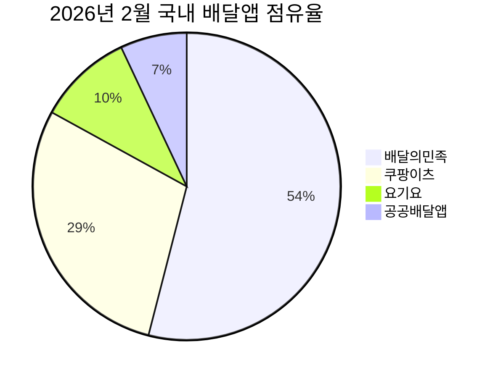
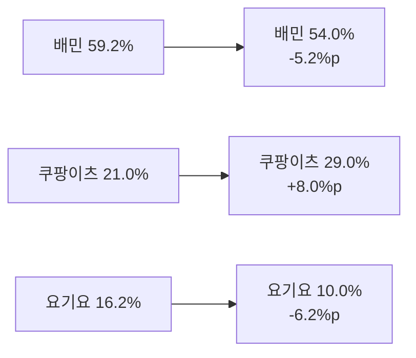
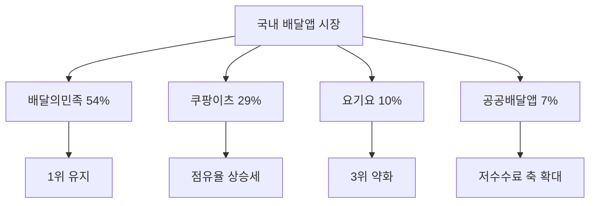

Creator: member-delta
Created: 2026-07-28 18:35
Version: 1.0

# 시각자료 개요

본 시각자료는 이번 워크스페이스의 `member-gamma/fact-check-log.md`와 `member-alpha/analysis-report.md`에 적힌 수치만 재구성했다. 핵심은 `현재 점유율 구조`, `2024-06 -> 2026-02 변화`, `시장 집중도`를 한눈에 보이게 하는 것이다. 2026년 2월 점유율은 매일경제(2026-03-30, 아이지에이웍스 인용), 2024년 6월 비교치는 나무위키 문서가 인용한 한국경제 수치, 사용자 수는 인더스트리뉴스(2024-11-13), 퀵커머스 보조 지표는 Mordor Intelligence(2026-05-28) 기준이다.

# Mermaid 다이어그램

현재 점유율 구조를 요약한 다이어그램.

2024년 6월 대비 2026년 2월 변화 흐름.

시장 집중도와 경쟁 구도 해석용 다이어그램. 아래 라벨은 점유율 흐름을 요약한 해석이며, 공공배달앱 7%는 단일 브랜드가 아닌 묶음 수치다.

# 핵심 수치 테이블

## 점유율 비교

| 플랫폼 | 2024-06 | 2026-02 | 변화 |
|------|------:|------:|------:|
| 배달의민족 | 59.2% | 54.0% | -5.2%p |
| 쿠팡이츠 | 21.0% | 29.0% | +8.0%p |
| 요기요 | 16.2% | 10.0% | -6.2%p |
| 공공배달앱 | - | 7.0% | - |

## 시장 집중도

| 지표 | 값 | 해석 |
|------|---:|------|
| CR1 | 54% | 1위 사업자 지배력 유지 |
| CR3 | 93% | 상위 3개 사업자 집중 |
| HHI | 3,906 | 고집중 시장 |

## 보조 지표

| 지표 | 값 | 출처 | 용도 |
|------|---:|------|------|
| 배민 사용자 수 | 2,207만 | 인더스트리뉴스 2024-11-13 | 최근 저변 규모 |
| 쿠팡이츠 사용자 수 | 883만 | 인더스트리뉴스 2024-11-13 | 추격 강도 확인 |
| 요기요 사용자 수 | 497만 | 인더스트리뉴스 2024-11-13 | 3위 약화 확인 |
| 땡겨요 사용자 수 | 84만 | 인더스트리뉴스 2024-11-13 | 공공앱 저변 확인 |
| 한국 퀵커머스 시장 | USD 3.35B | Mordor Intelligence 2026-05-28 | 구조 변화 배경 |
| 10분 이내 배송 비중 | 55.25% | Mordor Intelligence 2026-05-28 | 즉시배송 경쟁 강도 |

출처 메모: 점유율 표와 다이어그램의 2026년 2월 수치는 매일경제(2026-03-30)가 인용한 아이지에이웍스 데이터, 2024년 6월 비교치는 나무위키 문서가 인용한 한국경제 수치다.
