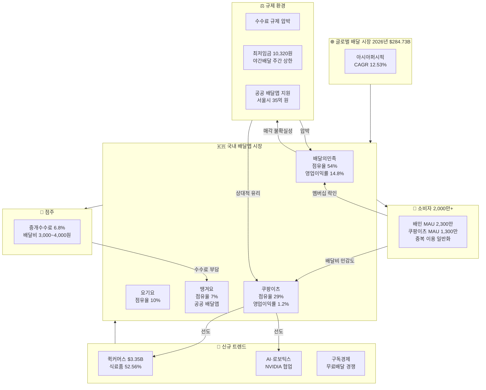
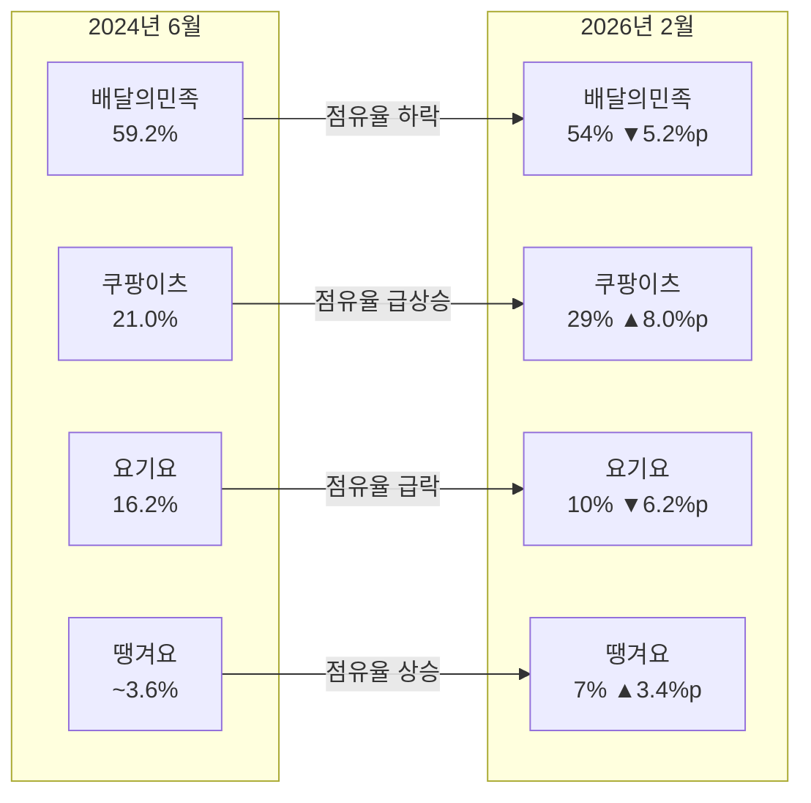
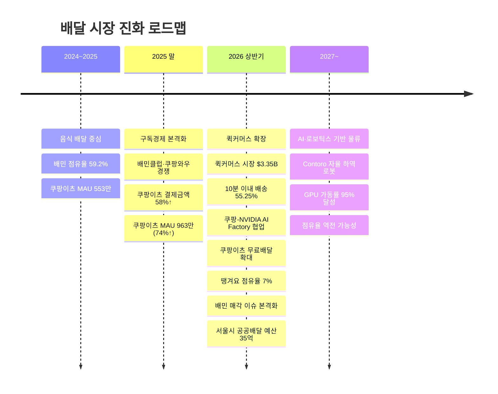

# 2026년 배달 시장 분석 — 최종 보고서

**작성일**: 2026-06-04  
**Task Type**: research-report  
**데이터 기준일**: 2026년 6월  
**생성 워크스페이스**: 2026-배달-시장-분석해줘

---

## 요약

본 보고서는 2026년 6월 현재 국내 배달 시장의 구조적 변화와 주요 플랫폼 간 경쟁 구도를 분석하고, 경영진의 전략적 의사결정을 위한 핵심 인사이트와 추천 사항을 제시합니다.

### 시장 현황

글로벌 배달 시장은 2026년 약 **$284.73B** 규모로, 2031년까지 연평균 **10.47%** 성장이 전망됩니다. 국내 배달앱 시장 또한 성장세를 유지하고 있으나, 플랫폼 간 **양극화 성장**이 심화되는 국면입니다.

### 경쟁 구도

| 플랫폼 | 2024.06 점유율 | 2026.02 점유율 | 변화 |
|--------|:-----------:|:-----------:|:----:|
| 배달의민족 | 59.2% | 54% | ▼ 5.2%p |
| 쿠팡이츠 | 21.0% | 29% | ▲ 8.0%p |
| 요기요 | 16.2% | 10% | ▼ 6.2%p |
| 땡겨요(공공) | ~3.6% | 7% | ▲ 3.4%p |

### 핵심 발견

1. **쿠팡이츠 점유율은 연 4.8%p 상승하고 배민과의 격차는 연 7.9%p 축소 중**이며, 현 추세 단순 연장 시 2029년 2분기 전후 역전 가능
2. **배달의민족 매각 이슈**가 시장 재편의 최대 변곡점으로 작용
3. 배달앱 산업이 **단순 음식 배달에서 퀵커머스·AI 물류·구독 기반 생활 물류 플랫폼**으로 진화 중
4. **수수료 규제 압박**이 플랫폼 수익 모델의 근본적 위협으로 부상

---

## 점유율 심층 분석 ★ 후속 분석 (2026-07-28)

> 이 섹션은 후속 지시 `2026년 배달 시장 점유율 분석`에 따라 기존 보고서를 보강한 내용이다. 수치 계산은 `member-gamma`가 확보한 원천 데이터 18건만 사용했으며, 2026.02 점유율은 CEO스코어데일리/아이지에이웍스 수치의 재인용 데이터라는 한계를 전제로 해석했다.

### (A) 시장 집중도

2026년 2월 기준 국내 배달앱 시장은 상위 4개 플랫폼이 사실상 시장 전체를 점유하는 고집중 구조다.

| 지표 | 값 | 해석 |
|------|---:|------|
| CR1 | 54% | 배달의민족 단일 1위 지배력은 여전히 높음 |
| CR3 | 93% | 상위 3개 플랫폼 중심의 초과점 구조 |
| HHI | 3,906 | `54^2 + 29^2 + 10^2 + 7^2`, 미국 DOJ 기준 highly concentrated |

핵심은 `1위 독주 시장`에서 `1위-2위 격차 축소 시장`으로 국면이 바뀌고 있다는 점이다. 절대 1위는 여전히 배달의민족이지만, 점유율 변화의 방향성은 쿠팡이츠 쪽으로 기울어 있다.

### (B) 점유율 변화 속도 (Velocity)

| 플랫폼 | 2024.06 | 2026.02 | 20개월 변화 | 월 평균 변화 | 연 환산 변화 |
|--------|:-------:|:-------:|:-----------:|:------------:|:------------:|
| 배달의민족 | 59.2% | 54.0% | -5.2%p | -0.26%p | -3.1%p |
| 쿠팡이츠 | 21.0% | 29.0% | +8.0%p | +0.40%p | +4.8%p |
| 요기요 | 16.2% | 10.0% | -6.2%p | -0.31%p | -3.7%p |
| 땡겨요 | ~3.6% | 7.0% | +3.4%p | +0.17%p | +2.0%p |

- 배민-쿠팡이츠 격차는 `38.2%p -> 25.0%p`로 20개월 동안 `13.2%p` 축소됐다.
- 격차 축소 속도는 월 `0.66%p`, 연 `7.9%p` 수준이다.
- 상위 4개 앱 내부 이동으로 단순 해석하면, 쿠팡이츠는 배민과 요기요가 잃은 점유율의 약 `70%`를 흡수했고 나머지를 땡겨요가 가져간 셈이다.

### (C) 역전 시나리오

아래 시나리오는 모두 단순 선형 외삽이며, 실제 예측이 아니라 현재 추세의 민감도 점검용이다.

| 시나리오 | 가정 | 배민-쿠팡이츠 역전 시점 | 해석 |
|----------|------|------------------------|------|
| Base | 현재 추세 유지 (`배민 -0.26%p/월`, `쿠팡이츠 +0.40%p/월`) | 2029년 2분기 전후 | 가장 기계적인 기준선 |
| Upside | 무료배달 확대와 배민 매각 불확실성 심화 (`격차 축소 0.80%p/월`) | 2028년 하반기 | 쿠팡이츠 가속 시나리오 |
| Downside | 시장 포화와 배민 방어 강화 (`격차 축소 0.45%p/월`) | 2030년 하반기 | 역전 시점이 크게 늦어지는 경우 |

영향 변수가 가장 큰 항목은 세 가지다. `1)` 배민 매각 성사 여부와 인수자 성격, `2)` 쿠팡이츠의 낮은 수익성(영업이익률 1.2%)이 공격적 마케팅을 얼마나 오래 버틸 수 있는지, `3)` 수수료 규제 강화가 선두 사업자 수익성에 얼마나 직접 타격을 주는지다.

### (D) 지역별 침투도 차이

기존 수집 데이터와 언론 재인용을 종합하면, 쿠팡이츠는 수도권과 일부 서울 핵심 상권에서 가장 빠르게 침투하고 있다. 반면 지방 중소도시에서는 배달의민족이 전국 단위 라이더 네트워크와 브랜드 선점 효과를 바탕으로 상대적으로 높은 방어력을 유지한다.

- 수도권: 쿠팡이츠가 30% 안팎까지 올라오며 추격 강도가 높음
- 서울 일부 지역: 배민 추월 사례가 보도될 정도로 경쟁이 접전 양상
- 지방 중소도시: 배민 우위가 더 강해 전국 평균 역전 시점은 수도권보다 늦게 나타날 가능성

즉, 전국 평균 점유율은 빠르게 좁혀지고 있지만 실제 역전은 `수도권 선행 -> 전국 확산` 순서로 진행될 가능성이 높다.

### (E) 글로벌 비교

Mordor Intelligence에 따르면 2025년 글로벌 온라인 음식 배달 시장은 북미가 매출의 `37.54%`를 차지했고, 아시아퍼시픽이 `12.53% CAGR`로 가장 빠르게 성장한다. 동시에 글로벌 시장 구조는 `moderately fragmented`로 설명된다.

한국 시장은 이와 다르다. 성장 산업이라는 점은 같지만, 국내는 CR3가 `93%`에 달하는 초고집중 시장이다. 즉 글로벌 시장이 `분산 성장`에 가깝다면, 한국 시장은 `높은 집중도 안에서 선두권 재편이 빠르게 진행되는 시장`으로 보는 편이 맞다.

---

## 시장 분석

### 글로벌 및 국내 배달 시장 규모

Mordor Intelligence(2026.01, 최종 업데이트 2026.05.05)에 따르면:

| 지표 | 수치 |
|------|------|
| 2025년 글로벌 시장 규모 | $257.74B |
| **2026년 글로벌 시장 규모** | **$284.73B** |
| 2031년 전망 | $468.51B |
| 예측 기간 CAGR | **10.47%** (2026-2031) |
| 최고 성장 지역 | 아시아퍼시픽 (CAGR 12.53%) |
| 모바일 주문 비중 | 82.76% (2025년) |

한국의 배달앱 시장은 정량적 원화 규모 데이터가 직접 포함되지 않았으나, 다음 지표로 간접 추정이 가능하다:

- **MAU**: 배민 약 2,300만 + 쿠팡이츠 약 1,300만 + 요기요 약 400만 = 합계 약 4,000만 명(중복 포함)
- **국내 배달앱 이용자**: 2,000만 명 이상
- **배민 매출**: 약 4조 3,226억 원 (2024년), 영업이익률 14.8%
- **쿠팡이츠 매출**: 약 1조 8,819억 원 (2024년), 결제금액 전년비 58% 증가 (2025년)
- **퀵커머스 시장**: 2026년 $3.35B (약 4.8조 원, 환율 1,430원 기준), CAGR 6.11%

국내 퀵커머스가 2026년 약 $3.35B, 2031년 $4.51B로 연평균 6.11% 성장할 것으로 전망되며, 식료품이 52.56%를 차지한다. 배달앱 시장 자체도 두 자릿수 성장을 이어가고 있으나, 플랫폼 간 격차가 벌어지는 **양극화 성장** 국면에 진입한 것으로 판단된다.

---

### 플랫폼별 경쟁 구도 분석

#### ① 배달의민족 — 압도적 1위, 그러나 하락세

- 2024년 매출 4조 3,226억 원, 영업이익 6,408억 원, 영업이익률 14.8%로 수익성 우수
- 2024.06 대비 2026.02까지 점유율 5.2%p 하락 (59.2% → 54%)
- 딜리버리히어로(DH)의 자회사로서 **2026년 매각 이슈**가 최대 리스크
- 중개수수료 6.8% (가게배달 7.8%), 배달비 약 3,000~4,000원 수준

#### ② 쿠팡이츠 — 가장 공격적인 성장세

- 2024.06 → 2026.02 점유율 8.0%p 상승 (21% → 29%)
- 2025년 결제금액 전년비 **58% 증가**, 카드 결제액 118% 급증 (월 2,700억 → 5,878억 원)
- 앱 사용자 74% 증가 (MAU 553만 → 963만, 2024년 1월→12월)
- **2026.06 일반회원 무료배달 확대**
- 쿠팡 커머스 MAU 3,325만 명(2026년 1분기 1위)의 시너지
- 2024년 영업이익률은 1.2%로 수익성은 낮은 수준 — 외형 성장에 집중하는 전략

#### ③ 요기요 — 추락하는 3위

- 점유율 16.2% → 10%, 6.2%p 하락
- 2025년 상반기 매출 전년 동기 대비 29% 감소

#### ④ 땡겨요 — 공공 배달앱의 부상

- 점유율 7%까지 상승 (2025년 3% → 2026.02 7%)
- 회원 475만 명, 가맹점 21만 개 (2024년 말), 2025년 회원 500만 명 이상
- 서울시 2026년 공공배달 예산 35억 원 편성 — 전년(1.8억) 대비 19.4배 증가

---

### 비주얼: 배달 시장 생태계 구조도

---

### 비주얼: 점유율 변화 흐름 (2024.06 → 2026.02)

---

### 비주얼: 배달 시장 진화 트렌드 타임라인

---

### 핵심 수치 요약

#### 글로벌 배달 시장

| 지표 | 수치 | 비고 |
|------|------|------|
| 2025년 글로벌 시장 규모 | $257.74B | Mordor Intelligence |
| 2026년 글로벌 시장 규모 | $284.73B | Mordor Intelligence |
| 2031년 전망 | $468.51B | Mordor Intelligence |
| CAGR (2026-2031) | 10.47% | 아시아퍼시픽 12.53% |
| 모바일 주문 비중 | 82.76% | 2025년 기준 |

#### 국내 배달앱 플랫폼 점유율 및 주요 지표

| 플랫폼 | 2024.06 | 2026.02 | 변화 | MAU | 매출 (2024) | 영업이익률 |
|--------|:-----:|:-----:|:---:|-----|------------|:--------:|
| 배달의민족 | 59.2% | 54% | ▼5.2%p | 2,300만 | 4조 3,226억 원 | 14.8% |
| 쿠팡이츠 | 21.0% | 29% | ▲8.0%p | 1,300만 | 1조 8,819억 원 | 1.2% |
| 요기요 | 16.2% | 10% | ▼6.2%p | 400만 | — | — |
| 땡겨요 | ~3.6% | 7% | ▲3.4%p | — | — | — |

#### 퀵커머스 및 신규 트렌드 지표

| 트렌드 | 지표 | 수치 |
|--------|------|:----:|
| 퀵커머스 | 2026년 시장 규모 | $3.35B (약 4.8조 원) |
| | 2031년 전망 / CAGR | $4.51B / 6.11% |
| | 식료품 비중 | 52.56% |
| | 10분 이내 배송 비중 | 55.25% |
| AI·로보틱스 | 쿠팡 AI 스타트업 투자 | $8,400만+ |
| | GPU 가동률 개선 | 65% → 95% |
| 구독·멤버십 | 쿠팡이츠 결제금액 증가율 | 58% (2025년 YoY) |
| 공공 배달 | 서울시 2026년 예산 | 35억 원 (전년비 19.4배↑) |
| | 땡겨요 회원 수 | 500만 명+ |

---

## 핵심 인사이트

### 인사이트 1: 쿠팡이츠의 추격 속도, 2029년 전후 역전 가능성

2024.06 대비 2026.02까지 20개월 동안 쿠팡이츠 점유율은 8.0%p 상승했고 배민은 5.2%p 하락했다. 그 결과 양사 격차는 38.2%p에서 25.0%p로 줄었고, 격차 축소 속도는 연 `7.9%p` 수준이다. 이 추세를 그대로 단순 선형 연장하면 **2029년 2분기 전후 점유율 역전 가능성**이 도출된다.

**성장 동력**: 쿠팡이츠의 성장은 단일 요인이 아닌 3중 시너지 구조에 기반한다:

| 레이어 | 자산 | 효과 |
|--------|------|------|
| 커머스 연계 | MAU 3,325만 (2026년 1분기 1위) | 배달로의 자연스러운 트래픽 전환 |
| 무료배달 확대 | 2026.06 일반회원 무료배달 도입 | 배달비 민감 소비자의 대규모 유입 |
| AI 물류 최적화 | NVIDIA DGX SuperPOD 협업 | 배송 비용 구조 자체의 경쟁 우위 |

**리스크**: 영업이익률 1.2%로 외형 성장 대비 수익성 취약. 배민 매각이 자본력 있는 인수자에게 이뤄질 경우, 배민의 반격 가능성 존재.

**비즈니스 시사점**: 쿠팡의 수직 계열화 전략(커머스 → 배달 → 물류 → AI)이 배달 시장에서도 작동 중. 단순히 '배달앱'이 아닌 '생태계'와 경쟁해야 하는 국면으로 전환.

---

### 인사이트 2: 배민 매각은 시장 재편의 최대 변곡점

딜리버리히어로(DH)가 한국 자회사인 우아한형제들(배달의민족) 매각을 추진 중. 인수 주체에 따라 시장 구도가 결정적으로 갈림.

**시나리오 분석**:

| 시나리오 | 시장 영향 | 가능성 |
|----------|-----------|:------:|
| 중국 메이퇀 인수 | 막대한 자본력으로 가격 경쟁 + AI 기술 이식 → 쿠팡과의 전면전 | 미확인 루머 |
| 국내 사모펀드 인수 | 수익성 최우선, 비용 통제, 공격적 투자 축소 → 점유율 방어전 | 유력 |
| 매각 무산 | DH 체제 유지, 불확실성 지속 → 투자 제약 지속 | 가능성 낮음 |

---

### 인사이트 3: 수수료 규제는 플랫폼 수익 모델의 근본적 위협

배민의 14.8% 영업이익률은 수익성이 과도하다는 비판의 근거로 작용하며, 정치권과 소상공인 단체의 규제 압박이 거세다.

**규제 영향 민감도**:

| 플랫폼 | 수수료 규제 | 노동 규제 | 비고 |
|--------|:---:|:---:|------|
| 배달의민족 | 高 | 中 | 높은 영업이익률이 규제 타깃 |
| 쿠팡이츠 | 低 | 中 | 저수익 구조(1.2%), 규제 충격 제한적 |
| 요기요 | 中 | 中 | 매출 감소 중으로 경쟁력 상실이 핵심 |
| 땡겨요 | 低 | 低 | 공공 성격으로 규제 수혜 가능성 |

- 2026년 최저임금 10,320원, 노동계 2027년 7~8% 추가 인상 요구
- 1만 원 주문 시 점주 실제 정산액 **10,167원**에 불과
- 2026.04 민주당 48시간 야간배달 노동자 주간 상한 제안

---

### 인사이트 4: 배달 플랫폼은 '생활 물류 플랫폼'으로 진화 중

| 지표 | 수치 | 의미 |
|------|------|------|
| 국내 퀵커머스 시장 규모 (2026) | $3.35B (~4.8조 원) | 배달앱의 TAM 확장 |
| 식료품 비중 | 52.56% | 식품 유통 채널로 진화 |
| 10분 이내 배송 비중 | 55.25% | 즉시성이 핵심 경쟁력 |

쿠팡은 커머스(로켓배송) → 퀵커머스(로켓프레시) → 배달(쿠팡이츠)로 수직 확장하며, NVIDIA와 AI Factory 협업으로 물류 최적화를 가속화 중(GPU 가동률 65%→95%). Contoro Robotics 등 로보틱스 스타트업에도 $8,400만 이상 투자.

**비즈니스 시사점**: 음식 배달만으로는 더 이상 시장 지배력을 유지할 수 없음. 생필품 즉시 배송, AI 기반 물류 최적화, 구독 멤버십 기반 록인 전략이 승패를 결정.

---

### 인사이트 5: 공공 배달앱(땡겨요)의 틈새 성장은 정책 리스크의 신호

서울시가 공공배달 예산을 1.8억 → 35억으로 19.4배 증액한 것은 지자체 차원의 배달 시장 개입 의지를 보여줌. 땡겨요가 7%까지 점유율을 올린 것은 **수수료 부담에 지친 소상공인의 대안 수요**를 반영. 지자체 지원이 전국 단위로 확대될 경우, 민간 플랫폼의 가격 결정력이 추가적으로 제약받을 수 있음.

---

## 추천 사항

### 경영진 의사결정 매트릭스

| 권고 | 시급성 | 투자 규모 | 기대 효과 | 리스크 미대응 시 |
|------|:---:|:---:|------|------|
| ① 배민 매각 대응 | ★★★★★ | 中 | 시장 재편 시 선제 포지셔닝 | 기회 상실 또는 시장 퇴출 위협 |
| ② AI 물류 투자 | ★★★★★ | 高 | 장기 비용 구조 우위 | 쿠팡과 격차 심화, 도태 |
| ③ 구독·록인 전략 | ★★★★ | 中 | 사용자 이탈 방지, LTV 향상 | 쿠팡이츠로의 고객 유출 지속 |
| ④ 규제·공공 대응 | ★★★★ | 低~中 | 규제 리스크 선제 관리 | 규제 강화 시 수익성 급감 |
| ⑤ 생태계 강화 | ★★★ | 中 | 공급망 안정화 | 가맹점·라이더 이탈 심화 |

### 권고 상세

**① [최우선] 배민 매각 시나리오별 대응 전략 수립**
- 시나리오 플래닝: 메이퇀 인수 / 국내 PEF 인수 / 매각 무산 각각에 대한 경쟁 대응 전략 사전 수립
- 배민 매각 불확실성 기간(2026년 하반기 예상)을 공격적 마케팅 기회로 활용

**② [긴급] AI 물류·퀵커머스 인프라 투자 가속화**
- AI 기반 배송 루트 최적화 시스템 도입 또는 파트너십 체결
- 도심형 마이크로 풀필먼트 센터(MFC) 전략적 거점 확보
- 배달 로보틱스/자율주행 PoC 추진 — 2027년까지 실증 단계 진입

**③ [중요] 구독·멤버십 기반 록인 전략 강화**
- 무료배달 혜택 확대 검토 (쿠팡이츠의 일반회원 무료배달에 대응)
- 배달 멤버십과 기존 서비스(결제, 쇼핑, 금융 등)의 번들 전략 개발

**④ [중요] 수수료 규제 대응 및 공공 배달앱 파트너십 전략**
- 자가진단: 자사 수익 구조의 수수료 의존도 및 시나리오별 손익 영향 시뮬레이션
- 선제적 상생안: 자발적 수수료 인하·배달비 지원 패키지
- 공공 배달앱 파트너십: 땡겨요 등과의 제휴(결제 인프라, 공동 물류 등) 가능성 검토

**⑤ [중기] 가맹점·라이더 생태계 강화**
- 가맹점 대상 수수료 인하·정산 주기 단축·매출 증대 지원 프로그램 확대
- 최저임금 인상(2027년 7~8% 인상 예상)에 대비한 라이더 비용 시뮬레이션

---

## 결론

2026년 한국 배달 시장은 **양극화 성장 + 구조적 재편**의 분기점에 서 있다. 글로벌 시장이 연 10% 이상 성장하는 가운데, 국내에서는 쿠팡이츠가 커머스·AI 물류·무료배달이라는 수직 계열화 전략으로 배민을 위협하고, 요기요는 존재감을 잃어가고 있다. 배민 매각과 수수료 규제라는 양대 변수는 2027~2029년 시장 구도를 결정할 핵심 요인이다. 퀵커머스·AI·로보틱스로의 진화 속도에서 뒤처지는 플랫폼은 살아남기 어려운 국면으로 진입하고 있다.

---

## 출처

| 출처 | 유형 | 날짜 |
|------|------|------|
| Mordor Intelligence — Online Food Delivery Market | 글로벌 리서치 | 2026.01 (업데이트 2026.05) |
| Mordor Intelligence — South Korea Quick Commerce Market | 글로벌 리서치 | 2026.01 (업데이트 2026.05) |
| Business Research Insights — Food Delivery Market | 글로벌 리서치 | 2026.05 |
| 한국경제 | 언론 보도 | 2024.07 |
| CEO스코어데일리 / 아이지에이웍스 | 앱 분석 | 2026.02 |
| 와이즈앱·리테일 | 앱 분석 | 2026.01 |
| 나무위키 — 배달앱 | 크라우드소싱 | 2026.05 |
| 뉴스피크 | 언론 보도 | 2026.06 |
| 머니투데이 | 언론 보도 | 2025.01 |
| 연합뉴스 / KBS | 언론 보도 | 2026.02~04 |
| 인더스트리뉴스 / NGO신문 | 언론 보도 | 2025~2026 |
| 위키트리 | 언론 보도 | 2026.04 |

> **데이터 주의사항**: 본 보고서의 수치는 member-gamma 가 WebSearch/WebFetch 로 수집한 18건의 원천 데이터에 기반합니다. CEO스코어데일리 점유율은 블로그 재인용, 나무위키는 크라우드소싱 데이터, 일부 기사는 URL 만료로 2차 인용되었습니다. 정밀한 의사결정이 필요한 항목은 원문 교차 확인을 권고합니다.
