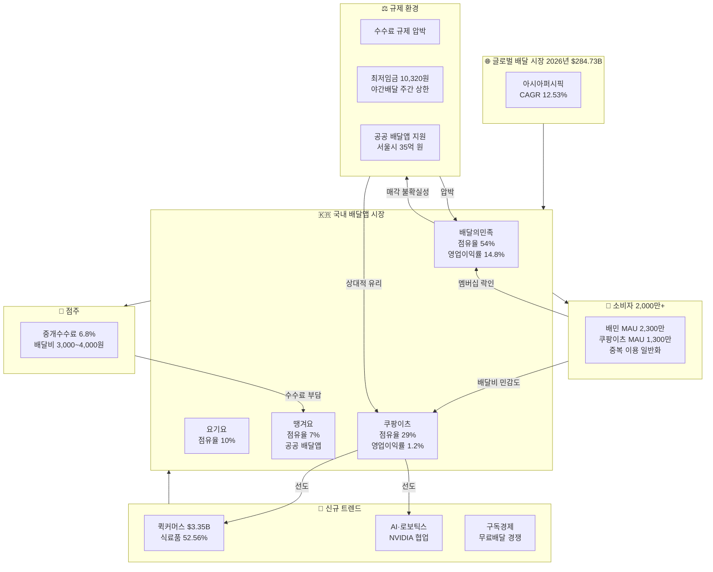
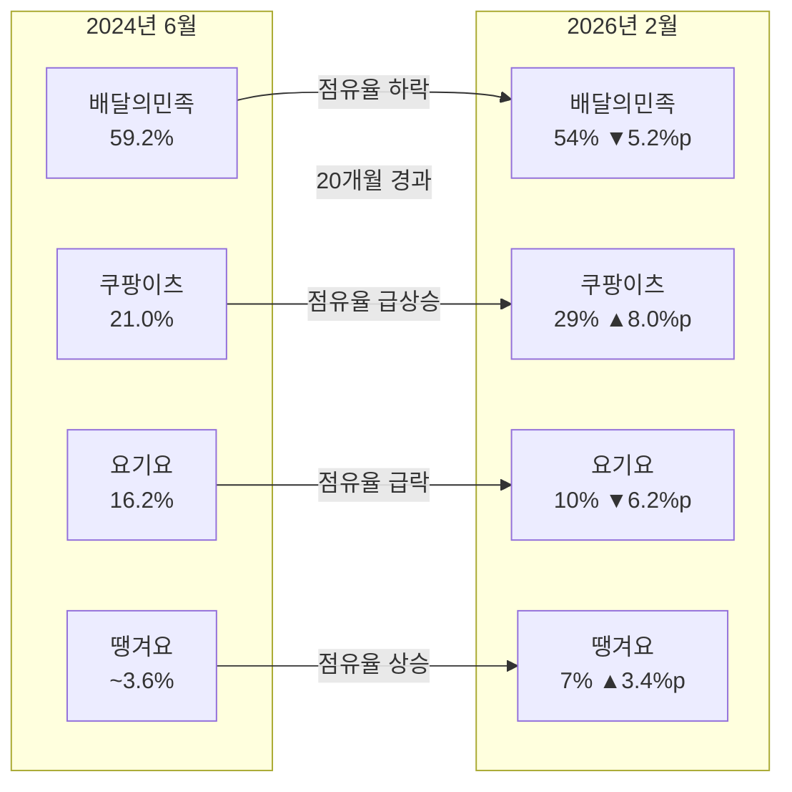
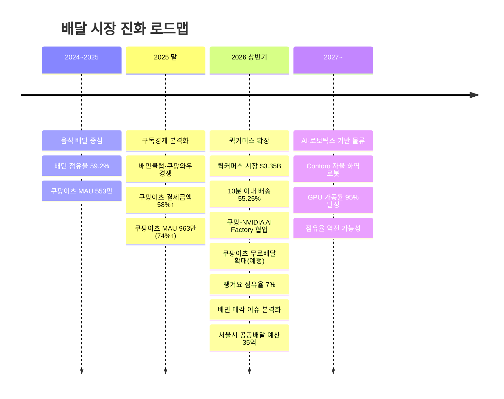

Creator: member-delta
Created: 2026-06-04
Version: 1.0

# 2026년 배달 시장 분석 시각화

## 시각자료 개요

본 문서는 member-alpha 의 분석 보고서에서 도출된 핵심 데이터를 Mermaid 다이어그램과 Markdown 표로 시각화한 자료이다.

- **목적**: 배달 시장의 구조, 경쟁 구도 변화, 트렌드 진화 방향을 직관적으로 전달
- **구성**: Mermaid 다이어그램 3종(시장 구조·경쟁 점유율 흐름·트렌드 타임라인) + 핵심 수치 테이블 3종
- **데이터 출처**: 모든 수치는 member-alpha 보고서 내 gamma 검증 데이터 기반 (Mordor Intelligence, CEO스코어데일리, 와이즈앱·리테일 등)

---

## Mermaid 다이어그램

### 1. 2026년 배달 시장 생태계 구조도

> 2026년 배달 시장을 둘러싼 주요 참여자와 가치 흐름. 플랫폼, 소비자, 점주, 규제 기관, 기술 투자 간 관계를 보여준다.

### 2. 국내 배달앱 점유율 변화 흐름 (2024.06 → 2026.02)

> 20개월간 주요 4개 플랫폼 점유율 변화. 쿠팡이츠와 땡겨요의 상승, 배민과 요기요의 하락이 뚜렷하다.

### 3. 배달 시장 진화 트렌드 타임라인

> 전통적 음식 배달에서 퀵커머스·AI 물류·로보틱스로 확장되는 진화 로드맵.

---

## 핵심 수치 테이블

### 테이블 1: 글로벌 배달 시장 규모

| 지표 | 수치 | 비고 |
|------|------|------|
| 2025년 글로벌 시장 규모 | $257.74B | Mordor Intelligence |
| **2026년 글로벌 시장 규모** | **$284.73B** | Mordor Intelligence |
| 2031년 전망 | $468.51B | Mordor Intelligence |
| 2035년 전망 | $243.03B | Business Research Insights (장기) |
| 예측 기간 CAGR (2026-2031) | **10.47%** | Mordor Intelligence |
| 대체 CAGR 전망 | 15.1% | Business Research Insights |
| 최고 성장 지역 | 아시아퍼시픽 (CAGR 12.53%) | Mordor Intelligence |
| 모바일 주문 비중 (2025) | 82.76% | Mordor Intelligence |

### 테이블 2: 국내 배달앱 플랫폼 점유율 및 주요 지표

| 플랫폼 | 2024.06 점유율 | 2026.02 점유율 | 변화 | MAU | 매출 (2024) | 영업이익률 | 핵심 전략 |
|--------|:-----------:|:-----------:|:----:|-----|------------|:---------:|----------|
| 배달의민족 | 59.2% | 54% | ▼ 5.2%p | 2,300만 | 4조 3,226억 원 | 14.8% | 수익성 방어, 매각 불확실 |
| 쿠팡이츠 | 21.0% | 29% | ▲ 8.0%p | 1,300만 | 1조 8,819억 원 | 1.2% | 무료배달 확대, AI·물류 투자 |
| 요기요 | 16.2% | 10% | ▼ 6.2%p | 400만 | — | — | 존재감 약화 |
| 땡겨요 | ~3.6%* | 7% | ▲ 3.4%p | — | — | — | 공공 지원, 회원 500만+ |
| **상위 3사 합계** | **96.4%** | **93%** | ▼ 3.4%p | — | — | — | — |

> * 2024.06 기준 땡겨요 점유율은 추정치.

### 테이블 3: 퀵커머스 및 신규 트렌드 지표

| 트렌드 | 지표 | 수치 | 비고 |
|--------|------|:----:|------|
| **퀵커머스** | 2026년 시장 규모 | $3.35B (약 4.8조 원) | 환율 1,430원 |
| | 2031년 전망 | $4.51B | |
| | CAGR (2026-2031) | 6.11% | |
| | 식료품 비중 | 52.56% | |
| | 10분 이내 배송 비중 | 55.25% | |
| **AI·로보틱스** | 쿠팡 AI 스타트업 투자 | $8,400만+ | 2023~현재 |
| | GPU 가동률 개선 | 65% → 95% | NVIDIA DGX SuperPOD |
| | 로보틱스 협업 | Contoro Robotics | 자율 컨테이너 하역 |
| **구독·멤버십** | 쿠팡이츠 결제금액 증가율 | 58% (2025년) | YoY |
| | 쿠팡이츠 카드 결제액 증가 | 118% | 월 2,700억 → 5,878억 원 |
| **공공 배달** | 서울시 2026년 예산 | 35억 원 | 전년 1.8억 → 19.4배↑ |
| | 땡겨요 회원 수 | 500만 명+ | 2025년 |
| | 땡겨요 가맹점 | 21만 개 | 2024년 말 |

---

## 인사이트-시각화 매핑

| alpha 인사이트 | 대응 시각자료 |
|----------------|--------------|
| 인사이트 1: 쿠팡이츠 배민 추월 가능성 | 다이어그램 2 (점유율 흐름), 테이블 2 |
| 인사이트 2: 배민 매각 변곡점 | 다이어그램 1 (생태계 구조도) |
| 인사이트 3: 수수료 규제 위협 | 다이어그램 1, 테이블 2 (영업이익률 대비) |
| 인사이트 4: 생활 물류 플랫폼 진화 | 다이어그램 3 (타임라인), 테이블 3 |
| 인사이트 5: 공공 배달앱 성장 | 다이어그램 2, 테이블 2·3 |

---

## 시각화 노트

- **모든 수치는 alpha 보고서에서 인용**: 새로 창출한 수치 없음.
- **Mermaid 다이어그램 렌더링**: GitHub/GitLab, Mermaid Live Editor, Notion(플러그인) 등에서 정상 렌더링된다.
- **색상/스타일**: 기본 Mermaid 테마를 사용하되, 구조도(diagram 1)는 subgraph 로 그룹핑하여 가독성을 높였다.
- **타임라인 차트**: `timeline` 타입은 Mermaid 9.x+ 에서 지원되므로 렌더링 환경 버전 확인 필요.