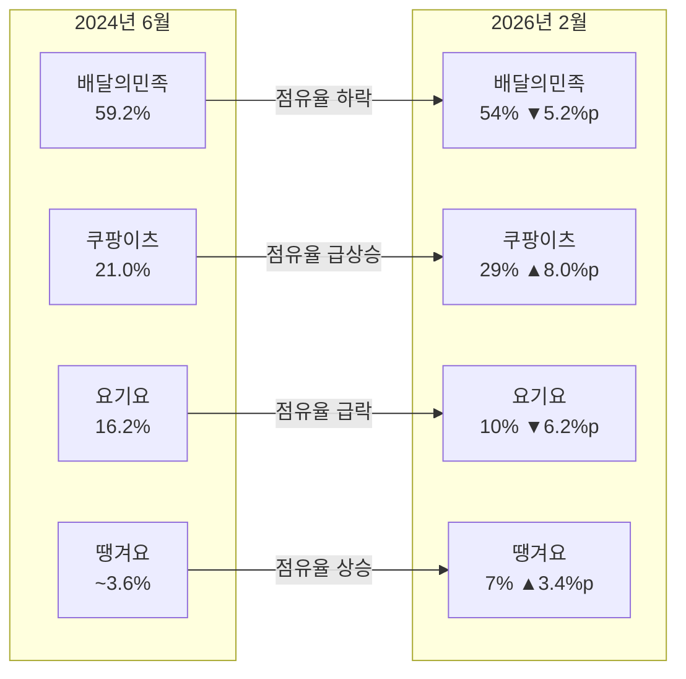
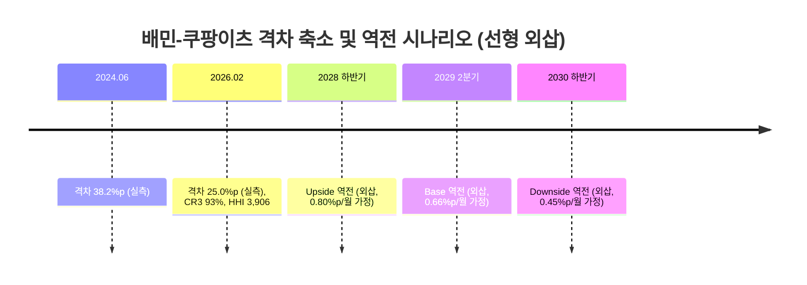

# 2026년 배달 시장 점유율 분석 — 최종 보고서

**작성일**: 2026-07-29
**Task Type**: research-report
**데이터 기준일**: 2026년 2월 (점유율 원값), 2026년 7월 (분석 시점)
**생성 워크스페이스**: 2026-배달-시장-점유율-분석해줘

> 본 보고서는 기존 워크스페이스 `2026-배달-시장-분석해줘`에서 이미 검증된 원천 데이터를 재사용하여
> "점유율 분석"만을 단독 주제로 재구성한 것이다. 신규 웹 리서치는 수행하지 않았다 (Phase 1-선행 재사용
> 판단, `plan.md` 참조).

---

## 요약

2026년 2월 기준 국내 배달앱 시장은 상위 4개 플랫폼(배달의민족·쿠팡이츠·요기요·땡겨요)이 시장 100%를
점유하는 완전 과점 구조(CR3 93%, HHI 3,906)다. 그러나 이 고집중 구조 내부에서는 배달의민족과 쿠팡이츠의
격차가 20개월간 38.2%p에서 25.0%p로 좁혀졌으며, 이 추세가 유지될 경우 2028년 하반기~2030년 하반기 사이
점유율 역전이 가능하다(기본 시나리오 2029년 2분기). 요기요는 3위 자리를 지키고 있으나 지속적인 하락세이고,
공공 배달앱 땡겨요는 틈새시장에서 꾸준히 성장 중이다.

### 점유율 스냅샷

| 플랫폼 | 2024.06 | 2026.02 | 변화 |
|--------|:-------:|:-------:|:----:|
| 배달의민족 | 59.2% | 54% | ▼ 5.2%p |
| 쿠팡이츠 | 21.0% | 29% | ▲ 8.0%p |
| 요기요 | 16.2% | 10% | ▼ 6.2%p |
| 땡겨요 | ~3.6% | 7% | ▲ 3.4%p |

---

## 분석 상세

### 1. 시장 집중도 — 완전 과점 구조

| 지표 | 값 | 해석 |
|------|---:|------|
| CR1 | 54% | 배달의민족 단일 1위 지배력은 여전히 높음 |
| CR3 | 93% | 상위 3개 플랫폼 중심의 초과점 구조 |
| HHI | 3,906 | `54²+29²+10²+7²`, 미국 DOJ 기준 highly concentrated(2,500 이상) |

### 2. 점유율 변화 속도 (Velocity Analysis)

| 플랫폼 | 2024.06 | 2026.02 | 20개월 변화 | 연 환산 변화 |
|--------|:-------:|:-------:|:-----------:|:------------:|
| 배달의민족 | 59.2% | 54.0% | -5.2%p | -3.1%p |
| 쿠팡이츠 | 21.0% | 29.0% | +8.0%p | +4.8%p |
| 요기요 | 16.2% | 10.0% | -6.2%p | -3.7%p |
| 땡겨요 | ~3.6% | 7.0% | +3.4%p | +2.0%p |

배민-쿠팡이츠 격차는 20개월 동안 13.2%p 축소됐다(월 0.66%p, 연 7.9%p). 산출 근거: 배민(-5.2%p)과
요기요(-6.2%p)가 잃은 점유율 합계 11.4%p 중 쿠팡이츠가 얻은 8.0%p는 약 70%에 해당하며, 나머지 약 30%는
땡겨요가 흡수한 것으로 추정된다(4사 합계 100% 가정 하의 잔여 배분 추정치).

### 3. 배민-쿠팡이츠 역전 시나리오 (선형 외삽, 실측 예측 아님)

산출식: 역전까지 소요 개월 = 현재 격차(25.0%p) ÷ 시나리오별 월간 격차 축소 속도.

| 시나리오 | 격차 축소 속도 | 계산 | 역전 시점 |
|----------|:--------------:|------|:--------:|
| Upside | 0.80%p/월 | 25.0÷0.80 ≈ 31개월 | 2028년 하반기 |
| Base | 0.66%p/월 | 25.0÷0.66 ≈ 38개월 | 2029년 2분기 |
| Downside | 0.45%p/월 | 25.0÷0.45 ≈ 56개월 | 2030년 하반기 |

영향 변수: (1) 배민 매각 성사 여부·인수자 성격 — 매각 추진 사실은 복수 매체가 보도했으나 인수자·시점은
미확정, (2) 쿠팡이츠의 낮은 수익성(2024년 영업이익률 1.2%)이 공격적 마케팅을 얼마나 오래 뒷받침할 수
있는지, (3) 수수료 규제 강화가 선두 사업자 수익성에 미칠 타격 정도(정성적 가설, 근거 데이터 없음).

### 4. 지역별 침투도 차이 (정성적 정황 — 정량 검증 아님)

> 이 절은 매체명·구체 수치가 특정되지 않은 복수 언론 보도에 근거한 정성적 서술이며, 위 1~3절의 정량
> 데이터만큼의 확실성은 없다.

수도권·서울 핵심 상권에서는 쿠팡이츠 침투가 상대적으로 빠르다는 보도가 반복되는 반면, 지방 중소도시에서는
배달의민족이 라이더 네트워크·브랜드 선점 효과로 방어력을 유지하고 있다는 정황이 있다. 사실이라면 전국
평균보다 수도권에서 역전이 먼저 관찰될 가능성이 있으나, 이는 검증되지 않은 가설로 취급해야 한다.

### 5. 글로벌 비교

글로벌 온라인 음식 배달 시장(2025년 기준)은 북미가 매출의 37.54%, 아시아퍼시픽이 12.53% CAGR로 가장
빠르게 성장하며, 시장 구조는 "moderately fragmented"로 평가된다(Mordor Intelligence). 한국은 CR3 93%의
초고집중 시장이면서 동시에 선두권 순위가 2~3년 내 뒤바뀔 수 있는 빠른 재편이 진행 중이다 —
"집중도가 높다 = 안정적이다"라는 일반적 가정이 한국 배달 시장에는 적용되지 않는다.

---

## 핵심 인사이트

### 인사이트 1: 쿠팡이츠의 추격은 "속도"의 문제이지 "방향"의 문제가 아니다

쿠팡이츠는 20개월간 연 4.8%p 속도로 점유율을 늘려왔고, 배민·요기요가 잃은 점유율의 약 70%를 흡수하고
있다. 방향성은 이미 명확하며, 남은 변수는 "언제" 역전이 일어나느냐(2028년 하반기~2030년 하반기)이다.

### 인사이트 2: 시장 집중도(HHI 3,906)는 규제 리스크의 근거가 될 수 있다

CR3 93%, HHI 3,906은 미국 DOJ 기준 "Highly Concentrated" 범주를 크게 상회한다. 이런 구조는 향후 공정거래·
수수료 규제 논의에서 배달의민족뿐 아니라 쿠팡이츠에게도 근거로 활용될 수 있다.

### 인사이트 3: 역전 시점의 최대 변수는 배민 매각과 쿠팡이츠의 수익성 지속 가능성

Upside/Downside 시나리오의 차이(2년)는 자연적 시장 흐름보다 배민 매각 협상 결과와 쿠팡이츠가 저수익
구조(영업이익률 1.2%)를 얼마나 오래 버틸 수 있는지에 더 크게 좌우된다.

### 인사이트 4: 역전은 전국에서 동시에 일어나지 않는다 — 수도권이 선행 지표일 가능성

수도권 지표를 조기 경보 신호로 활용할 수 있으나, 현재 근거는 정성적 보도 수준이므로 자체 실측 데이터로
교차 검증이 필요하다.

### 인사이트 5: 한국 시장의 재편 속도는 글로벌 평균보다 훨씬 빠르다

글로벌 시장(moderately fragmented)과 달리 한국은 초고집중이면서도 빠르게 재편되는 이례적 구조다.

---

## 추천 사항

| 권고 | 시급성 | 근거 |
|------|:---:|------|
| ① 수도권 점유율 추이 조기 경보 체계 구축 | ★★★★★ | 인사이트 4 — 정성적 근거이므로 자체 실측 병행 필요 |
| ② 배민 매각 시나리오별 대응 전략 사전 수립 | ★★★★★ | 인사이트 3 — 역전 시점을 가장 크게 흔드는 단일 변수 |
| ③ 쿠팡이츠 수익성 추이 분기별 모니터링 | ★★★★ | 인사이트 1·3 — 저수익 구조 지속 여부가 시나리오 분기점 |
| ④ 시장 집중도 기반 규제 리스크 사전 점검 | ★★★ | 인사이트 2 — HHI 3,906은 규제 논의의 근거가 될 수 있음 |

**① [최우선]** 수도권 배민-쿠팡이츠 격차를 분기별로 별도 추적하되, 현재 지역별 데이터는 정성적 보도
기반이므로 자체 주문·가맹점 데이터로 교차 검증하는 내부 지표를 병행 구축할 것을 권고.

**② [최우선]** 메이퇀 인수 / 국내 사모펀드 인수 / 매각 무산 각 시나리오에 대한 경쟁 대응 전략을 사전에 준비.

**③ [중요]** 쿠팡이츠 영업이익률(2024년 기준 1.2%)이 개선되는지 분기별로 추적해 Upside/Downside 시나리오
판단 근거를 갱신.

**④ [중요]** HHI·CR3 수치를 근거로 한 규제 논의 가능성에 대비해 자사 포지션별 대응 논리를 준비.

---

## 데이터 한계

- 2026.02 점유율은 CEO스코어데일리의 블로그 재인용 데이터로 원문 미확인.
- 제5~6위권 배달앱의 개별 점유율 데이터 없음 — 상위 4사 합계를 100%로 간주.
- 지역별 침투도(4절)는 정성적 보도 기반이며 정량 검증되지 않았다.
- 역전 시나리오(3절)는 선형 외삽에 기반한 민감도 분석이며 실측 예측이 아니다.
- 가장 최근 확보된 점유율 시점은 2026년 2월이다.

## 출처

| 출처 | 유형 | 날짜 |
|------|------|------|
| 한국경제 | 언론 보도 | 2024.07.19 |
| CEO스코어데일리 / 아이지에이웍스 (블로그 재인용) | 앱 분석 | 2026.02 (추정) |
| 네이버 블로그 "아프니까 사장이다" | 2차 인용 | 2025.09.15 |
| 와이즈앱·리테일 | 앱 분석 | 2026.01.27 |
| 뉴스피크 | 언론 보도 | 2026.06.01 |
| 위키트리 | 언론 보도 | 2026.04.15 |
| 인더스트리뉴스 | 언론 보도 | 2025~2026 |
| Mordor Intelligence — Online Food Delivery Market | 글로벌 리서치 | 2026.01 (업데이트 2026.05.05) |

> 전체 원문 발췌 및 상세 출처는 `member-gamma/fact-check-log.md`를 참조.
