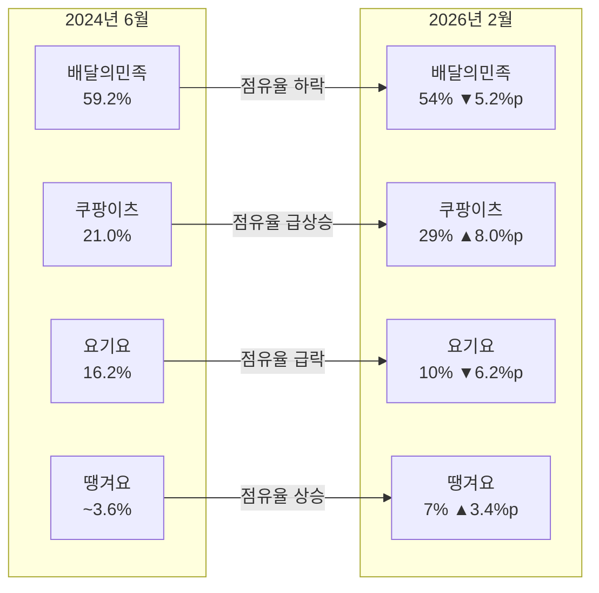
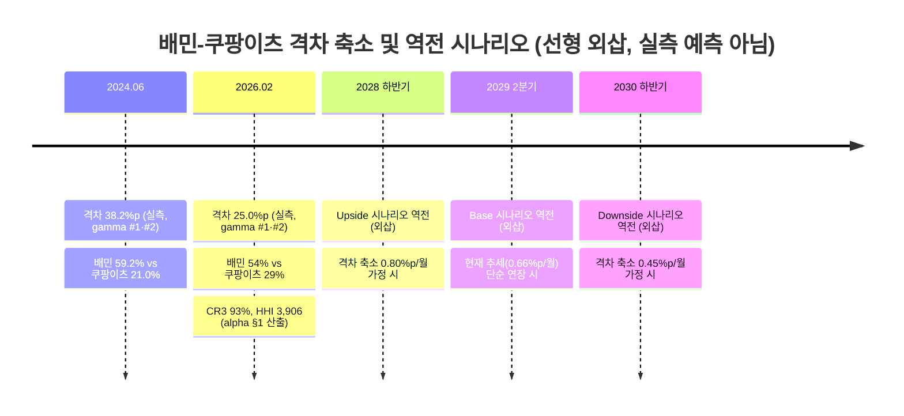

Creator: member-delta
Created: 2026-07-29
Version: 1.0

# 2026년 배달 시장 점유율 분석 — 시각자료

## 시각자료 개요

본 시각자료는 `member-alpha`의 점유율 분석 보고서(집중도, 변화 속도, 역전 시나리오, 지역별 침투도)를
바탕으로, 점유율 구조와 변화 흐름을 한눈에 볼 수 있도록 구성했다. Mermaid 다이어그램 2종과 핵심 수치
테이블 3종을 포함하며, 모든 수치는 alpha 보고서에서 인용했고 신규 수치는 생성하지 않았다.

**출처·산출 근거 (자체 완결성 확보)**: 2024.06/2026.02 점유율 원값은 alpha §1~2 (원천: gamma #1·#2 —
한국경제 2024.07.19, CEO스코어데일리 2차 인용). CR1/CR3/HHI는 alpha §1의 `54²+29²+10²+7²=3,906` 산출식을
그대로 인용. 역전 시나리오의 격차 축소 속도·역전 시점은 alpha §3의 선형 외삽(격차 축소 속도 × 역전까지
남은 격차)이며, **실측 예측이 아닌 민감도 분석용 가상 시나리오**임을 모든 다이어그램·표에 명시한다.

## Mermaid 다이어그램

### 다이어그램 1 — 점유율 변화 흐름 (2024.06 → 2026.02)

### 다이어그램 2 — 역전 시나리오 로드맵 (선형 외삽 기반 가상 시나리오)

> **산출 근거**: 각 시나리오의 역전 시점 = `현재 격차(25.0%p) ÷ 시나리오별 월간 격차 축소 속도`로 계산한
> 개월 수를 2026.02에 더한 값이다 (Base: 25.0÷0.66≈38개월 → 2029년 중반, Upside: 25.0÷0.80≈31개월 →
> 2028년 하반기, Downside: 25.0÷0.45≈56개월 → 2030년 하반기). 실측 예측이 아니라 alpha §3의 민감도
> 분석 결과를 시각화한 것이다.

## 핵심 수치 테이블

### 표 1 — 점유율 변화 속도 (Velocity)

| 플랫폼 | 2024.06 | 2026.02 | 20개월 변화 | 연 환산 변화 |
|--------|:-------:|:-------:|:-----------:|:------------:|
| 배달의민족 | 59.2% | 54.0% | -5.2%p | -3.1%p |
| 쿠팡이츠 | 21.0% | 29.0% | +8.0%p | +4.8%p |
| 요기요 | 16.2% | 10.0% | -6.2%p | -3.7%p |
| 땡겨요 | ~3.6% | 7.0% | +3.4%p | +2.0%p |

### 표 2 — 시장 집중도 지표

| 지표 | 값 | 기준 |
|------|---:|------|
| CR1 | 54% | 배달의민족 단독 |
| CR3 | 93% | 상위 3개 플랫폼 |
| HHI | 3,906 | 미국 DOJ 기준 highly concentrated(2,500 이상) |

### 표 3 — 역전 시나리오 요약 (산출식: 25.0%p ÷ 월간 축소 속도)

| 시나리오 | 격차 축소 속도 | 역전까지 소요 개월(계산) | 역전 시점 |
|----------|:--------------:|:-----------------------:|:--------:|
| Downside | 0.45%p/월 | 25.0÷0.45 ≈ 56개월 | 2030년 하반기 |
| Base | 0.66%p/월 | 25.0÷0.66 ≈ 38개월 | 2029년 2분기 |
| Upside | 0.80%p/월 | 25.0÷0.80 ≈ 31개월 | 2028년 하반기 |

> 위 속도값 자체는 alpha §3에서 가정한 시나리오별 변화율이며(실측 아님), 계산식만 이 표에서 자체
> 완결적으로 검증 가능하도록 명시했다.

## 인사이트-시각화 매핑

| alpha 인사이트 | 대응 시각자료 |
|-----------------|----------------|
| 점유율 변화 속도(연 7.9%p 격차 축소) | 다이어그램 1, 표 1 |
| 시장 집중도(CR3 93%, HHI 3,906) | 표 2 |
| 역전 시나리오(2028~2030년 범위) | 다이어그램 2, 표 3 |
