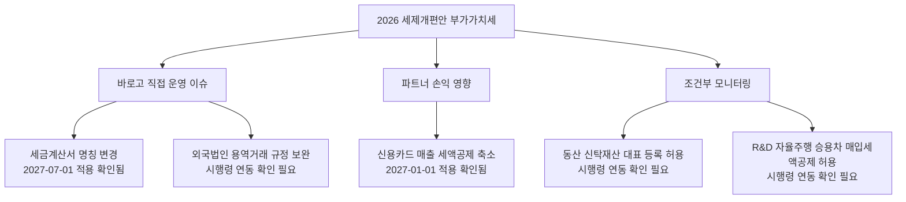
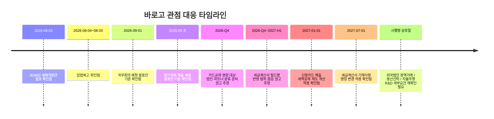

# 2026 세제개편안 부가가치세 조사

**작성일**: 2026-08-10
**Task Type**: research-report
**활성 멤버**: alpha(조사) · gamma(팩트체크) · delta(시각화) · beta(보고서)
**사이클**: 1 / 3
**승인**: human_approval=false (AUTO 모드 자동 완료)

**Creator**: team-lead
**Created**: 2026-08-10 10:29
**Version**: 1.1

## 요약

바로고 관점에서 2026년 세제개편안의 부가가치세 개정안을 다시 정리하면, `세금계산서 기재사항 명칭 변경`이 가장 직접적인 내부 운영 과제이고 `신용카드 매출 부가가치세 세액공제 우대 축소`가 가장 큰 사업 영향 변수다 ([출처1][출처3][출처4], 확인됨). 부가가치세 관련 개정안은 공개 요약 기준 총 5개 항목이며, 구체적으로는 `세금계산서 기재사항 명칭 변경`, `신용카드 매출에 대한 부가가치세 세액공제 제도 개선`, `동산 신탁재산의 사업자등록 합리화`, `연구개발 목적 자율주행 승용차 매입세액공제 허용`, `외국법인과의 용역거래 시 과세규정 보완`이다 ([출처3][출처4], 확인됨).

카드매출 세액공제 항목은 수치상 변화가 가장 크다. 우대 공제율은 `1.3% -> 1.2%`, 우대 공제한도는 `1,000만원 -> 500만원`으로 줄고, 적용 시기는 `2027-01-01 이후 재화·용역 공급분`이다 ([출처3][출처4], 확인됨). 다만 바로고에서는 이 항목이 본사 직접 세액 이슈로만 끝나지 않고, 음식점 등 카드매출 비중이 높은 파트너 손익과 현장 문의 증가로 이어질 가능성까지 함께 봐야 한다 (추정).

반대로 세금계산서 명칭 변경은 세부담보다 운영 반영 범위가 더 중요하다. `작성 연월일`을 `공급 연월일`로, 기존 `공급 연월일`을 `발급일`로 바꾸는 개정은 `2027-07-01 이후 세금계산서·계산서 발급분`부터 적용된다 ([출처4], 확인됨). 바로고처럼 정산 문서, 전자세금계산서, ERP, 파트너 안내문을 함께 운영하는 조직에서는 세무팀뿐 아니라 운영/개발/CS까지 영향 범위가 넓다 (추정).

나머지 항목 중 `외국법인 용역거래 과세규정 보완`은 해외 SaaS·기술용역 거래가 있을 때 점검 가치가 있고, `동산 신탁재산 사업자등록 합리화`와 `연구개발 목적 자율주행 승용차 매입세액공제 허용`은 현재 바로고 기준으로는 조건부 모니터링 항목에 가깝다 ([출처4], 확인됨). 현재 단계는 여전히 `발표안` 기준이므로, 이번 결과는 확정세법 안내가 아니라 `바로고 관련 우선순위 정리와 사전 준비`로 해석하는 것이 적절하다 ([출처1], 확인됨).

## 핵심 인사이트

1. **바로고 기준 최우선 과제는 세율 해석보다 내부 운영 반영 범위 파악이다.**
   세금계산서 명칭 변경은 `2027-07-01 이후` 적용이 비교적 명확하고 ([출처4], 확인됨), 바뀌는 내용이 세율이 아니라 필드명이라서 ERP, 정산서, 전자세금계산서, 파트너 안내문, CS 스크립트까지 광범위하게 연결된다 (추정).

2. **카드매출 세액공제 축소는 바로고 본체보다 파트너 생태계 영향으로 읽는 편이 실무적이다.**
   수치상 가장 큰 변화는 공제율과 한도 축소이며 ([출처3][출처4], 확인됨), 카드매출 비중이 높은 음식점·소매·생활서비스 업종의 체감도가 높을 가능성이 크다 (추정). 바로고는 이를 파트너 손익, 문의 증가, 현장 메시지 조정 이슈로 연결해 볼 필요가 있다.

3. **외국법인 용역거래 규정은 해외 SaaS·기술용역 사용 여부에 따라 중요도가 달라진다.**
   국내사업장이 세금계산서를 발급한 경우 신고·납부 주체가 그 국내사업장으로 정리되는 방향이므로 ([출처4], 확인됨), 해외 벤더 계약이 있다면 계약서와 인보이스 흐름을 미리 점검하는 편이 안전하다 (추정).

4. **동산신탁·자율주행 R&D 항목은 현재 바로고 기준으로는 조건부 모니터링이 적절하다.**
   동산신탁은 신탁 기반 자산 구조를 쓸 때, 자율주행 R&D 항목은 실제 자율주행 배송·모빌리티 실증을 할 때 의미가 커진다 ([출처4], 확인됨). 현재 핵심 운영 이슈와는 거리가 있어 우선순위는 낮다 (추정).

5. **이번 안은 아직 입법 절차 진행 중이므로 외부 공지보다 내부 체크리스트가 먼저다.**
   재정경제부는 `입법예고 2026-08-04~08-20`, `국무회의 2026-09-01`, `정기국회 제출 2026-09-03 이전` 일정을 제시했다 ([출처1], 확인됨). 따라서 확정 표현보다는 `대상 법인/파트너/시스템 분류`를 선행하는 것이 적절하다 (추정).

## 추천 사항

1. **세금계산서 발급/정산 관련 필드명 인벤토리를 먼저 만들라.**
   `작성 연월일`, `공급 연월일` 표기를 쓰는 ERP, 정산서, 전자세금계산서, 가이드 문서, FAQ, CS 응대문을 전수 점검해야 한다. 바로고에서는 이 항목이 가장 직접적인 내부 운영 과제다.

2. **카드매출 세액공제 영향은 직접 대상과 간접 대상으로 나눠 보라.**
   바로고 각 법인의 직접 공제 영향 가능성과, 음식점·제휴 파트너의 간접 손익 영향을 분리해서 봐야 한다. 그래야 세무 검토와 영업/운영 대응을 구분할 수 있다 (추정).

3. **2026년 4분기 안에 (추정) 파트너 문의 대응용 Q&A를 준비하라.**
   `2027-01-01 이후 공급분`부터 적용된다고 제시돼 있으므로 ([출처4], 확인됨), 연말 전에 영향 설명 문안과 상담 기준을 만들어 두는 편이 실무적이다.

4. **해외 용역 계약 목록과 인보이스 발급 구조를 점검하라.**
   외국법인 용역거래 규정 보완은 시행령 확정 전이므로, 지금은 세부 해석보다 `대상 후보 계약 파악`과 `증빙 흐름 정리`가 우선이다 (추정).

5. **동산신탁·자율주행 R&D 항목은 워치리스트로만 관리하라.**
   현재 바로고 핵심 운영 이슈보다 우선순위가 낮으므로, 메인 액션 플랜보다는 세법 모니터링 목록에 두고 시행령 확정 시 재평가하는 편이 효율적이다.

## 부가가치세 개정안 상세

| 항목 | 주요 내용 | 적용 시기 | 바로고 관련도 | 바로고 해석 | 근거 |
|------|-----------|-----------|---------------|-------------|------|
| 세금계산서 기재사항 명칭 변경 | `작성 연월일 -> 공급 연월일`, `공급 연월일 -> 발급일` | 2027-07-01 이후 (확인됨) | 높음 (추정) | 내부 시스템/정산/안내문 반영 이슈 | [출처4] |
| 신용카드 매출 세액공제 제도 개선 | 우대 공제율 `1.3% -> 1.2%`, 우대 공제한도 `1,000만원 -> 500만원` | 2027-01-01 이후 (확인됨) | 높음 (추정) | 파트너 손익·문의 증가 가능성 우선 점검 | [출처3][출처4] |
| 외국법인 용역거래 과세규정 보완 | 국내사업장이 세금계산서를 발급한 경우 국내사업장이 신고·납부 | 시행령 시행일이 속하는 과세기간 (확인 필요) | 중간 (추정) | 해외 SaaS/기술용역 계약이 있으면 점검 | [출처4] |
| 동산 신탁재산 사업자등록 합리화 | 다수 동산 신탁재산에 대해 대표 사업자등록 허용 | 시행령 시행일 이후 (확인 필요) | 낮음 (추정) | 신탁 구조 활용 시에만 직접성 확대 | [출처4] |
| 연구개발 목적 자율주행 승용차 매입세액공제 허용 | 임시 운행허가를 받은 R&D 자율주행 승용차의 매입세액공제 허용 | 시행령 시행일이 속하는 과세기간 (확인 필요) | 낮음~중간 (추정) | 자율주행 배송/R&D 추진 시 재검토 | [출처4] |

## 시각자료

시각자료 근거: 발표일·입법 일정은 재정경제부 발표 페이지 기준이다 (확인됨). 항목별 적용 시기와 수치는 BKL 및 일간NTN 교차 확인 기준이다 (확인됨). `2026-Q4 준비 권고`는 바로고 관점 해석이다 (추정).

## 출처 목록

- [출처1] 재정경제부 `2026년 세제개편안 발표`  
  https://www.mofe.go.kr/nw/nes/detailNesDtaView.do?searchBbsId1=MOSFBBS_000000000028&searchNttId1=MOSF_000000000078809&menuNo=4010100
- [출처2] 재정경제부 `한눈에 보는 정책 - 2026년 세제개편안`  
  https://www.mofe.go.kr/2026/taxlaw.do
- [출처3] BKL Legal Update `2026년 세제개편안 I - 주요 개정안`  
  https://www.bkl.co.kr/law/insight/newsletter/6681
- [출처4] 일간NTN `2026년 세제개편안 세목별 핵심사항`  
  https://www.intn.co.kr/news/articleView.html?idxno=2052332
