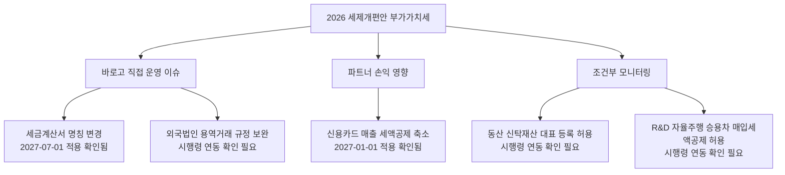
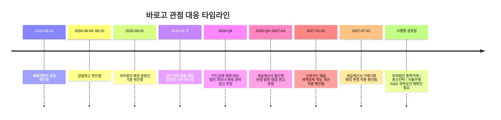

**Creator**: team-lead  
**Created**: 2026-08-10 10:29  
**Version**: 1.1

# 시각자료 개요

이번 시각화는 기존 VAT 개정 항목을 `바로고 직접 운영`, `파트너 손익`, `조건부 모니터링`의 세 층위로 다시 묶은 것이다. 숫자와 날짜는 gamma 검증 로그 및 alpha 분석 보고서에서만 가져왔고, 우선순위 판단은 바로고 관점 해석이다.

범례: `확인됨=발표안/검증자료에서 직접 확인`, `추정=바로고 실무 영향 해석`, `확인 필요=시행령 확정 또는 국회 통과 대기`

# Mermaid 다이어그램

타임라인 근거: 발표일·입법예고·국무회의·정기국회 제출 일정은 재정경제부 발표 페이지 기준이다 (확인됨). 각 적용 시점은 일간NTN 기사에 정리된 항목별 시행 시기 기준이다 (확인됨). `2026-Q4 준비 권고`는 alpha 분석의 바로고 대응 제안이다 (추정).

# 핵심 수치 테이블

## 항목별 우선순위 표

| 항목 | 확인된 변화 | 적용 시기 | 바로고 관련도 | 1차 오너 제안 | 근거/출처 |
|------|-------------|-----------|---------------|---------------|-----------|
| 세금계산서 명칭 변경 | `작성 연월일 -> 공급 연월일`, `공급 연월일 -> 발급일` | 2027-07-01 이후 (확인됨) | 높음 (추정) | 세무 + ERP/정산 운영 | 일간NTN, BKL |
| 신용카드 매출 세액공제 우대 축소 | 1.3% -> 1.2%, 1,000만원 -> 500만원 | 2027-01-01 이후 (확인됨) | 높음 (추정) | 재무 + 파트너정책/영업 | 일간NTN, BKL |
| 외국법인 용역거래 과세규정 보완 | 국내사업장 발급 시 직접 신고·납부 | 시행령 시행일 이후 (확인 필요) | 중간 (추정) | 세무 + 구매/법무 | 일간NTN |
| 동산 신탁재산 대표 등록 허용 | 재산별 등록 -> 대표 등록 허용 | 시행령 시행일 이후 (확인 필요) | 낮음 (추정) | 재무/전략 모니터링 | 일간NTN |
| 자율주행 승용차 매입세액공제 허용 | R&D 목적 예외 허용 | 시행령 시행일 이후 (확인 필요) | 낮음~중간 (추정) | 신사업/R&D 모니터링 | 일간NTN |

## 바로고 영향도 분류표

사실 근거: 발표안/검증자료 기준 수치와 적용 시기는 gamma 검증 로그와 alpha 분석 보고서가 사용한 재정경제부 발표 페이지, BKL, 일간NTN 기준이다.

해석: `판단` 열은 위 사실값을 바탕으로 한 바로고 우선순위 해석이다.

| 분류 | 직접 관련 항목 | 판단 |
|------|----------------|------|
| 내부 시스템/정산 운영 | 세금계산서 명칭 변경 | 가장 직접 영향 (추정): 필드명, 서식, 안내문, ERP 반영 범위가 넓음 |
| 파트너 손익/현장 커뮤니케이션 | 신용카드 매출 세액공제 제도 개선 | 높은 영향 (추정): 카드매출 비중 높은 파트너의 수익성·문의 증가 가능성 |
| 해외 솔루션/용역 계약 관리 | 외국법인 용역거래 과세규정 보완 | 조건부 중요 (추정): 해외 SaaS·기술용역 사용 시 점검 필요 |
| 자산 구조 재편 | 동산 신탁재산 대표 등록 | 낮은 영향 (추정): 신탁 구조를 쓰는 경우에만 직접성 확대 |
| 미래 배송/R&D 프로젝트 | 자율주행 승용차 매입세액공제 허용 | 조건부 기회 (추정): 자율주행 실증 시 비용처리 개선 가능 |

주석: 수치·적용 시기 출처는 재정경제부 `2026년 세제개편안 발표` 페이지와 이를 교차 정리한 BKL Legal Update, 일간NTN 기사 기준이다. 관련도와 오너 제안은 alpha 분석 보고서의 바로고 관점 재분류를 요약한 것이다.
