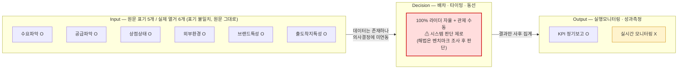
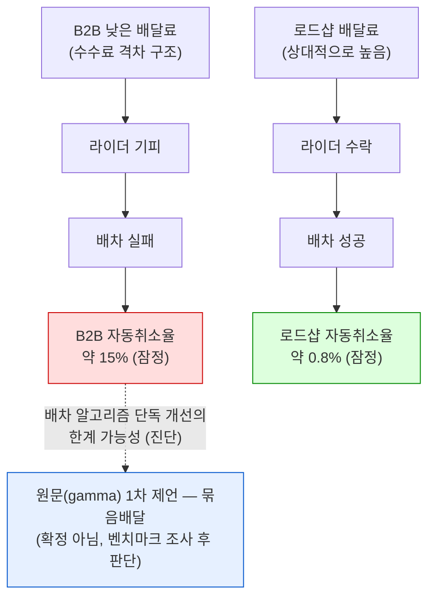
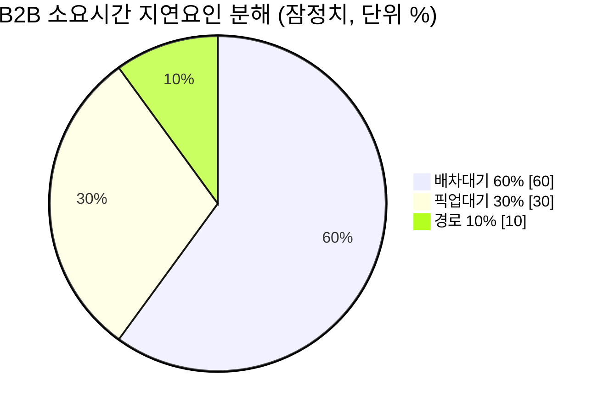

# 바로고 현황(포지션) — STEP01 산출물①+② 통합(진단) 초안

Creator: member-beta
Created: 2026-08-24
Revised: 2026-08-24 (REASSIGN — 범위 이탈 처방성 결론 제거, alpha Version 2.0 반영)
Version: 2.0

> **초안(내부 검토용)** — 이 문서는 신규 조사가 아니라 기존 Notion 산출물의 통합·정리이며,
> Section2(SQL 진단) 등 원천 데이터 자체가 아직 미완결 상태임을 전제로 한다.
>
> **범위**: 본 문서는 STEP01 ①시장변화·바로고현황 + ②AS-IS 현황진단(진단)까지만 다루며,
> ③국내외 벤치마크·④물류최적화 정의확정은 포함하지 않는다.

---

## 요약

### Executive Summary

- **핵심 주장**: 바로고는 배달수행건수 기준 업계 1위(2023년 2억 2,500만 건, +14.2%)이나 매출 규모는
  3사 중 상대적으로 작은 "역설적 포지션"에 있다. AS-IS 진단상 이 물류 최적화 프로젝트가 놓인 구조적
  병목은 Decision(배차·타이밍·동선) 레이어 자체가 아예 존재하지 않는다는 점이며, B2B 채널의
  자동취소율 약 15%(로드샵 약 0.8%)는 배차 알고리즘 문제가 아니라 "낮은 배달료 → 라이더 기피"라는
  수익구조 문제에서 기인한다. Decision 레이어 부재는 이 진단 단계에서 확인된 구조적 문제이며, 이를
  어떻게 풀지는 국내외 벤치마크 조사(STEP01-③, 예: 부릉·Meituan) 이후에 판단해야 한다.
- **주요 수치**: 바로고 처리건수 2023년 2억 2,500만 건(연간, 확인됨) / 2022년 업계추산 월평균
  기준으로는 부릉(약 700만 건)의 약 2.5배(부릉이 바로고의 40% 수준) / B2B 자동취소율 약 15%
  vs 로드샵 약 0.8%(잠정) / 지연요인 중 배차대기 60%(잠정).
- **결론·권고**: Decision 레이어 부재와 B2B 수익구조 문제는 AS-IS 진단상 확인된 구조적 문제로
  명확히 서술하되, 이를 "배차 알고리즘 개선"으로 풀지 "0→1 신설"로 재정의할지 등 구체 해법은 이
  문서 단계에서 확정하지 않는다 — 국내외 벤치마크 조사(STEP01-③) 이후에 판단해야 한다. 또한 근거
  데이터(Section2 Athena 오류 미해결, 9개 쿼리 중 일부만 완료)가 아직 확정되지 않았으므로 이 문서는
  "확정 현황 보고"가 아닌 "잠정 포지션 정리"로만 활용해야 한다.

### 본문 요약

[분석] alpha·delta 산출물을 종합하면 바로고의 현재 포지션은 세 개의 층위로 정리된다.

1. **시장 포지션(계약구조의 역설)** — 바로고는 지사·프로그램 사용료 계약 구조라서 매출 인식 규모는
   작지만(2023년 1,326억원, 2024년 약 1,702억원(**추정**)) 실제 처리건수는 업계 최다다. 부릉은 매출
   (2024년 3,400억원)이 바로고보다 크지만 2022년 업계추산 월평균 처리건수는 약 700만 건으로 바로고
   (약 1,800만 건)의 40% 수준에 불과하다(테이블 ②).
2. **AX 비전상의 위치(Decision 공백)** — 물류 최적화 8요소 프레임워크(다이어그램 ①)에서 Input과
   Output은 부분적으로 갖춰져 있으나, Decision(배차·타이밍·동선)은 100% 라이더 자율 + 관제 수동으로
   시스템 판단이 전혀 개입하지 않는다.
3. **B2B 채널의 구조적 취약점(원인은 수익구조)** — B2B 자동취소율 약 15%는 배차대기(60%)가 지연의
   최대 요인이라는 점(다이어그램 ③)과 함께, "낮은 배달료 → 라이더 기피 → 배차 실패 → 취소"라는
   연쇄(다이어그램 ②)에서 비롯된다. 배차대기가 지연의 최대 요인이라는 점만은 확정된 진단으로
   남기며, 이를 어떤 방식으로 해소할지는 국내외 벤치마크 조사(STEP01-③) 이후에 판단한다.

[제언] 다만 이 정리 전체는 원천 2 문서의 상태가 "리뷰중"이고 9개 SQL 쿼리 중 완료분 기준 잠정
결과이며, Section2(현황진단)는 Athena GROUP BY 오류로 미해결이라는 한계를 전제로 읽어야 한다. 또한
경쟁사 비교 수치는 확정치·추정치·업계추산·연도미확인이 혼재되어 있어(테이블 ①·②), 이를 구분하지
않고 서술하면 독자가 모두 동급의 사실로 오인할 위험이 있다.

---

## 핵심 인사이트

### 인사이트 1 — 매출과 처리건수의 역설이 프로젝트 목표를 규정한다

[사실] 바로고 배달수행건수는 2022년 1억 9,700만 건 → 2023년 2억 2,500만 건(+14.2%, 연간 최다
경신, 2023년 3월 월간 역대 최다 2,120만 건)으로 업계 1위이며, [분석] 반면 매출은 2023년 1,326억원
· 2024년 약 1,702억원(원문 "(추정)" 명시)으로, 매출 규모가 더 큰 부릉(2024년 3,400억원, 처리건수는
바로고의 약 40% 수준)과 대비된다(테이블 ①·②, 다이어그램 없음 — alpha Finding 1).

**so-what**: "매출 규모"로만 바로고의 지위를 서술하면 왜곡된다. 매출 확대보다 "이미 업계 최대
규모인 처리량의 효율화" 관점이 더 부합할 가능성이 이 진단에서 시사되나, 구체적인 프로젝트 목표·
정의는 이 문서 단계에서 확정하지 않으며 STEP01-④(물류최적화 정의확정)에서 다룬다.

### 인사이트 2 — Decision 레이어의 완전한 부재가 진짜 병목이다

[사실]/[분석] 8요소 프레임워크 AS-IS 진단(다이어그램 ①)에서 Input(수요파악·공급파악·상점상태·외부
환경·브랜드특성·출도착지특성)은 대부분 확보돼 있고 Output(KPI 정기보고)도 사후 집계는 이루어지지만,
Decision(배차·타이밍·동선)은 100% 라이더 자율 + 관제 수동으로 시스템 판단이 전혀 개입하지 않는다
(alpha Finding 2). 참고로 원문은 프레임워크를 "Input 5개"로 표기하지만 실제 열거 항목은 6개로,
표기 불일치가 있다(원문 작성자 재확인 필요).

**so-what**: Input이 이미 확보돼 있고 Output도 사후 집계는 되고 있으므로, 이 프로젝트의 실질적
병목은 "Decision 레이어 자체가 존재하지 않는다"는 점이다. 이는 AS-IS 진단상 확인된 구조적 문제이며
바로고 현황 문서에 명확히 밝혀야 한다. 다만 이 문제를 "배차 알고리즘 고도화"로 풀지 "알고리즘
개입 지점 자체를 신설하는 0→1 작업"으로 재정의할지는 이 문서 단계에서 아직 결정된 바 없다 — 국내외
유사 물류 플랫폼이 Decision 레이어 부재를 어떻게 해소했는지에 대한 벤치마크 조사(STEP01-③, 예:
부릉·Meituan)가 필요하며, 그 조사 이후에만 판단 가능하다.

### 인사이트 3 — B2B 서비스 품질 저하는 배차 알고리즘이 아니라 수익구조 문제다

[분석] B2B 자동취소율은 약 15%로 로드샵(약 0.8%)의 약 19배에 달하며(테이블 ③), 소요시간 지연요인
분해상 배차대기가 60%로 가장 크다(다이어그램 ③, 잠정치). [분석] 원문은 이를 "낮은 배달료로 인한
라이더 기피 → 배차 실패 → 취소"의 연쇄로 진단하며(다이어그램 ②), [사실] B2B 상점 중 상당수의
조리시간 설정값이 실제와 불일치한다는 점도 함께 확인된다(구체 수치는 미기재).

**so-what 및 트레이드오프**: 이 finding은 배차/묶음배송 최적화 논의에 직접적인 시사점을 준다.
다만 라이더 관점의 트레이드오프를 명시해야 한다 — 배차 알고리즘으로 저수익 B2B 건을 라이더에게
강제 우선배정하는 방식은 콜수락률 저하·라이더 이탈이라는 부작용을 낳을 수 있어(라이더 수익 희생
금지 원칙 위반), 배차 알고리즘 단독 개선만으로는 근본 해결이 어려울 가능성이 진단된다. 원문(gamma
산출물)은 [제언]으로 "묶음배달을 통한 수익성 구조 개선"을 제시했으나, 이는 원문 작성자의 1차
아이디어로만 인용하며 이 문서 단계에서 채택된 방향으로 확정하지 않는다. 구체적 해법(배차
우선배정 방식 개선 vs 묶음배달을 통한 수익구조 개선 등)은 국내외 유사 사례가 이 트레이드오프를
어떻게 풀었는지 조사한 뒤(STEP01-③ 벤치마크) 판단해야 한다. 배차대기(60%)가 지연의 최대 요인이라는
점만은 확정된 진단으로 남긴다.

### 인사이트 4 — 근거 데이터 자체가 아직 미완결 상태다

[제언] 원천 2 문서는 상태가 "리뷰중"이며, 완료된 SQL은 총 9개 쿼리 중 일부이고 Section2(배차 실패
패턴 심층 분석)는 Athena GROUP BY 오류로 미해결이다. 즉 인사이트 3에서 인용한 B2B 자동취소율
약 15%, 배차대기 60% 등의 수치는 잠정 결과이며 확정치가 아니다(alpha Finding 4).

**so-what**: 이 문서가 이후 Gate2(팩터 우선순위·목표수준 합의)의 근거자료로 쓰일 경우, 이 수치들을
확정 진단으로 못박아 목표수준을 설정하면 Section2 재작업 시 목표 자체가 흔들리는 리스크가 있다.

### 인사이트 5 — 경쟁사 비교 데이터는 신뢰 등급이 항목별로 다르다

[사실] 경쟁사 비교 데이터의 신뢰 수준은 균일하지 않다: 바로고 2024년 매출(약 1,702억원)은
"(추정)", 2025년은 절대액 미기재(전년대비 -0.2%만 제시), 2022년 3사 월평균 처리건수는 "업계
추산"으로만 표기, 생각대로(로지올)의 실적(매출 323억원·순이익 7억원·월간주문 1,674만건)은
**연도 자체가 미확인**이다(테이블 ①·②, alpha Finding 5).

**so-what**: 경쟁사 대비 포지션을 서술할 때 이 신뢰 등급(확정/추정/업계추산/연도미확인)을
구분하지 않으면 독자가 모두 동급의 확정 사실로 오인할 위험이 있다. 생각대로 수치는 별도
각주로 분리해야 한다.

---

## 참고: 시각자료 (member-delta 산출물 인용)

### 다이어그램 ① 물류 최적화 8요소 프레임워크 — Decision 레이어 "시스템 판단 제로"

### 다이어그램 ② B2B 자동취소율 발생 원인 연쇄 흐름도

### 다이어그램 ③ B2B 소요시간 지연요인 분해

### 테이블 ① 바로고 매출·처리건수 연도별 추이

| 연도 | 매출 | 거래액 | 처리건수(배달수행건수) | 신뢰도 등급 |
|---|---|---|---|---|
| 2019 | 데이터 없음 — 원문에 미기재("-") | 1조원 돌파 | 데이터 없음 — 원문에 미기재 | 확정(거래액만) |
| 2021 | 909억원 | 4.6조원 돌파 | 데이터 없음 — 원문에 미기재 | 확정 |
| 2022 | 데이터 없음 — 원문에 미기재 | 데이터 없음 — 원문에 미기재 | 1억 9,700만 건 | 확정 |
| 2023 | 1,326억원 | 데이터 없음 — 원문에 미기재 | 2억 2,500만 건 (+14.2%, 연간 최다 경신) ※ 2023년 3월 월간 역대 최다 2,120만 건 | 확정 |
| 2024 | 약 1,702억원 (창사 이후 첫 흑자, B2B 중심 전략) | 데이터 없음 — 원문에 미기재 | 데이터 없음 — 원문에 미기재 | **추정** ("(추정)" 원문 명시) |
| 2025 | 전년대비 -0.2% (거의 정체) | 데이터 없음 — 원문에 미기재 | 데이터 없음 — 원문에 미기재 | **절대치 미기재** (상대 변화율만) |

참고: 2023년 처리건수 증가에는 2020년 바다코리아(모아라인)·2023년 더원인터내셔널(딜버) 인수 효과가
함께 작용했다는 원문 [제언]이 있음(별도 정량 분리값은 원문에 없음).

### 테이블 ② 배달대행 3사 매출 vs 처리건수 비교

| 업체 | 매출 | 처리건수(2022 업계추산 월평균) | 처리건수 대비 바로고 비율 | 신뢰도 등급 |
|---|---|---|---|---|
| 바로고 | 2023: 1,326억원 2024: 약 1,702억원(추정) | 약 1,800만 건 (3사 중 최다) | 100% (기준) | 매출: 확정/추정 혼재 처리건수: 업계추산 |
| 부릉(메쉬코리아) | 2021: 3,038억원 2024: 3,400억원 | 약 700만 건 | 약 40% | 매출: 확정 처리건수: 업계추산 |
| 생각대로(로지올) | 323억원, 순이익 7억원(흑자전환) | 월간 주문 1,674만 건 | 데이터 없음 — 비교 불가 | **연도 미확인 — 재확인 필요** (원문 명시) |

주의: 생각대로(로지올) 수치는 해당 연도가 원문에 특정되어 있지 않아, 바로고/부릉의 특정 연도 실적과
동일 기준으로 비교할 수 없음(alpha Finding 5 권고). 참고용으로만 병기.

참고(3사 비교 대상 외, 원문 언급값): 만나플래닛 2022년 업계추산 월평균 처리건수 약 1,500만 건.

### 테이블 ③ B2B vs 로드샵 핵심 지표 비교

| 지표 | B2B | 로드샵 | 신뢰도 등급 |
|---|---|---|---|
| 자동취소율 (status=9) | 약 15% | 약 0.8% | 잠정(9개 쿼리 중 일부 완료, Section2 미해결) |
| 묶음배달 비율 | 0% (단건 100%) | 데이터 없음 — 원문에 미기재 | 잠정 |
| 소요시간 지연요인 분해 (B2B-로드샵 차이 기준) | 배차대기 60% / 픽업대기 30% / 경로 10% | 데이터 없음 — 원문에 별도 로드샵 단독 분해값 미기재 | 잠정 |
| 조리시간 설정값 vs 실제 조리시간 불일치 | 상당수 상점에서 불일치 (구체 수치 미기재) | 데이터 없음 — 원문에 미기재 | 사실(정성적 서술, 정량화 안 됨) |

---

## 추천 사항

### 추천 1 — Section2 Athena GROUP BY 오류를 데이터팀에 에스컬레이션하고, 해결 전까지 수치 표기에 "잠정" 라벨 유지

**무엇을**: 원천 2 문서의 Section2(배차 실패 패턴 심층 분석) Athena GROUP BY 오류를 담당
데이터팀/SQL 작성자에게 재현 로그와 함께 즉시 전달하고, 9개 쿼리 중 미완료분의 완료 일정을
확인한다. 해결 전까지 B2B 자동취소율 약 15%·배차대기 60% 등 모든 파생 수치에 "잠정(진단
미완결)" 라벨을 유지한다.

**무엇을 근거로**: 원천 2가 상태 "리뷰중"이며 완료 SQL이 9개 중 일부뿐이고 Section2가 미해결이라는
점(인사이트 4, alpha Finding 4).

**판단 지표·기한**: Gate2 진입 전(문서상 목표수준 합의 시점) 까지 Section2 재실행 완료 여부를
확인. 해결되지 않으면 Gate2 목표수준 합의를 Section2 결과 확정 이후로 순연할 것을 제안.

### 추천 2 — 경쟁사 비교 수치는 신뢰 등급별로 표를 분리하거나 각주 처리

**무엇을**: 테이블 ②의 생각대로(로지올) 행을 "연도 미확인 — 참고용"으로 명확히 각주 분리하고,
향후 이 문서가 대외(투자자·이사회 등) 자료로 인용될 경우 확정치(2021·2023 매출, 2022·2023
처리건수)만 본문 비교표에 남기도록 beta·Team Lead가 재검토한다.

**무엇을 근거로**: 경쟁사 수치가 확정/추정/업계추산/연도미확인 4개 신뢰 등급으로 혼재되어 있다는
점(인사이트 5, alpha Finding 5).

**판단 지표·기한**: 이 문서가 외부 공유 대상으로 지정되는 시점(현재는 내부 검토용) 이전에
Team Lead가 노출 범위와 표 형식을 확정.

### 추천 3 — STEP01-③ 국내외 벤치마크 조사를 다음 작업으로 착수

**무엇을**: 부릉·Meituan 등 유사 문제를 겪은 국내외 물류/배달 플랫폼이 ⓐDecision 레이어 부재
ⓑB2B형 저수익 채널의 자동취소·라이더기피 문제를 어떻게 해결했는지 조사한다.

**무엇을 근거로**: alpha Finding 2·3에서 Decision 레이어 부재와 B2B 수익구조 문제가 구조적 문제로
진단되었으나, 이를 어떤 방식(배차 알고리즘 개선 vs 0→1 신설, 배차 우선배정 vs 묶음배달 등)으로
해소할지는 아직 미확정 상태다(인사이트 2·3).

**판단 지표·기한**: STEP01-③ 조사 결과를 STEP01-④ "물류최적화 정의" 착수 전 필수 선행 조건으로
설정한다. 조사 결과 없이 STEP01-④로 진행하지 않는다.

---

## 미해결 이슈 트래킹 (추가 조사 필요)

- Section2(배차 실패 패턴 심층 분석) Athena GROUP BY 오류 — 원인 및 해결 시점 **추가 조사 필요**.
- 생각대로(로지올) 실적 수치의 정확한 연도 — **추가 조사 필요** (원문 출처 미확인).
- 원문 프레임워크 "Input 5개" 표기와 실제 열거 6개 항목 간 불일치 — 원문 작성자 확인 **추가 조사
  필요**.
- 조리시간 설정값-실제 불일치의 정량 수치(상점 수·비율) — 원문에 정성적 서술만 있어 **추가 조사
  필요**.
- 로드샵 소요시간 지연요인 단독 분해값(현재는 B2B-로드샵 차이 기준값만 존재) — **추가 조사 필요**.
- 물류 최적화의 정의(STEP01-④)는 STEP01-③ 벤치마크 조사 완료 전까지 확정하지 않음.
