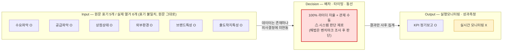
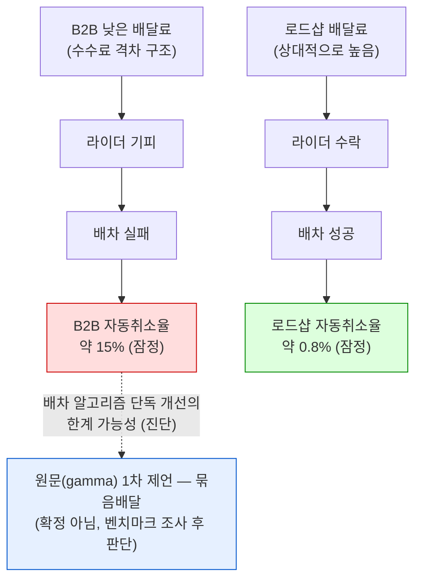
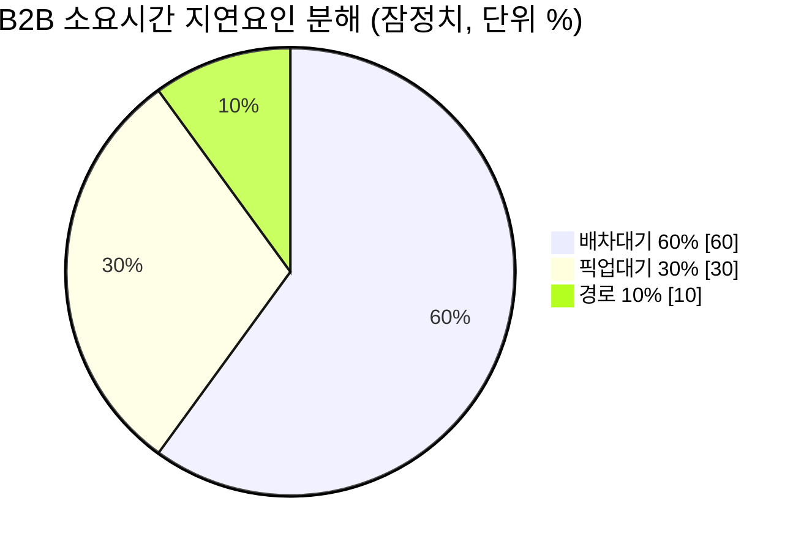

# STEP01 바로고 현황(포지션) — 시각자료

Creator: member-delta
Created: 2026-08-24
Version: 1.0

## 시각자료 개요

본 문서는 member-alpha의 `analysis-report.md`(및 그 근거가 된 member-gamma `fact-check-log.md` 원문
발췌)에 담긴 분석 결과를 시각 형태로 재구성한 것입니다. 새로운 수치·해석을 추가하지 않았으며, 원문에
명시되지 않은 값은 모두 **"데이터 없음 — 원문에 미기재"**로 표시했습니다. 다이어그램 3개(구조도 1 +
프로세스도 2)와 핵심 수치 테이블 3개로 구성됩니다.

- 다이어그램 ①: 물류 최적화 8요소 프레임워크 구조도 — Decision 레이어 "시스템 판단 제로" 강조
- 다이어그램 ②: B2B 자동취소율 발생 원인 연쇄 흐름도 (배달료 → 라이더 기피 → 배차실패 → 취소)
- 다이어그램 ③: B2B 소요시간 지연요인 분해 (배차대기/픽업대기/경로)
- 테이블 ①: 바로고 매출·처리건수 연도별 추이 (신뢰도 등급 포함)
- 테이블 ②: 배달대행 3사(바로고/부릉/생각대로) 매출 vs 처리건수 비교
- 테이블 ③: B2B vs 로드샵 핵심 지표 비교

---

## Mermaid 다이어그램

### ① 물류 최적화 8요소 프레임워크 구조도 — Decision 레이어 "시스템 판단 제로"

> Input은 대부분 확보돼 있고 Output도 사후 집계는 되고 있으나, Decision(배차·타이밍·동선)은 100%
> 라이더 자율 + 관제 수동으로 시스템 판단이 전혀 개입하지 않는 구조적 병목(Finding 2)을 강조.



### ② B2B 자동취소율 발생 원인 연쇄 흐름도

> 원천 2의 [분석] "낮은 배달료로 인한 라이더 기피 → 배차 실패 → 취소" 연쇄 구조(Finding 3)를 로드샵
> 경로와 대비해 시각화. 수치는 잠정(9개 쿼리 중 일부 완료, Section2 Athena 오류 미해결).



### ③ B2B 소요시간 지연요인 분해

> 배차대기가 지연의 60%를 차지 — "배차가 잡히지 않는 단계"가 지연의 최대 요인임을 시각화. B2B-로드샵
> 간 소요시간 차이를 분해한 값(잠정치)이며, 로드샵 단독 분해값은 원문에 별도 제시되지 않음.



```json
{
  "chart": "pie",
  "title": "B2B 소요시간 지연요인 분해 (잠정치)",
  "unit": "%",
  "data": [
    {"label": "배차대기", "value": 60},
    {"label": "픽업대기", "value": 30},
    {"label": "경로", "value": 10}
  ],
  "source": "member-alpha analysis-report.md Finding 3 / member-gamma fact-check-log.md Section B",
  "confidence": "잠정 — 9개 쿼리 중 완료분 기준, Section2 Athena GROUP BY 오류 미해결"
}
```

---

## 핵심 수치 테이블

### 테이블 ① 바로고 매출·처리건수 연도별 추이

| 연도 | 매출 | 거래액 | 처리건수(배달수행건수) | 신뢰도 등급 |
|---|---|---|---|---|
| 2019 | 데이터 없음 — 원문에 미기재("-") | 1조원 돌파 | 데이터 없음 — 원문에 미기재 | 확정(거래액만) |
| 2021 | 909억원 | 4.6조원 돌파 | 데이터 없음 — 원문에 미기재 | 확정 |
| 2022 | 데이터 없음 — 원문에 미기재 | 데이터 없음 — 원문에 미기재 | 1억 9,700만 건 | 확정 |
| 2023 | 1,326억원 | 데이터 없음 — 원문에 미기재 | 2억 2,500만 건 (+14.2%, 연간 최다 경신)<br/>※ 2023년 3월 월간 역대 최다 2,120만 건 | 확정 |
| 2024 | 약 1,702억원 (창사 이후 첫 흑자, B2B 중심 전략) | 데이터 없음 — 원문에 미기재 | 데이터 없음 — 원문에 미기재 | **추정** ("(추정)" 원문 명시) |
| 2025 | 전년대비 -0.2% (거의 정체) | 데이터 없음 — 원문에 미기재 | 데이터 없음 — 원문에 미기재 | **절대치 미기재** (상대 변화율만) |

참고: 2023년 처리건수 증가에는 2020년 바다코리아(모아라인)·2023년 더원인터내셔널(딜버) 인수 효과가
함께 작용했다는 원문 [제언]이 있음(별도 정량 분리값은 원문에 없음 — 데이터 없음).

### 테이블 ② 배달대행 3사 매출 vs 처리건수 비교

| 업체 | 매출 | 처리건수(2022 업계추산 월평균) | 처리건수 대비 바로고 비율 | 신뢰도 등급 |
|---|---|---|---|---|
| 바로고 | 2023: 1,326억원<br/>2024: 약 1,702억원(추정) | 약 1,800만 건 (3사 중 최다) | 100% (기준) | 매출: 확정/추정 혼재<br/>처리건수: 업계추산 |
| 부릉(메쉬코리아) | 2021: 3,038억원<br/>2024: 3,400억원 | 약 700만 건 | 약 40% | 매출: 확정<br/>처리건수: 업계추산 |
| 생각대로(로지올) | 323억원, 순이익 7억원(흑자전환) | 월간 주문 1,674만 건 | 데이터 없음 — 비교 불가 | **연도 미확인 — 재확인 필요** (원문 명시) |

주의: 생각대로(로지올) 수치는 해당 연도가 원문에 특정되어 있지 않아, 바로고/부릉의 특정 연도 실적과
동일 기준으로 비교할 수 없습니다(alpha Finding 5 권고에 따름). 참고용으로만 병기합니다.

참고(3사 비교 대상 외, 원문 언급값): 만나플래닛 2022년 업계추산 월평균 처리건수 약 1,500만 건.

### 테이블 ③ B2B vs 로드샵 핵심 지표 비교

| 지표 | B2B | 로드샵 | 신뢰도 등급 |
|---|---|---|---|
| 자동취소율 (status=9) | 약 15% | 약 0.8% | 잠정(9개 쿼리 중 일부 완료, Section2 미해결) |
| 묶음배달 비율 | 0% (단건 100%) | 데이터 없음 — 원문에 미기재 | 잠정 |
| 소요시간 지연요인 분해 (B2B-로드샵 차이 기준) | 배차대기 60% / 픽업대기 30% / 경로 10% | 데이터 없음 — 원문에 별도 로드샵 단독 분해값 미기재(차이값 기준) | 잠정 |
| 조리시간 설정값 vs 실제 조리시간 불일치 | 상당수 상점에서 불일치 (구체 수치 미기재) | 데이터 없음 — 원문에 미기재 | 사실(정성적 서술, 정량화 안 됨) |

---

## 데이터 한계 및 신뢰도 등급 범례

alpha 결론의 "불확실성 유형 명시"를 시각자료 전체에 일관 적용했습니다:

1. **확정** — 공시/명문 수치 (예: 2021 매출 909억원, 2023 매출 1,326억원, 2022/2023 처리건수)
2. **추정** — 원문에 "(추정)" 명시 (2024 매출 약 1,702억원)
3. **절대치 미기재** — 상대 변화율만 제시 (2025 매출)
4. **업계추산(비공식)** — 2022년 3사 월평균 처리건수
5. **연도 미확인** — 생각대로(로지올) 실적
6. **잠정(진단 미완결)** — B2B/로드샵 취소율·지연요인 분해 (9개 쿼리 중 일부 완료, Section2 Athena
   오류 미해결)
7. **데이터 없음 — 원문에 미기재** — delta가 임의로 만들지 않고 공백으로 남긴 항목 전체

※ 내부 약점 지표(B2B 자동취소율 15% 등)의 대외 노출 여부는 원문 [제언]에 따라 beta·Team Lead가
별도 판단할 사항이며, 본 시각자료는 노출 범위를 결정하지 않고 수치를 그대로 시각화했습니다.
