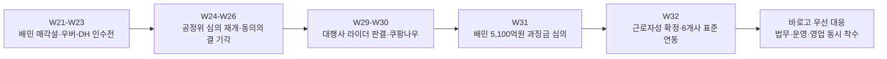

# 최근 3개월 시장 동향 분석 및 바로고 액션 아이템 3가지
**작성일**: 2026-08-05
**Task Type**: research-report
**활성 멤버**: alpha(조사) · gamma(팩트체크) · delta(시각화) · beta(보고서)
**사이클**: 1 / 3
**승인**: human_approval=false (AUTO 모드 자동 완료, market 대시보드 사용·override 비활성)

## 요약

최근 3개월 시장은 바로고에게 `관찰`보다 `대응`이 더 중요한 국면으로 바뀌었다. 5월 후반에는 배민 매각과 우버-DH 인수전이 시장 재편 가능성을 키웠고[`W21~W23` 아카이브], 6월에는 공정위 심의 재개와 동의의결 기각으로 배달앱 규제가 집행 단계로 이동했다[`W26` 아카이브]. 7월 중순 이후에는 대행사 라이더 근로자성 판결과 상고 포기 확정, 배민의 6개 배달대행사 표준연동까지 이어지며 바로고형 사업모델이 직접 판례·표준 경쟁의 중심으로 들어왔다[`W29`, `W32` 리포트].

이 흐름을 종합하면 바로고의 우선순위는 세 가지다. `1)` 라이더/노무 리스크를 숫자로 관리 가능한 수준까지 정리하고, `2)` 표준연동과 SLA 운영 역량을 멀티플랫폼 상품으로 만들며, `3)` 배달앱 비용 급등 국면에서 바로고를 가맹점의 비용 방어 대안으로 포지셔닝해야 한다.

## 핵심 인사이트

최근 3개월 신호를 바로고 관점에서 압축하면 아래 세 축으로 정리된다.

## 1. 규제 리스크는 배달앱 이슈에서 배달대행 직접 이슈로 이동했다

- `W21~W23`: 배민 매각과 우버-DH 인수전이 반복 보도되며 시장 재편 기대가 높아졌다.
- `W26`: 배민·쿠팡 동의의결 기각과 최혜대우 심판으로 규제가 실행 단계에 들어갔다.
- `W29`: 배달 대행사 라이더 근로자성 첫 인정이 직접 리스크로 등장했다.
- `W32`: 관련 판결이 업체 상고 포기로 최종 확정되며, 바로고와 동일 사업구조가 명시적으로 조명됐다.

최근 3개월은 `배달앱 규제 뉴스`가 `바로고 사업모델의 법무/재무 리스크`로 전이된 과정이었다. 따라서 이제는 규제 방향을 예측하는 수준이 아니라, 실제 비용과 계약 구조를 점검하는 단계로 넘어가야 한다.

## 2. 플랫폼 경쟁의 기준은 점유율보다 표준·데이터·수직통합으로 바뀌고 있다

- `W29~W30`: 쿠팡은 `쿠팡나우`, `로켓페이`로 결제-주문-배달 수직통합을 강화했다.
- `W31`: 우버-DH 심사의 핵심 쟁점도 멤버십, 데이터, 결제 연계로 압축됐다.
- `W32`: 배민은 바로고 포함 배달대행 6개사와 표준연동을 마쳐 가게배달 주문 약 `70%`의 위치추적을 가능하게 했다.

이 변화는 바로고에 양면적이다. 표준을 플랫폼이 쥐면 종속 압력은 강해지지만, 반대로 바로고가 `검증된 표준 운영 파트너`라는 공개 근거도 생긴다. 핵심은 이 연동 사실을 방어 논리가 아니라 상품화된 운영 역량으로 전환하는 것이다.

## 3. 운영 효율과 비용 설명력이 바로고의 영업 우위 포인트가 됐다

- `W32`: 부릉은 AI 배차로 평균 이동시간을 `12.7분 -> 9.2분`, 약 `30%` 줄였다고 공개했다.
- `W32`: 배달대행비는 `168만4,804원 -> 100만5,212원(-40%)`으로 줄고, 배달앱 이용료는 `38만3,687원 -> 54만630원(+40.9%)`으로 늘었다는 비용 비교가 제시됐다.
- 같은 리포트에서 치킨 전문점도 대행비 `-36.3%`, 앱 이용료 `+59%`로 비슷한 패턴을 보였다.

즉, 시장은 이제 `누가 물량을 많이 처리하나`만 보지 않고 `누가 더 빠르고`, `누가 더 예측 가능하며`, `누가 가맹점 총비용을 더 잘 설명하나`를 본다. 바로고는 이 국면에서 불리한 사업자가 아니라, 오히려 설명력을 확보하면 유리해질 수 있는 사업자다.

## 참고 시각자료

최근 3개월 이슈의 무게중심 이동.

핵심 수치 요약.

| 항목 | 수치 | 의미 |
|---|---:|---|
| 우버-DH 인수 규모 | `148억달러` | 글로벌 수직통합 경쟁 가속 |
| 배민 과징금 심의 최대치 | `5,100억원` | 규제 집행 국면 진입 |
| 배민 가게배달 위치연동 커버리지 | 약 `70%` | 표준 경쟁의 현실화 |
| 부릉 이동시간 개선 | `12.7분 -> 9.2분` | 효율 지표 공개 경쟁 |
| 배달대행비 변화 | `-40%` | 가맹점 비용 프레임에서 바로고 방어 가능 |
| 배달앱 이용료 변화 | `+40.9~59%` | 가맹점 불만의 주원인 재정의 가능 |

## 추천 사항

아래 3가지는 긴급도와 파급효과를 함께 고려했을 때 바로고가 지금 바로 착수할 우선순위다.

## 1. 라이더 근로자성 리스크 정량화 프로젝트를 즉시 시작한다

- 왜 지금: `W29`의 대행사 라이더 근로자성 첫 인정과 `W32`의 상고 포기 확정으로, 이 이슈는 더 이상 업계 일반론이 아니다.
- 무엇을 할지:
  - 법무·재무 합동으로 `최소/기준/최악` 3개 비용 시나리오 산출
  - 판결 논리와 현행 라이더 계약서 조항의 충돌 지점 정리
  - 30일 내 수정 가능한 운영/정산/안전 조항 우선순위 도출
- 성공 판단 기준: 바로고가 `규제 충격 규모`를 정량으로 설명할 수 있게 되는 것.

## 2. `표준연동 + SLA + AI 배차` 운영 패키지를 영업 상품으로 만든다

- 왜 지금: `W32`의 배민-배달대행 6개사 표준연동과 부릉의 `30%` 효율 개선 공개는 운영 성능 자체가 영업 언어가 되는 시점임을 보여준다.
- 무엇을 할지:
  - 배민 공식 연동 파트너 참여 사실을 영업 메시지로 표준화
  - 바로고 내부 이동시간, 도착 정시율, 배차 성공률을 동일 지표로 재산출
  - 쿠팡이츠·요기요에도 동일 표준 제안을 던져 `멀티플랫폼 호환성` 강조
- 성공 판단 기준: 바로고가 `플랫폼 종속 하청`이 아니라 `검증된 표준 운영 파트너`로 인식되는 것.

## 3. `배달대행비는 내렸고 앱 이용료는 올랐다`는 메시지로 가맹점 방어 영업을 실행한다

- 왜 지금: `W31`의 과징금 심의 국면과 `W32`의 비용 비교 데이터가 동시에 나와, 가맹점이 비용 구조를 다시 해석할 타이밍이 왔다.
- 무엇을 할지:
  - `대행비 -40% vs 앱 이용료 +40.9~59%` 비교표를 표준 영업 슬라이드로 제작
  - 배달앱 편중도 `80% 이상` 가맹점을 리스크군으로 관리
  - 자사앱/직접주문 브랜드에 `배달앱 없이 바로고와 직계약` 제안 패키지 배포
- 성공 판단 기준: 수수료 이슈가 나올 때 바로고가 방어 대상이 아니라 `비용 방어 대안`으로 호출되는 것.

## 출처 메모

- `W29` 리포트: `https://barogo-intel.vercel.app/api/report?week=2026-W29&locale=kr`
- `W30` 리포트: `https://barogo-intel.vercel.app/api/report?week=2026-W30&locale=kr`
- `W31` 리포트: `https://barogo-intel.vercel.app/api/report?week=2026-W31&locale=kr`
- `W32` 리포트: `https://barogo-intel.vercel.app/api/report?week=2026-W32&locale=kr`
- 5~6월 아카이브 검색: `https://barogo-intel.vercel.app/api/archive/search?weekFrom=2026-W20&weekTo=2026-W32&locale=kr`
- 참고: `W27~W28` 직접 아카이브는 이번 조회에서 비어 있었고, 해당 구간은 `W29`, `W30` 리포트의 catch-up 문구로 연결했다.
