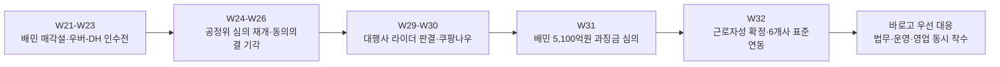
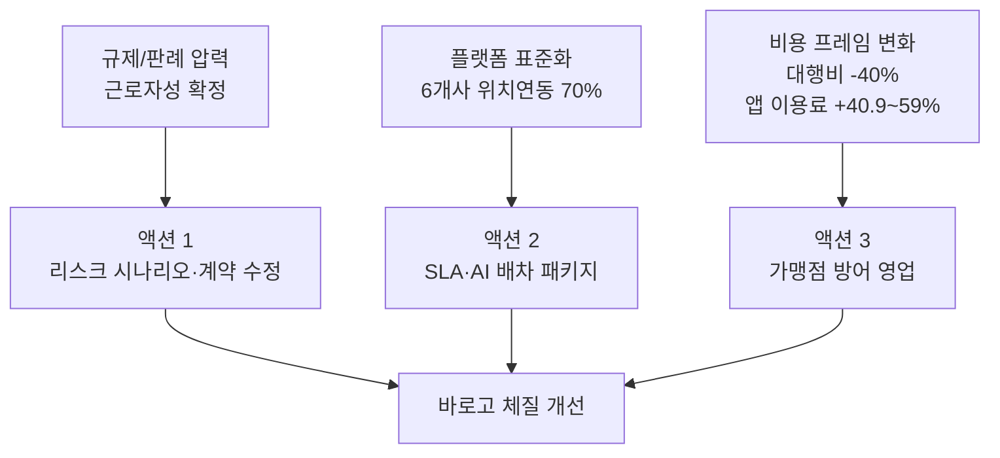

Creator: member-delta
Created: 2026-08-05 12:55
Version: 1.0

# 시각자료 개요

- 목적: 최근 3개월 시장 변화가 `규제`, `플랫폼 표준화`, `운영 효율/비용 프레임`의 세 축으로 어떻게 바로고 액션으로 연결되는지 빠르게 보여준다.
- 데이터 원천: `member-alpha/analysis-report.md`에 명시된 수치와 시점만 사용했다.

# Mermaid 다이어그램

최근 3개월 이슈의 무게중심 이동을 보여주는 타임라인.

시장 압력과 바로고 실행 과제의 연결 구조도.

# 핵심 수치 테이블

## 월별 시장 압력 요약

| 구간 | 핵심 변화 | 바로고 해석 |
|---|---|---|
| 5월 후반 (`W21~W23`) | 배민 매각설, 우버-DH 인수전, 8조원대 몸값 거론 | 시장 재편 가능성 확대, 플랫폼 주도권 변화 준비 필요 |
| 6월 (`W24~W26`) | 공정위 심의 재개, 배민·쿠팡 동의의결 기각, 과징금 위기 | 배달앱 규제가 가맹점과 정산 구조를 흔드는 국면 진입 |
| 7월 중순 (`W29~W30`) | 대행사 라이더 근로자성 인정, 쿠팡나우 재진입 | 바로고 직접 법무 리스크와 퀵커머스 내재화 압력 동시 확대 |
| 7월 말 (`W31`) | 배민 과징금 심의 최대 `5,100억원` 언급 | `중립 B2B` 메시지를 팔 수 있는 영업 타이밍 |
| 8월 초 (`W32`) | 배민-배달대행 6개사 표준연동, 주문 `70%` 위치추적, 부릉 이동시간 `30%` 단축 | 운영 표준과 효율 지표를 공개 경쟁력으로 전환해야 함 |

## 액션 아이템 우선순위 표

| 액션 | 긴급도 | 기대효과 | 근거 수치/사실 |
|---|---|---|---|
| 라이더 근로자성 리스크 정량화 | 매우 높음 | 매우 높음 | `W32` 상고 포기 확정, 대행사 동일 사업구조 직격 |
| 멀티플랫폼 표준 운영 패키지 | 높음 | 높음 | 배민 가게배달 주문 약 `70%` 위치추적, 부릉 이동시간 `30%` 단축 |
| 가맹점 비용 방어 영업 | 높음 | 중간~높음 | 배달대행비 `-40%`, 앱 이용료 `+40.9~59%` |

## 핵심 벤치마크 수치

| 항목 | 수치 | 출처 맥락 |
|---|---:|---|
| 우버-DH 인수 규모 | `148억달러` | `W32` |
| 배민 과징금 심의 최대치 | `5,100억원` | `W31` |
| 배민 가게배달 위치연동 커버리지 | 약 `70%` | `W32` |
| 부릉 평균 이동시간 개선 | `12.7분 -> 9.2분` | `W32` |
| 부릉 이동시간 개선율 | 약 `30%` | `W32` |
| 배달대행비 변화 | `168만4,804원 -> 100만5,212원` | `W32` |
| 배달앱 이용료 변화 | `38만3,687원 -> 54만630원` | `W32` |
