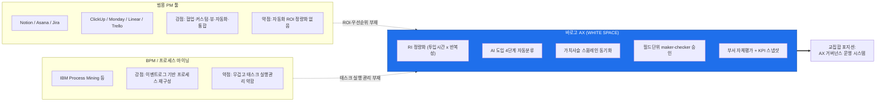
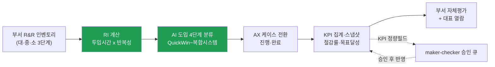
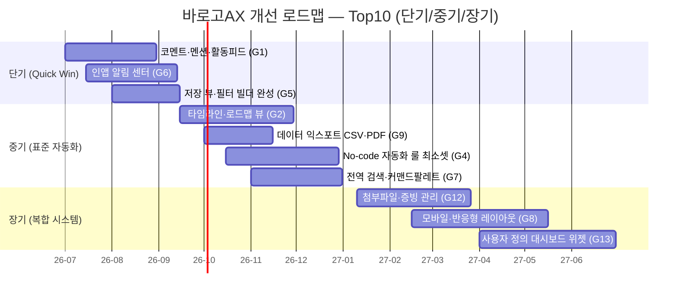

# 바로고 AX 관리 시스템 — 기능·UI 경쟁 벤치마크 및 개선 보고서

> **대상:** `ax-management-system` (바로고 AX 통합 관리 시스템, FastAPI + SQLAlchemy + SQLite/WAL 백엔드 + 동작형 정적 목업 프런트)
> **평가일:** 2026-06-18
> **방식:** 4개 에이전트 투입 — 앱 기능·UI 인벤토리(alpha) · 경쟁 제품 사실검증(gamma, WebSearch) · 비교 시각화(delta) · 통합 보고서(beta)
> **비교군:** Notion · Asana · Jira · ClickUp · Monday.com · Linear · Trello (+ 인접 영역: BPM/프로세스 마이닝)
> **범위 한정:** 본 보고서는 **기능·UI/UX 경쟁 비교** 관점이다. 코드 품질·보안은 별도 평가(`output/ax-management-system-eval/`)에서 다룸.

---

## 1. 종합 요약

바로고 AX 통합 관리 시스템은 범용 to-do·프로젝트 관리 툴이 아니라, 부서 R&R 업무를 **리소스 지수(RI = 총투입시간 × 반복성 가중치)** 로 정량화하고 AI 도입 4단계(Quick Win → 표준 자동화 → 자체 데이터 활용 → 복합 시스템)로 우선순위화하여 AX 케이스로 전환·집계하는 **AX 거버넌스 특화 운영 시스템**이다.

7개 범용 경쟁 제품과 6개 차원으로 대조한 결과는 명확히 갈린다.

- **압도적 우위 (차원 4 — AX 도메인 특화):** RI 정량화·가치사슬 스윔레인·AI 도입단계 분류·필드 단위 maker-checker 승인은 범용 PM 도구가 **구조적으로 제공하지 못하는 white space**다(가장 가까운 영역은 별도 카테고리인 프로세스 마이닝).
- **분명한 열위 (나머지 5개 차원 — 범용 기본기):** 코멘트·알림·간트/캘린더 뷰·커스텀 필드·전역 검색·모바일·익스포트 등 협업·뷰·UX 기본기에서 갭이 확인된다.

> **한 줄 포지셔닝:** "범용 PM 툴이 흉내 낼 수 없는 AX 거버넌스 엔진 위에, 범용 협업·뷰·UX 기본기를 보강하면 도입 장벽을 낮추면서 차별화 격차를 더 벌릴 수 있다."

### 6개 차원 스코어카드

| 차원 | 바로고AX | 경쟁 평균 | 포지션 | 핵심 근거 |
|---|:---:|:---:|---|---|
| 1. 정보구조·뷰 | 중 | 상 | 열위 | 테이블·칸반 ✅이나 타임라인·캘린더 ❌, 저장뷰 △ |
| 2. 데이터모델·커스텀 | 중 | 상 | 열위 | 수식·롤업 ✅(고정공식)이나 커스텀 필드 ❌ |
| 3. 협업·워크플로우 | 중 | 상 | 혼재 | 승인·RBAC·감사로그 ✅이나 코멘트·알림 ❌ |
| 4. AX 도메인 특화 | **상** | **하** | **압도적 우위** | RI·AI 4단계·가치사슬·LLM 재분석 — 경쟁 전무 |
| 5. UI/UX 완성도 | 중 | 상 | 열위 | 인라인편집·상세패널 ✅이나 모바일·검색·a11y ❌ |
| 6. 확장·통합 | 중 | 상 | 열위 | API·Slack·임포트 ✅이나 익스포트·Webhook ❌ |

---

## 2. 평가 대상 기능·UI 인벤토리 (요약)

현재 프런트 실체인 동작형 목업 기준 9개 뷰를 제공하며, 단순 와이어프레임이 아니라 RBAC 역할 전환·인라인 편집·칸반 DnD·승인 큐·가치사슬 편집기를 구현한 SPA다.

| 뷰 | 핵심 기능 | 비고 |
|---|---|---|
| 🏠 대시보드 | KPI 카드 5종 + 병목/AI단계 분포 + RI TOP8 | 고정 위젯 |
| 📋 업무 분류(핵심) | 테이블/보드 토글, 저장된 뷰 탭 4종, 6종 그룹핑, 인라인 편집, 일괄작업, 컬럼 리사이즈 | "뷰 추가"·필터패널은 데모 |
| 🧭 가치사슬 | Track→Stage 스윔레인 도식/표, 드래그 편집, 업무 리스트 양방향 동기화 | 병목(월 300h+) 표시 |
| 🔥 리소스·우선순위 | RI 내림차순 + AI 도입단계별 자동화 로드맵 | 도메인 특화 |
| ⚡ AX 케이스 | 진척율·절감률 이중 게이지, 미승인 배지 | KPI 집계 대상 |
| 📝 AX 보고서 | 부서장 자유서식 + 자동 KPI 스냅샷 | 대표 열람 라인 |
| 📊 전사 현황 / 🗂 전사 보고서 | 부서별 집계·자체평가 모음 | AX팀·대표 |
| ⏳ 승인 큐 | KPI 변경요청 maker-checker 승인 | 자기승인 차단 |
| ⚙️ 관리 | 엑셀 매핑·사용자 RBAC·LookupValue·AI 에이전트 연동 | AX팀 전용 |

케이스 상세는 880px 슬라이드 패널로 분류 3단계·업무정보(RI 자동 재계산)·AI 도입 분석(✨ 단일 업무 LLM 재분석)·AX 목표 9항목·KPI 정량필드(🔒 승인 필요)를 담는다.

---

## 3. 기능 비교 매트릭스 (16개 기능 × 8개 시스템)

✅ 네이티브 완전 지원 / △ 부분·플러그인·유료·미완·데모 / ❌ 미지원. 경쟁 셀은 모두 gamma 팩트체크(2026-06-18) 근거.

| # | 기능 | 바로고AX | Notion | Asana | Jira | ClickUp | Monday | Linear | Trello |
|---|---|:---:|:---:|:---:|:---:|:---:|:---:|:---:|:---:|
| F1 | 테이블·리스트 뷰 | ✅ | ✅ | ✅ | ✅ | ✅ | ✅ | ✅ | △ |
| F2 | 칸반 보드(DnD) | ✅ | ✅ | ✅ | ✅ | ✅ | ✅ | ✅ | ✅ |
| F3 | 타임라인·간트 뷰 | ❌ | ✅ | ✅ | ✅ | ✅ | ✅ | △ | △ |
| F4 | 캘린더 뷰 | ❌ | ✅ | ✅ | ✅ | ✅ | ✅ | ❌ | △ |
| F5 | 저장된 뷰·필터 빌더 | △ | ✅ | ✅ | ✅ | ✅ | ✅ | ✅ | △ |
| F6 | 커스텀 필드(사용자 정의) | ❌ | ✅ | ✅ | ✅ | ✅ | ✅ | ✅ | △ |
| F7 | 수식·롤업 | ✅ | ✅ | △ | △ | ✅ | △ | △ | ❌ |
| F8 | No-code 자동화 룰 | ❌ | ✅ | ✅ | ✅ | ✅ | ✅ | ✅ | ✅ |
| F9 | 코멘트·@멘션·활동피드 | ❌ | ✅ | ✅ | ✅ | ✅ | ✅ | ✅ | ✅ |
| F10 | 인앱 알림 센터 | ❌ | ✅ | ✅ | ✅ | ✅ | ✅ | ✅ | ✅ |
| F11 | 네이티브 승인(approval) | ✅ | ❌ | ✅ | ✅ | △ | △ | ❌ | ❌ |
| F12 | RBAC·부서/스페이스 스코프 | ✅ | ✅ | ✅ | ✅ | ✅ | ✅ | ✅ | ✅ |
| F13 | 대시보드·리포팅 빌더 | △ | △ | ✅ | ✅ | ✅ | ✅ | △ | △ |
| F14 | REST/공개 API + Slack 연동 | ✅ | ✅ | ✅ | ✅ | ✅ | ✅ | ✅ | ✅ |
| F15 | 데이터 익스포트(CSV/PDF) | ❌ | ✅ | ✅ | ✅ | ✅ | ✅ | ✅ | △ |
| F16 | RI 자동 우선순위·가치사슬 | ✅ | ❌ | ❌ | ❌ | ❌ | ❌ | ❌ | ❌ |

**읽기 포인트 (사실 정확성):**
- **F11 승인:** 네이티브 결재형은 Asana(태스크 approval)·Jira(JSM 워크플로우 step, 단 커스텀 필드 사전설정 필요)만 ✅. Notion·Linear·Trello는 ❌(버튼/상태/Power-Up 조합), ClickUp·Monday는 △(상태 기반). 바로고AX는 **필드 단위** maker-checker로 ✅.
- **F3/F4 Linear:** 캘린더·간트 네이티브 미제공. Timeline(로드맵)만 있어 간트 △, 캘린더 ❌.
- **Trello:** 다수 기능이 Power-Up 또는 Premium 유료 뷰 의존 → △ ("Trello가 간트 네이티브 지원"은 부정확).
- **F16 RI·가치사슬:** 8개 중 바로고AX만 ✅ — 명확한 white space.

### 시스템별 ✅/△/❌ 집계

| 시스템 | ✅ | △ | ❌ | 특징 한 줄 |
|---|:---:|:---:|:---:|---|
| 바로고AX | 7 | 2 | 7 | AX 도메인 단독 ✅, 범용 협업·통합 다수 ❌ |
| Notion | 12 | 2 | 2 | 문서·DB·AI Agents 종합형, 승인·대시보드 △ |
| Asana | 13 | 2 | 1 | 워크매니지먼트 + 네이티브 승인 + AI Studio |
| Jira | 13 | 2 | 1 | 이슈/ITSM, JSM 승인, Rovo AI |
| ClickUp | 14 | 2 | 0 | 올인원 15+뷰, Brain² AI, 승인만 △ |
| Monday | 13 | 3 | 0 | Work OS, AI Blocks, 승인·수식·롤업 △ |
| Linear | 11 | 3 | 2 | 제품개발 특화, 캘린더·간트 ❌ |
| Trello | 5 | 9 | 2 | 칸반 경량, 다수 기능 Power-Up/Premium 의존 |

---

## 4. 포지셔닝과 차별 강점

### 4.1 White space 포지셔닝

### 4.2 AX 가치 파이프라인 (도메인 차별 흐름)

### 4.3 차별 강점 5종

| 강점 | 경쟁 비교 근거 |
|---|---|
| RI 기반 자동 우선순위화 | 자동화 ROI·우선순위 산정은 일반 PM 도구의 네이티브 기능이 아님(가장 가까운 영역은 프로세스 마이닝) |
| AI 도입 4단계 분류 + 단일 업무 LLM 재분석 | 경쟁 전 제품이 AI 에이전트로 진입했으나 AX 도입단계 같은 도메인 특화 분류는 없음 |
| 가치사슬 스윔레인 ↔ 업무 리스트 동기화 | 가치사슬 시각화는 범용 PM 표준 기능 아님 |
| 필드 단위 maker-checker 승인 | 네이티브 승인은 Asana·Jira SM뿐이며, 어느 제품도 **필드 단위** 승인은 미제공 |
| 부서 자체평가 + KPI 스냅샷 + 대표 열람 | 범용 툴은 문서 기능으로 수동 작성에 의존 |

---

## 5. 기능·UX 갭 우선순위 히트맵

척도: 임팩트(高/中/低), 구현난이도(高=어려움/低=쉬움), 도메인 적합성(高=AX에 잘 맞음).

| 갭 | 내용 | 임팩트 | 구현난이도 | 도메인 적합성 | 우선순위 |
|---|---|:---:|:---:|:---:|:---:|
| G1 | 코멘트·멘션·활동피드 | 高 | 中 | 高 | ★★★ (1) |
| G6 | 인앱 알림 센터 | 高 | 中 | 高 | ★★★ (2) |
| G5 | 저장 뷰·필터 빌더 완성 | 中 | 低 | 高 | ★★★ (3) |
| G2 | 타임라인·로드맵 뷰 | 高 | 中 | 高 | ★★★ (4) |
| G9 | 데이터 익스포트(CSV/PDF) | 中 | 低 | 中 | ★★ (5) |
| G4 | No-code 자동화 룰 | 中 | 高 | 高 | ★★ (6) |
| G12 | 첨부파일·증빙 관리 | 中 | 中 | 中 | ★★ (7) |
| G7 | 전역 검색·커맨드팔레트 | 中 | 中 | 中 | ★★ (8) |
| G8 | 모바일·반응형 | 中 | 高 | 中 | ★★ (9) |
| G13 | 사용자 정의 대시보드 위젯 | 中 | 高 | 中 | ★★ (10) |
| G3 | 커스텀 필드(사용자 정의) | 高 | 高 | 低 | ★ (차순위) |
| G10 | 외부 Webhook 트리거 | 低 | 中 | 低 | ★ |
| G11 | 접근성(키보드·ARIA) | 中 | 中 | 低 | ★ |

> G3(커스텀 필드)는 임팩트는 크나 고정 도메인 스키마(RI·KPI 정합성 근간)와 충돌하므로 도메인 적합성 低 → 제한적 도입 별도 검토.

---

## 6. 개선 로드맵

각 항목은 `[근거(경쟁) → 갭 → 조치 → 기대효과]`로 추적 가능하다.

### A. 단기 (Quick Win) — 저비용·고체감, 기존 엔진 재활용

| 항목 | 갭 | 조치 | 기대효과 |
|---|---|---|---|
| 코멘트·멘션·활동 피드 | G1 | 케이스·승인 카드에 스레드 코멘트 + @멘션, AuditLog 통합 표시 | 부서↔AX팀 의사결정 이력 일원화, maker-checker 맥락 보존 |
| 인앱 알림 센터 | G6 | 승인 요청/처리·AX 단계 전환 당사자 통지(인앱 + 기존 Slack 재활용) | maker-checker 루프 완결, 응답 지연 감소 |
| 저장 뷰 + 필터 빌더 완성 | G5 | 이미 보유한 6종 그룹핑 엔진 위에 "뷰 추가" 실구현 + 다중조건 필터 패널 활성화 | 부서·역할별 작업 흐름 대응, 저비용 확장 |
| 데이터 익스포트(Excel/CSV/PDF) | G9 | 테이블·KPI·AX 보고서 출력 | 경영 보고·외부 공유 즉시 가능 |

### B. 중기 — 프로젝트성 가치·증빙 흐름 보강

| 항목 | 갭 | 조치 | 기대효과 |
|---|---|---|---|
| 타임라인/로드맵 뷰 | G2 | AX 케이스의 진척율·기간·도입단계·난이도를 시간축 로드맵으로 표시 | 자동화 로드맵의 경영 보고 가치 급상승 |
| 첨부파일·증빙 관리 | G12 | AX 계획·완료 증빙(스크린샷·산출물) 케이스 연결 | 보상/정산 케이스 근거자료 확보, 감사 대응 |
| 전역 검색/커맨드 팔레트 | G7 | 케이스 코드·분류·담당자 횡단 검색 | 부서·업무 증가 시 탐색성 유지 |
| No-code 자동화 룰(도메인 최소셋) | G4 | "stage=완료 시 절감률 입력 요구", "RI 임계 초과 시 AX후보 자동 제안" | 운영 일관성 + 도메인 차별 자동화 |
| 사용자 정의 대시보드 위젯 | G13 | 트랙별 절감·도입단계별 ROI 등 지표 조합을 경영진이 직접 구성 | 보고 유연성, 경영진 채택률↑ |

### C. 장기 — 도입 장벽·확장성 해소

| 항목 | 갭 | 조치 | 기대효과 |
|---|---|---|---|
| 모바일/반응형 레이아웃 | G8 | 사이드바·모달 반응형화, 모바일 승인·상태 확인 | 현장 운영 인력 채택률↑, 도입 장벽↓ |
| 외부 Webhook/자동화 트리거 | G10 | KPI 변경·AX 완료 시 외부 시스템 트리거 | 전사 시스템 연계 확장 |
| 접근성(키보드·ARIA) 개선 | G11 | 시맨틱 마크업·키보드 내비·ARIA 적용 | 공공·대기업 도입 요건 충족 |
| 커스텀 메타 필드(제한적) | G3 | **전면 허용 금지.** "RI/KPI 계산 비참여 메타 필드"로만 제한 도입 | 유연성 일부 확보, 도메인 정합성 유지 |

> **도메인 정합성 가드레일:** 고정 도메인 스키마는 RI·KPI 계산 결정론과 전사 집계 정합성의 근간이다. 사용자 추가 필드는 산식에 참여하지 않는 메타데이터로 한정해야 한다.

### D. 도메인 특화 강화 — 격차 벌리기 (경쟁 추격을 넘어)

| 항목 | 조치 | 기대효과 |
|---|---|---|
| RI 추세·시뮬레이션(what-if) | KPI 스냅샷 기반 "이 케이스 자동화 시 절감 추세" 시뮬레이션 | 데이터 기반 AX 의사결정, 프로세스 마이닝급 가치 |
| AI 도입단계 자동 추천 고도화 | 단일 업무 "✨ AI 분석"을 부서 전체 일괄 재분류·로드맵 자동 제안으로 확장 | AX 기획 공수 절감, 차별화 심화 |
| 가치사슬 병목 → 자동화 후보 자동 연결 | 월 300h+ 병목 단계를 RI·AI 도입단계와 연결해 우선 AX 후보로 자동 큐잉 | 병목→자동화 파이프라인 완결 |
| 필드 단위 승인 → 정책 엔진화 | 승인 대상 필드·역할·임계값을 룩업 마스터로 정책화 | 거버넌스 정밀도, 규제 대응력 |

---

## 7. 의사결정 권고

1. **포지셔닝 메시지를 명확히 하라.** 이 시스템은 "또 하나의 업무 관리 툴"이 아니라 **AX 거버넌스 엔진**이다. 차원 4 기능을 "경쟁 도구도 한다"고 기술하면 부정확하며, 이 차별점이 도입 명분이다.
2. **단기 4종(코멘트·알림·저장뷰·익스포트)을 최우선.** 모두 저비용·고체감이며, 특히 코멘트·알림은 maker-checker 승인 루프를 시스템 안에서 닫아 도메인 강점을 완성한다.
3. **중기는 경영 보고 가치(타임라인·대시보드 위젯)와 도메인 자동화 룰**에 집중해 차별화를 강화한다.
4. **커스텀 필드는 신중히.** 범용 툴 따라잡기 욕심으로 전면 허용하면 RI/KPI 정합성이 깨진다. 계산 비참여 메타 필드로 제한한다.
5. **D 섹션(격차 벌리기)을 로드맵에 병행 편성**하라. 경쟁 추격만으로는 범용 툴 대비 영원히 2등이지만, white space를 더 파면 대체 불가가 된다.

---

*근거 산출물: `member-alpha/analysis-report.md` · `member-gamma/fact-check-log.md` · `member-delta/visuals.md` · `member-beta/draft-report.md`*
*경쟁 사실은 gamma 팩트체크(2026-06-18, 공식 문서·릴리스 노트 17개 출처) 검증. 접근성(a11y)은 1차 자료 빈약으로 단정하지 않음.*
