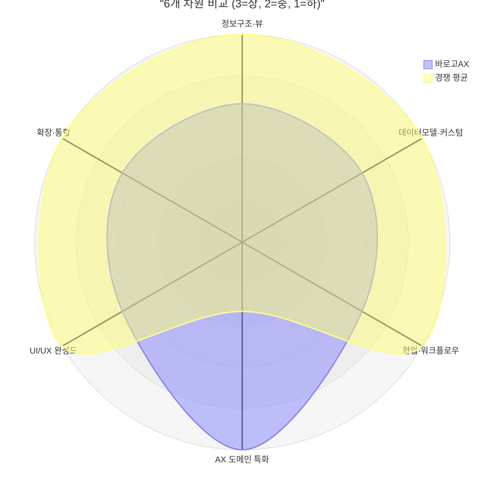
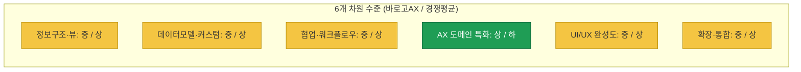
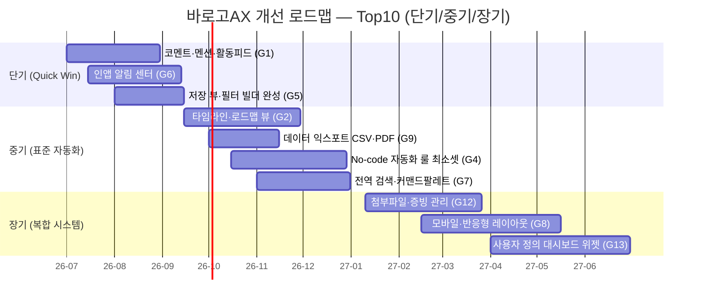
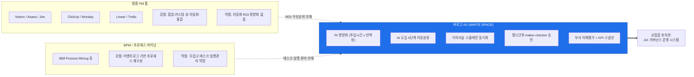
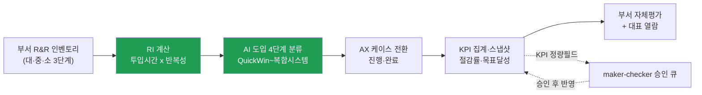

# 바로고 AX 관리 시스템 vs 일반 업무관리 시스템 — 비교 시각자료

## 시각자료 개요

본 문서는 member-alpha의 기능·UI 인벤토리 분석과 member-gamma의 경쟁 제품 팩트체크를 바탕으로, 바로고 AX 관리 시스템을 7개 범용 PM 도구(Notion·Asana·Jira·ClickUp·Monday·Linear·Trello)와 시각적으로 비교한다. 총 5종의 시각자료로 구성된다.

1. **기능 비교 매트릭스** — 15개 주요 기능 × 8개 시스템. 셀은 ✅(네이티브 지원) / △(부분·플러그인·유료·미완) / ❌(미지원). gamma 검증 사실과 일치하도록 작성(특히 Trello의 Power-Up·Premium 의존, Linear의 캘린더·간트 미제공, 승인 기능의 제품별 차이 반영).
2. **6개 차원 요약 테이블 + 레이더 도식** — 정보구조·데이터모델·협업워크플로우·AX도메인·UI/UX·확장통합 6개 축에서 바로고AX 수준(상/중/하)과 경쟁 평균 대비 포지션.
3. **UX 갭 우선순위 히트맵** — G1~G13 갭을 임팩트·구현난이도·도메인적합성 3개 축으로 평가한 표.
4. **개선 로드맵 간트** — Top10 개선점을 단기/중기/장기 3구간에 배치(Mermaid gantt).
5. **포지셔닝 도식** — "범용 PM 툴"과 "BPM/프로세스마이닝" 사이에서 바로고AX의 white space 위치(Mermaid flowchart).

> 표기 규칙: ✅ 네이티브 완전 지원 / △ 부분·플러그인·유료·미완·데모 / ❌ 미지원. 경쟁 제품 셀은 모두 gamma 팩트체크 로그(2026-06-18 기준) 근거.

---

### 1. 기능 비교 매트릭스 (15개 기능 × 8개 시스템)

| # | 기능 | 바로고AX | Notion | Asana | Jira | ClickUp | Monday | Linear | Trello |
|---|---|:---:|:---:|:---:|:---:|:---:|:---:|:---:|:---:|
| F1 | 테이블·리스트 뷰 | ✅ | ✅ | ✅ | ✅ | ✅ | ✅ | ✅ | △ |
| F2 | 칸반 보드(DnD) | ✅ | ✅ | ✅ | ✅ | ✅ | ✅ | ✅ | ✅ |
| F3 | 타임라인·간트 뷰 | ❌ | ✅ | ✅ | ✅ | ✅ | ✅ | △ | △ |
| F4 | 캘린더 뷰 | ❌ | ✅ | ✅ | ✅ | ✅ | ✅ | ❌ | △ |
| F5 | 저장된 뷰·필터 빌더 | △ | ✅ | ✅ | ✅ | ✅ | ✅ | ✅ | △ |
| F6 | 커스텀 필드(사용자 정의) | ❌ | ✅ | ✅ | ✅ | ✅ | ✅ | ✅ | △ |
| F7 | 수식·롤업 | ✅ | ✅ | △ | △ | ✅ | △ | △ | ❌ |
| F8 | No-code 자동화 룰 | ❌ | ✅ | ✅ | ✅ | ✅ | ✅ | ✅ | ✅ |
| F9 | 코멘트·@멘션·활동피드 | ❌ | ✅ | ✅ | ✅ | ✅ | ✅ | ✅ | ✅ |
| F10 | 인앱 알림 센터 | ❌ | ✅ | ✅ | ✅ | ✅ | ✅ | ✅ | ✅ |
| F11 | 네이티브 승인(approval) | ✅ | ❌ | ✅ | ✅ | △ | △ | ❌ | ❌ |
| F12 | RBAC·부서/스페이스 스코프 | ✅ | ✅ | ✅ | ✅ | ✅ | ✅ | ✅ | ✅ |
| F13 | 대시보드·리포팅 빌더 | △ | △ | ✅ | ✅ | ✅ | ✅ | △ | △ |
| F14 | REST/공개 API + Slack 연동 | ✅ | ✅ | ✅ | ✅ | ✅ | ✅ | ✅ | ✅ |
| F15 | 데이터 익스포트(CSV/PDF) | ❌ | ✅ | ✅ | ✅ | ✅ | ✅ | ✅ | △ |
| F16 | RI 자동 우선순위·가치사슬 | ✅ | ❌ | ❌ | ❌ | ❌ | ❌ | ❌ | ❌ |

> 핵심 읽기 포인트 (gamma 검증 반영):
> - **F11 승인**: 네이티브 결재형은 Asana(태스크 approval)·Jira(JSM 워크플로우 step, 단 커스텀 필드 사전설정 필요)만. Notion·Linear·Trello는 ❌(버튼/상태/Power-Up 조합), ClickUp·Monday는 △(상태 기반). 바로고AX는 필드 단위 maker-checker로 ✅.
> - **F3/F4 Linear**: 캘린더·간트 네이티브 미제공. Timeline(로드맵)만 있어 간트는 △, 캘린더는 ❌.
> - **F1/F3/F4/F5/F6/F13/F15 Trello**: 다수가 Power-Up 또는 Premium 유료 뷰 의존 → △.
> - **F16 RI·가치사슬**: 7개 범용 PM 도구 모두 네이티브 부재. 인접 영역은 별도 카테고리(프로세스 마이닝). 바로고AX 단독 ✅ — 명확한 white space.

---

## Mermaid 다이어그램

### 다이어그램 A. 6개 차원 레이더 (바로고AX vs 경쟁 평균)

상=3, 중=2, 하=1 척도. 바로고AX는 AX도메인(차원4)에서 압도적, 협업·확장에서 열위.

> radar-beta 미지원 렌더러를 위한 대체 막대 도식:

### 다이어그램 B. 개선 로드맵 간트 (Top10, 단기/중기/장기)

### 다이어그램 C. 포지셔닝 도식 — white space

### 다이어그램 D. AX 가치 파이프라인 (도메인 차별점 흐름)

---

## 핵심 수치 테이블

### 표 1. 6개 차원 요약 (수준 + 경쟁 대비 포지션)

| 차원 | 바로고AX 수준 | 경쟁 평균 | 포지션 | 핵심 근거 |
|---|:---:|:---:|---|---|
| 1. 정보구조·뷰 | 중 | 상 | 열위 | 테이블·칸반 ✅이나 타임라인·캘린더 ❌, 저장뷰 △ |
| 2. 데이터모델·커스텀 | 중 | 상 | 열위 | 수식·롤업 ✅(고정공식)이나 커스텀 필드 ❌ |
| 3. 협업·워크플로우 | 중 | 상 | 혼재 | 승인·RBAC·감사로그 ✅이나 코멘트·알림 ❌ |
| 4. AX 도메인 특화 | **상** | **하** | **압도적 우위** | RI·AI4단계·가치사슬·LLM재분석 — 경쟁 전무 |
| 5. UI/UX 완성도 | 중 | 상 | 열위 | 인라인편집·상세패널 ✅이나 모바일·검색·a11y ❌ |
| 6. 확장·통합 | 중 | 상 | 열위 | API·Slack·임포트 ✅이나 익스포트·Webhook ❌ |

### 표 2. UX 갭 우선순위 히트맵 (G1~G13)

척도: 임팩트(高/中/低), 구현난이도(高=어려움/中/低=쉬움), 도메인적합성(高=AX에 잘맞음/中/低).

| 갭 | 내용 | 임팩트 | 구현난이도 | 도메인 적합성 | 종합 우선순위 |
|---|---|:---:|:---:|:---:|:---:|
| G1 | 코멘트·멘션·활동피드 | 高 | 中 | 高 | ★★★ (1) |
| G6 | 인앱 알림 센터 | 高 | 中 | 高 | ★★★ (2) |
| G5 | 저장 뷰·필터 빌더 완성 | 中 | 低 | 高 | ★★★ (3) |
| G2 | 타임라인·로드맵 뷰 | 高 | 中 | 高 | ★★★ (4) |
| G9 | 데이터 익스포트(CSV/PDF) | 中 | 低 | 中 | ★★ (5) |
| G4 | No-code 자동화 룰 | 中 | 高 | 高 | ★★ (6) |
| G12 | 첨부파일·증빙 관리 | 中 | 中 | 中 | ★★ (7) |
| G7 | 전역 검색·커맨드팔레트 | 中 | 中 | 中 | ★★ (8) |
| G8 | 모바일·반응형 | 中 | 高 | 中 | ★★ (9) |
| G13 | 사용자 정의 대시보드 위젯 | 中 | 高 | 中 | ★★ (10) |
| G3 | 커스텀 필드(사용자 정의) | 高 | 高 | 低 | ★ (차순위) |
| G10 | 외부 Webhook 트리거 | 低 | 中 | 低 | ★ |
| G11 | 접근성(키보드·ARIA) | 中 | 中 | 低 | ★ |

> G3는 임팩트는 크나 고정 도메인 스키마(RI·KPI 정합성 근간)와 충돌하므로 도메인 적합성 低 → 제한적 도입 별도 검토.

### 표 3. 시스템별 ✅/△/❌ 집계 (16개 기능 기준)

| 시스템 | ✅ | △ | ❌ | 특징 한 줄 |
|---|:---:|:---:|:---:|---|
| 바로고AX | 7 | 2 | 7 | AX 도메인 단독 ✅, 범용 협업·통합 다수 ❌ |
| Notion | 12 | 2 | 2 | 문서·DB·AI Agents 종합형, 승인·대시보드 △ |
| Asana | 13 | 2 | 1 | 워크매니지먼트 + 네이티브 승인 + AI Studio |
| Jira | 13 | 2 | 1 | 이슈/ITSM, JSM 승인, Rovo AI |
| ClickUp | 14 | 2 | 0 | 올인원 15+뷰, Brain² AI, 승인만 △ |
| Monday | 13 | 3 | 0 | Work OS, AI Blocks, 승인·수식·롤업 △ |
| Linear | 11 | 3 | 2 | 제품개발 특화, 캘린더·간트 ❌ |
| Trello | 5 | 9 | 2 | 칸반 경량, 다수 기능 Power-Up/Premium 의존 |

> 바로고AX의 ❌ 7개는 모두 범용 협업·통합 영역(G1·G2·G4·G6·G9·F15·F16 외 경쟁)이며 개선 로드맵 대상. 반대로 F16(RI·가치사슬)은 경쟁 8개 중 바로고AX만 ✅인 유일 항목.

### 표 4. 개선 로드맵 구간별 요약

| 구간 | 기간 | 개선점(갭) | 기대효과 |
|---|---|---|---|
| 단기 | 2026 Q3 | G1·G6·G5 | maker-checker 협업 루프 완결, 부서별 작업흐름 정착 |
| 중기 | 2026 Q4 | G2·G9·G4·G7 | 경영보고 가치 ↑, 도메인 자동화 룰 차별화 |
| 장기 | 2027 H1 | G12·G8·G13 | 현장 채택률·증빙관리·맞춤 지표 구성 |
