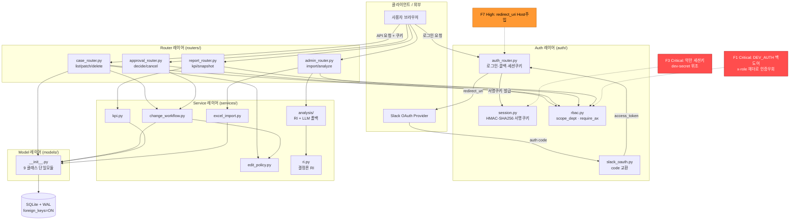
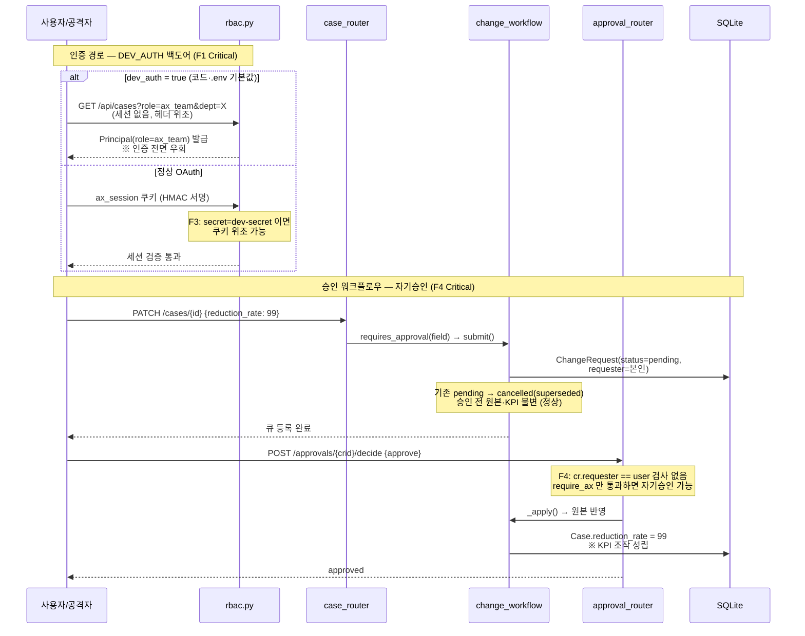
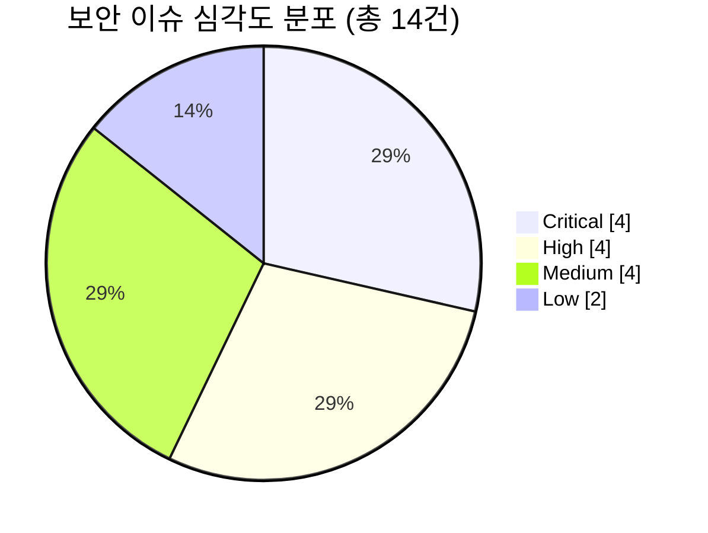

# 바로고 AX 통합 관리 시스템 — 종합 평가 보고서

> **대상:** `ax-management-system` (FastAPI + SQLAlchemy 2.0 + SQLite/WAL 기반 내부망 RBAC 웹앱, 약 1,018 LOC, 1단계 결정론 스캐폴드)
> **평가일:** 2026-06-18
> **방식:** 6개 평가 에이전트 병렬 투입 (코드/아키텍처·보안·설계 부합도·업계 표준·시각화·통합)
> **기준 문서:** `AX_관리시스템_설계서.md` (2026-06-15, 인터뷰 업데이트 2026-06-16)

---

## 1. 종합 요약

바로고 AX 통합 관리 시스템은 11개 부서의 업무를 정량화(RI·KPI)하고 AX(AI 전환) 진척을 통제하기 위한 내부망 웹앱으로, 현재 **1단계 결정론 스캐폴드** 상태다. 본 평가는 설계 부합도·보안·코드 품질·업계 표준·운영 준비도 5개 차원을 종합했다.

### 종합 등급: **C- (조건부 — 보안 Critical 해결 전 운영 배포 불가)**

| 차원 | 지표 | 등급 | 평가자 |
|---|---|:---:|---|
| 설계 부합도 | 72% | C | zeta |
| 보안 | Critical 4·High 4·Medium 4·Low 2 | **D** | gamma |
| 코드 품질 | 68/100 | C- | alpha |
| 업계 표준 부합 | 부분 미준수 | C- | eta |
| 운영 준비도 | 미흡 | **D** | gamma·zeta·eta |

> 등급 기준: A(≥90) · B(80~89) · C(65~79) · D(<65 또는 Critical 미해결). 보안·운영준비도는 미해결 Critical로 정성 하향.

**총평.** 도메인 설계의 골격은 1단계 스캐폴드 기준으로 견고하다 — 레이어 분리(router→service→model/auth, 순환 의존 없음), 데이터 모델 8객체, 승인 워크플로우(상태 단방향 전이 + supersede + 승인 전 KPI 불변), KPI 집계 stage 한정, 그리고 설계가 명시적으로 요구한 **Meeting 전면 제외**가 모델·라우터·DB 전체에서 완벽히 지켜졌다. 외부 의존성을 의도적으로 최소화(requirements 8줄, OIDC 위임으로 패스워드 자체저장 회피)한 선택도 내부망·단일 PC 맥락에서 합리적이다.

그러나 **인증 신뢰 사슬을 근본적으로 무력화·위조할 수 있는 Critical 4건이 코드 기본값과 평문 저장된 `.env`(OneDrive 동기화)에 함께 존재**한다는 점이 시스템의 가장 큰 결함이다. `DEV_AUTH=true` 백도어(헤더만으로 전권), 평문 저장된 실시크릿, 약한 세션키(`dev-secret`), 자기승인 가능(maker-checker 위배)은 정량 통제 시스템의 신뢰도를 뿌리에서 훼손한다. 이는 단순한 "미완성"이 아니라 **현 상태로 배포 시 인증이 사실상 없는 것과 동등**하다.

동시에 1단계 스캐폴드라는 맥락은 공정하게 반영되어야 한다. 미구현 항목(케이스 생성 API, 관리 API, 스냅샷, 프런트엔드, 테스트) 다수는 "잘못 만든 것"이 아니라 "아직 안 만든 것"이며, 설계 핵심 골격이 충실한 만큼 보안 Critical만 차단하면 건전한 기반 위에 증축 가능하다.

> **사실 정정(팀장 리뷰):** 평가 중 일부 산출물이 시크릿을 "git 커밋됨"으로 기술했으나, 검증 결과 `.env`는 git 추적 대상이 아니다(`git ls-files .env` 무결과). 다만 실시크릿이 **평문 파일로 OneDrive 동기화 폴더에 저장**된 사실은 유효하므로 위험도(Critical)와 로테이션 권고는 유지한다.

---

## 2. 시스템 아키텍처 (시각화)

router→service→model/auth 단방향 레이어 구조. 빨강/주황 점선 노드는 보안 결함 위치.

### 인증·승인 우회 경로 (Critical 강조)

### 보안 이슈 심각도 분포 (총 14건)

---

## 3. 핵심 인사이트

### 3.1 강점 — 1단계 스캐폴드로서 견고한 골격 (공정 반영)

- **도메인 설계 우수.** 업계 벤치마크 결과 라우터/서비스 분리·RBAC 스코프·감사로그·승인 워크플로우 등 도메인 설계는 비교군(공식 풀스택 템플릿 포함) 대비 견고하다. 흔한 도메인 안티패턴(패스워드 미해싱, IDOR, 감사 부재, SQLite 동시성 미고려)을 대부분 회피했다.
- **Meeting 제외 정확 구현.** 설계서 §1.3/§2.1의 핵심 범위 결정이 전체 검색 0건으로 완벽 준수.
- **승인 워크플로우 골격 정확.** 상태 단방향 전이 + 동일 필드 pending 자동 supersede + 승인 전 원본·KPI 불변이 설계 의도대로 구현. 결함은 "누가 승인하는가"(자기승인 F4)에 한정.
- **결정론/LLM 2단계 분리 + 오프라인 폴백.** OPENAI_API_KEY 미설정 시 휴리스틱 폴백을 둔 것은 데이터 거버넌스상 적절한 완충.
- **표준 부합 항목 존재.** Pydantic Settings, `get_db` DI, WAL+foreign_keys, ADMIN_SLACK_IDS 부트스트랩은 업계 표준에 부합.

### 3.2 치명적 결함 — 인증 신뢰 사슬의 단일 실패점 (Critical 4건)

네 건 모두 "인증·승인을 무력화하거나 위조"하는 단일 실패점이며, 코드 기본값과 평문 저장된 `.env`에 공존한다는 점이 위험을 증폭한다.

| ID | 결함 | 영향 | 근거 파일 |
|---|---|---|---|
| F1 | `DEV_AUTH=true` 기본값 → `?role=ax_team` 헤더만으로 전권 (fail-open). `/health`가 dev_auth 노출해 탐지까지 용이 | 인증 전면 우회 | `config.py:16`, `.env:10`, `rbac.py:34-38` |
| F2 | OpenAI 키·Slack client_secret 평문 저장 (실 키, OneDrive 동기화) | 외부 비용·계정 탈취 | `.env:5,13` |
| F3 | `SESSION_SECRET`=`dev-secret`/`change-me` → 임의 role·dept 세션 쿠키 위조 | 세션 위조 → 전권 | `config.py:14`, `.env:6` |
| F4 | ax_team이 자기 ChangeRequest 자기승인 (maker-checker 위배) | KPI 조작 (절감률 임의 상향→자기승인) | `approval_router.py:26-33` |

### 3.3 정량 통제 신뢰도 훼손 — 결정론 약속 위배 (코드 품질)

이 시스템의 존재 이유는 RI·KPI 정량 통제인데, 그 핵심 계산이 결정론을 보장하지 못한다.

- **RI 비결정론(높음).** 반복성 가중치가 batch 전체 min/max 분포에 의존 → 같은 업무도 함께 계산되는 단위(부서 전체 vs 일부)에 따라 RI가 달라짐. 설계서 §0의 "결정론" 약속 위배(`ri.py:56-64`, `analysis/__init__.py:19-24`).
- **KPI 가중평균 미적용(높음).** `avg_reduction`이 단순 산술평균으로 hours 가중 없어 부서 절감률 왜곡(`kpi.py:38`). 계산식 자체가 "미확정" 스텁 상태.
- **승인 통제 우회(높음).** 파생필드(hours/ri/weight)가 IMMEDIATE 집합에 포함 → 클라이언트가 RI를 직접 덮어써 KPI 통제 우회 가능. 미지정 patch 키는 조용히 무시(`edit_policy.py:5-9`, `case_router.py:44-51`).

> 주: zeta는 승인 라우팅 로직 자체는 "직접 반영 우회 차단됨(통과)"으로 판정. 모순이 아니라 층위가 다르다 — 승인 **필드 분류 라우팅**은 정확하나, **파생필드가 IMMEDIATE에 잘못 분류**되어 통제 밖에 있다는 것이 alpha의 지적이다. 둘 다 유효.

### 3.4 미완성 = 미구현 (스캐폴드 맥락 — 결함 아닌 잔여 과제)

설계 부합도 72%의 주된 감점은 "잘못 만듦"이 아니라 "아직 안 만듦"이다. 워크플로우/API 영역 충족도가 55%로 가장 낮다.

- 미구현(설계 명시): 케이스 생성 `POST /cases`, ActionItem 라우터, 관리 API(`/admin/users`·`/admin/lookups`), KPI 월말 스냅샷, 프런트엔드(Jinja2+HTMX), 동적 컬럼매핑, `tests/`.
- 설계 이탈(주의 요): 미매핑 Slack 사용자를 거부가 아닌 **staff로 자동 생성**(zeta ⚠️ + gamma F10) — 거버넌스/보안 이탈로 우선 시정 권고.

### 3.5 인프라 레이어가 업계 표준을 우회 — 운영 확장 리스크 집중

도메인은 견고하나 인프라는 검증된 라이브러리를 우회한 자체 경량 구현이라, 운영 확장 시 리스크가 여기 집중된다.

- **Alembic 부재** → `create_all`만으로는 운영 중 컬럼 추가 불가(Case 40+ 컬럼 확장 도메인에서 차단급).
- **인메모리 `JOBS` dict**로 잡 추적 → 재시작 소실·멀티워커 불가.
- **`urlopen` 타임아웃 미설정** → Slack 지연 시 워커 블로킹(가용성).
- **테스트 0건** → RI·KPI 결정론·RBAC·승인 전이 회귀 검증 불가(전 평가자 공통 지적, 최우선 갭).
- 부수: SQLAlchemy 1.x 레거시 매핑, `@app.on_event` deprecated, 인증을 `Depends` 아닌 직접 호출(테스트 목킹 약화).
- **오버엔지니어링 회피 권고.** Casbin·amis-admin 전면 도입·PostgreSQL 전환은 현 규모에 불필요 — 현 함수형 RBAC·SQLite WAL 유지가 적절.

### 3.6 라이선스 — 청정, 단 데이터 경계 리스크 1건

- 카피레프트(GPL/AGPL) 의존성 없음. 전부 MIT/BSD/Apache-2.0 퍼미시브 → 내부 배포 충돌 없음. 표절 위험 패턴 미발견.
- 유일한 컴플라이언스 리스크는 라이선스가 아닌 **데이터 거버넌스**: §8 LLM 분석이 부서 업무 데이터를 OpenAI API로 외부 전송 → 내부망 격리 정책과 충돌 가능. 분석 전용 PC 분리 또는 온프레미스 LLM(Ollama) 옵션 명문화 권고.

---

## 4. 평가 스코어 매트릭스

| 차원 | 점수/지표 | 등급 | 핵심 근거 |
|---|---|:---:|---|
| 설계 부합도 (Conformance) | 72% | **C** | 핵심 골격(모델·승인·KPI·Meeting 제외)은 충실, 생성/관리 API·프런트 미완 |
| 보안 (Security) | Critical 4건 | **D** | 인증 무력화·위조 결함이 코드+평문 `.env`에 공존 |
| 코드 품질 (Code Quality) | 68/100 | **C-** | 레이어 분리 우수, 결정론 위배·승인 우회·테스트 전무 |
| 업계 표준 (Best Practice) | 부분 미준수 | **C-** | Pydantic 스키마 부재·시크릿 평문·테스트 0·Alembic 부재 |
| 운영 준비도 (Prod Readiness) | 미흡 | **D** | fail-open 백도어·Secure 미설정·스냅샷/관리API 부재 |

### 설계 부합도 세부 (가중)

| 영역 | 가중 | 충족도 |
|---|:---:|:---:|
| 시스템성격/범위(Meeting 제외) | 15% | 95% |
| 데이터 모델 8객체 | 20% | 80% |
| RBAC/권한 | 20% | 85% |
| 워크플로우/API | 25% | 55% |
| Seed/엑셀 | 10% | 60% |
| 기술스택/폴더/테스트 | 10% | 55% |
| **가중 합** | **100%** | **≈72%** |

### 리스크 히트맵 (심각도 × 영역)

**Critical=🔴 / High=🟠 / Medium=🟡 / Low=⚪**

| 영역 \ 심각도 | 🔴 Critical | 🟠 High | 🟡 Medium | ⚪ Low |
|---|---|---|---|---|
| **인증/세션** | F1 DEV_AUTH 백도어 F3 약한 세션키 | F5 쿠키 Secure 누락 F7 redirect_uri Host주입 | F9 토큰/id_token 미검증 | F14 만료/무효화 미흡 |
| **승인/직무분리** | F4 자기승인 가능 | F6 승인 IDOR/스코프 F8 old_val 오염 | — | — |
| **접근통제/스코프** | — | — | F11 대량삭제·실삭제 F12 analyze_status 무인증 | F13 편집권한 과대 |
| **계정/온보딩** | — | — | F10 미등록자 자동가입 | — |
| **시크릿 관리** | F2 실시크릿 평문 저장 | — | — | — |

**히트존 (즉시 조치):** 🔴 인증/세션 2건 · 승인 1건 · 시크릿 1건 — 모두 인증 신뢰 사슬의 단일 실패점.

---

## 5. 추천 사항 (우선순위 로드맵)

우선순위·담당영역·근거 파일을 매핑한 통합 로드맵. **P0는 운영 배포의 전제 조건(미해결 시 배포 불가).**

| 우선 | 조치 | 담당영역 | 근거 파일 | 출처 |
|:---:|---|---|---|---|
| **P0** | DEV_AUTH fail-closed: 기본 `false`, 운영서 true면 기동 거부, `/health` 노출 제거 | 보안/인증 | `config.py:16`, `.env:10`, `rbac.py:34-38`, `main.py:37` | gamma F1, alpha, eta |
| **P0** | 시크릿 로테이션·제거: OpenAI 키·Slack secret 즉시 폐기·재발급, `.env`를 동기화 폴더 밖 보관, `.env.example`만 유지 | 보안/시크릿 | `.env:5,13` | gamma F2 |
| **P0** | SESSION_SECRET 강제: 기본값 제거, 약한 값이면 기동 거부, 32B+ 랜덤 | 보안/세션 | `config.py:14`, `.env:6`, `session.py` | gamma F3 |
| **P0** | 자기승인 차단: `cr.requester == 승인자`면 403, 비교는 `slack_id` 기반 | 보안/직무분리 | `approval_router.py:26-33` | gamma F4, delta |
| **P1** | RI 결정론 보장: 가중치 batch 독립화 + 빈도 정규화 일원화 | 코드품질/정량통제 | `ri.py:56-64`, `analysis/__init__.py:20-22` | alpha |
| **P1** | 승인 통제 우회 차단: 파생필드(hours/ri/weight) IMMEDIATE 제거, 미지정 키 400 | 코드품질/통제 | `edit_policy.py:5-9`, `case_router.py:44-51` | alpha |
| **P1** | 쿠키 Secure(F5) + redirect_uri 고정(F7) + 승인 식별키 slack_id화(F6/F8) | 보안/High | `auth_router.py:50,14-15`, `change_workflow.py:13` | gamma F5·F7·F6·F8 |
| **P1** | 미매핑 사용자 자동가입 → 승인 대기 큐로 변경 (설계 이탈 시정) | 보안/거버넌스 | `auth_router.py:40-44` | gamma F10, zeta ⚠️ |
| **P1** | DB 제약 보강: UniqueConstraint(dept_id, code) + cascade/ondelete + 정책-모델 필드 정합 | 코드품질/데이터 | `models/__init__.py:23,68,86` | alpha |
| **P1** | 핵심 로직 단위 테스트 도입(RI·KPI·RBAC·승인 전이) + Pytest/TestClient | 품질/표준 | `tests/`(신규) | alpha, eta, zeta |
| **P2** | KPI 가중평균 적용(hours 가중) + 분모 기준 통일 + 계산식 확정 | 코드품질/정량통제 | `kpi.py:29,37,38,40` | alpha |
| **P2** | analyze_status 인증 추가(F12) + 임포트/삭제 가드(F11, 부서 스코프·확인·백업) + 파일 검증 | 보안/Medium | `admin_router.py:52-57`, `excel_import.py:97-103` | gamma F11·F12 |
| **P2** | Alembic 도입 + 잡 영속화(DB 테이블) + `urlopen` 타임아웃 | 표준/인프라 | `db.py`, `analysis.JOBS`, `slack_oauth.py:26,32` | eta |
| **P2** | 미구현 API 보강: `POST /cases`·ActionItem·관리 API·KPI 스냅샷 | 설계부합/기능 | `case_router.py`, `report_router.py` | zeta |
| **P2** | 데이터 경계: LLM 경로 분석 전용 PC 분리 또는 온프레미스 LLM 옵션 명문화 | 거버넌스 | §8 분석 경로 | eta |
| **P3** | 현대화: SQLAlchemy 2.0 매핑·lifespan 전환·`Depends(current_user)`·모델 per-file·HTMX 프런트 | 표준/점진 | `models/__init__.py`, `main.py` | eta, zeta |

### 로드맵 분류

- **즉시 조치 (배포 전 필수, P0):** F1·F2·F3·F4 — 인증 Critical 4건. 해결 전까지 운영 배포 금지. 이 네 건은 코드 수정량이 작아(주로 기본값·가드 추가) 수일 내 완료 가능.
- **단기 (2주, P1):** RI 결정론·승인 통제 우회·High 보안 3건(F5/F7/F6·F8)·미매핑 자동가입 시정·DB 제약·핵심 단위 테스트 도입. 정량 통제 신뢰도와 인증 표면을 정상화.
- **중기 (P2~P3):** KPI 가중·Medium 보안·Alembic/잡영속화/타임아웃·미구현 API·데이터 경계 정책·현대화. 운영 확장성과 기능 완성도 확보. **채택 금지:** Casbin·amis-admin 전면도입·PostgreSQL 전환(현 규모 오버엔지니어링).

### 의사결정 권고

1. 현 상태는 건전한 도메인 기반 위의 1단계 스캐폴드다. **폐기·재작성이 아니라 P0 차단 + P1 보강으로 증축하는 것이 합리적.**
2. **P0 4건은 비협상 게이트다.** 미해결 시 인증이 사실상 없는 시스템이므로 어떤 형태의 운영 노출도 금지.
3. P1의 단위 테스트 도입을 우선 배치하라 — RI/KPI 결정론 수정의 회귀를 잡는 안전망이자, 이후 모든 보강의 토대다.

---

*근거 산출물: `member-alpha/analysis-report.md` · `member-gamma/fact-check-log.md` · `member-zeta/design-spec.md` · `member-eta/github-research-report.md` · `member-delta/visuals.md` · `member-beta/draft-report.md`*
*평가 방식: Team Lead 오케스트레이션 + 6개 평가 에이전트 병렬/순차 투입 + 격리 리뷰*
