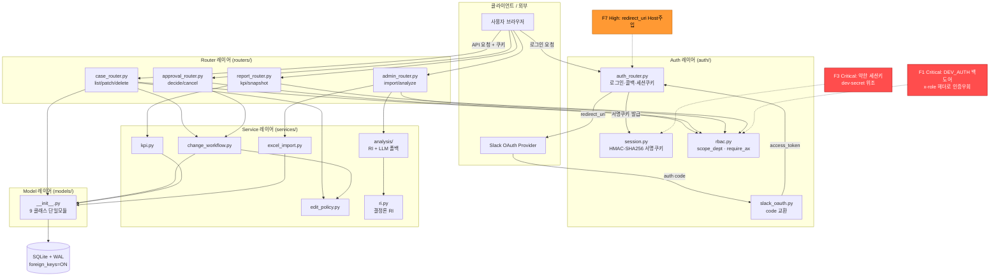
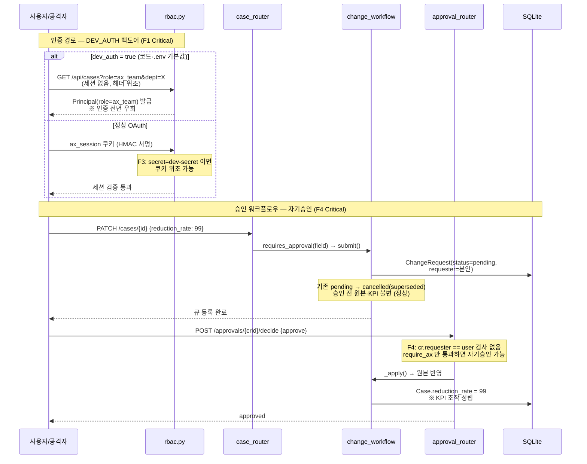
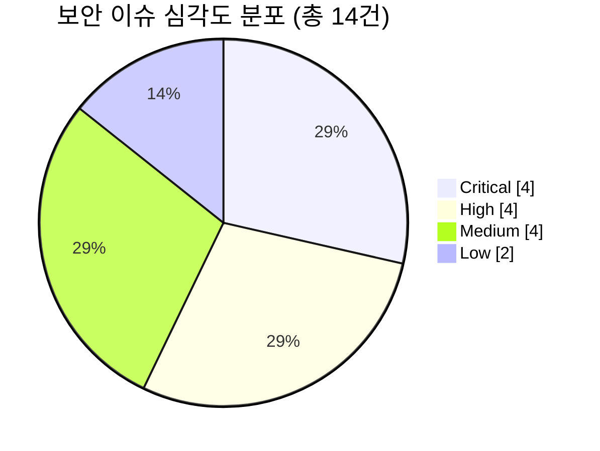

# AX 통합 관리 시스템 — 평가 시각자료 (member-delta)

> 출처: member-alpha(코드/아키텍처 68/100) · member-gamma(보안 14건: Critical 4·High 4·Medium 4·Low 2) · member-zeta(설계 부합도 72%)
> 작성일: 2026-06-18

---

## 시각자료 개요

본 문서는 바로고 AX 통합 관리 시스템(FastAPI + SQLAlchemy 2.0 + SQLite/WAL 기반 내부망 RBAC 웹앱, 약 1,018 LOC, 1단계 스캐폴드)에 대한 3개 평가 보고서를 5종 시각자료로 종합한다.

| # | 시각자료 | 형식 | 핵심 메시지 |
|---|---|---|---|
| 1 | 시스템 아키텍처 다이어그램 | Mermaid flowchart | router→service→model/auth 단방향 레이어 + SQLite(WAL) + Slack OAuth 흐름. 보안 결함 위치 표기 |
| 2 | 인증·승인 워크플로우 | Mermaid sequence | DEV_AUTH 백도어(F1)·자기승인(F4) 우회 경로 강조 |
| 3 | 평가 스코어 매트릭스 | 테이블 | 5개 차원 점수·등급 (설계부합도 72% / 보안 D / 코드품질 68 등) |
| 4 | 리스크 히트맵 | 테이블 | 14개 보안 이슈를 심각도×영역으로 배치, Critical/High 강조 |
| 5 | 이슈 심각도 분포 | Mermaid pie | Critical 4·High 4·Medium 4·Low 2 비율 |

**핵심 결론**: 아키텍처 의도(레이어 분리·결정론/LLM 2단계·Meeting 제외)는 우수하나, **인증을 무력화·위조 가능한 Critical 4건**(DEV_AUTH 백도어·평문 시크릿·약한 세션키·자기승인)이 정량 통제 시스템의 신뢰도를 근본적으로 훼손한다.

---

## Mermaid 다이어그램

### 1. 시스템 아키텍처 다이어그램

### 2. 인증·승인 워크플로우 다이어그램 (보안 발견 강조)

### 5. 이슈 심각도 분포 (보안 14건)

---

## 핵심 수치 테이블

### 3. 평가 스코어 매트릭스 (차원별 점수·등급)

| 차원 | 점수/지표 | 등급 | 평가자 | 핵심 근거 |
|---|---|:---:|---|---|
| 설계 부합도 (Conformance) | 72% | **C** | zeta | 핵심 골격(모델·승인·KPI·Meeting 제외)은 충실, 생성/관리 API·프런트 미완 |
| 보안 (Security) | Critical 4건 | **D** | gamma | 인증 무력화·위조 결함이 코드+커밋 `.env`에 공존 |
| 코드 품질 (Code Quality) | 68/100 | **C-** | alpha | 레이어 분리 우수, 결정론 위배·승인 우회·테스트 전무 |
| 업계 표준 (Best Practice) | 부분 미준수 | **C-** | alpha·gamma | Pydantic 스키마 부재·시크릿 평문커밋·테스트 0 |
| 운영 준비도 (Prod Readiness) | 미흡 | **D** | gamma·zeta | fail-open 백도어·Secure 미설정·스냅샷/관리API 부재 |

> 등급 기준: A(≥90) · B(80~89) · C(65~79) · D(<65 또는 Critical 미해결). 보안·운영준비도는 Critical 결함으로 정성 하향.

#### 설계 부합도 세부 (zeta, 가중)

| 영역 | 가중 | 충족도 |
|---|:---:|:---:|
| 시스템성격/범위(Meeting 제외) | 15% | 95% |
| 데이터 모델 8객체 | 20% | 80% |
| RBAC/권한 | 20% | 85% |
| 워크플로우/API | 25% | 55% |
| Seed/엑셀 | 10% | 60% |
| 기술스택/폴더/테스트 | 10% | 55% |
| **가중 합** | **100%** | **≈72%** |

### 4. 리스크 히트맵 (심각도 × 영역)

각 셀은 해당 영역·심각도에 속한 발견 ID. **Critical=🔴 / High=🟠 / Medium=🟡 / Low=⚪**

| 영역 \ 심각도 | 🔴 Critical | 🟠 High | 🟡 Medium | ⚪ Low |
|---|---|---|---|---|
| **인증/세션** | F1 DEV_AUTH 백도어 F3 약한 세션키 | F5 쿠키 Secure 누락 F7 redirect_uri Host주입 | F9 토큰/id_token 미검증 | F14 만료/무효화 미흡 |
| **승인/직무분리** | F4 자기승인 가능 | F6 승인 IDOR/스코프 F8 old_val 오염 | — | — |
| **접근통제/스코프** | — | — | F11 대량삭제·실삭제 F12 analyze_status 무인증 | F13 편집권한 과대 |
| **계정/온보딩** | — | — | F10 미등록자 자동가입 | — |
| **시크릿 관리** | F2 실시크릿 평문커밋 | — | — | — |

**히트존 (즉시 조치):** 🔴 인증/세션 2건 · 승인 1건 · 시크릿 1건 — 모두 인증 신뢰 사슬의 단일 실패점.

#### Critical 4건 요약 (최우선)

| ID | 발견 | 위치 | 즉시 조치 |
|---|---|---|---|
| F1 | `DEV_AUTH=true` 기본값+커밋 → 헤더만으로 ax_team 전권 | `config.py:16`, `.env:10`, `rbac.py:34-38` | 기본 false + 운영 시 기동거부(fail-closed) |
| F2 | OpenAI 키·Slack secret 평문 커밋 | `.env:5,13` | 즉시 로테이션 + git 히스토리 제거 |
| F3 | `SESSION_SECRET=dev-secret/change-me` → 쿠키 위조 | `config.py:14`, `.env:6` | 약한 값이면 기동거부, 32B+ 랜덤 |
| F4 | ax_team 자기 ChangeRequest 자기승인(maker-checker 위배) | `approval_router.py:26-33` | `cr.requester==승인자`면 403 |

#### 코드 품질 Top 5 개선 (alpha)

| 우선 | 개선 항목 | 근거 |
|:---:|---|---|
| 1 | RI 결정론 보장 (batch 독립 가중치 + 빈도 정규화 일원화) | `ri.py:56-64` |
| 2 | 승인 통제 우회 차단 (파생필드 편집 제거, 미지정 키 400) | `edit_policy.py:5-9` |
| 3 | dev 인증 기본값 강경화 (dev_auth=false, 기본역할 staff) | `config.py:16` |
| 4 | DB 제약 보강 (UniqueConstraint(dept_id, code) + cascade) | `models/__init__.py:23` |
| 5 | 핵심 로직 단위 테스트 + excel_import 헤더 기반 매핑 | `excel_import.py:42` |
