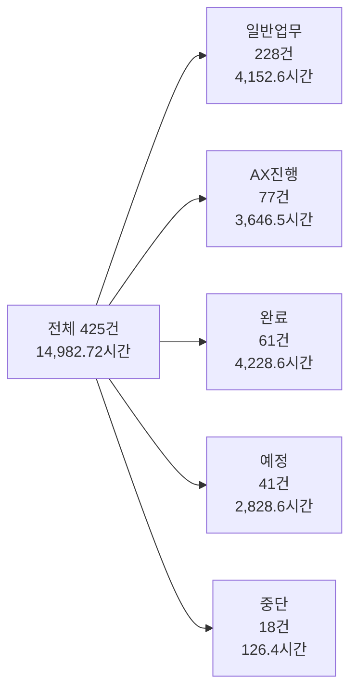
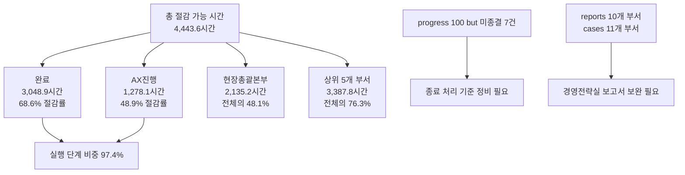

# AX 대시보드 전사 AX 진행 현황 요약

**작성일**: 2026-07-31
**Task Type**: research-report
**활성 멤버**: alpha(조사) · gamma(팩트체크) · delta(시각화) · beta(보고서)
**사이클**: 1 / 3
**승인**: human_approval override (사내 대시보드 데이터 사용) - Notion 저장은 자동 진행, Slack 등 나머지 외부 배포는 승인 대기 알림만 발송

# 요약
- AX 대시보드 `cases` 전체 `11개 부서`를 재집계한 결과, 전사 AX 케이스는 `425건`, 총 월간 업무시간은 `14,982.72시간`, 가중 평균 절감률은 `29.7%`, 환산 절감 가능 시간은 `4,443.6시간`이다.
- 절감 가능 시간의 `97.4%`가 이미 `완료(3,048.9시간)` 또는 `AX진행(1,278.1시간)` 단계에 몰려 있어, 현재 전사 AX의 핵심은 신규 발굴보다 실행 전환과 운영 안정화다.
- 부서별로는 `현장총괄본부`가 절감 가능 시간 `2,135.2시간`으로 전체의 `48.1%`를 차지하고, `물류운영사업부`, `법무실`, `통합운영실_통합운영팀`, `경영지원실_피플팀`까지 상위 5개 부서가 `76.3%`를 차지한다.
- 정성 보고서는 최신 작성일이 `2026-07-03`에 머물러 있고 `경영전략실` 보고서가 누락돼 있어, 7월 말 시점 판단은 `cases` export를 기준선으로 보는 것이 안전하다.

# 핵심 지표
| 구분 | 건수 | 비중 | 시간 | 평균 절감률 | 환산 절감 가능 시간 | 해석 |
|---|---:|---:|---:|---:|---:|---|
| 일반업무 | 228 | 53.6% | 4,152.6 | 1.1% | 71.6 | 미착수 물량은 크지만 절감 가정은 거의 비어 있음 |
| AX진행 | 77 | 18.1% | 3,646.5 | 48.9% | 1,278.1 | 실행 중 파이프라인의 절감 효과가 큼 |
| 완료 | 61 | 14.4% | 4,228.6 | 68.6% | 3,048.9 | 이미 실현된 절감효과 핵심 구간 |
| 예정 | 41 | 9.6% | 2,828.6 | 10.2% | 22.9 | 착수 예정 물량은 크지만 절감 설계는 약함 |
| 중단 | 18 | 4.2% | 126.4 | 2.8% | 22.0 | 절감효과 기여는 제한적 |

| 부서 | 케이스 수 | 월 업무시간 | 평균 진행률 | 평균 절감률 | 환산 절감 가능 시간 | AX진행 | 완료 |
|---|---:|---:|---:|---:|---:|---:|---:|
| 현장총괄본부 | 24 | 5,651.7 | 23.3% | 14.8% | 2,135.2 | 2 | 5 |
| 물류운영사업부 | 45 | 2,189.0 | 40.0% | 37.3% | 348.4 | 23 | 4 |
| 법무실 | 20 | 797.8 | 47.8% | 50.0% | 346.3 | 3 | 8 |
| 통합운영실_통합운영팀 | 40 | 1,205.7 | 35.2% | 23.7% | 280.2 | 4 | 11 |
| 경영지원실_피플팀 | 32 | 876.5 | 25.0% | 25.0% | 277.7 | 23 | 0 |
| 채널비즈니스팀 | 23 | 790.0 | 35.2% | 26.3% | 266.0 | 7 | 4 |
| 경영전략실 | 49 | 698.9 | 36.5% | 26.3% | 228.5 | 3 | 15 |
| 재무관리실_AP팀 | 63 | 806.2 | 6.5% | 11.7% | 223.7 | 7 | 0 |
| 통합운영실_커넥트운영팀 | 91 | 767.1 | 12.1% | 10.4% | 214.9 | 0 | 11 |
| 4륜사업본부_운영지원팀 | 17 | 496.0 | 4.1% | 5.6% | 74.2 | 4 | 0 |
| 재무관리실_재무회계팀 | 21 | 704.0 | 18.6% | 9.9% | 48.5 | 1 | 3 |

| 데이터 품질 체크 | 수치 | 의미 |
|---|---:|---|
| `progress_rate=100` 미종결 | 7건 | 운영상 완료 처리 지연 |
| `cases` 부서 수 | 11개 | 전사 정량 기준선 |
| `reports` 부서 수 | 10개 | `경영전략실` 보고서 누락 |
| 최신 보고서 작성일 | 2026-07-03 | 정성 보고 최신성 시차 |

# 핵심 인사이트
## 1. 리소스 절감효과는 이미 실행 단계에 올라온 업무에서 대부분 결정되고 있다
- `완료` 단계 평균 절감률은 `68.6%`, `AX진행` 단계는 `48.9%`로 높고, 두 단계가 절감 가능 시간의 `97.4%`를 차지한다.
- 이는 전사 AX의 핵심 관리 포인트가 `신규 아이디어 발굴`보다 `실행 중 업무의 완료 전환`, `운영 품질 안정화`, `절감효과 실측`으로 이동했다는 뜻이다.
- 반대로 `일반업무`와 `예정`은 시간 물량은 크지만 절감률 입력이 매우 낮아, 백로그 관리만으로는 전사 절감효과를 키우기 어렵다.

## 2. 전체 부서 집계로 보면 전사 절감 레버리지는 소수 부서에 강하게 집중돼 있다
- `현장총괄본부`는 절감 가능 시간 `2,135.2시간`으로 단일 부서 비중이 `48.1%`에 이른다. 이 부서의 예정 과제 착수와 완료 유지율이 전사 효과를 가장 크게 좌우한다.
- `물류운영사업부`와 `경영지원실_피플팀`은 각각 `AX진행 23건`으로 실행 파이프라인을 주도하고, `법무실`은 평균 절감률 `50.0%`로 고효율 사례를 보여준다.
- 반대로 `통합운영실_커넥트운영팀`, `재무관리실_AP팀`, `재무관리실_재무회계팀`은 시간 규모 대비 절감률이 낮아, 다음 차수에서 절감 설계와 업무 분해를 우선 점검할 필요가 있다.

## 3. 다음 병목은 착수율보다 절감률 설계와 현황판 정확도다
- `4륜사업본부_운영지원팀` 최신 보고서는 정산 자동화에서 `18개 항목 중 9개 항목 오류`를 기록한다. 일부 부서는 단순 구축보다 예외 처리 안정화가 더 시급하다.
- `법무실` 보고서는 `AX 전환율 50%`, `업무시간 절감율 46%`를 제시해 규칙 기반 업무에서 효과가 현실화되고 있음을 보여준다.
- 반면 `progress_rate=100`인데 `완료`로 닫히지 않은 케이스 `7건`과 `경영전략실` 보고서 누락은 현황판 신뢰도를 낮춘다. 전사 AX 관리는 이제 `무엇을 시작할지`보다 `절감효과를 어떻게 검증하고 종료 처리할지`를 다뤄야 하는 단계다.

# 시각 요약
전사 AX 단계 분포를 한 장으로 보여주는 요약도.

절감 가능 시간 집중 구간과 관리 포인트를 연결한 운영 시사점 구조도.

# 추천 사항
1. `현장총괄본부`를 전사 AX 절감효과 관리 1순위 부서로 지정하고, `환산 절감 가능 시간`을 월간 핵심 KPI로 고정한다.
2. `물류운영사업부`와 `경영지원실_피플팀`은 진행 중 46건을 분기 핵심 파이프라인으로 묶어, `진행률`뿐 아니라 `예상 절감시간`과 `완료 전환 여부`를 함께 점검한다.
3. `통합운영실_커넥트운영팀`, `재무관리실_AP팀`, `재무관리실_재무회계팀`은 대형 백로그의 `reduction_rate` 산정 기준을 재점검해 저평가 여부를 먼저 확인한다.
4. `재무관리실_AP팀`, `통합운영실_통합운영팀`, `경영전략실`은 `progress_rate=100` 미종결 7건의 종료 기준을 정리하고, `경영전략실` 누락 보고서를 보완해 현황판 신뢰도를 복구한다.

본 문서는 AX 대시보드에서 취득한 내부 운영 데이터를 포함하므로, AUTO 모드에서는 Notion(사내 지식베이스) 저장만 자동 허용되고 Slack 최종 배포 등 나머지 외부 배포는 사람 승인 전까지 보류한다.
