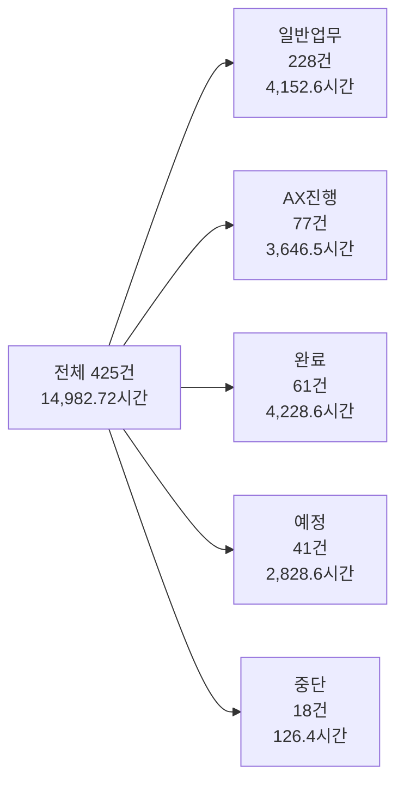
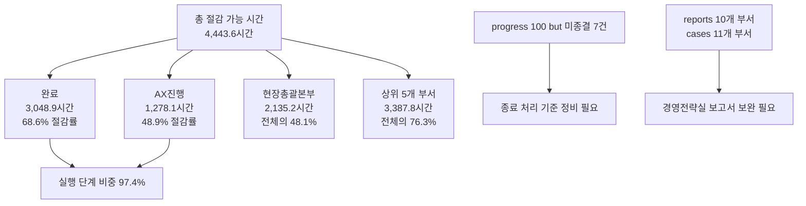

Creator: member-delta
Created: 2026-07-31 16:18
Version: 1.1

## 시각자료 개요
- 전사 AX 현황을 `단계 분포`, `전체 부서 절감 레버리지`, `운영 거버넌스 이슈` 세 축으로 빠르게 읽을 수 있게 구성했다.
- 수치는 모두 `member-alpha/analysis-report.md` 에 기재된 AX 대시보드 원문 기준값만 사용했다.

## Mermaid 다이어그램
단계별 케이스와 시간 비중을 함께 보여주는 전사 AX 파이프라인 요약.

절감 가능 시간 집중 구간과 관리 포인트를 연결한 운영 시사점 구조도.

## 핵심 수치 테이블
| 구분 | 건수 | 비중 | 시간 | 평균 절감률 | 환산 절감 가능 시간 |
|---|---:|---:|---:|---:|---:|
| 일반업무 | 228 | 53.6% | 4,152.6 | 1.1% | 71.6 |
| AX진행 | 77 | 18.1% | 3,646.5 | 48.9% | 1,278.1 |
| 완료 | 61 | 14.4% | 4,228.6 | 68.6% | 3,048.9 |
| 예정 | 41 | 9.6% | 2,828.6 | 10.2% | 22.9 |
| 중단 | 18 | 4.2% | 126.4 | 2.8% | 22.0 |

| 부서 | 케이스 수 | 월 업무시간 | 평균 진행률 | 평균 절감률 | 환산 절감 가능 시간 | AX진행 | 완료 |
|---|---:|---:|---:|---:|---:|---:|---:|
| 현장총괄본부 | 24 | 5,651.7 | 23.3% | 14.8% | 2,135.2 | 2 | 5 |
| 물류운영사업부 | 45 | 2,189.0 | 40.0% | 37.3% | 348.4 | 23 | 4 |
| 법무실 | 20 | 797.8 | 47.8% | 50.0% | 346.3 | 3 | 8 |
| 통합운영실_통합운영팀 | 40 | 1,205.7 | 35.2% | 23.7% | 280.2 | 4 | 11 |
| 경영지원실_피플팀 | 32 | 876.5 | 25.0% | 25.0% | 277.7 | 23 | 0 |
| 채널비즈니스팀 | 23 | 790.0 | 35.2% | 26.3% | 266.0 | 7 | 4 |
| 경영전략실 | 49 | 698.9 | 36.5% | 26.3% | 228.5 | 3 | 15 |
| 재무관리실_AP팀 | 63 | 806.2 | 6.5% | 11.7% | 223.7 | 7 | 0 |
| 통합운영실_커넥트운영팀 | 91 | 767.1 | 12.1% | 10.4% | 214.9 | 0 | 11 |
| 4륜사업본부_운영지원팀 | 17 | 496.0 | 4.1% | 5.6% | 74.2 | 4 | 0 |
| 재무관리실_재무회계팀 | 21 | 704.0 | 18.6% | 9.9% | 48.5 | 1 | 3 |

| 거버넌스 체크 | 수치 | 해석 |
|---|---:|---|
| `progress_rate=100` 이지만 `완료` 미전환 | 7건 | 종료 처리 지연 |
| `reports` 최신 작성일 | 2026-07-03 | 정성 보고 최신성 시차 |
| `cases` 부서 수 | 11개 | 이번 후속 집계의 전체 모수 |
| `reports` 부서 수 | 10개 | `경영전략실` 보고서 누락 |
