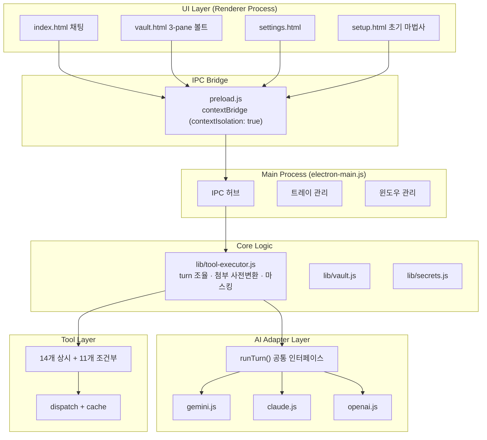
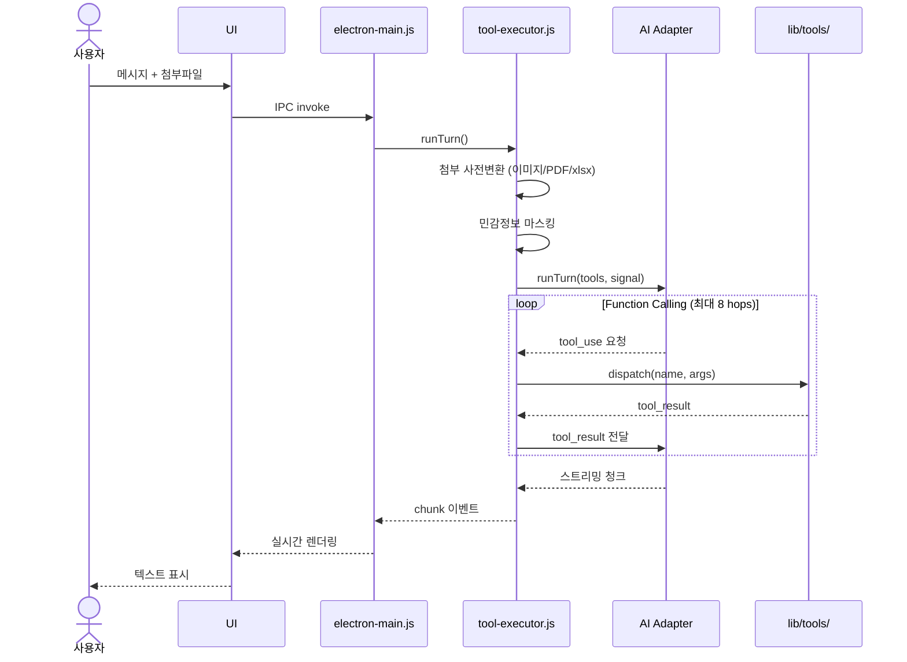

# BARO AGENT v0.3.0 종합 평가 보고서

> 작성: 에이전트 팀 (member-alpha · gamma · delta · beta) | 통합: Team Lead
> 날짜: 2026-06-02 | 워크스페이스: barogo-agent-eval

---

## 요약

**전체 평점: B+ — 설계 우수, 의존성 긴급 보완 필요**

| 항목 | 평가 |
|------|------|
| 아키텍처 설계 | A (레이어 분리·보안 원칙 준수) |
| AI 어댑터 추상화 | A- (3개 provider 통합, 일관된 인터페이스) |
| 도구 카탈로그 | B+ (25개 도구, 조건부 로딩 구현) |
| 의존성 상태 | D (레거시·EOL 패키지 다수) |
| CLAUDE.md 준수율 | B (75%, 2개 원칙 위반) |
| **종합** | **B+** |

**핵심 강점 3가지**
1. **견고한 레이어 아키텍처** — Main/Preload/ai-client/tools/UI 명확한 분리, contextIsolation:true + nodeIntegration:false 보안 원칙 전면 적용
2. **공통 AI 어댑터 인터페이스** — runTurn() 단일 인터페이스로 Claude·Gemini·GPT 3개 provider 추상화, lazy require·streaming·AbortController·hops 제한(8) 통일
3. **정교한 도구 카탈로그** — 상시 14개 + 조건부 11개, 외부 API에만 5분 TTL/LRU 50개 캐시, xlsx 4종 분업 설계

**즉시 수정 필요**: P0 3건 + P1 3건 = 합계 **6건**

---

## 아키텍처 개요



---

## 한 Turn 처리 흐름



---

## 도구 카탈로그

| 카테고리 | 도구 수 | 도구 목록 |
|----------|:-------:|-----------|
| **PC 제어** | 4 | bash, read_file, write_file, list_dir |
| **첨부 변환** | 1 | attach_to_md |
| **엑셀 분석** | 4 | xlsx_summary, xlsx_query, xlsx_aggregate, xlsx_distinct |
| **Vault** | 4 | vault_save, vault_search, vault_list, vault_read |
| **Slack** (조건부) | 5 | slack_today, slack_mentions, slack_my_msgs, slack_search, slack_dm |
| **Notion** (조건부) | 3 | notion_search, notion_read, notion_create |
| **Outlook** (조건부) | 3 | outlook_today, outlook_search, outlook_read |
| **합계** | **25** | 상시 13 + 조건부 11 |

---

## 팩트체크 보정 결과 (member-gamma)

| 이슈 | alpha 원본 주장 | gamma 판정 | 최종 결론 |
|------|----------------|------------|-----------|
| Claude 모델 ID | "존재하지 않는 ID" | PARTIAL | ID 존재하나 레거시. 4-5→4-6 업그레이드 권장 |
| @anthropic-ai/sdk 0.32.1 | "구버전" | CONFIRMED | 최신 0.100.1. Claude 4.x는 v0.52.0+ 필요 |
| @google/generative-ai 0.21.0 | "1.x로 업" | CONFIRMED | 패키지 자체 EOL(2025-08-31). @google/genai로 교체 필요 |
| pdf-parse "2019년 중단" | "유지보수 중단" | REFUTED | 최신 2.4.5(2025년 11월). 단, 1.1.1은 7년 전 버전 |
| Electron 32 EOL | "보안 지원 종료 임박" | CONFIRMED | EOL 2025-03-04 (16개월 초과) |
| gpt-5/gpt-5-mini | "ID 미존재" | CONFIRMED | 미존재. gpt-5.5, gpt-5.4-mini가 올바른 ID |

---

## 이슈 우선순위 매트릭스

| # | 이슈 | 심각도 | 수정 공수 | 우선순위 |
|---|------|:------:|:---------:|:--------:|
| 1 | Electron 32 EOL 업그레이드 | 높음 | 중 | ★★★★★ |
| 2 | gpt-5/gpt-5-mini ID 수정 | 높음 | 소 | ★★★★★ |
| 3 | @anthropic-ai/sdk 0.32.1 → 0.100.1 | 높음 | 소 | ★★★★★ |
| 4 | @google/generative-ai → @google/genai | 높음 | 대 | ★★★★☆ |
| 5 | Claude 모델 ID 4-5 → 4-6 | 중간 | 소 | ★★★☆☆ |
| 6 | pdf-parse 1.1.1 → 2.4.5 | 중간 | 소 | ★★★☆☆ |
| 7 | no-sandbox 전역 적용 | 낮음 | 중 | ★★☆☆☆ |
| 8 | redactionEnabled false 시 API키 노출 | 낮음 | 소 | ★★☆☆☆ |
| 9 | providerForModel 신규 OpenAI 모델 미처리 | 낮음 | 소 | ★★☆☆☆ |
| 10 | foo.txt 임시파일 잔존 | 낮음 | 소 | ★☆☆☆☆ |

---

## CLAUDE.md 원칙 준수율

| 원칙 | 상태 | 비고 |
|------|:----:|------|
| 팩트 기반 (모델 ID 검증) | ⚠️ 부분 위반 | 구형 모델 ID 사용 |
| 자두 별개 (관심사 분리) | ✅ 준수 | 독자 구현, 자두 import 없음 |
| 무게 의식 (Python 없이 Node만) | ✅ 준수 | Python 의존성 없음 |
| 파일 분리 (관심사 기준) | ✅ 준수 | 단일 관심사 파일 구조 |
| commit/push 통제 | ✅ 준수 | 자동 커밋 로직 없음 |
| 불필요 파일 제거 | ⚠️ 경미 위반 | foo.txt 잔존 |

**전체 준수율: 약 75% (4/6 완전 준수)**

---

## 추천 사항

### P0 — 즉시 조치 (런타임 오류·보안 위험)

**P0-1. Electron 32 → 41 이상 업그레이드**
- EOL 2025-03-04 (16개월 초과), 보안 취약점 무패치 상태
- `"electron": "^41.x"` 이상으로 교체 후 회귀 테스트 필수

**P0-2. GPT 모델 ID 수정**
```diff
- { id: 'gpt-5',      label: 'GPT-5' }
- { id: 'gpt-5-mini', label: 'GPT-5 mini' }
+ { id: 'gpt-5.5',      label: 'GPT-5.5 (최신)' }
+ { id: 'gpt-5.4-mini', label: 'GPT-5.4 mini (경량)' }
```

**P0-3. @anthropic-ai/sdk 업그레이드**
```diff
- "@anthropic-ai/sdk": "^0.32.1"
+ "@anthropic-ai/sdk": "^0.100.1"
```
Claude 4.x Extended Thinking 등 기능 활용 가능

---

### P1 — 1주 내 조치 (기능 미작동 위험)

**P1-1. @google/generative-ai → @google/genai 마이그레이션**
```diff
- "@google/generative-ai": "^0.21.0"
+ "@google/genai": "^2.7.0"
```
패키지명 변경 + import 경로 + API 호출 코드 수정 필요. 공식 마이그레이션 가이드 참조.

**P1-2. Claude 모델 ID 업그레이드**
```diff
- { id: 'claude-opus-4-5',   label: 'Claude Opus 4.5 (최고 품질)' }
- { id: 'claude-sonnet-4-5', label: 'Claude Sonnet 4.5 (균형)' }
+ { id: 'claude-opus-4-8',   label: 'Claude Opus 4 (최고 품질)' }
+ { id: 'claude-sonnet-4-6', label: 'Claude Sonnet 4.6 (균형)' }
  { id: 'claude-haiku-4-5',  label: 'Claude Haiku 4.5 (빠름)' }   ← 현재 유효, 유지
```

**P1-3. pdf-parse 버전 업그레이드**
```diff
- "pdf-parse": "1.1.1"
+ "pdf-parse": "^2.4.5"
```
또는 `unpdf` / `pdfjs-dist` 대안 패키지 검토

---

### P2 — 1개월 내 조치 (최적화·개선)

- **CLAUDE.md 준수율 100%**: 모델 ID 검증 프로세스 정례화, foo.txt 삭제
- **providerForModel 신규 모델 처리**: `o4-mini` 등 reasoning 모델 prefix 추가
- **no-sandbox 조건부 적용**: 개발 모드에서만 `--no-sandbox` 플래그 사용
- **redaction 설정 강화**: API 키 패턴은 설정 무관 항상 마스킹
- **hops 상한 외부 구성화**: 하드코딩(8)을 provider별 설정으로 분리

---

## 참조 산출물

| 멤버 | 파일 | 내용 |
|------|------|------|
| member-alpha | `member-alpha/analysis-report.md` | 코드 이슈 10건 전문, 아키텍처 정적 분석 |
| member-gamma | `member-gamma/fact-check-log.md` | 팩트체크 6건 원본 근거·출처 |
| member-delta | `member-delta/visuals.md` | Mermaid 3종, 테이블 4종 상세 시각자료 |
