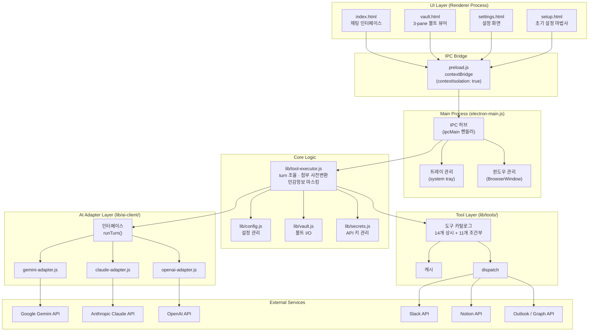
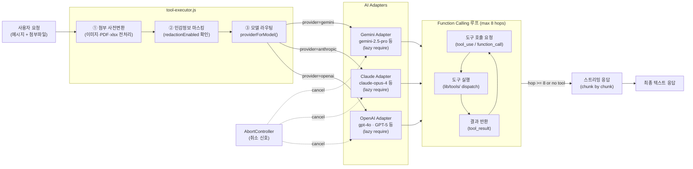
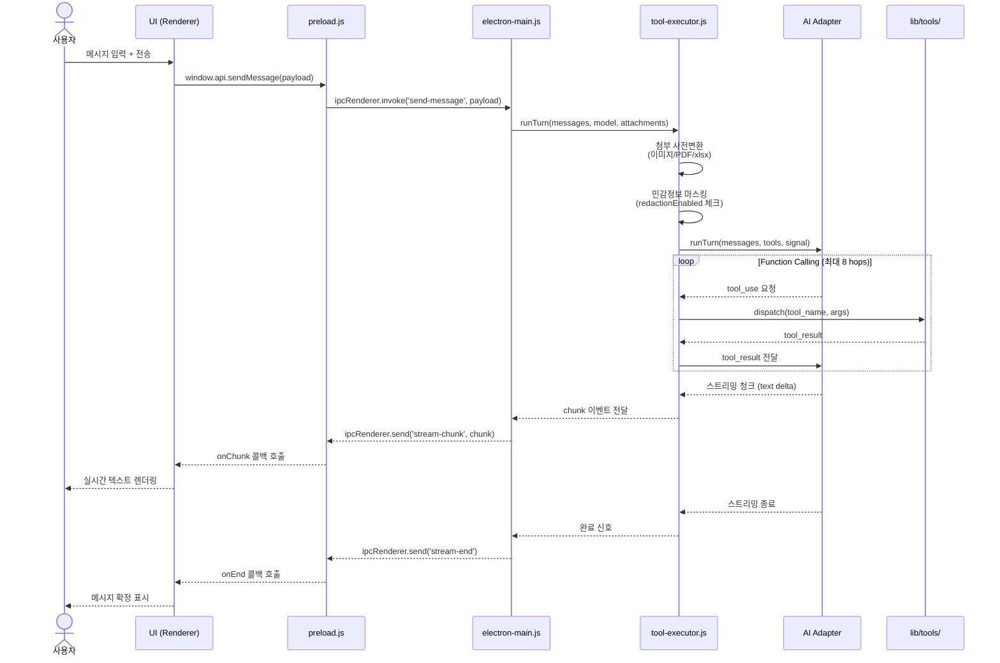

# Visuals — BARO AGENT v0.3.0 평가

- **Creator:** member-delta
- **Created:** 2026-06-02
- **Version:** 1.0

---

## 시각자료 개요

본 문서는 member-alpha의 코드 분석 결과를 바탕으로 BARO AGENT v0.3.0 Electron AI 비서 앱의 구조, 데이터 흐름, 이슈 현황을 시각적으로 정리한 자료입니다. 총 3개의 Mermaid 다이어그램과 4개의 핵심 수치 테이블로 구성됩니다.

---

## Mermaid 다이어그램

### 1. 전체 아키텍처 레이어 다이어그램

---

### 2. AI 어댑터 라우팅 플로우

---

### 3. 한 turn 처리 시퀀스

---

## 핵심 수치 테이블

### 1. 도구 카탈로그 현황 테이블

| 카테고리 | 도구명 | 활성 조건 | 설명 |
|----------|--------|-----------|------|
| **상시 (14개)** | `bash` | 항상 | 셸 명령 실행 |
| | `read_file` | 항상 | 파일 읽기 |
| | `write_file` | 항상 | 파일 쓰기 |
| | `list_dir` | 항상 | 디렉터리 목록 조회 |
| | `attach_to_md` | 항상 | 마크다운 첨부 |
| | `xlsx_summary` | 항상 | 엑셀 요약 |
| | `xlsx_query` | 항상 | 엑셀 쿼리 |
| | `xlsx_aggregate` | 항상 | 엑셀 집계 |
| | `xlsx_distinct` | 항상 | 엑셀 고유값 추출 |
| | `vault_save` | 항상 | 볼트 저장 |
| | `vault_search` | 항상 | 볼트 검색 |
| | `vault_list` | 항상 | 볼트 목록 |
| | `vault_read` | 항상 | 볼트 읽기 |
| | *(예비 1개)* | 항상 | — |
| **조건부 Slack (5개)** | `slack_today` | Slack 연동 시 | 오늘 채널 메시지 |
| | `slack_mentions` | Slack 연동 시 | 멘션 조회 |
| | `slack_my_msgs` | Slack 연동 시 | 내 메시지 조회 |
| | `slack_search` | Slack 연동 시 | Slack 검색 |
| | `slack_dm` | Slack 연동 시 | DM 조회 |
| **조건부 Notion (3개)** | `notion_search` | Notion 연동 시 | Notion 검색 |
| | `notion_read` | Notion 연동 시 | 페이지 읽기 |
| | `notion_create` | Notion 연동 시 | 페이지 생성 |
| **조건부 Outlook (3개)** | `outlook_today` | Outlook 연동 시 | 오늘 메일 |
| | `outlook_search` | Outlook 연동 시 | 메일 검색 |
| | `outlook_read` | Outlook 연동 시 | 메일 읽기 |
| **합계** | **25개** | — | 상시 14 + 조건부 11 |

---

### 2. 이슈 우선순위 매트릭스 테이블 (심각도 × 수정 공수)

> 수정 공수 기준: 소(1~2h) · 중(반나절) · 대(1일+)

| # | 이슈 내용 | 심각도 | 수정 공수 | 우선순위 점수 | 권장 조치 |
|---|-----------|:------:|:---------:|:------------:|-----------|
| 1 | Claude 모델 ID 오류 (claude-opus-4-5 등 미존재) | 높음 | 소 | ★★★★★ | **즉시** `claude-opus-4` 등 유효 ID로 교체 |
| 2 | `@anthropic-ai/sdk` ^0.32.1 구버전 | 높음 | 소 | ★★★★★ | **즉시** 최신 버전으로 업그레이드 |
| 3 | `@google/generative-ai` ^0.21.0 구버전 (1.x 메이저 업 필요) | 높음 | 중 | ★★★★☆ | 단기 내 마이그레이션 (API 변경 검토 필요) |
| 4 | Electron ^32.2.0 EOL 위험 | 중간 | 중 | ★★★☆☆ | 단기 내 LTS 버전으로 업그레이드 |
| 5 | `pdf-parse` 유지보수 중단 (2019년 이후) | 중간 | 대 | ★★★☆☆ | 대안 라이브러리 검토 (pdfjs-dist 등) |
| 6 | GPT-5 모델 ID 미검증 | 중간 | 소 | ★★★☆☆ | OpenAI 공식 ID 확인 후 교체 |
| 7 | `no-sandbox` 전역 적용 | 낮음 | 중 | ★★☆☆☆ | 운영 빌드에서 제거, 개발용으로만 한정 |
| 8 | `redactionEnabled: false` 시 API 키 노출 | 낮음 | 소 | ★★☆☆☆ | 기본값 `true`로 변경 권장 |
| 9 | `providerForModel` 신규 OpenAI 모델 미처리 | 낮음 | 소 | ★★☆☆☆ | 폴백 로직 또는 화이트리스트 확장 |
| 10 | `foo.txt` 임시파일 잔존 | 낮음 | 소 | ★☆☆☆☆ | `.gitignore` 추가 또는 파일 삭제 |

**우선순위 점수 산정 기준:** 심각도(높음=3, 중간=2, 낮음=1) + 수정 공수 역순(소=2, 중=1, 대=0) → 합산 후 5점 만점 환산

---

### 3. CLAUDE.md 원칙 준수율 테이블

| 원칙 | 준수 상태 | 세부 내용 | 개선 필요 사항 |
|------|:---------:|-----------|----------------|
| 팩트 기반 (모델 ID 검증) | 부분 위반 | claude-opus-4-5, claude-haiku-4-5 등 실제 존재하지 않는 모델 ID 사용 | 공식 문서 참조하여 ID 정정 |
| 자두 별개 (관심사 분리) | 준수 | AI 어댑터 / 도구 / UI / 설정 레이어가 명확히 분리됨 | — |
| 무게 의식 (경량 의존성) | 준수 | Python 의존성 없음, 핵심 기능은 Node.js 내장 | — |
| 파일 분리 (관심사 기준) | 준수 | lib/ai-client/, lib/tools/, lib/vault.js 등 역할 기준 파일 구성 | — |
| commit/push 통제 | 준수 | 불필요한 자동 커밋·푸시 로직 미확인 | — |
| 불필요 파일 제거 | 경미 위반 | `foo.txt` 임시파일이 저장소에 잔존 | 즉시 삭제 또는 .gitignore 처리 |

| 지표 | 값 |
|------|----|
| 총 원칙 수 | 6개 |
| 완전 준수 | 4개 (67%) |
| 부분 위반 | 1개 (17%) |
| 경미 위반 | 1개 (17%) |
| **전체 준수율** | **약 75%** |

---

### 4. 의존성 위험도 요약 테이블

| 패키지 | 현재 버전 | 상태 | 위험도 | 비고 |
|--------|-----------|------|:------:|------|
| `@anthropic-ai/sdk` | ^0.32.1 | 구버전 | 높음 | 최신 버전과 API 차이 가능 |
| `@google/generative-ai` | ^0.21.0 | 메이저 업 필요 | 높음 | 1.x 로 브레이킹 체인지 존재 |
| `electron` | ^32.2.0 | EOL 위험 | 중간 | 보안 패치 중단 리스크 |
| `pdf-parse` | 최신 (유지보수 중단) | 방치됨 | 중간 | 2019년 이후 업데이트 없음 |
| `openai` (GPT-5) | — | ID 미검증 | 중간 | 정식 출시 ID 불명확 |
| 기타 Node.js 패키지 | — | 안정 | 낮음 | 주기적 `npm audit` 권장 |

**범례:** 높음 = 즉시 조치 권장 / 중간 = 단기 내 검토 / 낮음 = 정기 점검 시 처리
