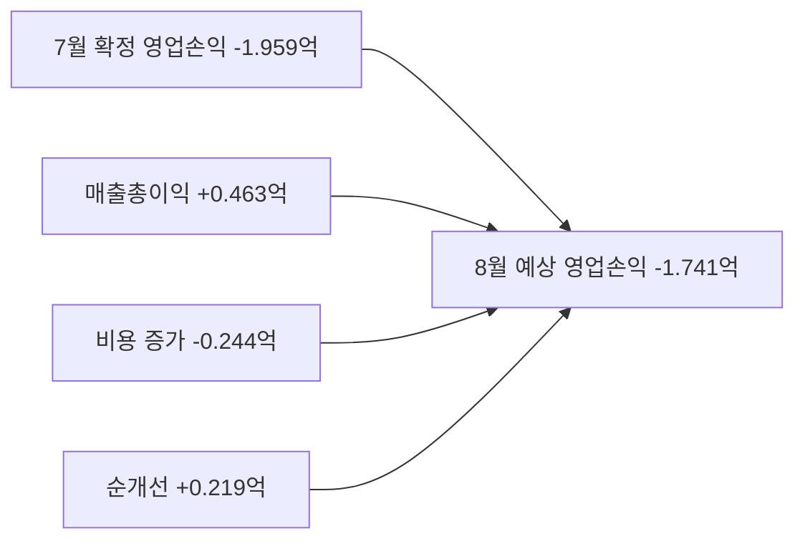
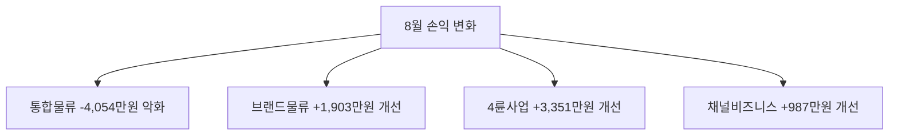

# ERP 전사 손익 분석

**작성일**: 2026-08-05
**Task Type**: research-report
**활성 멤버**: alpha(조사) · gamma(팩트체크) · delta(시각화) · beta(보고서)
**사이클**: 1 / 3
**승인**: human_approval=false (ERP 대시보드 사용, override 비활성으로 자동 완료)

## 요약

- ERP 기준 8월 전사 예상 영업손익은 `-174,050,936원`으로, 7월 확정 `-195,928,052원` 대비 `21,877,116원` 개선됐다.
- 개선은 `4륜사업`, `브랜드물류`, `채널비즈니스`가 이끌었고, `통합물류` 악화가 개선폭을 상당 부분 상쇄했다.
- 다만 8월 값은 `2026-08-04`까지의 `4일 실적`과 ERP 내부 보정계수 `7.75`를 반영한 `예상` 수치이므로 방향성 판단용으로 해석해야 한다.

## 핵심 인사이트

### 1. 전사 레벨에서는 적자 지속이지만 전월 대비 개선

| 지표 | 7월 확정 | 8월 예상 | 증감 |
|---|---:|---:|---:|
| 매출총이익 | 1,102,145,710원 | 1,148,430,595원 | 46,284,885원 |
| 비용 | 1,298,073,762원 | 1,322,481,531원 | 24,407,769원 |
| 영업손익 | -195,928,052원 | -174,050,936원 | 21,877,116원 |
| 손익률(`er`) | 84.9% | 86.8% | 1.9%p |

- 손익률은 ERP 응답의 `er` 필드이며 `매출총이익 / 비용 x 100` 기준 회수율 지표다.
- 매출총이익 증가 폭이 비용 증가 폭보다 커 손실 폭이 줄었다.

### 2. 8월 개선의 핵심은 4륜사업/브랜드물류, 핵심 리스크는 통합물류

| 사업부 | 7월 영업손익 | 8월 영업손익 | 증감 | 해석 |
|---|---:|---:|---:|---|
| 통합물류 | -80,319,828원 | -120,857,803원 | -40,537,975원 | 가장 큰 악화 요인 |
| 브랜드물류 | -68,301,973원 | -49,272,183원 | 19,029,790원 | 적자 축소 |
| 4륜사업 | -41,928,696원 | -8,413,804원 | 33,514,892원 | 개선 폭 최대 |
| 채널비즈니스 | -5,377,555원 | 4,492,853원 | 9,870,408원 | 흑자 전환 |

- `통합물류` 적자 `-120,857,803원`은 8월 전사 예상 적자 `-174,050,936원`의 약 `69.4%`에 해당한다.
- `브랜드물류`, `4륜사업`, `채널비즈니스`의 개선이 없었다면 전사 적자는 전월보다 악화됐을 가능성이 높다.

### 3. 비용 총액보다 비용 항목 이동이 더 중요한 점검 포인트

| 비용 항목 | 7월 | 8월 | 증감 |
|---|---:|---:|---:|
| 사업인건비 | 397,549,540원 | 580,536,450원 | 182,986,910원 |
| 개발인건비 | 293,715,580원 | 64,783,882원 | -228,931,698원 |
| Infra | 177,785,312원 | 192,900,080원 | 15,114,768원 |
| 사업운영비 | 69,227,140원 | 126,120,014원 | 56,892,874원 |
| 사업지원 | 82,225,221원 | 80,570,131원 | -1,655,090원 |
| 내부거래 | 169,914,188원 | 168,909,193원 | -1,004,995원 |

- `사업인건비` 급증과 `개발인건비` 급감이 동시에 나타나, 성과 해석 전에 계정 재분류 여부를 먼저 확인할 필요가 있다.
- `사업운영비`, `Infra` 증가도 8월 예상치의 비용 민감도를 높이는 요인이다.

### 4. 기존 7월 보고서는 참고용, 이번 문서가 최신 기준

- 2026-07-31 작성된 기존 워크스페이스 최종본은 7월 `예상` 영업손익 `-199,283,982원`을 사용했다.
- 이번 ERP 재조회 결과 7월 `확정` 영업손익은 `-195,928,052원`으로 `3,355,930원` 개선됐다.
- 연속 모니터링에서는 이전 초안보다 최신 확정 데이터를 우선 적용해야 한다.

## 시각자료

전사 손익의 전월 대비 개선 구조

사업부별 증감 기여도

- 주석: 사업부별 8월 영업손익 합계는 `-174,050,937원`이며, 전사 `totals.op`는 소수점 원단위(`-174,050,936.2`)를 반올림한 값이라 `1원` 차이가 난다.

## 검증 메모

- alpha 분석 산출물과 gamma 팩트체크 산출물은 모두 결정론적 검증과 격리 리뷰를 통과했다.
- gamma 검증 결과, 전사 영업손익/손익률/사업부별 증감 계산은 ERP 원문 응답과 일치한다.
- 8월 수치는 `live_actual.op = -22,458,185원`, `elapsed = 4`, `total_days = 31`, `factor = 7.75` 기반의 `예상`이다.
- 본 문서는 사내 ERP 대시보드의 민감 재무 데이터를 사용했다.

## 추천 사항

1. `통합물류` 적자 확대분 `40,537,975원`이 전사 적자의 약 `69.4%`를 차지하므로, `매출총이익 감소`, `직접비 증가`, `공통비 배부`로 나눈 브리지 분석을 재무/사업 합동으로 즉시 작성한다.
2. `4륜사업(+33,514,892원)`과 `채널비즈니스(+9,870,408원)`의 개선은 전체 손익 개선의 핵심 근거이므로, 물량/단가/일회성 요인으로 분해해 8월 중순에도 지속 가능한지 점검한다.
3. `사업인건비 +182,986,910원`과 `개발인건비 -228,931,698원`의 동시 변동은 성과보다 분류 영향일 수 있으므로, 계정 재분류 여부 확인 없이 비용 효율화 결론을 내리지 않는다.
4. 경영진 공유 시 문서 제목과 요약에 `8월 예상치(4일 실적 + ERP 보정계수 7.75 반영)` 문구를 유지해 기대치 과대해석을 방지한다.

출처: ERP 대시보드 `api/external/board?ym=2026-08`, `api/external/board?ym=2026-07` 조회 결과 (`fetched_at`: 2026-08-05T03:35:24Z 전후)
