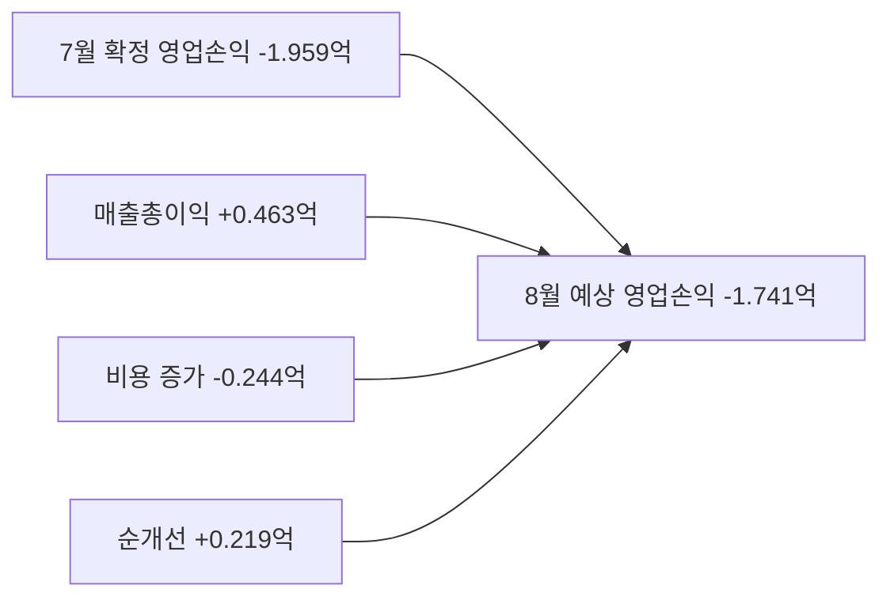
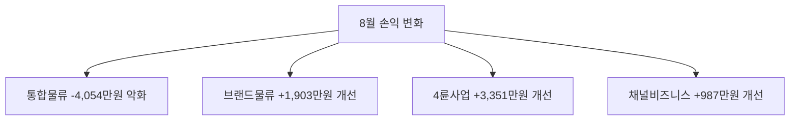

Creator: member-delta
Created: 2026-08-05 12:35 KST
Version: 1.0

# 시각자료 개요

- 전사 손익의 전월 대비 개선 규모와 사업부별 기여/악화 요인을 한눈에 볼 수 있도록 구성했다.
- 모든 수치는 `member-alpha/analysis-report.md`에 기재된 ERP 원문 기반 숫자만 사용했다.
- 출처: ERP 원문 `api/external/board?ym=2026-08`, `api/external/board?ym=2026-07` / `member-alpha/analysis-report.md` 집계값.

# Mermaid 다이어그램

전사 손익의 전월 대비 개선 구조

사업부별 증감 기여도

# 핵심 수치 테이블

| 지표 | 7월 확정 | 8월 예상 | 증감 |
|---|---:|---:|---:|
| 매출총이익 | 1,102,145,710원 | 1,148,430,595원 | 46,284,885원 |
| 비용 | 1,298,073,762원 | 1,322,481,531원 | 24,407,769원 |
| 영업손익 | -195,928,052원 | -174,050,936원 | 21,877,116원 |
| 손익률 | 84.9% | 86.8% | 1.9%p |

- 손익률은 ERP 응답의 `er` 필드이며, `매출총이익 / 비용 x 100` 기준 회수율 지표다.
- 출처: ERP `totals` 필드 기준.

| 사업부 | 7월 영업손익 | 8월 영업손익 | 증감 |
|---|---:|---:|---:|
| 통합물류 | -80,319,828원 | -120,857,803원 | -40,537,975원 |
| 브랜드물류 | -68,301,973원 | -49,272,183원 | 19,029,790원 |
| 4륜사업 | -41,928,696원 | -8,413,804원 | 33,514,892원 |
| 채널비즈니스 | -5,377,555원 | 4,492,853원 | 9,870,408원 |

- 주석: 사업부별 8월 영업손익 합계는 `-174,050,937원`이며, 전사 `totals.op`는 소수점 원단위(`-174,050,936.2`)를 반올림한 값이라 `1원` 차이가 난다.
- 출처: ERP `depts` 필드 기준.

| 비용 항목 | 7월 | 8월 | 증감 |
|---|---:|---:|---:|
| 사업인건비 | 397,549,540원 | 580,536,450원 | 182,986,910원 |
| 개발인건비 | 293,715,580원 | 64,783,882원 | -228,931,698원 |
| Infra | 177,785,312원 | 192,900,080원 | 15,114,768원 |
| 사업운영비 | 69,227,140원 | 126,120,014원 | 56,892,874원 |
| 사업지원 | 82,225,221원 | 80,570,131원 | -1,655,090원 |
| 내부거래 | 169,914,188원 | 168,909,193원 | -1,004,995원 |

- 출처: ERP `cost_structure` 필드 기준.
