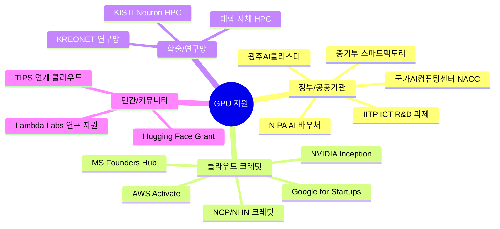
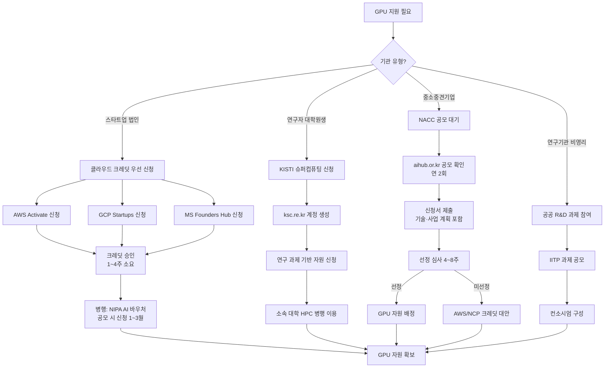

# GPU 지원 받는 방법 — 최종 보고서

> 작성일: 2026-05-12 | Task Type: research-report | 활성 멤버: alpha · gamma · delta · beta

---

## 요약

AI/딥러닝 개발에서 GPU 자원은 핵심 병목이다. 그러나 국내외에는 스타트업·연구자·중소기업이 무상 또는 대폭 할인된 조건으로 GPU를 확보할 수 있는 경로가 다수 존재한다. 크게 ① 정부·공공기관 공모형 지원, ② 글로벌 클라우드 벤더 스타트업 크레딧, ③ 학술·연구망 HPC 자원, ④ 민간·커뮤니티 보조금의 네 채널로 나뉜다.

**기관 유형별 핵심 경로:**
- **AI 스타트업 (법인)**: AWS Activate + GCP for Startups + MS Founders Hub 동시 신청 → 합산 최대 $300K~$450K 크레딧 (상시 신청 가능)
- **국내 최대 규모 공공 지원**: 국가AI컴퓨팅센터(NACC) 공모 — 연 2회, H100/A100 기반 고성능 GPU 무상 배정
- **연구자 최적 경로**: KISTI Neuron HPC → 소속 대학 HPC → IITP R&D 과제 순서
- **공모 시기 핵심**: 국내 공공 프로그램은 1~3월에 집중; 이 기간 이전 준비 완료 필수

---

## GPU 지원 채널 전체 구조도

---

## 1. 정부/공공기관 GPU 지원

### 1-1. 국가AI컴퓨팅센터 (NACC)
- **운영**: 과학기술정보통신부 산하, NIPA 위탁 운영
- **자원**: A100 80GB, H100 기반 고성능 GPU 클러스터
- **대상**: AI 스타트업, 중소기업, 연구기관
- **지원 규모**: 지원 규모는 공모 회차 및 선정 등급에 따라 상이 (최신 공모 공고 확인: aihub.or.kr)
- **신청 방법**: NIPA AI Hub(aihub.or.kr) 또는 국가AI컴퓨팅센터 포털 공모 시 신청
- **비용**: 무상(선정 시) 또는 시장가 대비 대폭 할인
- **주기**: **연 2회 공모** (추가 회차는 예산 소진 여부에 따라 변동)

### 1-2. NIPA AI 바우처 사업
- **운영**: NIPA(정보통신산업진흥원)
- **대상**: 중소·중견기업, AI 스타트업
- **지원 내용**: AI 서비스·솔루션 이용권(클라우드 GPU 포함) 최대 7,000만 원 (자부담 30% 포함, 2024년 기준; 2025년 규모 최신 공고 확인 필요)
- **신청**: 매년 1~3월 K-스타트업(www.k-startup.go.kr) 또는 NIPA 사업공고
- **활용**: 클라우드 인프라(AWS, Azure, NCP 등) GPU 비용에 바우처 적용 가능

### 1-3. IITP 정보통신·방송기술개발사업 (ICT R&D)
- **운영**: IITP(정보통신기획평가원), iitp.kr
- **대상**: 연구기관, 대학, 기업 컨소시엄
- **내용**: 과제비 내 GPU 클라우드/온프레미스 비용 포함 가능
- **신청**: 과제 공모 참여 (연 1~2회)
- **규모**: 과제당 수천만 원 ~ 수십억 원 (GPU 비용은 일부)

### 1-4. 광주 AI 클러스터 (광주광역시·GIST)
- **운영**: 광주광역시, GIST(광주과학기술원), AI중심산업융합집적단지
- **대상**: 광주 입주 기업·스타트업 우선 (타 지역도 가능)
- **자원**: A100 GPU 클러스터 (최신 포털 주소 직접 확인 권고)
- **지원**: 입주 기업 무상/저가 GPU 이용, 공간·네트워킹·인프라 동시 혜택
- **신청**: 광주AI클러스터 공모 및 입주 프로그램

### 1-5. 중소벤처기업부 — TIPS 프로그램 연계
- **운영**: 중소벤처기업부 TIPS(민간투자주도형기술창업지원)
- **내용**: TIPS 선정 시 클라우드·AI 인프라 비용 포함 가능
- **신청**: TIPS 운영사(VC·엑셀러레이터) 통한 선발

---

## 2. 클라우드 벤더 스타트업 크레딧

### 기관 유형별 신청 프로세스

### 주요 클라우드 크레딧 프로그램

| 프로그램 | 지원 규모 | 신청 시기 | 신청 URL |
|---|---|---|---|
| AWS Activate | $1,000 ~ $100,000 (VC 추천 시) | 상시 | aws.amazon.com/activate/ |
| Google for Startups | 직접 신청 $100K, 파트너 경유 최대 $200K (2년) | 상시 | cloud.google.com/startup |
| MS Founders Hub | 최대 $150,000 | 상시 | microsoft.com/en-us/startups |
| NVIDIA Inception | 소프트웨어·파트너 할인 혜택 | 상시 | nvidia.com/en-us/startups/ |
| NCP/NHN Cloud | GPU 크레딧 (조건 최신 공고 확인) | 상시 | NCP 파트너 문의 |

> **주의**: GCP 크레딧 상한($100K vs $200K)은 직접 신청 vs 파트너 경유 여부에 따라 상이. 고성능 H100 인스턴스는 일부 크레딧 제외 가능성 있어 사전 확인 필요.

---

## 3. 학술·연구망 HPC 자원

| 기관 | 자원 | 대상 | 신청처 |
|---|---|---|---|
| KISTI Neuron (GPU 중심) | A100·V100 GPU 클러스터 | 대학·연구기관 | ksc.re.kr |
| KISTI 누리온 (CPU 중심) | CPU HPC + 소규모 GPU | 국내 연구기관 | ksc.re.kr |
| 소속 대학 HPC | 대학별 상이 | 소속 학생·교수 | 각 대학 연구처 |
| KREONET 연구망 | 연구망 기반 원격 GPU | 연구기관 | KISTI 문의 |

---

## 4. 민간·커뮤니티 보조금

| 프로그램 | 대상 | 지원 내용 | 신청처 |
|---|---|---|---|
| Hugging Face Compute Grant | 오픈소스 ML 연구자 | Spaces GPU 크레딧 | huggingface.co/support |
| Lambda Labs 연구 지원 | 학술 연구자 | GPU 클라우드 크레딧 | lambdalabs.com |
| TIPS 연계 클라우드 | TIPS 선정 스타트업 | 클라우드 인프라 비용 | 운영 VC 통해 신청 |

---

## 5. 신청 시기 타임라인

```mermaid
gantt
    title GPU 지원 프로그램 신청 시기 (연간)
    dateFormat MM
    axisFormat %m월

    section 공공 프로그램
    NIPA AI 바우처 공모          :active, 01, 3M
    NACC 1차 공모                :active, 02, 2M
    NACC 2차 공모                :active, 08, 2M
    IITP ICT R&D 과제 공모       :active, 01, 3M

    section 클라우드 크레딧 (상시)
    AWS Activate                 :crit, 01, 12M
    GCP for Startups             :crit, 01, 12M
    MS Founders Hub              :crit, 01, 12M
    NVIDIA Inception             :crit, 01, 12M

    section 지역/기타
    광주AI클러스터 공모          :03, 2M
    KISTI 슈퍼컴 자원 신청 (상시):01, 12M
```

---

## 6. 주요 프로그램 비교 테이블

| 프로그램 | 운영 주체 | 지원 대상 | 지원 규모 | 신청 시기 | GPU 직접 제공 |
|---|---|---|---|---|---|
| NACC | 과기부/NIPA | 스타트업·중소기업·연구기관 | 공모별 상이 (H100/A100) | 연 2회 | ✅ 직접 |
| NIPA AI 바우처 | NIPA | 중소·중견기업 | 최대 7,000만 원 | 1~3월 | 간접(클라우드) |
| IITP ICT R&D | IITP | 대학·연구기관·기업 | 수억 원 내 일부 | 연 1~2회 | 간접 |
| AWS Activate | Amazon | 법인 스타트업 | $1,000~$100,000 | 상시 | 간접(크레딧) |
| GCP for Startups | Google | 초기 스타트업 | 최대 $200,000 | 상시 | 간접(크레딧) |
| MS Founders Hub | Microsoft | 법인 스타트업 | 최대 $150,000 | 상시 | 간접(크레딧) |
| KISTI Neuron | KISTI | 대학·연구기관 | 과제 기반 GPU 시간 | 상시 | ✅ 직접 |
| 광주AI클러스터 | 광주시·GIST | 입주기업 우선 | 저가/무상 | 상시(입주) | ✅ 직접 |

---

## 7. 기관 유형별 추천 조합 전략

| 기관 유형 | 1순위 | 2순위 | 3순위 | 예상 확보 규모 |
|---|---|---|---|---|
| AI 스타트업 (법인) | AWS+GCP+Azure 크레딧 | NIPA AI 바우처 | NVIDIA Inception | $150K~$450K 상당 |
| 대학원생·연구자 | KISTI Neuron HPC | 소속 대학 HPC | Hugging Face Grant | 과제 기간 내 무제한 |
| 중소기업 | NACC 공모 | NIPA AI 바우처 | AWS/NCP 크레딧 | 수억 원 상당 |
| 비영리·연구기관 | IITP R&D 과제 | KISTI HPC | 광주AI클러스터 | 과제 규모 의존 |
| 글로벌 스타트업 | GCP for Startups | MS Founders Hub | AWS Activate | 최대 $450K 조합 |

---

## 8. 핵심 인사이트

### 인사이트 1: 클라우드 크레딧 3개 동시 신청이 가장 빠른 출발점

AWS Activate, Google for Startups, Microsoft Founders Hub는 모두 **상시 온라인 신청**이 가능하며, 법인 스타트업이라면 동시에 신청해도 중복 제한이 없다. 세 프로그램 조합 시 최대 $450,000 규모의 클라우드 크레딧을 확보할 수 있다. VC나 엑셀러레이터 파트너를 통해 추천받으면 상한이 더 높아진다.

### 인사이트 2: 국내 공공 지원은 1~3월을 절대 놓치지 말 것

NIPA AI 바우처(최대 7,000만 원)와 NACC 공모는 규모 면에서 클라우드 크레딧을 능가할 수 있다. 공모 시기 이전에 **중소기업 확인서 + 사업계획서 + AI 기술 개요** 준비를 완료해야 한다. 선정 후 GPU 배정까지 4~8주가 추가 소요된다는 점도 일정에 반영 필요.

### 인사이트 3: 연구자는 KISTI HPC + 소속 대학 HPC 병행

연구 목적이라면 KISTI Neuron GPU 클러스터가 가장 즉각적이고 규모 있는 대안이다. 소속 대학 자체 HPC를 1차로 활용하고, 용량 부족 시 KISTI로 확장하는 2단계 전략이 효과적이다.

### 인사이트 4: 광주AI클러스터 — 스타트업에게 숨겨진 기회

초기 스타트업이 공간 이전을 고려 중이라면 광주AI클러스터 입주는 GPU 인프라 + 사무 공간 + 네트워킹을 동시에 해결하는 전략적 선택지다. 타 지역 기업도 참여 가능하다.

---

## 9. 실행 체크리스트

### 즉시 실행 (이번 주)
- [ ] AWS Activate 신청 (aws.amazon.com/activate/)
- [ ] GCP for Startups 신청 (cloud.google.com/startup)
- [ ] MS Founders Hub 신청 (microsoft.com/en-us/startups)
- [ ] NVIDIA Inception 가입 (nvidia.com/en-us/startups/)
- [ ] KISTI 슈퍼컴퓨팅 포털 계정 생성 (ksc.re.kr) — 연구자

### 단기 준비 (1~3월 공모 시즌 전)
- [ ] 중소기업 확인서 발급 (sminfo.mss.go.kr)
- [ ] NIPA AI 바우처 신청 준비 (사업계획서, AI 기술 개요)
- [ ] NACC 공모 공고 모니터링 (aihub.or.kr)
- [ ] IITP 과제 공모 일정 확인 (iitp.kr) — 연구기관

### 주의사항 공통
- [ ] 동일 연도 내 복수 공공 프로그램 중복 지원 제한 확인
- [ ] 클라우드 크레딧 만료 기간 관리 (AWS/GCP: 2년, Azure: 1~2년)
- [ ] 공공 지원 선정 후 사용 실적·결과 보고 의무 숙지
- [ ] 민감 데이터 처리 시 국내 클라우드(NCP, KT Cloud) 우선 검토

---

## 팩트체크 노트 (member-gamma 검증 기반)

다음 정보는 최신 확인이 권고된다:
1. **NACC GPU 시간 상한** → aihub.or.kr 최신 공모 공고에서 정확한 수치 확인
2. **GCP 크레딧 상한** → 직접 신청($100K) vs 파트너 경유($200K) 차이 존재
3. **광주AI센터 공식 포털 URL** → 최신 URL 직접 확인 후 접속 권고
4. **KISTI 시스템 현황** → 2025년 차세대 시스템 도입 일정 확인 권고
5. **NIPA AI 바우처 2025년 지원 규모** → 연도별 예산에 따라 변동 가능

---

*본 보고서는 team-lead가 member-alpha(분석), member-gamma(팩트체크), member-delta(시각화), member-beta(보고서 작성) 산출물을 통합하여 작성하였습니다.*
