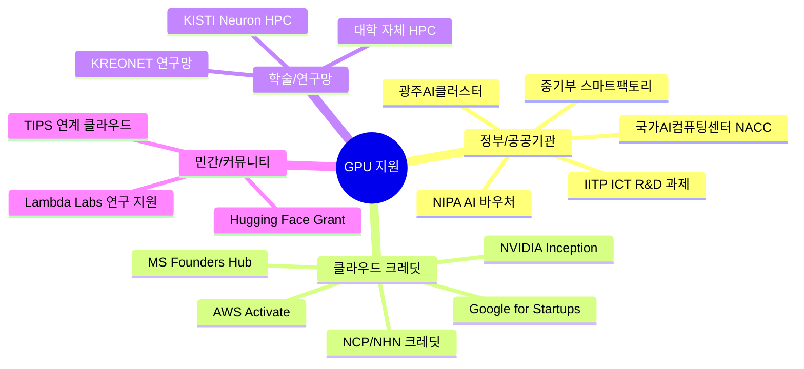
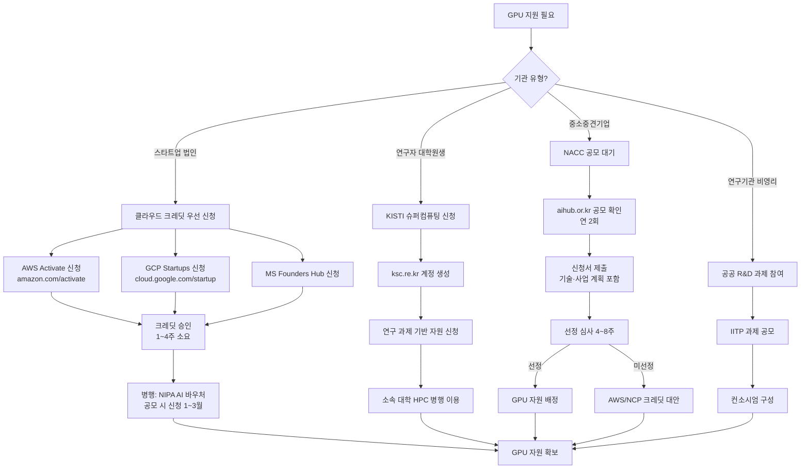

# 시각자료 — GPU 지원 받는 방법

- Creator: member-delta
- Created: 2026-05-12
- Version: 1.0

---

## 시각자료 개요

alpha의 분석 보고서와 gamma의 팩트체크 결과를 바탕으로 다음 시각 자료를 제작했다.

1. **GPU 지원 채널 전체 구조도** — 4대 채널과 주요 프로그램을 한눈에 보는 마인드맵
2. **지원 신청 프로세스 플로우차트** — 기관 유형별 신청 흐름
3. **주요 프로그램 비교 테이블** — 지원 대상·규모·신청 시기·난이도 비교

---

## Mermaid 다이어그램

### 다이어그램 1: GPU 지원 채널 전체 구조도

---

### 다이어그램 2: 기관 유형별 GPU 지원 신청 프로세스

---

### 다이어그램 3: GPU 지원 시기별 타임라인

```mermaid
gantt
    title GPU 지원 프로그램 신청 시기 (연간)
    dateFormat MM
    axisFormat %m월

    section 공공 프로그램
    NIPA AI 바우처 공모          :active, 01, 3M
    NACC 1차 공모                :active, 02, 2M
    NACC 2차 공모                :active, 08, 2M
    IITP ICT R&D 과제 공모       :active, 01, 3M

    section 클라우드 크레딧 (상시)
    AWS Activate                 :crit, 01, 12M
    GCP for Startups             :crit, 01, 12M
    MS Founders Hub              :crit, 01, 12M
    NVIDIA Inception             :crit, 01, 12M

    section 지역/기타
    광주AI클러스터 공모          :03, 2M
    KISTI 슈퍼컴 자원 신청 (상시):01, 12M
```

---

## 핵심 수치 테이블

### 테이블 1: 주요 GPU 지원 프로그램 비교

| 프로그램 | 운영 주체 | 지원 대상 | 지원 규모 | 신청 시기 | 비고 |
|---|---|---|---|---|---|
| 국가AI컴퓨팅센터 (NACC) | 과기부/NIPA | 스타트업·중소기업·연구기관 | GPU 시간 (공모별 상이) | 연 2회 | 고성능 H100/A100, 무상 |
| NIPA AI 바우처 | NIPA | 중소·중견기업 | 최대 7,000만 원 | 1~3월 | 자부담 30% 포함 |
| IITP ICT R&D | IITP | 대학·연구기관·기업 | 과제당 수억 원 내 GPU 비용 | 연 1~2회 | 컨소시엄 구성 필요 |
| 광주AI클러스터 | 광주시·GIST | 광주 입주기업 우선 | A100 클러스터 저가/무상 | 상시(입주) | 지역 가점 있음 |
| AWS Activate | Amazon | 법인 스타트업 | $1,000 ~ $100,000 | 상시 | VC/파트너 추천 시 상한 증가 |
| Google for Startups | Google | 초기 스타트업 | 최대 $200,000 (2년) | 상시 | 파트너 경유 시 상한 증가 |
| MS Founders Hub | Microsoft | 법인 스타트업 | 최대 $150,000 | 상시 | Azure + GitHub + LinkedIn |
| NVIDIA Inception | NVIDIA | AI 스타트업 | 소프트웨어·에코시스템 혜택 | 상시 | 직접 GPU 아님 |
| KISTI Neuron | KISTI | 대학·연구기관 | 과제 기반 GPU 시간 | 상시 신청 | 연구 목적 한정 |
| Hugging Face Grant | Hugging Face | 오픈소스·연구자 | Spaces GPU 크레딧 | 상시(심사) | ML 연구 한정 |
| TIPS 연계 | 중기부 | TIPS 선정 스타트업 | 클라우드 인프라 비용 포함 | VC 추천 시 | 투자 연계 필수 |

---

### 테이블 2: 기관 유형별 추천 조합 전략

| 기관 유형 | 1순위 | 2순위 | 3순위 | 예상 확보 규모 |
|---|---|---|---|---|
| AI 스타트업 (법인) | AWS/GCP/Azure 크레딧 | NIPA AI 바우처 | NVIDIA Inception | $150K~$350K 상당 |
| 대학원생·연구자 | KISTI Neuron HPC | 소속 대학 HPC | Hugging Face Grant | 연구 과제 기간 내 무제한 |
| 중소기업 | NACC 공모 | NIPA AI 바우처 | AWS/NCP 크레딧 | 수억 원 상당 |
| 비영리·연구기관 | IITP R&D 과제 | KISTI HPC | 광주AI클러스터 | 과제 규모 의존 |
| 글로벌 스타트업 | GCP for Startups | MS Founders Hub | AWS Activate | 최대 $450K 조합 |
