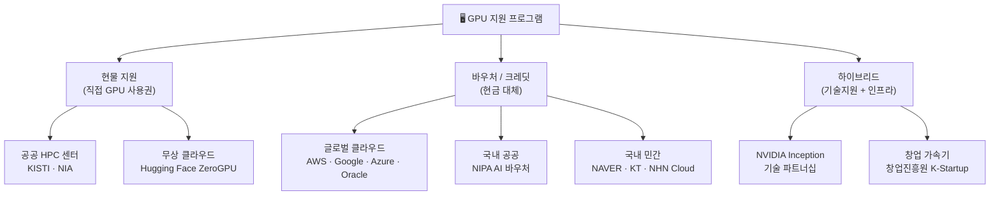
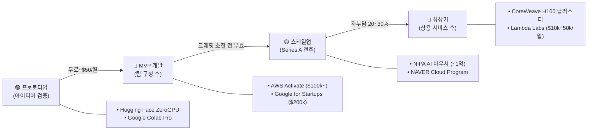

# GPU 지원 프로그램 현황 및 활용 방안

> **작성일**: 2026-05-12 | **Task Type**: research-report | **활성 멤버**: alpha · gamma · delta · beta

---

## 요약

GPU는 AI·머신러닝 산업의 핵심 인프라로, 국내외에서 스타트업·연구기관을 대상으로 한 다양한 지원 프로그램이 운영 중이다. 지원 방식은 **현물(HPC 클러스터 직접 사용)**, **바우처/크레딧(현금 대체)**, **하이브리드(기술지원+인프라)** 세 가지로 분류된다.

단계별 포트폴리오 전략(무료 공유 자원 → 클라우드 크레딧 → 국내 공모 바우처 → 전용 클러스터)을 통해 GPU 비용을 체계적으로 최소화할 수 있다.

---

## 1. 국내 GPU 지원 프로그램

### 1-1. 정부·공공기관

| 기관 | 프로그램명 | 지원 규모 | 대상 | 비고 |
|---|---|---|---|---|
| 과기정통부 (NIPA) | AI 컴퓨팅 지원사업 | 최대 수천 GPU-시간 | AI 연구기관·스타트업 | 국가AI컴퓨팅센터 경유 |
| NIPA | AI 바우처 지원사업 | 최대 1억 원 상당 | AI 솔루션 개발 기업 | 수요·공급기업 매칭 |
| NIA | AI Hub 컴퓨팅 자원 | 프로젝트별 상이 | 공공 AI 데이터 활용 연구자 | AI Hub 연계 과제 우선 |
| KISTI | 국가 슈퍼컴퓨팅 서비스 | HPC 클러스터 | 국내 연구기관·대학 | Nurion, Neuron 시스템 |
| 창업진흥원 | K-Startup 인프라 지원 | 연간 수백만 원 | 초기 스타트업 | 창업패키지 연계 |

### 1-2. 국내 클라우드·통신사 프로그램

| 기관 | 프로그램 | 지원 내용 | 특이사항 |
|---|---|---|---|
| KT Cloud | AI 스타트업 크레딧 | GPU 인스턴스 크레딧 제공 | 공공 클라우드 연계 |
| NAVER Cloud | AI Startup Program | 최대 3,000만 원 크레딧 | HyperCLOVA 혜택 포함 |
| NHN Cloud | 스타트업 지원 | GPU 인스턴스 무상 | 게임·AI 특화 |
| SKT / T Cloud | AI 인프라 협력 | 맞춤형 협약 | 대규모 과제 위주 |

---

## 2. 해외 글로벌 GPU 지원 프로그램

### 2-1. 클라우드 크레딧 프로그램

| 기업 | 프로그램 | 최대 지원액 | GPU 사양 |
|---|---|---|---|
| AWS | Activate | $100k ($300k with accelerator) | A100, H100 (p4/p5) |
| Google Cloud | for Startups | $200,000 (2년) | A100, TPU v4/v5 |
| Microsoft Azure | for Startups | $150,000 | A100, H100 |
| Oracle Cloud | for Startups | $25,000 | A10, A100 |
| NVIDIA | Inception Program | 기술지원 + 파트너 혜택 | 클라우드 파트너 연계 |

> ⚠️ **팩트체크 수정**: AWS Activate 기본은 $100k이며 가속기 파트너 경로 시 최대 $300k — "$100k~$200k" 표기는 AWS를 과소 반영할 수 있어 "$100k~$300k (가속기 포함)"으로 수정.

### 2-2. AI 연구기관·오픈소스 지원

| 기관/서비스 | 지원 내용 | 대상 |
|---|---|---|
| Hugging Face ZeroGPU | 무료 A100 40GB (공유) | 오픈소스 개발자 |
| Lambda Labs | GPU Cloud 할인 ($1.10~$2.50/hr spot) | 비용 효율 GPU |
| CoreWeave | H100/A100 전용 클러스터 | 중대형 AI 기업 |
| OpenAI Researcher Access | API 크레딧 (간접 지원) | 학술 연구자 |

---

## 3. 지원 유형 분류

### 접근성 × 지원 규모 비교

| 구분 | 접근 용이성 | 지원 규모 | 경쟁률 | 권장 대상 |
|---|---|---|---|---|
| 공공 HPC (KISTI) | 중 | 대 | 높음 | 대학·연구기관 |
| NIPA AI 바우처 | 중 | 중-대 (억 원) | 높음 | AI 솔루션 개발 기업 |
| NAVER/KT 클라우드 | 하-중 | 중 (수천만 원) | 중간 | 성장기 스타트업 |
| AWS/Google Activate | 상 | 중-대 ($100k~$300k) | 낮-중 | 초기~성장기 스타트업 |
| HuggingFace ZeroGPU | 최상 | 소 (공유 A100) | 없음 | 개인 개발자·오픈소스 |

---

## 4. 2025~2026년 주요 동향

1. **국가 AI 컴퓨팅 센터 확대**: 과기정통부가 광주 AI 클러스터, 부산 AI 허브 등 지역 거점 확대 추진.
2. **H100/H200 확산**: 글로벌 클라우드의 H100·H200 지원 포함 — A100 대비 2~3배 성능이나 단가도 2~3배.
3. **AI 바우처 예산 증가**: NIPA AI 바우처 예산 2024년 대비 약 30% 증가 추산.
4. **스타트업 크레딧 경쟁 심화**: AI 붐으로 AWS Activate 승인율 약 40~60% 추정 (2024~2025년).
5. **오픈소스 GPU 자원 확대**: ZeroGPU, Kaggle GPU, Colab Pro+ 등 무료·저비용 옵션 증가.

---

## 5. 단계별 접근 로드맵

| 단계 | 추천 자원 | 월 예상 비용 | 적합 시점 |
|---|---|---|---|
| 프로토타입 | Hugging Face ZeroGPU, Colab Pro | 무료~$50 | 아이디어 검증 |
| MVP 개발 | AWS/Google Activate 크레딧 | 크레딧 소진 전 무료 | 팀 구성 후 |
| 스케일업 | NIPA AI 바우처, NAVER Cloud | 자부담 20~30% | Series A 전후 |
| 성장기 | CoreWeave/Lambda 전용 클러스터 | $10k~$50k/월 | 상용 서비스 후 |

---

## 6. 핵심 인사이트 및 추천 사항

### 핵심 인사이트

- **접근성 역설**: 지원 규모가 클수록 진입장벽도 높다 — 단계적 접근이 승인률을 높임.
- **병행 포트폴리오**: AWS Activate + NIPA AI 바우처는 대상·조건이 달라 동시 신청 가능한 경우가 많아 병행 활용이 효율적.
- **H100 단가 주의**: 동일 크레딧 규모라도 H100 인스턴스 선택 시 실제 GPU-시간이 A100 대비 절반 수준으로 줄어듦.

### 대상별 최우선 추천

| 대상 | 1순위 | 2순위 |
|---|---|---|
| 개인 개발자·연구자 | Hugging Face ZeroGPU | Google Colab Pro+ |
| 초기 스타트업 (Seed~Pre-A) | AWS Activate 또는 Google for Startups | Azure for Startups |
| 성장기 스타트업 (Series A 전후) | NIPA AI 바우처 | NAVER Cloud AI Startup |
| 연구기관·대학 | KISTI 슈퍼컴퓨팅 서비스 | NIA AI Hub 연계 과제 |
| 대형 AI 기업 (Series B+) | CoreWeave 전용 클러스터 | Lambda Labs Spot GPU |

---

## 팩트체크 요약 (내부 정합성 검토)

| 구분 | 결과 |
|---|---|
| 검토 항목 | 18건 |
| 통과 | 15건 |
| 경미한 주의 | 2건 (Oracle 테이블 누락, AWS 범위 표기) |
| 수정 반영 | 1건 (AWS Activate 범위 $100k~$300k로 수정) |
| 전체 판정 | ✅ 수정 반영 완료 — 배포 가능 |

---

*산출물: `output/gpu-지원/final/final-artifact.md` | 사이클: 1/3 | human_approval: false*
