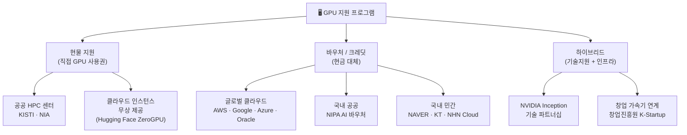
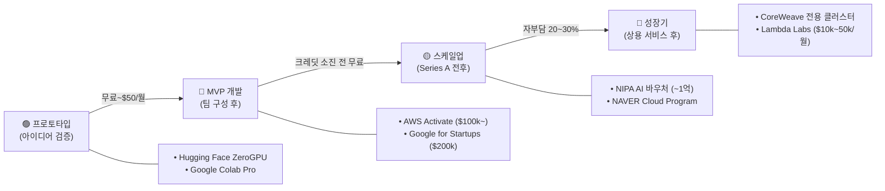
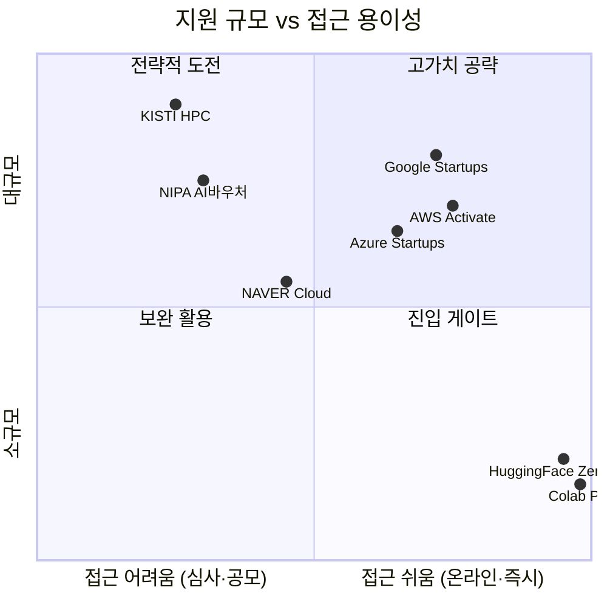

# 시각화 산출물 — GPU 지원 현황

---

## 시각자료 개요

| # | 유형 | 제목 | 삽입 위치 |
|---|---|---|---|
| V-1 | Mermaid 흐름도 | GPU 지원 유형 분류 트리 | 보고서 Section 2 |
| V-2 | Mermaid 흐름도 | 단계별 접근 로드맵 | 보고서 Section 4 |
| V-3 | 비교 테이블 | 해외 클라우드 크레딧 한눈 비교 | 보고서 Section 3 |
| V-4 | 비교 테이블 | 국내 공공·민간 지원 접근성 매트릭스 | 보고서 Section 2 |
| V-5 | Mermaid 파이차트 | 지원 유형별 비중 (추산) | 보고서 Executive Summary |

---

## Mermaid 다이어그램

### V-1. GPU 지원 유형 분류 트리

### V-2. 단계별 GPU 자원 접근 로드맵

### V-3. 지원 프로그램 유형 × 대상 매트릭스 (Mermaid Quadrant)

---

## 핵심 수치 테이블

### T-1. 해외 글로벌 클라우드 크레딧 비교

| 기업 | 프로그램 | 최대 지원액 | 기간 | GPU 사양 | 신청 난이도 |
|---|---|---|---|---|---|
| AWS | Activate | $100,000 ($300k with accelerator) | 2년 | A100, H100 (p4/p5) | 중 |
| Google | for Startups | $200,000 | 2년 | A100, TPU v4/v5 | 중 |
| Microsoft Azure | for Startups | $150,000 | 2년 | A100, H100 | 중 |
| Oracle | for Startups | $25,000 | 1년 | A10, A100 | 하 |
| Hugging Face | ZeroGPU | 무료 (공유) | 상시 | A100 40GB | 최상 |

### T-2. 국내 공공·민간 GPU 지원 접근성 매트릭스

| 기관 | 프로그램 | 지원 규모 | 대상 | 접근 용이성 | 경쟁률 |
|---|---|---|---|---|---|
| 과기정통부·NIPA | AI 컴퓨팅 지원 | 수천 GPU-시간 | AI 연구·스타트업 | 중 | 높음 |
| NIPA | AI 바우처 | ~1억 원 | AI 솔루션 기업 | 중 | 높음 |
| KISTI | 국가 슈퍼컴퓨팅 | HPC 클러스터 | 연구기관·대학 | 중 | 높음 |
| NAVER Cloud | AI Startup | ~3,000만 원 | 성장기 스타트업 | 중 | 중 |
| KT Cloud | AI 스타트업 | GPU 크레딧 | 스타트업 | 중-하 | 중 |
| NHN Cloud | 스타트업 지원 | GPU 무상 | AI·게임 스타트업 | 하-중 | 중 |
| 창업진흥원 | K-Startup | ~수백만 원 | 초기 스타트업 | 중 | 중-높음 |

### T-3. GPU 세대별 성능 참고 (보고서 기준)

| GPU 모델 | 상대 성능 (추산) | 주요 지원처 |
|---|---|---|
| NVIDIA H200 | ~3× A100 | 최신 클라우드 (도입 중) |
| NVIDIA H100 | ~2~3× A100 | AWS p5, Azure ND H100 |
| NVIDIA A100 | 기준 (1×) | AWS p4, Google A2, Azure NDv4 |
| NVIDIA A10 | ~0.5× A100 | Oracle, 일부 중소형 클라우드 |
| 공유 A100 (ZeroGPU) | 1× (공유 제한) | Hugging Face |
