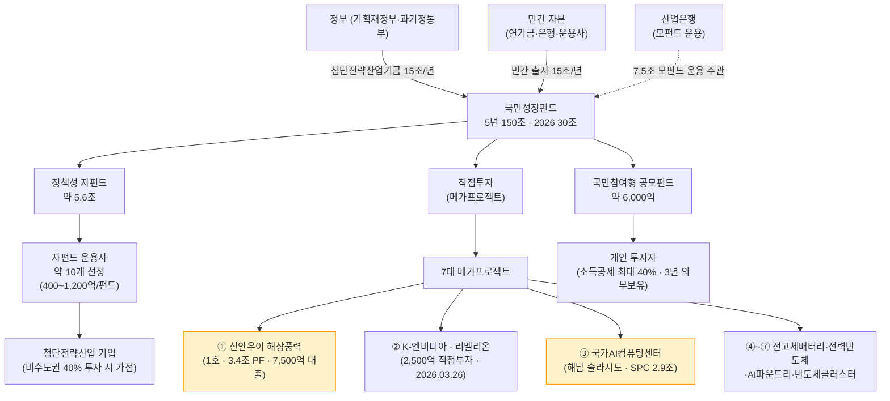
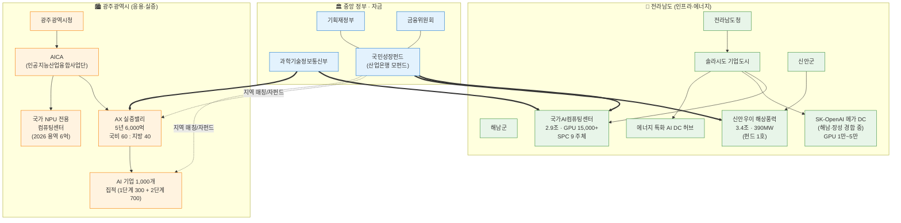
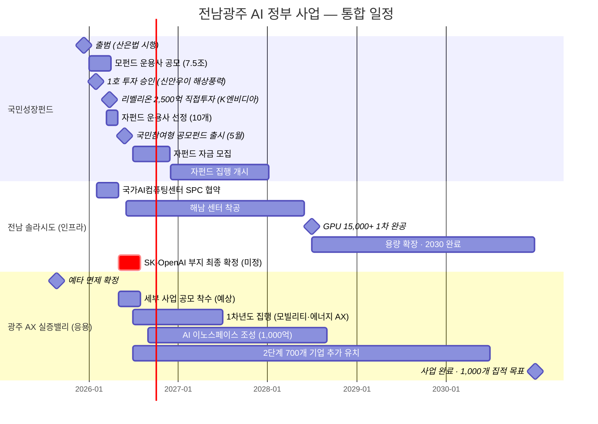

# 전남광주 AI 정부 사업 — 국민성장펀드 축으로 본 2026년 통합 리포트

- 작성일: **2026-04-24**
- 워크스페이스: `jeonnam-gwangju-ai-national-growth-fund`
- 데이터 시점: 2025.08 ~ 2026.04 공개 발표 기준 (gamma 팩트체크 반영)
- 구성: 팀장 통합본 (alpha 조사 · gamma 검증 · delta 시각화 · beta 초안)

---

## 0. 한 문단 요약

2026년은 대한민국 AI 정책 자금과 지역 인프라가 **전남·광주 축**으로 집중되기 시작한 원년이다. 중앙에서는 **국민성장펀드**(5년 150조 · 2026 AI 6조)가 가동됐고, 지역에서는 **전남 해남 솔라시도 국가AI컴퓨팅센터(2.9조)** · **SK-OpenAI 메가 데이터센터(부지 경합 중)** · **광주 AX 실증밸리(5년 6,000억)** 3개 축이 동시에 착수 단계에 진입했다. 세 축은 개별 사업이 아니라 **"중앙 자금 → 전남 인프라 + 광주 실증"** 의 구조적 한 묶음이다. 국민성장펀드 **1호 투자 = 신안우이 해상풍력(전남)**, **#3 = 해남 국가AI컴퓨팅센터**로 7대 메가프로젝트 중 2건이 전남 확정 — 공개된 메가프로젝트 금액 중 **전남 배분만 6.3조+**. 광주는 국가AI컴퓨팅센터 유치에는 밀렸으나 AX 실증밸리로 **"AI 1,000개 기업 집적 + 산업·도시 AI 응용"** 포지션을 확보했다.

---

## 1. 3대 축 스냅샷

| 축 | 규모 | 주관 | 핵심 일정 |
|---|---|---|---|
| ① 국민성장펀드 (자금) | 5년 150조 / 2026 AI 6조 | 금융위·산업은행 | 2025.12.10 출범 · 2026.04말 자펀드 운용사 선정 · 2026.05 국민참여형 출시 |
| ② 전남 솔라시도 (인프라) | 국가AI컴퓨팅센터 2.9조 + SK-OpenAI 2.5조 (경합 중) | 삼성SDS 컨소 / SK·OpenAI | 2026 착공 · 2028 GPU 15,000+ 1차 완공 · 2030 확장 |
| ③ 광주 AX 실증밸리 (응용) | 5년 6,000억 | 광주시·AICA | 2025.08.22 예타 면제 확정 · 2026 착수 · 2030 1,000개 기업 집적 |

### 요약 인포그래픽

```
🏛 국민성장펀드 — 5년 150조 · 2026 AI 6조
    │
    ├─ ✅ 1호 투자 → 🌬 신안우이 해상풍력 (전남)  3.4조 PF / 7,500억 대출
    │
    ├─ ⚡ 직접투자 1호 → 🔬 리벨리온 K엔비디아    2,500억 (2026.03.26)
    │
    ├─ 🖥 메가 #3 → 해남 국가AI컴퓨팅센터         2.9조 · GPU 15,000+
    │                 └─ SPC 9 주체 (공공 51 : 민간 49)
    │                 └─ 삼성SDS·네이버·KT·카카오·삼성전자·삼성물산·클러쉬
    │
    ├─ 🟡 미확정 → SK-OpenAI 메가 DC (해남 vs 장성)  2.5조 · GPU 1~5만
    │
    └─ 💡 자펀드 "비수도권 40% 가점" → 광주·전남 기업 구조적 수혜

🏙 광주 AX 실증밸리 — 5년 6,000억 (국비 60 : 지방 40, 상향 건의 중)
    ├─ 3,000억 ▸ 모빌리티·에너지 AX 핵심기술
    ├─ 2,000억 ▸ 도시문제 AI 혁신
    └─ 1,000억 ▸ AI 이노스페이스 (기업 집적)
        목표: 1,000개 기업 집적 (2030) · 고용유발 6,281명
```

---

## 2. 핵심 인사이트 (7)

### 2-1. 전남 = "에너지 인프라 × AI 인프라" 이중 수혜지 (공식 확인)

국민성장펀드 7대 메가프로젝트 중 **1호 = 신안우이 해상풍력(전남 신안, 3.4조 PF, 정책자금 7,500억 장기대출, 2026.01.29 승인)**, **#3 = 해남 국가AI컴퓨팅센터(2.9조 SPC)**. 두 프로젝트가 모두 전남에 입지했다는 사실은 전남을 단순 "AI 컴퓨팅 부지"가 아니라 **"재생에너지 + AI 컴퓨팅 결합 허브"**로 국가 차원에서 지정한 것을 의미한다. 삼성SDS 컨소시엄의 해남 입지 선정 사유 첫 번째가 "재생에너지 기반 안정적 전력"이다.

### 2-2. 해남 국가AI컴퓨팅센터는 단일 프로젝트가 아닌 "SPC 연합"

- **SPC 구성**: 민간 7개사(삼성SDS 주관 · 네이버클라우드 · 삼성물산 · 카카오 · 삼성전자 · 클러쉬 · KT) + 공공 2개(전라남도 · 서남해안기업도시개발) = **총 9개 기관**
- **지분**: **공공 51% : 민간 49%**
- **함의**: ① 공공 과반으로 정책 집행 일관성 확보, ② 대기업 AI 인프라 협력 모델의 첫 대형 사례 → SK-OpenAI 협상에도 영향

### 2-3. SK-OpenAI 메가 DC 부지는 여전히 미확정 (2026-04-19 기준)

초기 해남 솔라시도 유력 → 2026.03 광주 첨단지구(장성 남면) 유력 → 2026.04.19 **"해남·장성 입지 경합, 조만간 결정"** 로 회귀. GPU 규모도 초기 5만 → 최근 1만으로 축소 보도. **2026 2~3Q 결론이 전남광주 AI 지형 재편 변수**.

### 2-4. 광주는 "AX(AI 전환) 실증"으로 차별화, 국비 비율이 집행 속도 결정 변수

- **6,000억 배분**: 모빌리티·에너지 AX 핵심기술 **3,000억** (50%) + 도시문제 AI 혁신 **2,000억** (33%) + AI 이노스페이스 **1,000억** (17%)
- **특징**: 단순 R&D 가 아닌 **"실사용 레퍼런스 축적"** 에 무게 → 자펀드 투자 유치 시 트랙 레코드 자산화 가능
- **국비 60% → 70% 상향 건의 (광주상의 2025.10)**: 2026 추경 또는 2027 본예산 반영 여부가 초기 2개년 집행 규모 결정

### 2-5. 국민성장펀드 자펀드 = 광주·전남 기업의 실제 수혜 채널

2026.03 금융위 공식 발표된 자펀드 운용사 선정 기준이 지역 기업에 구조적 유리 조건을 내장:
- **비수도권 40% 투자 시 추가 성과보수** (운용사 입장의 지역 기업 발굴 인센티브)
- **비상장/코스닥 기술특례사 40% 이상 신규 투자 시 가점**
- **신규 운용사 트랙 개방** (지역 VC 참여 기회)
- 자펀드 규모 400~1,200억 × 약 10개 선정 → **정책+민간 매칭 6조+ 실탄 시장 유입**

### 2-6. 광주 AI 1단계 성과가 2단계 자금 유입의 레퍼런스

1단계(2020~2024) **5년간 160개 기업 유치 + CES 혁신상 24개** → 2단계(2026~2030) 700개 추가 → 누적 **1,000개** 목표. AICA 가 실증 레퍼런스 자산 보유 → 자펀드 운용사 심사 시 가점 후보 리스트와 자연스럽게 매칭.

### 2-7. 2026년 4개 동시 이벤트가 수주·투자·실증 타이밍 결정

| 이벤트 | 시점 | 의사결정 영향 |
|---|---|---|
| 자펀드 운용사 선정 완료 | 2026.04 말 | 지역 VC 편입 여부 |
| 국민참여형 공모펀드 출시 | 2026.05 (예정) | 개인 투자 자금 유입 |
| 해남 국가AI컴퓨팅센터 착공 | 2026.06~ (예상) | 전력·공조·네트워크 발주 본격화 |
| 광주 AX 실증밸리 세부 RFP | 2026.05~ (예상) | 1,000억 AI 이노스페이스 입주 선발 |

→ **2026년 2~3분기** 가 결정적 구간.

---

## 3. 국민성장펀드 — 자금의 해부도

### 3-1. 재원·구조 (2026)

- **총 규모**: 5년 150조 / 2026 배정 30조 (AI 6조 · 반도체 4.2조 · 바이오·백신 2.3조 · 이차전지 1.6조 · 기타 15.9조)
- **재원**: 민간 자본 15조 + 정부 기금(첨단전략산업기금) 15조 = 30조/년
- **산업은행 모펀드 규모**: 7.5조 (운용사 공모)
- **3트랙**:
  - 정책성 자펀드 약 **5.6조** (10개 자펀드, 400~1,200억/펀드)
  - 직접투자 메가프로젝트 (리벨리온 2,500억 등)
  - 국민참여형 공모펀드 약 **6,000억** (소득공제 최대 40%)

### 3-2. 자펀드 운용사 선정 기준 (2026.03 금융위)

- 주목적 투자: 자펀드 결성금액 **60% 이상** 첨단전략산업기업에
- 운용사 후순위 출자 의무 **1%** (초과 시 심사 가점)
- 추가 성과보수 조건 (2개, 복수 충족 가능):
  - 비상장/코스닥 기술특례사 **40% 이상 신규 투자**
  - **비수도권 지역 투자 40% 이상**
- 신규 운용사 트랙 개방, 창업 경험(실패 포함) 평가 반영
- **선정 일정**: 2026.04 말 마무리

### 3-3. 자금 흐름도



### 3-4. 7대 메가프로젝트 현황

| # | 프로젝트 | 규모 | 상태 | 지역 |
|---|---|---|---|---|
| 1 | **신안우이 해상풍력** | 3.4조 PF / 7,500억 대출 | ✅ 2026.01.29 **1호 승인** | 전남 신안 |
| 2 | K-엔비디아 · 리벨리온 | 2,500억 직접투자 | ✅ 2026.03.26 의결 (직접투자 1호) | 본사 서울 |
| 3 | 국가 AI 컴퓨팅 센터 | 2.9조 SPC | 🟡 2026 협약·착공 | **전남 해남** |
| 4 | 전고체배터리 소재공장 | 미공개 | ⏳ 순차 의결 | 미정 |
| 5 | 전력반도체 생산공장 | 미공개 | ⏳ | 미정 |
| 6 | 첨단 AI 반도체 파운드리 | 미공개 | ⏳ | 미정 |
| 7 | 반도체클러스터 에너지 인프라 | 미공개 | ⏳ | 미정 |

> **전남 수혜 프로젝트**: 7건 중 **2건(#1, #3)** 전남 확정, 공개 금액 **6.3조+**.

---

## 4. 전남 솔라시도 — AI 인프라 3대 프로젝트

### 4-1. 국가AI컴퓨팅센터 (삼성SDS 컨소시엄)

- **위치**: 전남 해남군 산이면 솔라시도 기업도시 내 데이터센터 파크
- **SPC 9개 주체**:
  - 민간 7: 삼성SDS (주관) · 네이버클라우드 · 삼성물산 · 카카오 · 삼성전자 · 클러쉬 · KT
  - 공공 2: 전라남도 · 서남해안기업도시개발㈜
- **지분**: 공공 **51%** : 민간 **49%**
- **투자**: **2.9조 원** (2026~2030, SPC 집행)
- **GPU**: **2028년 1차 완공 시 15,000장 이상**, 2030 확장
- **입지 사유**: 재생에너지 전력 · 공업용수 · 넓은 부지 · 기업도시 특별법 패스트트랙

### 4-2. SK-OpenAI 메가 데이터센터 ('한국판 스타게이트')

- **MOU**: 2025.10.01 SK-OpenAI
- **투자 (초기)**: 2.5조 원, 2030년까지 **GPU 5만 장** — **최근 보도 1만 장으로 축소**
- **부지 (2026-04-19)**: **해남 솔라시도 vs 광주 첨단지구(장성 남면) 경합 중, 미확정**
- **의미**: OpenAI 글로벌 스타게이트 연계 → 확정 지역은 **"포스트 실리콘밸리"** 내러티브 독점

### 4-3. 에너지 특화 AI 데이터센터 허브

- 솔라시도 전체를 "재생에너지 × AI" 결합 허브로 육성
- 태양광·해상풍력 대규모 발전 단지 + AI DC 전력 수요 매칭
- 2026.01 언론 보도에서 "에너지 특화 AI DC" 브랜딩 확정
- 국가AI컴퓨팅센터 이후 **추가 민간 DC 유치 파이프라인** 가동 예상

---

## 5. 광주 AX 실증밸리 — 응용·실증의 축

### 5-1. 사업 개요

- **공식 명칭**: 광주 AX(AI 전환) 실증밸리 조성 사업 = 광주 AI 2단계
- **확정**: 2025.08.18 국무회의 의결, 2025.08.22 예타 면제 최종
- **규모·기간**: **6,000억 / 2026~2030 (5년)**
- **배경**: 정부가 광주·대구·전북·경남 4개 AI 거점 지정 (2025.8)
- **운영**: 인공지능산업융합사업단(AICA) + 광주광역시

### 5-2. 6,000억 사업 구성

| 축 | 금액 | 비중 | 내용 |
|---|---|---|---|
| AX 핵심기술 개발 | 3,000억 | 50% | 모빌리티 AI · 에너지산업 AX |
| 도시문제 AI 혁신 | 2,000억 | 33% | 민주주의·교통·돌봄·안전 등 시민 생활 |
| AI 이노스페이스 | 1,000억 | 17% | 기업 집적 공간·인프라 |
| **합계** | **6,000억** | 100% | 5년 |

**재원 분담**: 국비 **60%** (3,600억) : 지방비·민자 포함 **40%** (2,400억) — **광주상의 70% 상향 건의 진행 중**

### 5-3. 1,000개 기업 집적 로드맵

| 단계 | 기간 | 목표 | 실적/계획 |
|---|---|---|---|
| 1단계 | 2020~2024 | 300개 유치 | ✅ 5년간 **160개 기업** 유치 · **CES 혁신상 24개** |
| 2단계 (AX 실증밸리) | 2026~2030 | **700개 추가** | ⏳ 착수 예정 |
| 누적 | ~2030 | **1,000개** | - |

### 5-4. 기대 경제효과

| 지표 | 금액/수 |
|---|---|
| 생산유발 | 9,831억 원 |
| 부가가치유발 | 4,942억 원 |
| 고용유발 | 6,281명 |

### 5-5. 2026년 광주시 AI·AX 관련 예산

- 광주시 2026 국비 총액: **3조 9,497억** (역대 최대)
- **AI·AX 확보 예산: 1,634억**
- 국가 NPU센터 용역비: 6억

---

## 6. 전남광주 AI 사업 맵



---

## 7. 2025~2030 통합 타임라인



---

## 8. 추천 액션 (3 그룹)

### A. 지역 AI·데이터·에너지 기업

1. **자펀드 운용사와 접촉 타이밍을 2026 2~3분기에 집중**
   - 선정된 운용사에 IR 자료 발송, "비수도권 40% 투자" 조항 충족 카드 제시
   - 프리A·시리즈A 라운드를 2026 하반기로 재조정 시 자펀드 진입 가능성 증가

2. **해남 국가AI컴퓨팅센터 수주 기회 3개 카테고리 즉시 스캔**
   - 인프라: 전력(재생에너지 PPA·ESS) · 공조(고밀도 GPU 냉각) · 네트워크 · 보안
   - 운영: 모니터링 · MLOps 플랫폼
   - 파트너십: SPC 9개 주체와 AI 서비스 공동 개발·데이터 공유

3. **광주 AX 실증밸리 3대 축에서 핵심 역량 선점**
   - 모빌리티 AI → 자율주행·물류 최적화·디스패치
   - 에너지 AI → VPP·재생에너지 예측·수요관리
   - 도시문제 AI → 교통·돌봄·안전·공공 서비스
   - AI 이노스페이스 입주 자격 확인

4. **SK-OpenAI 부지 결정 전후 대응 플랜 이중화**
   - 해남 확정 시: 전남 데이터센터 단일 수주·협력
   - 광주 확정 시: 광주 AI 2.0 재편 대응, 첨단지구 기업 협업

### B. 지자체·공공기관 담당자

5. **광주 AX 실증밸리 국비 70% 상향을 2026 추경 또는 2027 본예산 반영**
   - 광주상의 건의문 + 지방의원·국회의원 근거 자료 보강
   - 초기 2개년 국비 선집행 확대를 과기정통부·기재부 동시 창구로

6. **전남 AI 인프라 후속 유치전 강화**
   - 국가AI컴퓨팅센터 2.9조 이후 "에너지 특화 AI DC 클러스터" 민간 유치 파이프라인
   - 솔라시도 내 추가 DC·AI 연구소·AI 반도체 팹 연결 검토

7. **자펀드 운용사와의 지자체 매칭 펀드 협의**
   - 광주·전남 지자체 출자 매칭으로 자펀드의 비수도권 40% 달성 가속
   - "지역 매칭 × 국민성장펀드 자펀드" 복층 구조로 실탄 2배 효과

### C. 물류·모빌리티 기업 관점

8. **광주 AX 실증밸리 "모빌리티 AI 3,000억" 축에 직접 참여**
   - 배송 경로 최적화·실시간 디스패치·AI 주행 자동화를 **실증 과제** 로 제안
   - 광주 1,000개 기업 풀 내 파트너사(자율주행·지도·센서) 발굴

9. **해남 국가AI컴퓨팅센터에 "물류 AI 파운데이션 모델 학습" 수요 제안**
   - GPU 15,000장 자원을 활용할 국내 수요처로 물류 특화 대규모 모델 학습 유치
   - 네이버클라우드·KT와 AI 인프라 협력 채널 확보

10. **리벨리온 K엔비디아 프로젝트와의 실전 파일럿 검토**
    - 리벨100(2026.07 양산) 을 배송 AI 추론 엔진에 테스트 도입 가능성 평가
    - 국산 AI 반도체 레퍼런스 확보 → 자펀드 투자 유치 시 차별화

---

## 9. 추적 대상 (2026년 중 결론 예정)

| # | 이벤트 | 결정 시점 | 관전 포인트 |
|---|---|---|---|
| 1 | 자펀드 운용사 10개 선정 결과 | 2026.04 말 | 신규 운용사 편입 개수, 지역 VC 포함 |
| 2 | 국민참여형 공모펀드 출시 일자 | 2026.05 | 금융위 최종 승인·세법 개정안 통과 |
| 3 | SK-OpenAI DC 부지 최종 확정 | 2026.2~3Q | 해남 vs 장성(광주 첨단지구) |
| 4 | 광주 AX 실증밸리 세부 RFP | 2026.2Q~ | 3대 축별 사업자 공모 |
| 5 | 해남 국가AI컴퓨팅센터 착공 | 2026.2H | SPC 협약·부지 정지 |
| 6 | 광주 AX 국비 비율 상향 | 2026 추경·2027 본예산 | 60% → 70%? |
| 7 | 리벨100 양산 개시 | 2026.07 | 양산 지연 여부 |
| 8 | 국민성장펀드 메가 #4~#7 승인 | 2026 하반기 | 순차 의결 |

---

## 10. 리스크 매트릭스

| 리스크 | 영향 | 모니터링 포인트 |
|---|---|---|
| 전력·용수 공급 지연 | 국가AI컴퓨팅센터 2028 완공 일정 영향 | 재생에너지 PPA 체결 / 공업용수 인프라 계획 |
| 국비 60% 유지 | 광주 AX 2026~2027 집행 규모 축소 | 2026 추경 동향 |
| SK-OpenAI 부지 결론 | 전남광주 AI 지형 재편 | 2026 2~3Q 공식 발표 |
| 신규 운용사 미선정 | 지역 VC 참여 기회 축소 | 2026.04 말 선정 결과 공개 |
| 국민참여형 흥행 부진 | 장기 자금 모집 차질 | 5월 출시 초기 판매 추이 |
| 리벨100 양산 지연 | K엔비디아 프로젝트 신뢰도 | 2026.07 양산 개시 여부 |

---

## 11. 출처

### 공식·정부

- [국민성장펀드 공식 (한국산업은행)](https://ngf.kdb.co.kr/)
- [금융위원회 - 국민성장펀드, 해상풍력으로 본격 투입](https://fsc.go.kr/no010101/86170)
- [금융위원회 - 자펀드 운용사 선정기준 (정책브리핑)](https://www.korea.kr/briefing/pressReleaseView.do?newsId=156753966)
- [정책브리핑 - 국민성장펀드 2차 메가프로젝트](https://www.korea.kr/news/policyNewsView.do?newsId=148962687)
- [정책브리핑 - 운용사 공모 시작 (2025.12)](https://www.korea.kr/news/policyNewsView.do?newsId=148958010)
- [정책브리핑 - 광주 AX 실증밸리 민생토론](https://www.korea.kr/news/policyNewsView.do?newsId=148933531)
- [AICA (인공지능산업융합사업단)](https://www.aica-gj.kr/)

### 국민성장펀드·리벨리온

- [서울신문 - 150조 국민성장펀드](https://www.seoul.co.kr/news/economy/2026/04/14/20260414500265)
- [문화일보 - 5년간 150조 · 내년 AI 6조](https://www.munhwa.com/article/11554540)
- [서울경제 - 내년 30조, AI 6조](https://www.sedaily.com/NewsView/2H1R566ZEQ)
- [유니콘팩토리 - 산업은행 7.5조 모펀드](https://www.unicornfactory.co.kr/article/2026011516373853248)
- [서울경제 - 리벨리온 2,500억 K엔비디아](https://www.sedaily.com/article/20017666)
- [이투데이 - 1호 투자 신안우이 해상풍력](https://www.etoday.co.kr/news/view/2550964)
- [디지털타임스 - 신안우이 3.4조 PF 조달 성공](https://www.dt.co.kr/article/12056580)
- [인베스트조선 - 관제 상품 비인기 전철 우려](https://www.investchosun.com/site/data/html_dir/2026/04/21/2026042180102.html)

### 전남 솔라시도

- [디일렉 - 국가AI컴퓨팅센터 해남 착공](https://www.thelec.kr/news/articleView.html?idxno=50638)
- [서울경제 CES2026 - 삼성SDS 착공 계획](https://www.sedaily.com/NewsView/2K780Z3VGP)
- [헤럴드경제 - 해남 최종 확정](https://biz.heraldcorp.com/article/10691199)
- [서울신문 - SPC 구성사 명단](https://www.seoul.co.kr/news/economy/industry/2026/01/08/20260108020004)
- [디지털데일리 - SPC 지분 공공 51 : 민간 49](https://m.ddaily.co.kr/page/view/2025091117082707216)
- [세계일보 - 에너지 특화 AI DC](https://www.segye.com/newsView/20260109504010)
- [녹색경제신문 - SK-OpenAI 해남 유력](https://www.greened.kr/news/articleView.html?idxno=332845)
- [전자신문 - SK-OpenAI 광주 첨단지구 유력](https://www.etnews.com/20260304000369)
- [Daum 뉴스 - 해남·장성 경합 중 (2026-04-19)](https://v.daum.net/v/20260419174655930)

### 광주 AX 실증밸리

- [뉴시스 - 광주 AI 2단계 1,000개 집적](https://www.newsis.com/view/NISX20250818_0003293793)
- [내외일보 - AX 실증밸리 6,000억 예타면제](https://www.naewoeilbo.com/news/articleView.html?idxno=2166476)
- [헤럴드경제 - 광주상의 국비 70% 상향 건의](https://biz.heraldcorp.com/article/10601456)
- [브릿지경제 - 국비 비율 70% 공식 건의](https://www.viva100.com/article/20251024500455)
- [게트뉴스 - 광주 2026 AI·AX 예산 1,634억](https://www.getnews.co.kr/news/articleView.html?idxno=852433)
- [게트뉴스 - 광주 5년간 160개 기업 유치·CES 24개](https://www.getnews.co.kr/news/articleView.html?idxno=850383)

### 국민참여형 펀드

- [캐시코드 - 2026 출시 및 소득공제](https://maybeconomy.com/national-growth-fund-launch-date/)
- [MBC뉴스 - 40% 소득공제](https://imnews.imbc.com/replay/2026/nw1200/article/6794895_36967.html)

---

## 12. 팀 구성 및 산출물 이력

| 단계 | 담당 | 산출물 | 경로 |
|---|---|---|---|
| 계획 | team-lead | plan.md (v2) | `output/jeonnam-gwangju-ai-national-growth-fund/plan.md` |
| 조사·분석 | member-alpha | analysis-report.md | `output/jeonnam-gwangju-ai-national-growth-fund/member-alpha/` |
| 팩트체크 | member-gamma | fact-check-log.md | `output/jeonnam-gwangju-ai-national-growth-fund/member-gamma/` |
| 시각화 | member-delta | visuals.md | `output/jeonnam-gwangju-ai-national-growth-fund/member-delta/` |
| 보고서 초안 | member-beta | draft-report.md | `output/jeonnam-gwangju-ai-national-growth-fund/member-beta/` |
| 리뷰 | team-lead | review-log.md | `output/jeonnam-gwangju-ai-national-growth-fund/review-log.md` |
| **최종 통합** | **team-lead** | **final-artifact.md** | **본 문서** |

사이클: 1 / max_cycles 3 (재할당 없이 1 사이클 완료) · human_approval=false (자동 진행) · Phase 5 Notion + Slack 배포 진행 예정.
