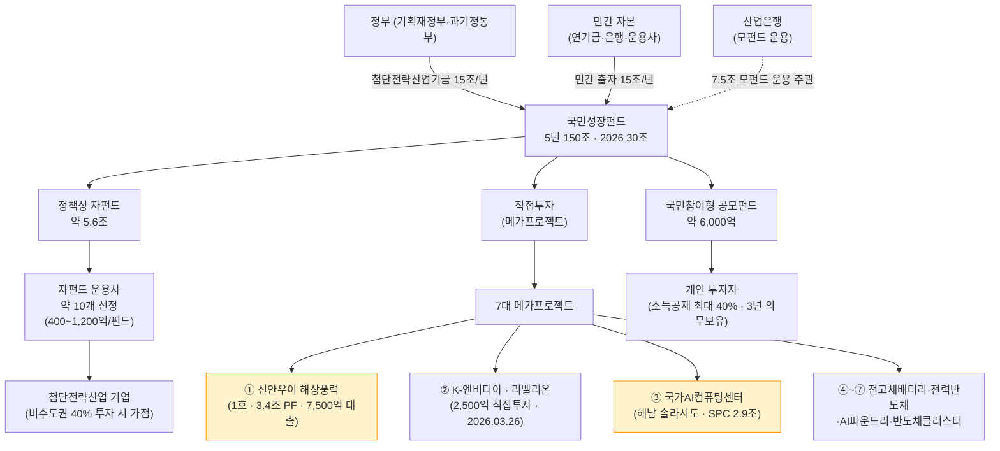
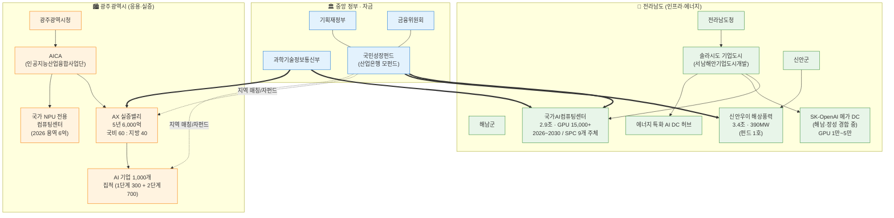
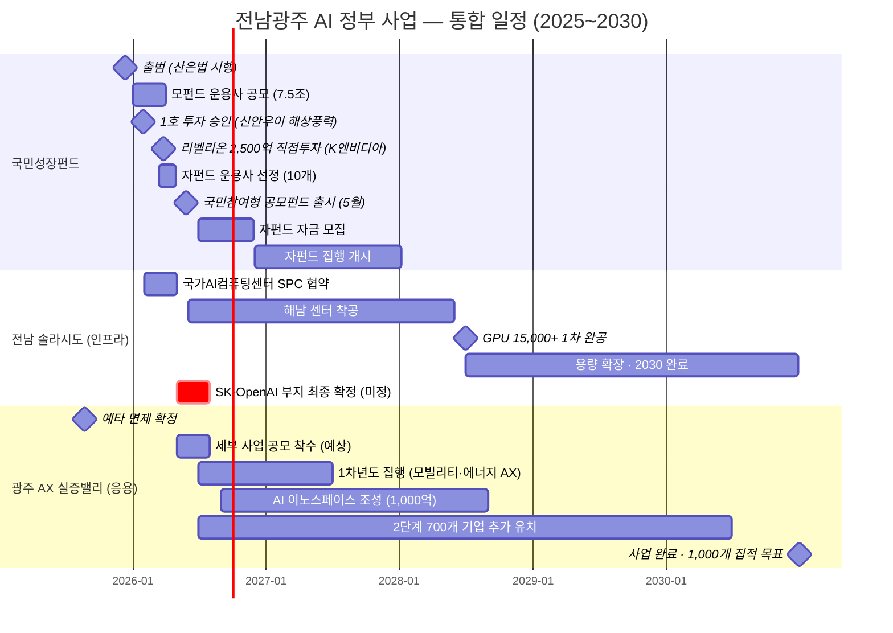

# Visuals: 전남광주 AI 정부 사업 (국민성장펀드)

- 작성자: member-delta
- 작성일: 2026-04-24
- 입력: `member-alpha/analysis-report.md` + `member-gamma/fact-check-log.md` (확정/수정 수치 기반)

---

## 시각자료 개요

본 파일은 전남광주 AI 정부 사업의 3대 축(국민성장펀드 · 전남 솔라시도 · 광주 AX 실증밸리) 을 표현하는 시각자료를 제공한다. 총 4종:

1. **자금 흐름도** — 국민성장펀드 재원 구조와 집행 경로 (Mermaid flowchart)
2. **전남광주 AI 사업 맵** — 지역 거점·주관 주체·사업 연결 (Mermaid graph TD)
3. **2025~2030 통합 타임라인** — 펀드·인프라·실증 이벤트 (Mermaid gantt)
4. **핵심 수치 테이블** — 분야별·지역별·연도별 금액·지표

모든 수치는 **gamma 에서 확정(✅) 또는 수정권고(🟡) 처리된 값** 기준. 🔴 제거 항목("해남=1호") 은 포함하지 않음.

---

## 1. Mermaid 다이어그램

### 1-1. 국민성장펀드 자금 흐름도



**메모**: 노란색 강조(🟨) 노드는 **전남 지역 수혜 프로젝트** (신안우이 해상풍력 + 해남 국가AI컴퓨팅센터).

### 1-2. 전남광주 AI 사업 맵



### 1-3. 2025~2030 통합 타임라인



---

## 2. 핵심 수치 테이블

### 2-1. 국민성장펀드 구조 (2026 기준)

| 구분 | 규모 | 비고 |
|---|---|---|
| 총 펀드 규모 | **150조 (5년)** | 민관합동 |
| 2026년 배정 | **30조** | AI 6조 포함 |
| 정책성 자펀드 | **약 5.6조** | 10개 자펀드, 400~1,200억/펀드 |
| 직접투자 (메가프로젝트) | **가변** | 건당 대규모 (리벨리온 2,500억 등) |
| 국민참여형 공모펀드 | **약 6,000억** | 소득공제 최대 40% |
| 산업은행 모펀드 규모 | **7.5조** | 운용사 공모 |

### 2-2. 2026 AI 관련 분야별 배정

| 분야 | 금액 | 비중 |
|---|---|---|
| AI | **6.0조** | 20.0% |
| 반도체 | 4.2조 | 14.0% |
| 바이오·백신 | 2.3조 | 7.7% |
| 이차전지 | 1.6조 | 5.3% |
| 기타 첨단산업 | 약 15.9조 | 53.0% |
| **합계** | **30.0조** | 100% |

### 2-3. 국민성장펀드 7대 메가프로젝트 현황 (2026-04 기준)

| # | 프로젝트 | 규모 | 상태 | 지역 |
|---|---|---|---|---|
| 1 | **신안우이 해상풍력** | 3.4조 PF / 정책 7,500억 대출 | ✅ 2026.01.29 **1호 승인** | 전남 신안 |
| 2 | K-엔비디아 · 리벨리온 | 2,500억 직접투자 | ✅ 2026.03.26 의결 (직접투자 1호) | 본사 서울 |
| 3 | 국가 AI 컴퓨팅 센터 | 2.9조 SPC | 🟡 2026 협약·착공 | **전남 해남** |
| 4 | 전고체배터리 소재공장 | 미공개 | ⏳ 순차 의결 예정 | 미정 |
| 5 | 전력반도체 생산공장 | 미공개 | ⏳ | 미정 |
| 6 | 첨단 AI 반도체 파운드리 | 미공개 | ⏳ | 미정 |
| 7 | 반도체클러스터 에너지 인프라 | 미공개 | ⏳ | 미정 |

> **전남 수혜 프로젝트 비중**: 7건 중 **2건(#1, #3)** 이 전남 확정. 전체 공개 금액 중 **전남 배분 약 6.3조+** (3.4조 신안 + 2.9조 해남).

### 2-4. 전남 솔라시도 AI 인프라 3대 프로젝트

| 프로젝트 | 주관 | 투자액 | GPU | 일정 | 상태 |
|---|---|---|---|---|---|
| 국가AI컴퓨팅센터 | 삼성SDS 컨소 (SPC 9개 주체) | **2.9조** | **15,000+** (2028) | 2026~2030 | ✅ 확정 |
| SK-OpenAI 메가 DC | SK그룹·OpenAI | **2.5조** (초기) | **1~5만** (시점별 상이) | 2030 완공 목표 | 🟡 해남·장성 경합 |
| 에너지 특화 AI DC 허브 | 전남도·민간 | 미정 (후속 유치) | - | 2026~ | 🟡 브랜딩 단계 |

**SPC 참여 9개 주체**: (민간 7) 삼성SDS·네이버클라우드·삼성물산·카카오·삼성전자·클러쉬·KT / (공공 2) 전라남도·서남해안기업도시개발. **지분 구조 공공 51 : 민간 49**.

### 2-5. 광주 AX 실증밸리 6,000억 배분

| 축 | 금액 | 비중 | 내용 |
|---|---|---|---|
| AX 핵심기술 개발 | **3,000억** | 50% | 모빌리티·에너지산업 AI |
| 도시문제 AI 혁신 | **2,000억** | 33% | 교통·돌봄·안전·민주주의 |
| AI 이노스페이스 | **1,000억** | 17% | 기업 집적 공간·인프라 |
| **합계** | **6,000억** | 100% | 5년 (2026~2030) |

**재원 분담**: 국비 **60%** (3,600억) + 지방비·민자 포함 **40%** (2,400억) — 광주상의 **70% 상향 건의 중**

### 2-6. 광주 AI 기업 집적 목표

| 단계 | 기간 | 목표 기업 | 달성 현황 |
|---|---|---|---|
| 1단계 | 2020~2024 | 300개 유치 | ✅ 5년간 160개 유치, CES 혁신상 24개 |
| 2단계 (AX 실증밸리) | 2026~2030 | 700개 추가 | ⏳ 착수 예정 |
| **누적 목표** | **~2030** | **1,000개** | - |

### 2-7. 광주 AX 실증밸리 기대 경제효과

| 지표 | 금액/수 |
|---|---|
| 생산유발 | 9,831억 원 |
| 부가가치유발 | 4,942억 원 |
| 고용유발 | 6,281명 |

### 2-8. 2026년 광주시 AI·AX 관련 예산

| 항목 | 금액 |
|---|---|
| 광주시 2026 국비 총액 | 3조 9,497억 (역대 최대) |
| AI·AX 확보 예산 | **1,634억** |
| 국가 NPU센터 용역비 | 6억 |

---

## 3. 요약 인포그래픽 (텍스트 차트)

```
🏛 국민성장펀드 — 5년 150조 · 2026 AI 6조
    │
    ├─ ✅ 1호 투자 → 🌬 신안우이 해상풍력 (전남)  3.4조 PF / 7,500억 대출
    │
    ├─ ⚡ 직접투자 1호 → 🔬 리벨리온 K엔비디아    2,500억 (2026.03.26)
    │
    ├─ 🖥 메가 #3 → 해남 국가AI컴퓨팅센터        2.9조 · GPU 15,000+
    │                 └─ SPC 9 주체 (공공 51 : 민간 49)
    │                 └─ 삼성SDS·네이버·KT·카카오·삼성전자·삼성물산·클러쉬
    │
    ├─ 🟡 미확정 → SK-OpenAI 메가 DC (해남 vs 장성)  2.5조 · GPU 1~5만
    │
    └─ 💡 자펀드 "비수도권 40% 가점" → 광주·전남 기업 구조적 수혜

🏙 광주 AX 실증밸리 — 5년 6,000억 (국비 60 : 지방 40, 상향 건의 중)
    ├─ 3,000억 ▸ 모빌리티·에너지 AX 핵심기술
    ├─ 2,000억 ▸ 도시문제 AI 혁신
    └─ 1,000억 ▸ AI 이노스페이스 (기업 집적)
        목표: 1,000개 기업 집적 (2030) · 고용유발 6,281명
```

---

## 4. beta 통합 가이드

- **보고서 요약 섹션**: 3번 텍스트 차트를 인용하면 한 눈에 구조 파악 가능.
- **본문 "펀드 메커니즘"**: 1-1 자금 흐름도 + 2-1/2-2 표 조합.
- **본문 "지역 사업"**: 1-2 사업 맵 + 2-4/2-5 표 조합.
- **본문 "타임라인"**: 1-3 간트 + 2-3 메가프로젝트 현황 표.
- **부록/추적표**: 2-7, 2-8 수치.
