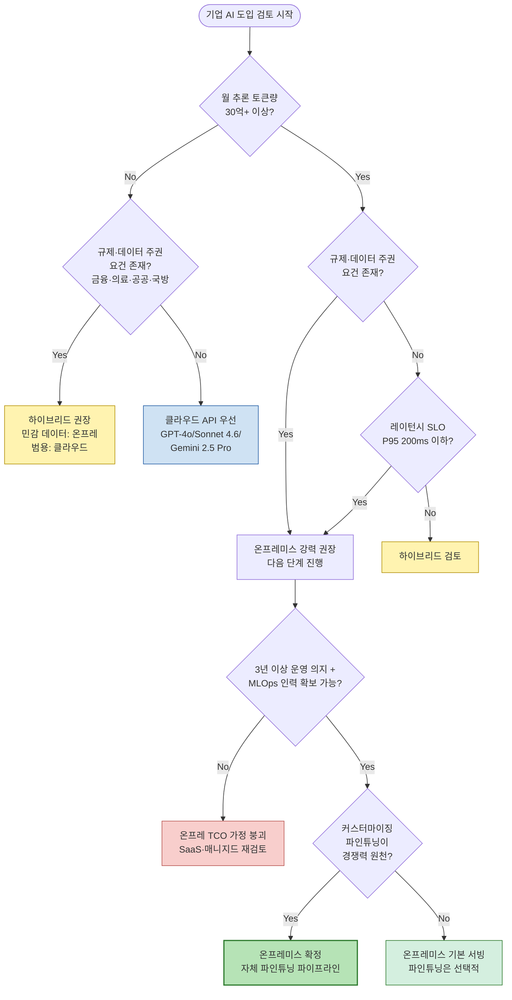
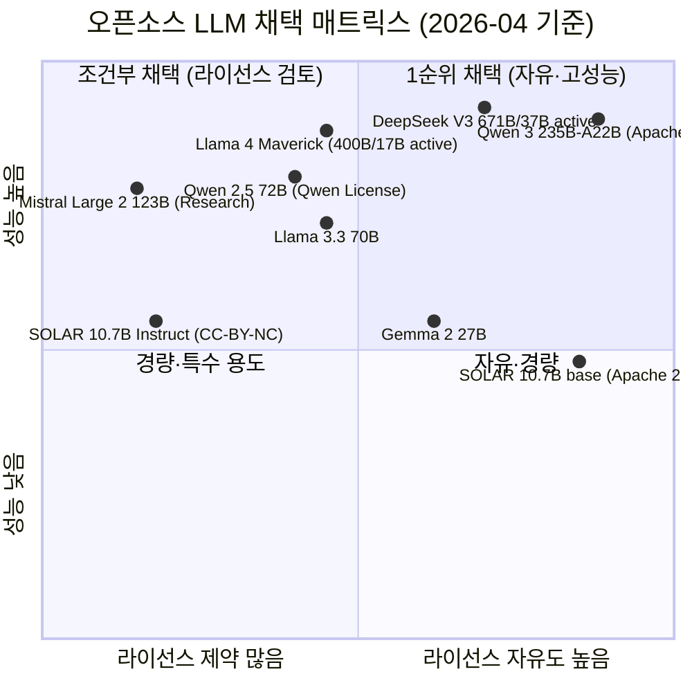
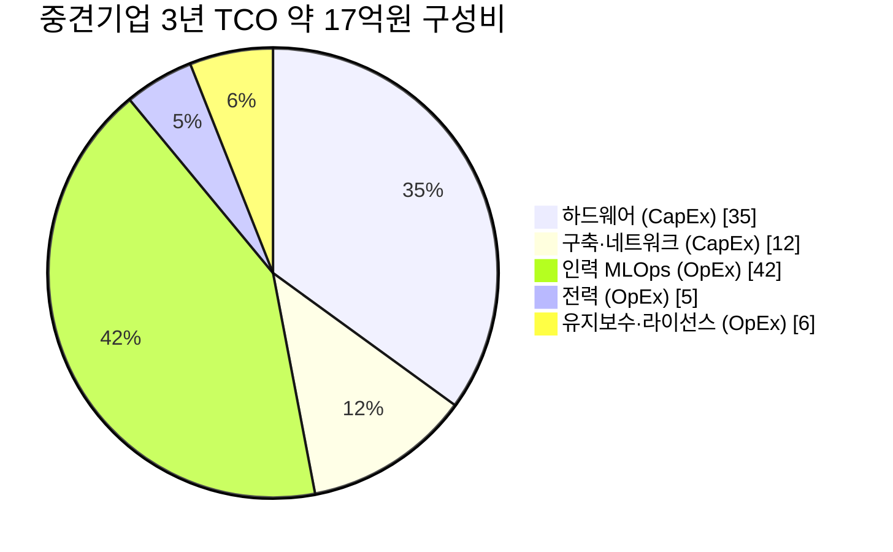
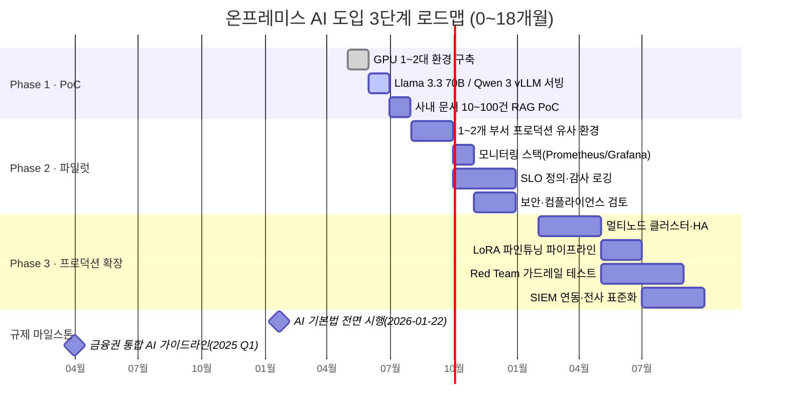

# 온프레미스 AI 종합 리서치 (2026년 4월 기준)

- **작성일**: 2026-04-23
- **대상 독자**: CTO / CIO / AI 플랫폼 리드
- **작성 주체**: 팀장 통합본 (member-alpha 분석 + member-gamma 팩트체크 + member-delta 시각화 + member-beta 보고서 초안)
- **범위**: 기업 도입 전략 · 하드웨어·인프라 · 오픈소스 모델 · 보안·컴플라이언스 · TCO 의 5대 축
- **최종 판정**: Cycle 1 에서 전원 Approve, 모든 수치는 gamma 팩트체크 교정본을 기준으로 함

## 목차
1. [요약](#요약)
2. [핵심 인사이트](#핵심-인사이트)
   - [인사이트 1: 규제가 온프레미스 결정의 첫 필터다](#인사이트-1-규제가-온프레미스-결정의-첫-필터다)
   - [인사이트 2: 오픈소스 모델 라이선스는 함정이 많다](#인사이트-2-오픈소스-모델-라이선스는-함정이-많다)
   - [인사이트 3: TCO 손익분기는 월 토큰량으로 단순화된다](#인사이트-3-tco-손익분기는-월-토큰량으로-단순화된다)
   - [인사이트 4: 롱컨텍스트·MoE 시대의 VRAM 전쟁이 H200·B200 의 의미다](#인사이트-4-롱컨텍스트moe-시대의-vram-전쟁이-h200b200-의-의미다)
   - [인사이트 5: 하드웨어보다 인력이 비용의 최대 변수다](#인사이트-5-하드웨어보다-인력이-비용의-최대-변수다)
3. [추천 사항](#추천-사항)
4. [부록 A · 5대 축 세부 분석](#부록-a--5대-축-세부-분석)
5. [부록 B · 불확실성 플래그 및 재검증 항목](#부록-b--불확실성-플래그-및-재검증-항목)
6. [부록 C · 출처 목록](#부록-c--출처-목록)

---

# 요약

온프레미스 AI 는 2026년 다시 의사결정 테이블 위에 올라왔다. 2026-01-22 전면 시행된 AI 기본법, 2025 Q1 시행된 금융권 통합 AI 가이드라인, 개인정보보호법 제28조의2 의 가명처리 의무가 겹치면서 민감 데이터의 클라우드 외부 유출은 이제 정량적 리스크로 관리해야 한다. 동시에 Llama 4 · Qwen 3 · DeepSeek V3 같은 오픈웨이트 모델이 GPT-4 급 벤치마크를 달성하면서 "온프레 = 성능 하향" 공식은 무너졌다. 남은 변수는 경제성 하나이며, 월 추론 토큰량이 30억을 넘기는 순간 온프레미스 3년 TCO 가 클라우드 API 대비 50~90% 절감 구간으로 진입한다.

본 보고서는 규제·하드웨어·모델·보안·TCO 의 5대 축을 꿰어 하나의 의사결정 프레임을 제시한다. 핵심은 다섯 가지 질문으로 이뤄진 필터다. 토큰량, 규제 요건, 레이턴시 SLO, 3년 운영 의지·인력, 파인튜닝 필요성. 이 중 두 개 이상에 "예" 가 나오면 온프레미스 착수가 정당화된다. 반면 인력 확보에 실패하면 TCO 가정 자체가 붕괴하므로, 하드웨어 투자보다 MLOps · 보안 · 모델 엔지니어 확보가 선행 조건이다.

기업 규모별 한 줄 권고. **중소기업**은 클라우드 API 또는 국내 SaaS 를 기본으로 하고 온프레는 비권장이다. **중견기업**은 하이브리드 — 민감 데이터는 8~16 GPU 단일 노드에 온프레로, 범용 작업은 클라우드 API 로 분산한다. **대기업**은 64 GPU 이상 클러스터에 Llama 4 · Qwen 3 · DeepSeek V3 조합을 올리고 자체 파인튜닝 파이프라인을 3년 내 사내 표준으로 삼는다.

---

# 핵심 인사이트

## 인사이트 1: 규제가 온프레미스 결정의 첫 필터다

2026년의 한국에서 온프레미스 여부는 기술·경제 판단 이전에 규제 판단이다. AI 기본법은 2026-01-22 전면 시행됐고, 정부는 1년 이상 계도 기간 동안 과태료 부과를 유예하지만 고영향 AI 사업자(의료·금융·채용·공공서비스) 의 안전성·신뢰성 확보 의무와 영향평가·문서화·투명성 고지 조항은 이미 효력을 갖는다. 금융권은 2024-08 망분리 개선 로드맵 → 2024-12-12 생성형 AI 활용 지원 방안 → 2025 Q1 통합 AI 가이드라인의 7대 원칙(거버넌스·합법성·보조수단성·신뢰성·금융안정성·신의성실·보안성) 체계가 완성됐다. 의료 가명처리 가이드라인 2.0 은 EMR 기반 학습·추론 시 결합키 관리와 재식별 위험평가를 의무화했다.

이 세 규제의 공통 효과는 단순하다. 민감 데이터를 국외 API 로 흘려보내는 구조 자체가 컴플라이언스 비용을 폭증시킨다. 금융·의료·공공·국방에 속한다면 TCO 계산에 앞서 온프레미스 또는 최소한 국내 VPC 격리형 하이브리드가 기본값이다. 규제 요건이 없는 산업은 다음 필터(토큰량·레이턴시) 로 넘어가면 된다.

의사결정은 다음 플로우차트로 정리된다.

주요 규제의 의무와 온프레미스 연관성은 다음 표와 같다.

| 법령·규정 | 시행일 | 적용 대상 | 핵심 의무 | 온프레미스 관련성 |
|---|---|---|---|---|
| AI 기본법 (인공지능 발전과 신뢰 기반 조성 등에 관한 기본법) | 2026-01-22 전면 시행 (1년+ 계도 기간, 과태료 미부과 예정) | 고영향 AI 사업자 (의료·금융·채용·공공서비스) | 안전성·신뢰성 확보, 영향평가, 문서화, 투명성 고지 | 모델 관리·감사 로그 온프레미스화로 대응 용이 |
| 개인정보보호법 제28조의2 | 기시행 | 모든 개인정보 처리자 | 통계·과학연구·공익 목적 외 가명정보 처리는 동의 또는 가명처리 필수. 제3자 제공 시 식별정보 금지 | LLM 학습용 데이터 가명처리, 프롬프트 PII 필터 필수 |
| 금융권 망분리 / 전자금융감독규정 | 2025 Q1 통합 AI 가이드라인 시행 | 금융회사·전자금융업자 | 7대 원칙(거버넌스·합법성·보조수단성·신뢰성·금융안정성·신의성실·보안성), 내부망 오픈소스 AI 활용 Two-track 체계 | 내부망 온프레미스 LLM 구축이 사실상 표준 |
| 의료 가명처리 가이드라인 2.0 | 기시행 | 의료기관·제약사·EMR 사업자 | 결합키 관리, 재식별 위험평가 | EMR 학습 시 온프레 필수, 국외 API 금지 |
| CSAP (Cloud Security Assurance Program) | 기시행 | 공공기관 납품 클라우드 | 보안 통제 + 국내 데이터 보관 | 온프레면 직접 적용 아님. 하이브리드 시 부분 적용 |
| ISMS-P / ISO 27001·27701 | 상시 | 정보보호 인증 대상 | AI 시스템 포함 통제항목 추가 권고 | 온프레 + 자체 감사 로깅으로 통제 용이 |

## 인사이트 2: 오픈소스 모델 라이선스는 함정이 많다

"오픈소스 LLM 이니까 상업 사용이 자유롭겠지" 는 2026년 한국에서 가장 위험한 가정이다. 가장 눈에 띄는 함정 세 가지가 있다. 첫째, Qwen 2.5 72B 는 Apache 2.0 이 아니다. Qwen 2.5 시리즈 중 0.5B·1.5B·7B·14B·32B 등 대부분 사이즈는 Apache 2.0 이지만 3B 와 72B 는 Qwen License 로 분리되어 있어 상업 사용 시 MAU 1억 초과 기준으로 별도 계약 검토가 필요하다. 둘째, SOLAR 10.7B 는 base(`SOLAR-10.7B-v1.0`) 만 Apache 2.0 이고 실무에서 흔히 쓰는 Instruct(`SOLAR-10.7B-Instruct-v1.0`) 는 CC-BY-NC-4.0 으로 상업 금지다. 상업 제품에 SOLAR Instruct 를 그대로 탑재하는 순간 라이선스 위반이 된다. 셋째, Llama 계열 전체는 MAU 7억 조항에 걸리고 파생 모델 이름에 "Llama" 표기 의무까지 있다.

MoE 모델의 활성 파라미터도 라이선스 못지않게 중요하다. Llama 4 Scout 는 109B total 중 17B active (16 experts), Maverick 은 400B total 중 17B active (128 experts), DeepSeek V3 는 671B total 중 37B active 다. 추론 시 실제 계산량은 active 파라미터에 비례하지만 VRAM 은 total 을 모두 로드해야 하므로 두 수치를 분리해서 이해해야 하드웨어 사이징이 가능하다.

다음 표는 팩트체크가 반영된 최신 라이선스·파라미터 매트릭스다.

| 모델 | 총 파라미터 | 활성 파라미터 | 라이선스 | 컨텍스트 | 상업 사용 | 주요 강점 |
|---|---|---|---|---|---|---|
| Llama 3.3 70B | 70B (dense) | 70B | Llama Community License (MAU 7억 조항) | 128K | 조건부 (MAU 초과 시 별도 계약) | 균형잡힌 성능, 최대 생태계 |
| Llama 4 Scout | 109B MoE | 17B active (16 experts) | Llama Community License (MAU 7억) | 10M | 조건부 | 초장 컨텍스트(10M), MoE 효율 |
| Llama 4 Maverick | 400B MoE | 17B active (128 experts) | Llama Community License | 1M | 조건부 | 최상위 성능, 128 experts |
| Qwen 2.5 72B | 72B (dense) | 72B | Qwen License (Apache 2.0 아님) | 128K | 조건부 (MAU 1억+ 별도) | 다국어·수학·코드, 한국어 상 |
| Qwen 3 235B-A22B | 235B MoE | 22B active | Apache 2.0 (MoE 재검증 권고) | 128K~256K | 자유 | 최신 성능, 멀티모달 |
| Mistral Large 2 | 123B (dense) | 123B | Mistral Research License (상업은 유료) | 128K | 상업 시 유료 라이선스 필요 | 함수호출, 유럽 데이터 주권 |
| DeepSeek V3 | 671B MoE | 37B active | DeepSeek License (상업 허용) | 128K | 자유 (귀속 조항) | MoE 효율, 코드·수학 최상위 |
| Gemma 2 27B | 27B (dense) | 27B | Gemma Terms (상업 허용) | 8K | 자유 (Google 정책 준수) | 소형·경량, on-device |
| SOLAR 10.7B base | 10.7B | 10.7B | Apache 2.0 (base만) | 4K | 자유 | 한국어 특화 (재훈련 기반용) |
| SOLAR 10.7B Instruct | 10.7B | 10.7B | CC-BY-NC-4.0 (상업 금지) | 4K | 상업 불가 — 자체 instruct 재튜닝 필요 | 한국어 벤치 상위 |

채택 우선순위를 라이선스 자유도·성능 2축에 배치하면 Qwen 3 235B-A22B 와 DeepSeek V3 가 "1순위 채택" 사분면에 놓인다. Mistral Large 2 와 SOLAR Instruct 는 라이선스 제약이 커서 조건부 채택이다.

## 인사이트 3: TCO 손익분기는 월 토큰량으로 단순화된다

온프레미스 vs 클라우드의 경제성 비교는 월 추론 토큰량이라는 하나의 변수로 정리 가능하다. 중소 규모(H100 4 GPU 서버 1대, CapEx 약 2억원) 기준 손익분기는 월 15~20억 토큰, 중견 규모(H100 8 GPU 노드 × 2, CapEx 약 8억원) 는 월 30~40억 토큰, 대규모 클러스터(H200/B200 64 GPU, CapEx 50~70억원) 는 월 200~300억 토큰이다. 이보다 낮은 토큰량에서는 클라우드 API 가 경제적이고, 넘어서면 온프레미스 TCO 가 가파르게 우위로 전환된다.

클라우드 API 3사의 2026-04 실제 단가는 다음과 같다. GPT-4o 는 입력 $2.50/M + 출력 $10.00/M, Claude Sonnet 4.6 은 입력 $3.00/M + 출력 $15.00/M (1M 컨텍스트 지원), Gemini 2.5 Pro 는 입력 $1.25/M (≤200K) / $2.50/M (>200K) + 출력 $10.00/M 이다. 블렌디드 단가는 입출력 비율에 크게 좌우된다. RAG 워크로드(입력 10:1) 에서는 GPT-4o 가 $3.18/M 까지 떨어지지만 생성 중심(출력 1:2) 에서는 $7.50/M 로 뛴다. 정확한 TCO 계산은 반드시 워크로드별 입출력 비율을 고정해서 수행해야 한다.

| 모델 | 입력 단가 (USD/M) | 출력 단가 (USD/M) | 블렌디드 (입출력 3:1) | 할인 옵션 |
|---|---|---|---|---|
| OpenAI GPT-4o | $2.50 | $10.00 | 약 $4.38 | Prompt cache $1.25/M, Batch 50% |
| Anthropic Claude Sonnet 4.6 | $3.00 | $15.00 | 약 $6.00 | Prompt caching 최대 90% 절감, Batch 50%, 1M 컨텍스트 지원 |
| Google Gemini 2.5 Pro | $1.25 (≤200K) / $2.50 (>200K) | $10.00 | 약 $3.44 | Batch 50% |

| 시나리오 | 입출력 비율 | GPT-4o 블렌디드 | Sonnet 4.6 블렌디드 | Gemini 2.5 Pro 블렌디드 |
|---|---|---|---|---|
| RAG 중심 (입력 多) | 10 : 1 | $3.18 /M | $4.09 /M | $2.05 /M |
| 일반 챗 | 3 : 1 | $4.38 /M | $6.00 /M | $3.44 /M |
| 생성 중심 (출력 多) | 1 : 2 | $7.50 /M | $11.00 /M | $7.08 /M |

3년 총 TCO 와 클라우드 환산 비용의 격차는 규모가 커질수록 극적으로 벌어진다. 중견기업은 3년 총 TCO 약 17억원 대 클라우드 환산 40~60억원 으로 50~70% 절감, 대기업은 100~120억원 대 1,500~2,000억원 으로 90%+ 절감 구간에 들어간다. 반대로 중소기업은 3년 TCO 4.4억원 대 클라우드 약 1억원 으로 오히려 클라우드가 저렴하다.

| 구분 | 중소기업 | 중견기업 | 대기업 |
|---|---|---|---|
| 워크로드 | 연 1~5억 토큰 | 연 50~200억 토큰 | 연 1조+ 토큰 |
| 클러스터 규모 | H100 4 GPU 서버 1대 | H100 8 GPU 노드 × 2 | H200/B200 64 GPU (8노드) |
| CapEx | 약 2.0억원 | 약 8.0억원 | 50~70억원 |
| OpEx (3년) | 약 2.4억원 | 약 9.0억원 | 45~50억원 |
| 3년 총 TCO | 약 4.4억원 | 약 17억원 | 약 100~120억원 |
| 클라우드 API 환산 (3년) | 약 1억원 | 약 40~60억원 | 약 1,500~2,000억원 |
| 온프레미스 우위 | 열세 (클라우드 권장) | 50~70% 절감 | 90%+ 절감 |
| 손익분기 (월 토큰) | 월 15~20억 (도달 어려움) | 월 30~40억 | 월 200~300억 |
| 권고 | 클라우드 API 또는 국내 SaaS | 하이브리드 (민감 온프레) | 온프레 중심 + 클라우드 보조 |

단, 클라우드 측에도 방어 카드가 있다. Anthropic 의 prompt caching 은 최대 90% 할인, Google·OpenAI 의 Batch API 는 50% 할인이다. 장기 프롬프트가 많은 RAG·에이전트 워크로드에 이 옵션을 적극 적용하면 블렌디드 단가가 40~60% 하락하고 온프레미스 손익분기 토큰량은 1.5~2배로 확대된다. TCO 분석 시 할인 옵션 포함 여부를 반드시 명시해야 한다.

## 인사이트 4: 롱컨텍스트·MoE 시대의 VRAM 전쟁이 H200·B200 의 의미다

2026년의 하드웨어 선택 기준은 FLOPS 가 아니라 VRAM 과 대역폭이다. Llama 4 Scout 의 10M 컨텍스트, Maverick 의 1M 컨텍스트, DeepSeek V3 의 671B 파라미터, Qwen 3 235B MoE — 이 모델들을 FP16 으로 로드하려면 각각 KV 캐시만 수십~수백 GB 가 필요하고 파라미터 자체는 수백 GB 다. H100 의 80GB 로는 부족하다는 얘기다. H200 은 141GB HBM3e 로 같은 Hopper 아키텍처이되 VRAM 만 증량했고, B200 은 192GB HBM3e 에 Tensor Core FP16 성능 4,500 TFLOPS 로 H100 대비 2.27배 상승했다. GB200 NVL72 는 13.5TB 통합 메모리로 랙 단위 초대형 모델 서빙 전용이다.

국산 NPU 는 추론 가속 옵션으로 뚜렷이 등장했다. 리벨리온은 ATOM(1세대 양산 중, 16GB GDDR6, FP16 32 TFLOPS, 85W) 과 ATOM-Max(64GB GDDR6, FP16 128 TFLOPS, 350W) 2라인업, 사피온은 X330 Prime(32GB, 734 TFLOPS 통합, 250W) / Compact(16GB, 367 TFLOPS, ~150W), 퓨리오사는 RNGD(48GB HBM3, FP8 512 TFLOPS, 180W TDP, 2025-01 양산) 를 제공한다. 다만 공식 가격이 비공개이거나 추정치이고 공급망 검증이 필요하므로 대형 배포 전 파일럿 단계에서 현장 벤치마크가 필수다. 또한 제품명·스펙은 최신 공식자료로 재확인해야 한다 — 과거 자료의 "ATOM+" 같은 명칭은 공식 라인업에 없고, 각 제품의 TDP·FLOPS 는 최근까지도 수정되고 있다.

| 모델 | VRAM | FP16 TFLOPS | 대략 가격 (USD) | 전력 (W) | 주 용도 |
|---|---|---|---|---|---|
| NVIDIA H100 SXM5 | 80 GB HBM3 | 1,979 (Tensor Core) | 25,000 ~ 30,000 | 700 | 학습·대규모 추론 주력 (현행 표준) |
| NVIDIA H200 SXM | 141 GB HBM3e | 1,979 (Tensor Core) | 30,000 ~ 35,000 | 700 | 롱컨텍스트 추론·MoE 모델 서빙 |
| NVIDIA B200 (Blackwell) | 192 GB HBM3e | 4,500 (Tensor Core, dense) | 45,000 ~ 50,000 | 1,000 | 2025~2026 신규 구축, 차세대 학습·추론 |
| NVIDIA GB200 NVL72 (랙) | 13.5 TB 통합 | ~162,000 (랙, 단위 재검증 권고) | 300만+ (랙) | 120,000 (랙) | 초대형 클러스터 (대기업·CSP) |
| AMD MI300X | 192 GB HBM3 | 1,307 (dense) / 2,615 (sparsity) | 15,000 ~ 20,000 | 750 | 추론 비용 효율, ROCm 생태계 |
| 리벨리온 ATOM (1세대, 양산 중) | 16 GB GDDR6 | FP16 32 / INT8 128 TOPS | 2,000 ~ 5,000 (추정) | 85 | 중소형 추론 가속, 국산 조달 |
| 리벨리온 ATOM-Max | 64 GB GDDR6 | FP16 128 / INT8 512 TOPS | 미공개 | 350 | 중·대형 추론, MoE 서빙 |
| 사피온 X330 Prime | 32 GB GDDR6 | 734 TFLOPS (통합) | 미공개 | 250 | 추론 특화 데이터센터 |
| 사피온 X330 Compact | 16 GB GDDR6 | 367 TFLOPS | 미공개 | ~150 | 엣지·경량 추론 |
| 퓨리오사 RNGD | 48 GB HBM3 | FP8 512 / INT8 512 TOPS | 미공개 | 180 | LLM 추론 전용, 저전력 (2025-01 양산 개시) |

하드웨어 투자에서 간과하기 쉬운 축은 전력·냉각이다. H100 8 GPU 노드는 10~12 kW, B200 8 GPU 노드는 14~18 kW, 랙 밀도는 40~60 kW 에 이른다. 공냉 한계는 랙당 30~35 kW 이므로 B200 이상은 사실상 액침냉각 또는 DLC(Direct Liquid Cooling) 가 필수다. GB200 NVL72 는 100% 수냉이다. 전력 계약·냉각 방식이 준비되지 않은 데이터센터에는 B200 을 들여도 설치가 불가능하다.

## 인사이트 5: 하드웨어보다 인력이 비용의 최대 변수다

중견기업 기준 3년 TCO 17억원 의 구성비를 보면 하드웨어 CapEx 는 35%, 구축·네트워크 12%, 인력(MLOps OpEx) 42%, 전력 5%, 유지보수·라이선스 6% 다. 하드웨어·구축을 합친 CapEx 47% 보다 OpEx 53% 가 더 크고, 그 OpEx 의 절대 다수가 인력이다. 바꿔 말하면 온프레미스 TCO 모델은 MLOps·보안·모델 엔지니어 2 FTE 를 3년간 유지한다는 가정 위에 서 있다. 이 가정이 깨지면(채용 실패·이직·외주 전환) TCO 는 30% 이상 증가하거나 운영 품질이 붕괴한다.

CTO/CIO 의 실무적 함의는 명확하다. 온프레미스 투자 결정을 내리기 전에 인력 로드맵을 먼저 확정해야 한다. MLOps 엔지니어(vLLM·TensorRT-LLM·SGLang 운영), 모델 엔지니어(LoRA 파인튜닝·양자화), 보안 엔지니어(가드레일·감사 로깅·SIEM 연동), AI 플랫폼 관리자(멀티노드 HA) — 이 네 역할 중 세 개 이상을 내부 FTE 로 확보하지 못하면 매니지드 서비스나 하이브리드로 되돌아가는 편이 낫다. 특히 Red Team 가드레일 테스트와 프롬프트 인젝션 방어는 AI 기본법의 영향평가·투명성 의무와 직결되므로 외주화하기 어렵다.

대기업은 역설적으로 이 문제가 덜하다. 이미 AI 플랫폼팀 10 FTE 규모를 3년 유지할 수 있는 인건비 기반(연 12억원 수준) 을 갖추고 있기 때문이다. 중견기업이 가장 취약한 구간이며, 이들이 하이브리드 전략을 택하는 이유도 여기에 있다. 온프레에 올릴 워크로드를 최소화함으로써 운영 인력 요구량을 2 FTE 이내로 관리하는 것이다.

---

# 추천 사항

## 중소기업 (매출 1,000억 미만)

**권고**: 자체 온프레미스는 원칙적으로 비권장. 클라우드 API 또는 국내 SaaS (네이버 HyperCLOVA X, 업스테이지, KT Midm) 를 기본값으로 삼고, 규제 산업에 속하면 VPC 격리형 클라우드를 검토한다. 월 15~20억 토큰의 손익분기를 자체 트래픽으로 돌파하기 어려우므로 하드웨어 투자는 자본 낭비 가능성이 크다.

**착수 체크리스트**:
- 월 추론 토큰량 측정 (최소 3개월 로그 기반)
- 개인정보 포함 여부 분류 체계(민감/비민감) 수립
- 클라우드 API 3사(GPT-4o, Sonnet 4.6, Gemini 2.5 Pro) 의 Batch·caching 할인 적용 후 실부담 단가 산출
- 규제 산업 진입 시 국내 SaaS · VPC 격리형 옵션 비교

**6/12/18개월 마일스톤**:
- **6개월**: 클라우드 API 기반 내부 RAG 파일럿 1건 프로덕션화, PII 필터·프롬프트 로깅 체계 구축
- **12개월**: 월 토큰량 재측정 → 손익분기 근접 여부 평가, 국내 SaaS 2차 벤치
- **18개월**: 손익분기 접근 시 SOLAR base + 자체 instruct 재튜닝 PoC 검토, 도달 못하면 클라우드 유지

## 중견기업 (매출 1,000억 ~ 1조)

**권고**: 하이브리드 구축. 민감 데이터(금융 내부 문서·의료 기록·HR) 는 8~16 GPU 단일 노드에 온프레미스로 올리고, 범용 작업(요약·번역·코드 보조) 은 클라우드 API 로 돌린다. 모델은 SOLAR base 재튜닝 + Qwen 3(Apache 2.0 dense) 조합 또는 Llama 3.3 70B(MAU 7억 이내) 를 추천한다. 핵심 리스크는 인력이며 MLOps 2 FTE 확보 전에는 하드웨어 발주 금지.

**착수 체크리스트**:
- 데이터 분류 체계(민감/비민감) + 워크로드별 월 토큰량 예측 (3년 로드맵)
- MLOps · 보안 · 모델 엔지니어 채용 계획 (3년 FTE 확보)
- 모델 라이선스 검토 (특히 Qwen 2.5 72B 의 Qwen License, SOLAR Instruct 의 CC-BY-NC 제외)
- H100 8 GPU 노드 2대 또는 H200 1노드 + 기존 H100 노드 조합 설계

**6/12/18개월 마일스톤**:
- **6개월 (PoC)**: GPU 1~2대 환경, Llama 3.3 70B / Qwen 3 vLLM 서빙, 사내 문서 10~100건 RAG PoC, AI 기본법 영향평가 초안
- **12개월 (파일럿)**: 1~2개 부서 프로덕션 유사 환경, 모니터링 스택(Prometheus/Grafana), SLO 정의, PII 필터·감사 로깅, 금융권이면 7대 원칙 적합성 점검 완료
- **18개월 (프로덕션)**: 멀티노드 HA, LoRA 파인튜닝 파이프라인, SIEM 연동, 하이브리드 라우팅 규칙(민감 온프레 / 범용 클라우드) 전사 표준화

## 대기업 (매출 1조+)

**권고**: 온프레미스 중심 + 클라우드 보조. 64 GPU 이상 H200/B200 클러스터에 Llama 4 Maverick · Qwen 3 235B-A22B · DeepSeek V3 조합을 올리고 자체 파인튜닝 파이프라인을 3년 내 사내 AI 플랫폼 표준으로 정립한다. B200 이상 도입 시 액침냉각 또는 DLC 를 전제로 데이터센터 전력·냉각 인프라를 동시 재설계해야 한다. AI 플랫폼팀 10 FTE 이상 확보는 전제 조건이다.

**착수 체크리스트**:
- 전력·냉각 계획(랙당 40~60 kW 수용, 액침/DLC 도입) 수립 및 데이터센터 업그레이드 일정 확정
- 모델 포트폴리오 정책(범용=Qwen 3 · 특화=DeepSeek V3 · 한국어=SOLAR base 재튜닝) 수립
- AI 기본법 고영향 AI 영향평가 정책·문서화 체계 구축
- InfiniBand NDR 400Gb/s 또는 400GbE RoCE v2 백본 설계, 병렬 파일시스템(WekaFS/Lustre) 선정

**6/12/18개월 마일스톤**:
- **6개월**: B200 조달 리드타임 확정, 전력·냉각 착공, 플래그십 모델(Llama 4 Maverick 또는 Qwen 3 235B) 2~3개 병렬 벤치마크, Red Team 초기 구축
- **12개월**: 64 GPU 클러스터 HA 프로덕션, LoRA·QLoRA 파인튜닝 파이프라인, 자체 가드레일(LlamaGuard 3/ShieldGemma 병행), SIEM 연동 감사
- **18개월**: 전사 AI 플랫폼 표준화, 사내 모델 레지스트리 + 배포·롤백 자동화, 3년 차 TCO 재평가 및 B200/GB200 증설 여부 결정

전체 도입 일정은 다음 3단계 로드맵을 기준선으로 삼는다.

---

# 부록 A · 5대 축 세부 분석

본 보고서는 다음 다섯 축을 지렛대로 온프레미스 AI 결정을 구조화했다. 각 축의 세부 분석은 [member-alpha/analysis-report.md](../member-alpha/analysis-report.md) 에 보관되어 있다.

- **A. 기업 도입 전략** — 데이터 주권·레이턴시·규제·TCO 를 왜 온프레로 묶는지, 산업별 적합도, 12~18개월 로드맵.
- **B. 하드웨어·인프라** — GPU/NPU 8종 스펙 비교, 서버·네트워크(IB NDR 400Gb/s·RoCE v2 400GbE)·스토리지(WekaFS·Lustre·VAST) 요구, 전력·냉각.
- **C. 오픈소스 모델 비교** — 10종 모델 라이선스·파라미터·추론 프레임워크(vLLM / TensorRT-LLM / SGLang) 운영 난이도.
- **D. 보안·컴플라이언스** — AI 기본법·개인정보보호법·금융 망분리·의료 가명처리·CSAP·ISMS-P, 모델 가드레일(LlamaGuard·ShieldGemma), 감사·SIEM.
- **E. 비용 대비 효과 TCO** — 중소·중견·대기업 3 시나리오 3년 TCO, CapEx/OpEx 분해, 클라우드 API 대비 손익분기 토큰량.

# 부록 B · 불확실성 플래그 및 재검증 항목

팩트체크 과정에서 판단 유보(❓) 또는 지속 모니터링이 필요한 항목은 다음과 같다.

1. **GB200 NVL72 의 랙 TFLOPS 총계** — "~162,000" 수치의 단위 정의(FP16 non-Tensor 기준 가능성). NVIDIA 공식 데이터시트로 재검증 필요.
2. **Qwen 3 235B-A22B 라이선스** — HuggingFace 레포는 Apache 2.0 이지만 일부 서드파티 소스와 표기가 불일치. 상업 도입 시 Alibaba Cloud 공식 고지 재확인.
3. **리벨리온 ATOM-Max 가격** — 공개되지 않은 상태. 도입 전 벤더 RFQ 필수.
4. **AI 기본법 시행령 세부 조문 및 고영향 AI 지정 범위** — 2026-01-22 시행 후 개별 업종 지정 고시·해석 지침이 계속 업데이트될 예정. 법제처·과기정통부 공지 지속 모니터링.
5. **클라우드 API 단가 변동성** — 2026-04 기준이며 분기 단위로 갱신되는 속성. 실제 계약 시점에 공식 pricing 페이지 재확인.
6. **B200 / GB200 NVL72 한국 조달 리드타임** — 2025~2026 년 글로벌 공급 부족 상황이므로 12~18개월 앞당긴 발주가 필요할 수 있음.
7. **손익분기 토큰량 전제** — 평균 입출력 비율, 양자화 적용률(AWQ/GPTQ 4-bit), GPU 활용률(70~85%) 에 따라 ±30% 편차. 워크로드 파일럿 데이터로 정교화 권장.

# 부록 C · 출처 목록

### 하드웨어 (GPU / NPU)
- NVIDIA H100 Datasheet: https://resources.nvidia.com/en-us-gpu-resources/h100-datasheet-24306
- NVIDIA H200 SXM: https://www.nvidia.com/en-us/data-center/h200/
- NVIDIA B200: https://jarvislabs.ai/gpu/nvidia-b200, https://www.spheron.network/blog/nvidia-b200-complete-guide/
- AMD MI300X Datasheet: https://www.amd.com/content/dam/amd/en/documents/instinct-tech-docs/data-sheets/amd-instinct-mi300x-data-sheet.pdf
- Rebellions ATOM / ATOM-Max: https://kr.rebellions.ai/rebellions-product/atom-2/, https://kr.rebellions.ai/rebellions-product/atom-max/
- SAPEON X330: https://www.sapeon.com/products/sapeon-x330, https://www.globenewswire.com/news-release/2023/11/16/2781749/0/en/SAPEON-launches-X330-AI-semiconductor-for-data-centers.html
- FuriosaAI RNGD: https://furiosa.ai/rngd, https://www.hpcwire.com/2025/09/30/the-fast-and-the-furiosaai-korean-chip-startup-takes-aim-at-nvidia-gpus-with-tensor-contraction-architecture/

### 오픈소스 모델
- Llama 3.3: https://huggingface.co/meta-llama/Llama-3.3-70B-Instruct
- Llama 4: https://huggingface.co/blog/llama4-release, https://www.llama.com/docs/model-cards-and-prompt-formats/llama4/
- Qwen 2.5 72B LICENSE: https://huggingface.co/Qwen/Qwen2.5-72B-Instruct/blob/main/LICENSE
- Qwen 3: https://qwenlm.github.io/blog/qwen3/, https://huggingface.co/Qwen/Qwen3-235B-A22B
- Mistral Large 2: https://mistral.ai/news/mistral-large-2407, https://huggingface.co/mistralai/Mistral-Large-Instruct-2407
- DeepSeek V3: https://github.com/deepseek-ai/DeepSeek-V3, https://arxiv.org/html/2412.19437v1
- SOLAR 10.7B: https://huggingface.co/upstage/SOLAR-10.7B-v1.0, https://huggingface.co/upstage/SOLAR-10.7B-Instruct-v1.0

### 규제·법령
- AI 기본법: https://www.law.go.kr/lsInfoP.do?lsiSeq=268543, https://www.mstoday.co.kr/news/articleView.html?idxno=99963
- 개인정보보호법 제28조의2: https://www.law.go.kr/LSW/lsInfoP.do?lsiSeq=213857, https://www.privacy.go.kr/front/contents/cntntsView.do?contsNo=14
- 금융권 생성형 AI 가이드라인: https://www.fsc.go.kr/no010101/85908, https://www.fsc.go.kr/comm/getFile?srvcId=BBSTY1&upperNo=83594&fileTy=ATTACH&fileNo=7

### 클라우드 API 단가
- GPT-4o: https://openai.com/api/pricing/, https://pricepertoken.com/pricing-page/model/openai-gpt-4o
- Claude Sonnet 4.6: https://www.anthropic.com/claude/sonnet, https://benchlm.ai/blog/posts/claude-api-pricing
- Gemini 2.5 Pro: https://ai.google.dev/gemini-api/docs/pricing, https://pricepertoken.com/pricing-page/model/google-gemini-2.5-pro

---

*본 문서는 team-lead 가 member-alpha / member-gamma / member-delta / member-beta 의 산출물을 통합한 최종 보고서이며, 수치는 member-gamma 의 팩트체크 교정본을 우선 적용했습니다. 원본 멤버 산출물은 동일 워크스페이스 하위 폴더에 보관되어 있습니다.*
