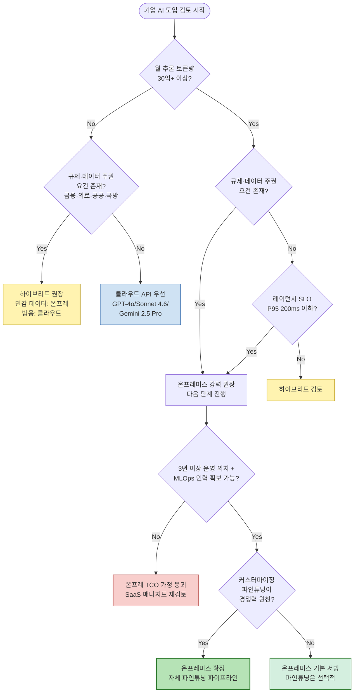
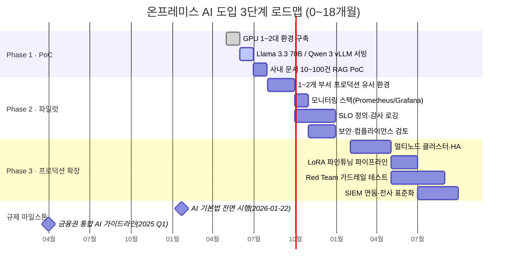
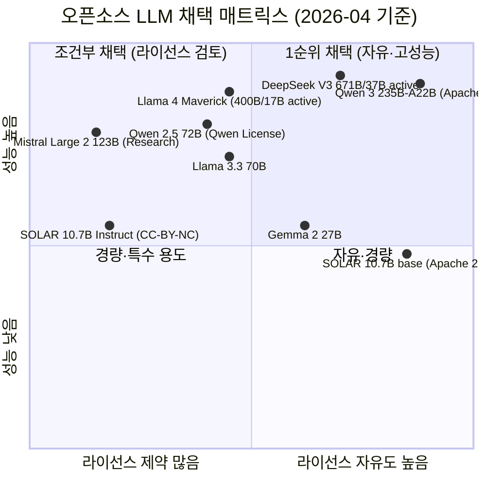
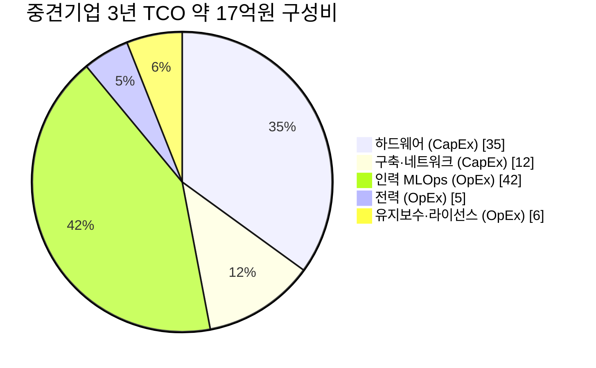

Creator: member-delta
Created: 2026-04-23
Version: 1.0

# 시각자료 개요

본 문서는 온프레미스 AI 리서치 보고서의 이해를 돕기 위해 제작된 시각자료 모음이다. **모든 수치는 member-gamma 팩트체크 로그의 수정 권고를 반영**하였다(H100/H200 FP16 Tensor 1,979 TFLOPS, B200 FP16 Tensor 4,500 TFLOPS, Qwen 2.5 72B → Qwen License, SOLAR Instruct → CC-BY-NC-4.0, 리벨리온 ATOM/ATOM-Max 분리, 사피온 X330 Prime 734 TFLOPS/250W, 퓨리오사 RNGD 180W, Llama 4 활성 파라미터 17B 명시, 클라우드 API 입·출력 분리 단가).

| # | 시각자료 | 유형 | 목적 |
|---|---|---|---|
| 1 | 온프레미스 AI 도입 의사결정 플로우차트 | Mermaid flowchart | 기업이 5가지 질문을 통해 온프레미스/하이브리드/클라우드를 선택하도록 유도 |
| 2 | 3단계 도입 로드맵 (PoC·파일럿·프로덕션) | Mermaid gantt | 0~18개월 일정·마일스톤 시각화 |
| 3 | 오픈소스 모델 맵 (라이선스 vs 성능) | Mermaid quadrantChart | 8개 모델을 라이선스 자유도·성능 축에 배치해 채택 우선순위 비교 |
| 4 | 기업 규모별 TCO 구성 비교 | Mermaid pie (보조) | 중견기업 CapEx/OpEx 구성비 시각화 |
| 5 | 하드웨어 옵션 비교표 | Markdown 표 | GPU·NPU 스펙·가격·용도 비교 (수정된 TFLOPS 반영) |
| 6 | TCO 시나리오 비교표 | Markdown 표 | 중소/중견/대기업 3년 TCO 및 클라우드 대비 절감률 |
| 7 | 오픈소스 모델 라이선스·파라미터 비교표 | Markdown 표 | 8개 모델의 라이선스·파라미터·컨텍스트 (수정된 라이선스 반영) |
| 8 | 한국 규제 요약표 | Markdown 표 | AI 기본법·개인정보보호법·금융권 망분리 등 핵심 의무 요약 |
| 9 | 클라우드 API 단가 vs 온프레미스 손익분기 | Markdown 표 | 규모별 월 토큰량 손익분기 + API 3사 입·출력 단가 |

---

# Mermaid 다이어그램

## 1. 온프레미스 AI 도입 의사결정 플로우차트

## 2. 3단계 도입 로드맵 (Gantt)

## 3. 오픈소스 모델 맵 (라이선스 자유도 vs 성능)

## 4. 중견기업 TCO 구성비 (보조 시각화)

---

# 핵심 수치 테이블

## 1. 하드웨어 옵션 비교표 (2026-04, gamma 수정 반영)

> **주석**: FP16 TFLOPS 는 NVIDIA GPU 의 경우 **Tensor Core · sparsity 미포함** 값. 989 TFLOPS 는 non-Tensor vector 값이므로 제외. 국산 NPU 는 벤더 공식자료 기준, 가격은 비공개 또는 추정.

| 모델 | VRAM | FP16 TFLOPS | 대략 가격 (USD) | 전력 (W) | 주 용도 |
|---|---|---|---|---|---|
| NVIDIA H100 SXM5 | 80 GB HBM3 | **1,979** (Tensor Core) | 25,000 ~ 30,000 | 700 | 학습·대규모 추론 주력 (현행 표준) |
| NVIDIA H200 SXM | 141 GB HBM3e | **1,979** (Tensor Core) | 30,000 ~ 35,000 | 700 | 롱컨텍스트 추론·MoE 모델 서빙 |
| NVIDIA B200 (Blackwell) | 192 GB HBM3e | **4,500** (Tensor Core, dense) | 45,000 ~ 50,000 | 1,000 | 2025~2026 신규 구축, 차세대 학습·추론 |
| NVIDIA GB200 NVL72 (랙) | 13.5 TB 통합 | ~162,000 (랙, 단위 재검증 권고) | 300만+ (랙) | 120,000 (랙) | 초대형 클러스터 (대기업·CSP) |
| AMD MI300X | 192 GB HBM3 | 1,307 (dense) / 2,615 (sparsity) | 15,000 ~ 20,000 | 750 | 추론 비용 효율, ROCm 생태계 |
| 리벨리온 **ATOM** (1세대, 양산 중) | 16 GB GDDR6 | FP16 32 / INT8 128 TOPS | 2,000 ~ 5,000 (추정) | **85** | 중소형 추론 가속, 국산 조달 |
| 리벨리온 **ATOM-Max** | 64 GB GDDR6 | FP16 128 / INT8 512 TOPS | 미공개 | **350** | 중·대형 추론, MoE 서빙 |
| 사피온 X330 **Prime** | 32 GB GDDR6 | **734 TFLOPS** (통합) | 미공개 | **250** | 추론 특화 데이터센터 |
| 사피온 X330 Compact | 16 GB GDDR6 | 367 TFLOPS | 미공개 | ~150 | 엣지·경량 추론 |
| 퓨리오사 RNGD | 48 GB HBM3 | FP8 512 / INT8 512 TOPS | 미공개 | **180** | LLM 추론 전용, 저전력 (2025-01 양산 개시) |

## 2. TCO 시나리오 비교 (3년 총 TCO, 추정)

> 전제: 한국 산업용 전력 약 170원/kWh, FP8~FP16 양자화, 평균 GPU 이용률 60%, 입출력 비율 3:1. 클라우드 환산 단가는 표 9 의 **입·출력 분리 단가**를 기준으로 블렌디드 적용.

| 구분 | 중소기업 | 중견기업 | 대기업 |
|---|---|---|---|
| 워크로드 | 연 1~5억 토큰 | 연 50~200억 토큰 | 연 1조+ 토큰 |
| 클러스터 규모 | H100 4 GPU 서버 1대 | H100 8 GPU 노드 × 2 | H200/B200 64 GPU (8노드) |
| **CapEx** | 약 2.0억원 | 약 8.0억원 | 50~70억원 |
| **OpEx (3년)** | 약 2.4억원 | 약 9.0억원 | 45~50억원 |
| **3년 총 TCO** | **약 4.4억원** | **약 17억원** | **약 100~120억원** |
| 클라우드 API 환산 (3년) | 약 1억원 | 약 40~60억원 | 약 1,500~2,000억원 |
| **온프레미스 우위** | 열세 (클라우드 권장) | **50~70% 절감** | **90%+ 절감** |
| 손익분기 (월 토큰) | 월 15~20억 (도달 어려움) | 월 30~40억 | 월 200~300억 |
| 권고 | 클라우드 API 또는 국내 SaaS | 하이브리드 (민감 온프레) | 온프레 중심 + 클라우드 보조 |

## 3. 오픈소스 모델 라이선스·파라미터 비교 (gamma 수정 반영)

| 모델 | 총 파라미터 | 활성 파라미터 | 라이선스 | 컨텍스트 | 상업 사용 | 주요 강점 |
|---|---|---|---|---|---|---|
| **Llama 3.3 70B** | 70B (dense) | 70B | Llama Community License (MAU 7억 조항) | 128K | 조건부 (MAU 초과 시 별도 계약) | 균형잡힌 성능, 최대 생태계 |
| **Llama 4 Scout** | 109B MoE | **17B active (16 experts)** | Llama Community License (MAU 7억) | 10M | 조건부 | 초장 컨텍스트(10M), MoE 효율 |
| **Llama 4 Maverick** | 400B MoE | **17B active (128 experts)** | Llama Community License | 1M | 조건부 | 최상위 성능, 128 experts |
| **Qwen 2.5 72B** | 72B (dense) | 72B | **Qwen License** (Apache 2.0 아님) | 128K | 조건부 (MAU 1억+ 별도) | 다국어·수학·코드, 한국어 상 |
| **Qwen 3 235B-A22B** | 235B MoE | 22B active | Apache 2.0 (MoE 재검증 권고) | 128K~256K | 자유 | 최신 성능, 멀티모달 |
| **Mistral Large 2** | 123B (dense) | 123B | Mistral **Research License** (상업은 유료) | 128K | **상업 시 유료 라이선스 필요** | 함수호출, 유럽 데이터 주권 |
| **DeepSeek V3** | 671B MoE | 37B active | DeepSeek License (상업 허용) | 128K | 자유 (귀속 조항) | MoE 효율, 코드·수학 최상위 |
| **Gemma 2 27B** | 27B (dense) | 27B | Gemma Terms (상업 허용) | 8K | 자유 (Google 정책 준수) | 소형·경량, on-device |
| **SOLAR 10.7B base** | 10.7B | 10.7B | **Apache 2.0** (base만) | 4K | 자유 | 한국어 특화 (재훈련 기반용) |
| **SOLAR 10.7B Instruct** | 10.7B | 10.7B | **CC-BY-NC-4.0** (상업 금지) | 4K | **상업 불가** — 자체 instruct 재튜닝 필요 | 한국어 벤치 상위 |

## 4. 한국 규제 요약표 (2026-04 기준)

| 법령·규정 | 시행일 | 적용 대상 | 핵심 의무 | 온프레미스 관련성 |
|---|---|---|---|---|
| **AI 기본법** (인공지능 발전과 신뢰 기반 조성 등에 관한 기본법) | **2026-01-22 전면 시행** (1년+ 계도 기간, 과태료 미부과 예정) | 고영향 AI 사업자 (의료·금융·채용·공공서비스) | 안전성·신뢰성 확보, 영향평가, 문서화, 투명성 고지 | 모델 관리·감사 로그 온프레미스화로 대응 용이 |
| **개인정보보호법 제28조의2** | 기시행 | 모든 개인정보 처리자 | 통계·과학연구·공익 목적 외 가명정보 처리는 동의 또는 가명처리 필수. 제3자 제공 시 식별정보 금지 | LLM 학습용 데이터 가명처리, 프롬프트 PII 필터 필수 |
| **금융권 망분리 / 전자금융감독규정** | **2025 Q1 통합 AI 가이드라인 시행** | 금융회사·전자금융업자 | 7대 원칙(거버넌스·합법성·보조수단성·신뢰성·금융안정성·신의성실·보안성), 내부망 오픈소스 AI 활용 Two-track 체계 | 내부망 온프레미스 LLM 구축이 사실상 표준 |
| **의료 가명처리 가이드라인 2.0** | 기시행 | 의료기관·제약사·EMR 사업자 | 결합키 관리, 재식별 위험평가 | EMR 학습 시 온프레 필수, 국외 API 금지 |
| **CSAP** (Cloud Security Assurance Program) | 기시행 | 공공기관 납품 클라우드 | 보안 통제 + 국내 데이터 보관 | 온프레면 직접 적용 아님. 하이브리드 시 부분 적용 |
| **ISMS-P / ISO 27001·27701** | 상시 | 정보보호 인증 대상 | AI 시스템 포함 통제항목 추가 권고 | 온프레 + 자체 감사 로깅으로 통제 용이 |

## 5. 클라우드 API 단가 vs 온프레미스 손익분기 (2026-04 단가)

### 5-1. 클라우드 API 3사 단가표 (입·출력 분리, gamma 수정 반영)

| 모델 | 입력 단가 (USD/M) | 출력 단가 (USD/M) | 블렌디드 (입출력 3:1) | 할인 옵션 |
|---|---|---|---|---|
| **OpenAI GPT-4o** | **$2.50** | **$10.00** | 약 $4.38 | Prompt cache $1.25/M, Batch 50% |
| **Anthropic Claude Sonnet 4.6** | **$3.00** | **$15.00** | 약 $6.00 | Prompt caching 최대 90% 절감, Batch 50%, 1M 컨텍스트 지원 |
| **Google Gemini 2.5 Pro** | **$1.25** (≤200K) / $2.50 (>200K) | **$10.00** | 약 $3.44 | Batch 50% |

### 5-2. 기업 규모별 월 손익분기 토큰량

| 구분 | CapEx 기준 | 월 손익분기 | 연 환산 | 3년 환산 | 비고 |
|---|---|---|---|---|---|
| 중소 (H100 4GPU) | 약 2억원 | 월 **15~20억 토큰** | 약 180~240억 | 540~720억 | 일반 중소기업 워크로드로 도달 어려움 — 클라우드 권장 |
| 중견 (H100 8GPU × 2) | 약 8억원 | 월 **30~40억 토큰** | 약 360~480억 | 약 1.1~1.4조 | 하이브리드 + RAG 워크로드에서 도달 가능 |
| 대기업 (H200/B200 64GPU) | 50~70억원 | 월 **200~300억 토큰** | 약 2,400~3,600억 | 약 7.2~10.8조 | 연 1조 토큰+ 워크로드에서 90%+ 절감 |

### 5-3. 블렌디드 단가 시나리오별 손익분기 민감도 (참고)

| 시나리오 | 입출력 비율 | GPT-4o 블렌디드 | Sonnet 4.6 블렌디드 | Gemini 2.5 Pro 블렌디드 |
|---|---|---|---|---|
| RAG 중심 (입력 多) | 10 : 1 | $3.18 /M | $4.09 /M | $2.05 /M |
| 일반 챗 | 3 : 1 | $4.38 /M | $6.00 /M | $3.44 /M |
| 생성 중심 (출력 多) | 1 : 2 | $7.50 /M | $11.00 /M | $7.08 /M |

> **해석**: Prompt caching(Anthropic 최대 90% · Google 일부) · Batch API 50% 할인을 적극 활용하면 **클라우드 블렌디드 단가가 40~60% 하락**하여 온프레미스 손익분기 토큰량이 1.5~2배로 확대될 수 있음. TCO 분석 시 해당 할인 옵션 포함 여부 명시 필요.
