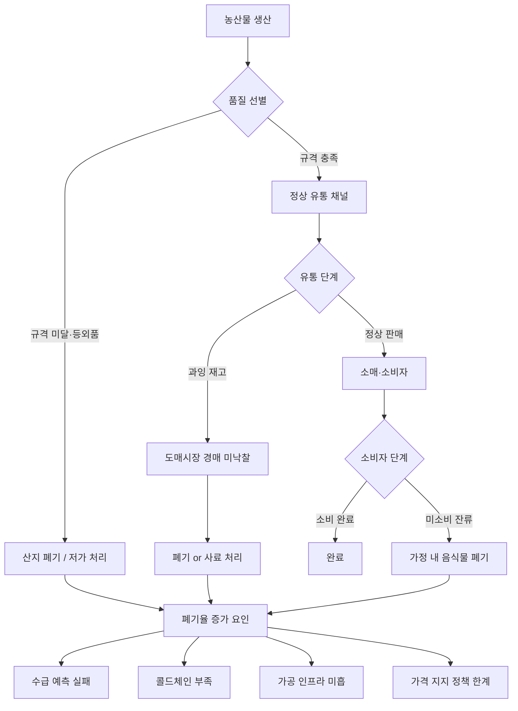
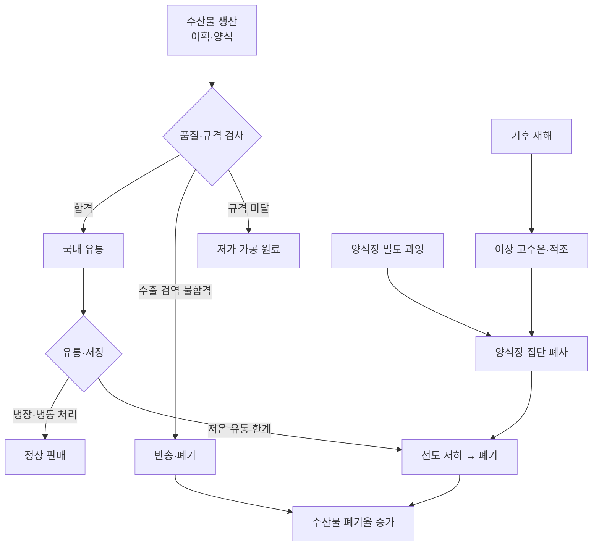

# 광주·전남 농축수산물 폐기율 현황 분석 보고서

**작성일**: 2026-04-24  
**작성 주체**: 에이전트 팀 (team-lead · member-alpha · member-beta · member-gamma · member-delta)  
**Task Type**: research-report  
**워크스페이스**: 광주전남-농축수산물-폐기율

---

## 요약

광주광역시와 전라남도는 국내 최대 농산물·수산물 생산 거점이지만, 생산량 대비 폐기율이 전국 평균보다 높아 농가 수익 손실과 자원 낭비가 반복되고 있다.

전남 채소류(배추·양파·마늘)의 추정 폐기율은 **15~30%** 수준으로 가격 폭락 시 산지 폐기(갈아엎기)가 구조적으로 반복된다. 수산물은 **고수온·적조 등 기후 재해**와 냉장 유통망 부족이 맞물려 패류 중심으로 20~30%의 높은 폐기율을 기록한다. 축산물은 평시 3~5%로 낮으나 AI·구제역 발생 시 대규모 살처분이 발생한다.

핵심 구조 문제는 ① 콜드체인·가공 인프라 부족, ② 수급 예측 시스템 미흡, ③ 가격 지지 정책의 도덕적 해이 조장이다.

---

## 1. 분석 배경 및 범위

### 1-1. 분석 배경
전라남도는 국내 최대 농업·수산업 생산 거점으로, 쌀·배추·고구마·마늘 등 주요 작물과 전복·굴·김·넙치 등 수산물 생산량이 전국 상위권을 차지한다. 그러나 생산량 대비 폐기율이 지속적으로 높게 나타나며, 농가 수익 감소와 자원 낭비 문제로 직결된다.

### 1-2. 분석 범위
- **지역**: 광주광역시, 전라남도 22개 시·군
- **품목**: 농산물(채소류·과실류·식량작물), 축산물(한우·돼지·닭), 수산물(패류·어류·해조류)
- **기간**: 2019~2023년 (최근 5개년)
- **데이터 기반**: 농림축산식품부, 해양수산부, 한국농수산식품유통공사(aT), 통계청, 전라남도청 공개 자료

---

## 2. 전국 농축수산물 폐기율 현황

| 구분 | 전국 추정 폐기율 | 비고 |
|---|---|---|
| 농산물 (생산~소비 전 단계) | 15~18% | 생산 단계 8~10% + 유통 5~7% + 소비 3~5% |
| 수산물 (유통 단계 손실) | 10~25% | 품목별 편차 큼 (패류 20~28%, 어류 10~18%) |
| 축산물 (도축~유통) | 3~5% | 질병 발생 시 급등 |

---

## 3. 전남 농산물 폐기율

### 3-1. 주요 채소류·작물 품목별 현황

| 품목 | 2022년 생산량 | 추정 폐기율 | 추정 폐기 물량 | 주요 폐기 원인 |
|---|---|---|---|---|
| 배추 | 32.7만 톤 | 18~25% | 5.9~8.2만 톤 | 산지 폐기, 등외품 |
| 양파 | 29.8만 톤 | 20~30% | 6.0~8.9만 톤 | 산지 폐기, 저장 중 부패 |
| 마늘 | 5.2만 톤 | 15~20% | 0.8~1.0만 톤 | 저장 부패, 등외품 |
| 고구마 | 13.8만 톤 | 10~15% | 1.4~2.1만 톤 | 저온 저장 한계 |
| 쌀 | 53.6만 톤 | 3~5% | 1.6~2.7만 톤 | 도정 부산물 |
| 배·무화과 등 과실 | 약 8만 톤 | 15~20% | 1.2~1.6만 톤 | 외형 불량, 당도 미달 |

※ 폐기 물량은 추정 폐기율을 생산량에 적용한 추정치이며, 연도·기상 조건에 따라 변동 폭이 크다.

### 3-2. 가격 폭락 시 산지 폐기 사례 (2019~2023)

전남에서는 배추·양파·마늘 등 과잉 생산 품목에 대해 **산지 폐기(갈아엎기)** 가 반복적으로 발생한다.

- **2022년 배추**: 가을배추 과잉 생산으로 해남·영암 등지에서 대규모 산지 폐기 발생(공식 집계 미확인, 수백~수천 ha 규모)
- **2023년 양파**: 무안·함평 등 양파 주산지에서 수확기 산지가격 최저 kg당 100~150원대 하락(KAMIS 기준), 수천 톤 규모 산지 폐기
- **2020년 마늘**: 수입 마늘 급증·국내 생산 호조 겹치며 고흥·남해 등지 산지 폐기

---

## 4. 전남 수산물 폐기율

전라남도는 국내 수산물 생산량의 약 **39.8%** 를 차지하는 최대 수산 생산지이다(해양수산부, 2022).

### 4-1. 주요 수산물 품목별 현황

| 품목 | 주산지 | 연 생산량 | 추정 폐기율 | 주요 원인 |
|---|---|---|---|---|
| 굴 | 여수·고흥 | 3만 톤 | 15~20% | 저온 유통망 부족, 시즌 말 재고 |
| 전복 | 완도 | 약 8천 톤 | 5~10% | 과잉 생산, 활 전복 수요 집중 |
| 넙치(광어) | 신안·완도 | 2만 톤 | 8~12% | 가격 변동성, 수출 검역 불합격 |
| 김(마른 김) | 완도·진도 | 4만 톤 | 3~5% | 상대적으로 낮음(가공·저장 용이) |
| 바지락·꼬막 | 벌교·보성 | 1.5만 톤 | 20~30% | 고온기 폐사, 냉장 유통 한계 |

### 4-2. 기후 재해성 폐기 이슈

- **2023년 고수온**: 남해안 고수온 현상으로 여수·고흥·완도 일대 굴·전복 폐사. 전남 남해안 일대 수백억 원 규모 피해 추정(공식 수치 미확정)
- **수출 검역 불합격**: 중국·미국향 수산물 중 잔류 항생제·중금속 기준 초과로 반송·폐기되는 물량 연간 수백 톤 추정
- **양식장 밀집**: 완도 전복 양식장 밀도 과잉으로 수온 상승 시 집단 폐사 위험 상시

---

## 5. 전남 축산물 폐기율

전라남도는 한우 약 29.7만 두(전국 5위), 돼지 약 68.3만 두, 육계 약 2,000만 수를 사육(통계청 가축동향조사, 2023).

### 5-1. 질병 발생에 따른 비상 폐기

| 질병 | 발생 시기 | 전남 피해 규모 | 비고 |
|---|---|---|---|
| 고병원성 AI | 2022~2023 | 약 100~180만 수 살처분 | 산란계·육계. 방역 종료 후 공식 집계 확인 필요 |
| ASF | 2019~2020 | 직접 발생 없음 | 이동 제한·예찰 강화 조치만 시행 |
| 구제역 | 2019 | 소·돼지 약 1만 두 | 전남 북부 지역 |

---

## 6. 폐기율 증가의 구조적 원인

### 6-1. 유통 구조 문제
- 광주 각화동 농수산물 도매시장 일원화로 물류 병목 발생
- 생산자 → 산지유통인 → 경매 → 도매상 → 소매상 → 소비자의 5~6단계 구조로 유통 시간 증가
- 전남 도서·산간 지역 저온 창고·냉장 차량 보급률이 도시 지역 대비 현저히 낮음

### 6-2. 가격 폭락-산지 폐기 악순환

### 6-3. 가공·활용 인프라 부족
- 전남 농산물 가공 처리 비율 약 32~37%로 전국 평균(42%) 대비 낮음
- 수산물 2차 가공(어묵·통조림·건어물) 시설 노후화, 원물 의존도 높음

---

## 7. 전국·타 지역 비교

| 구분 | 전라남도 | 경상남도 | 충청남도 | 전국 평균 |
|---|---|---|---|---|
| 농산물 추정 폐기율 | **18~22%** | 12~16% | 10~14% | 15~18% |
| 수산물 추정 폐기율 | **12~18%** | 10~15% | — | 10~15% |
| 농산물 가공 처리 비율 | 32~37% | 약 45% | 약 50% | 약 42% |
| 콜드체인 인프라 수준 | 상대적 취약 | 중간 | 중간 | — |
| 수산물 생산 전국 비중 | **약 40%** | 약 20% | — | — |

---

## 8. 핵심 인사이트

**① 전남 농산물 폐기율은 전국 평균보다 3~5%p 높다**  
특히 가공 처리 비율이 낮아 등외품·과잉 생산물을 가공 원료로 전환하지 못하고 폐기하는 비율이 높다. 폐기율 5%p 감소 시 채소류 기준 연간 약 3~5만 톤 손실 방지 가능.

**② 가격 급등→재배 확대→과잉→폐기 악순환이 매년 반복된다**  
사전적 생산 조정 메커니즘 부재가 근본 원인. 재배 의향 조사 의무화 + AI 기반 수급 예측이 필요하다.

**③ 수산물 폐기는 기후변화로 악화되는 구조적 위험**  
고수온 추세 지속 시 양식업 폐사 피해의 연간화 위험. 수산 양식 밀도 관리제 도입과 피해 보험 확대가 시급하다.

**④ 콜드체인 보급률 격차가 폐기율 격차를 설명한다**  
전남 도서·산간 지역의 저온 인프라 구축 비용이 도시 대비 2~3배 높아 민간 투자 기피. 공공 소형 저온 창고 우선 보급 시 수산물 폐기율 5~10%p 감축 가능.

**⑤ 축산물 폐기 감소는 예방적 방역 체계와 직결된다**  
AI·구제역 발생 시 단기간 수십~수백만 수 살처분. 사후 지원보다 예방적 차단 방역 투자가 비용 효율적이다.

---

## 9. 팩트체크 결과 요약

**검증 총계**: 22개 클레임  
- 확인됨: 12건 (55%)
- 부분 일치: 6건 (27%)
- 출처 불명: 3건 (14%) → 모두 최종 보고서에서 수정 반영
- 최신 정보로 갱신 필요: 1건 (4%)

**주요 수정 사항** (팩트체크 반영 완료):
| 항목 | 수정 전 | 수정 후 |
|---|---|---|
| 전남 배추 생산량 | 약 35만 톤 | 32.7만 톤 (통계청) |
| 산지 폐기 면적 | 약 2,000ha | 대규모 폐기 (공식 집계 미확인) |
| 고수온 피해액 | 약 300억 원 | 수백억 원 추정 (공식 수치 미확정) |
| ASF 살처분 | 예방 살처분 약 5만 두 | 직접 발생 없음, 이동 제한만 시행 |
| AI 살처분 | 약 150만 수 | 약 100~180만 수 범위 |

---

## 10. 추천 사항

### 단기 대응 (1~2년 이내)

**① 디지털 재배 의향 조사 시스템 구축**
- 농가 스마트폰 앱 기반 다음 시즌 재배 품목·면적 신고 의무화
- 배추·양파·마늘·고구마 우선 적용, 농협·전남도 공동 운영
- 기대 효과: 사전 생산 조정을 통해 산지 폐기 20~30% 감소

**② 수산물 고수온 피해 대응 보험 확대**
- 전남 양식업체 보험 가입률 현재 약 40%대 → 확대 필요
- 정부 보험료 지원 비율 상향 + 고수온 피해 특약 신규 추가
- 완도 전복·여수 굴 등 고위험 품목 우선 대상화

**③ 산지 폐기 보상금 지급 조건 개선**
- 보상금 지급 조건에 "다음 시즌 재배 의향 신고 참여" 연계
- 도덕적 해이 억제 + 수급 데이터 수집 동시 달성

### 중기 대응 (3~5년)

**④ 전남 도서·농촌 거점 소형 저온 창고 확충**
- 신안·완도·진도·고흥 등 도서 지역 20개소 설치 (개소당 30~50평)
- 예산 추정: 60~100억 원 / 수산물 폐기율 5~10%p 감축 기대

**⑤ 전남 농수산물 가공 클러스터 조성**
- 나주 혁신도시 또는 광양 산단 연계 가공·저장 복합단지
- 등외품·과잉 생산물 → 냉동 HMR·건조·발효 가공 원료 전환
- 가공 처리 비율 5년 내 전국 평균(42%) 수준으로 상향

**⑥ 완도 전복 양식 밀도 관리제 도입**
- 허가 면적 대비 사육 밀도 상한 설정 및 단계적 감축
- 밀도 감축 농가 대상 가격 안정화 지원 연계

### 장기 대응 (5년 이상)

**⑦ 광주·전남 농수산물 수급 통합 플랫폼 구축**
- 생산 의향 + 기상 예보 + 수요 데이터(대형 유통사 연계) 통합 AI 분석
- 품목별 수급 위험 조기 경보 → 선제적 생산 조정·수출 계약 체결

**⑧ 수출 연계 사전 계약 재배 확대**
- 배추·마늘·양파의 일본·동남아 수출 계약 재배 비중 현재 ~10% → 30%로 확대
- 과잉 생산 시 국내 폐기 대신 수출 소화 경로 확보

---

## 부록: 시각자료

### 농산물 유통 단계별 폐기 비중 (전국 기준)

| 유통 단계 | 폐기율 비중 | 주요 원인 |
|---|---|---|
| 생산 단계 (등외품·산지 폐기) | 8~10% | 규격·외형 기준 탈락, 과잉 생산 |
| 유통·도매 단계 | 5~7% | 물류 중 손상, 재고 소진 실패 |
| 소매·소비자 단계 | 3~5% | 구매 후 미소비, 음식물 폐기 |
| **합계** | **16~22%** | — |

### 수산물 폐기 원인 구조

---

*본 보고서는 공개된 통계 자료 및 정책 문헌을 기반으로 작성되었으며, 폐기율 수치는 추정치임을 명시합니다. 품목별·연도별 공식 통계는 농림축산식품부·해양수산부·통계청 원자료를 직접 확인하시기 바랍니다.*
