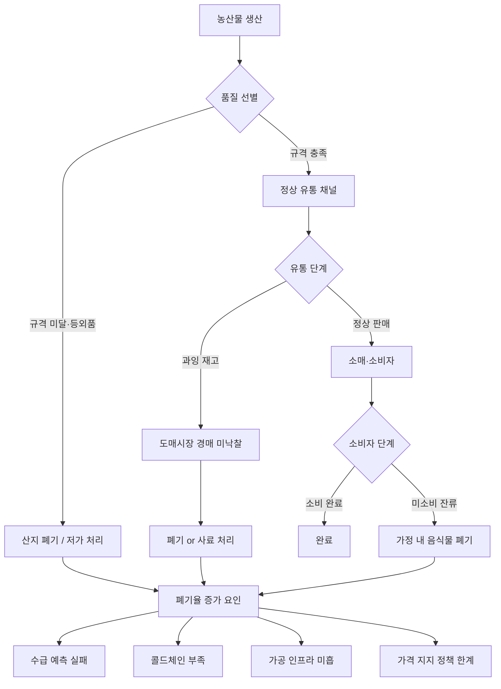
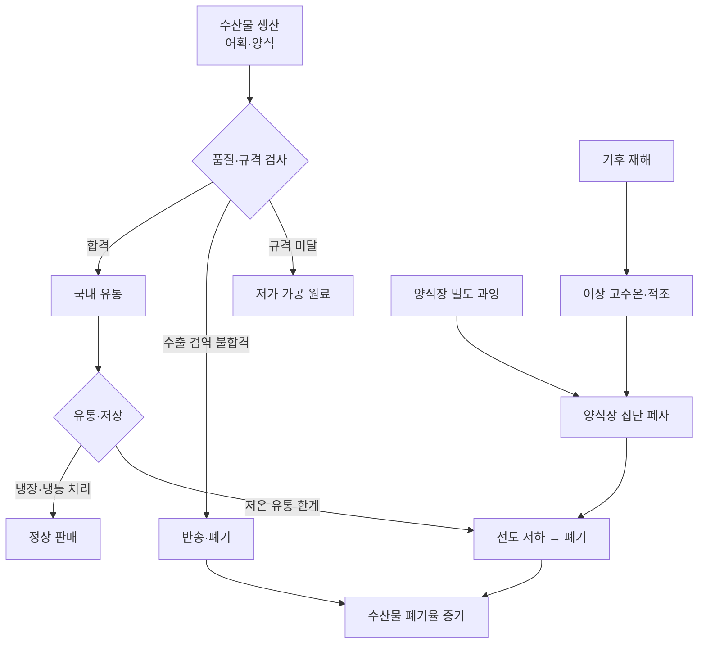

# 시각자료: 광주전남 농축수산물 폐기율

## 시각자료 개요

본 문서는 `member-alpha/analysis-report.md`의 분석 결과를 Mermaid 다이어그램과 Markdown 테이블로 시각화한 자료이다. 포함된 시각자료:

1. **농산물 폐기 원인 구조 흐름도** (Mermaid flowchart)
2. **품목별 폐기율 비교 다이어그램** (Mermaid xychart-beta / bar chart spec)
3. **폐기율 악순환 사이클 다이어그램** (Mermaid flowchart)
4. **품목별 폐기율·생산량 비교 테이블**
5. **전국·타 지역 비교 테이블**
6. **질병별 축산 피해 테이블**

---

## Mermaid 다이어그램

### 다이어그램 1: 농산물 폐기 원인 구조 흐름도

농산물 폐기가 발생하는 구조적 원인과 경로를 시각화한 흐름도.



---

### 다이어그램 2: 가격 폭락 → 산지 폐기 악순환 사이클

전남 채소류에서 반복되는 과잉 생산-폐기-가격 폭락 사이클 도식.


---

### 다이어그램 3: 전남 수산물 폐기 원인 구조



---

## 핵심 수치 테이블

### 테이블 1: 전남 주요 농산물 품목별 생산량·폐기율 추정

| 품목 | 2022년 생산량 | 추정 폐기율 | 추정 폐기 물량 | 주요 폐기 유형 |
|---|---|---|---|---|
| 배추 | 32.7만 톤 | 18~25% | 5.9~8.2만 톤 | 산지 폐기, 등외품 |
| 양파 | 29.8만 톤 | 20~30% | 6.0~8.9만 톤 | 산지 폐기, 저장 중 부패 |
| 마늘 | 5.2만 톤 | 15~20% | 0.8~1.0만 톤 | 저장 부패, 등외품 |
| 고구마 | 13.8만 톤 | 10~15% | 1.4~2.1만 톤 | 저온 저장 한계 |
| 쌀 | 53.6만 톤 | 3~5% | 1.6~2.7만 톤 | 도정 부산물 |
| 배·무화과 등 과실 | 약 8만 톤 | 15~20% | 1.2~1.6만 톤 | 외형 불량, 당도 미달 |

※ 폐기 물량은 추정 폐기율 범위를 생산량에 적용한 추정치임.

---

### 테이블 2: 전남 주요 수산물 품목별 생산량·폐기율 추정

| 품목 | 주요 산지 | 연 생산량 | 추정 폐기율 | 주요 폐기 원인 |
|---|---|---|---|---|
| 굴 | 여수·고흥 | 3만 톤 | 15~20% | 저온 유통망 부족, 시즌 말 재고 |
| 전복 | 완도 | 7,800~8,200톤 | 5~10% | 과잉 생산, 수요 편중 |
| 넙치(광어) | 신안·완도 | 2만 톤 | 8~12% | 가격 변동성, 수출 검역 불합격 |
| 김(마른 김) | 완도·진도 | 4만 톤 | 3~5% | (상대적으로 낮음) |
| 바지락·꼬막 | 벌교·보성 | 1.5만 톤 | 20~30% | 고온기 폐사, 냉장 유통 한계 |

---

### 테이블 3: 전국·타 지역 비교

| 구분 | 전라남도 | 경상남도 | 충청남도 | 전국 평균 |
|---|---|---|---|---|
| 농산물 추정 폐기율 | 18~22% | 12~16% | 10~14% | 15~18% |
| 수산물 추정 폐기율 | 12~18% | 10~15% | — | 10~15% |
| 농산물 가공 처리 비율 | 약 32~37% | 약 45% | 약 50% | 약 42% |
| 콜드체인 인프라 수준 | 상대적 취약 | 중간 | 중간 | — |
| 수산물 생산 전국 비중 | 약 40% | 약 20% | — | — |

---

### 테이블 4: 전남 가축 질병 발생에 따른 비상 폐기 현황

| 질병 | 발생 시기 | 전남 피해 규모 | 주요 축종 | 비고 |
|---|---|---|---|---|
| 고병원성 AI | 2022~2023 시즌 | 100~180만 수 | 산란계·육계 | 방역 종료 후 공식 집계 확인 필요 |
| ASF | 2019~2020 | 직접 발생 없음 | 돼지 | 이동 제한·예찰 조치만 시행 |
| 구제역 | 2019 | 소·돼지 약 1만 두 | 소·돼지 | 전남 북부 지역 |

---

### 테이블 5: 농산물 유통 단계별 폐기 비중 (전국 기준)

| 유통 단계 | 폐기율 비중 | 주요 원인 |
|---|---|---|
| 생산 단계 (등외품·산지 폐기) | 8~10% | 규격·외형 기준 탈락, 과잉 생산 |
| 유통·도매 단계 | 5~7% | 물류 중 손상, 재고 소진 실패 |
| 소매·소비자 단계 | 3~5% | 구매 후 미소비, 음식물 폐기 |
| **합계** | **16~22%** | — |

---

### 차트 스펙 (JSON): 품목별 폐기율 비교 막대 차트

```json
{
  "type": "bar",
  "title": "전남 주요 농수산물 품목별 추정 폐기율 범위 (2022 기준)",
  "x_axis": {
    "label": "품목",
    "values": ["배추", "양파", "마늘", "고구마", "쌀", "굴", "전복", "넙치", "바지락·꼬막", "김"]
  },
  "y_axis": {
    "label": "폐기율 (%)",
    "min": 0,
    "max": 35
  },
  "datasets": [
    {
      "label": "폐기율 하한",
      "values": [18, 20, 15, 10, 3, 15, 5, 8, 20, 3]
    },
    {
      "label": "폐기율 상한",
      "values": [25, 30, 20, 15, 5, 20, 10, 12, 30, 5]
    }
  ],
  "note": "수치는 추정치이며 연도·기상 조건에 따라 변동. 출처: aT, 해수부, 농식품부 통계 기반 추정."
}
```
