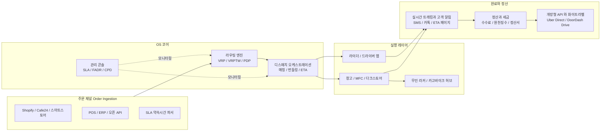
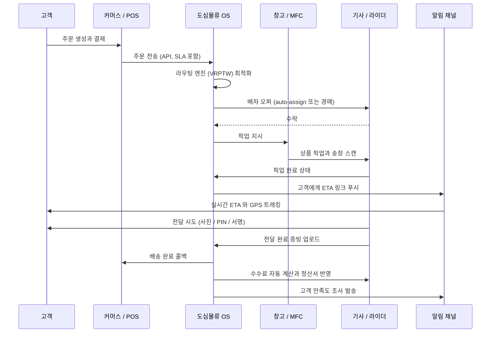
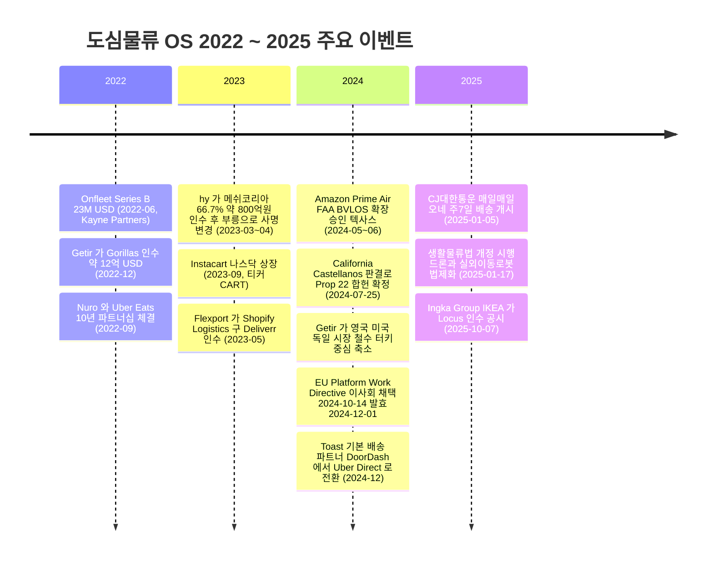

Creator: member-delta
Created: 2026-04-20
Version: 1.0

## 시각자료 개요

본 문서는 member-alpha 의 분석 결과와 member-gamma 의 팩트체크 수정 권고를 반영하여 도심물류 OS 의 구조·프로세스·경쟁 지형·핵심 수치를 4개 Mermaid 다이어그램과 4개 테이블로 시각화한 것이다. gamma 가 "불일치" 로 플래그한 수치(Onfleet 2022-06 / 23M USD, 바로고 2021년 909억원, Amazon Prime Air BVLOS 2024년 5~6월, Getir-Gorillas 2022년 12월)는 gamma 의 수정안을 우선 반영했으며, 그 외 "출처 불명" 또는 "부분 일치" 는 각주로 표시한다.

수록 목록:

- 다이어그램 1 - 도심물류 OS 기능 모듈 구조도 (flowchart LR): 주문 수집부터 정산·알림까지의 모듈 스택 시각화
- 다이어그램 2 - 주문부터 배송 완료까지 메시지 흐름 (sequenceDiagram): 고객·커머스·OS·기사·창고·알림 채널 간 상호작용
- 다이어그램 3 - 플레이어 포지셔닝 4분면 (quadrantChart): 국내 대 해외 축과 SaaS 대 수직통합 축 교차
- 다이어그램 4 - 2023~2025 주요 M&A / 자본 이벤트 타임라인 (timeline): 구조조정과 전략적 인수의 순서
- 테이블 1 - 국내 주요 플레이어 비교
- 테이블 2 - 해외 주요 플레이어 비교
- 테이블 3 - 시장 규모와 성장률 요약
- 테이블 4 - 2023~2025 주요 M&A 와 자본 이벤트

## Mermaid 다이어그램

### 다이어그램 1. 도심물류 OS 기능 모듈 구조도

캡션: 주문 수집부터 라우팅·디스패치·라이더 앱·완료·정산·고객 알림까지 도심물류 OS 가 종단간으로 통합하는 9개 기능 모듈의 연결 구조.



### 다이어그램 2. 주문에서 배송 완료까지 메시지 흐름

캡션: 단일 주문 한 건이 고객 - 커머스 - OS - 기사 - 창고 - 고객 알림 채널을 왕복하며 생성되는 주요 이벤트 메시지의 시간 순서.



### 다이어그램 3. 플레이어 포지셔닝 4분면 (국내 대 해외 x SaaS 대 수직통합)

캡션: X축은 국내(0 쪽) 대 해외(1 쪽), Y축은 순수 SaaS(0 쪽) 대 수직통합(1 쪽). 각 사분면의 대표 플레이어 배치를 통해 경쟁 구도를 가시화.

```mermaid
quadrantChart
    title 도심물류 OS 플레이어 포지셔닝
    x-axis 국내 시장 --> 해외 시장
    y-axis 순수 SaaS --> 수직통합 (라이더 / 차량 소유)
    quadrant-1 해외 수직통합
    quadrant-2 국내 수직통합
    quadrant-3 국내 SaaS 성격
    quadrant-4 해외 SaaS
    "쿠팡 CLS": [0.18, 0.92]
    "CJ 오네": [0.22, 0.78]
    "우아한청년들": [0.14, 0.82]
    "쿠팡이츠": [0.20, 0.85]
    "부릉": [0.28, 0.70]
    "바로고": [0.30, 0.55]
    "생각대로": [0.26, 0.50]
    "카카오모빌리티": [0.34, 0.40]
    "티맵모빌리티": [0.36, 0.30]
    "Bringg": [0.75, 0.20]
    "Locus": [0.78, 0.22]
    "Onfleet": [0.72, 0.15]
    "FarEye": [0.80, 0.18]
    "Shipsy": [0.82, 0.20]
    "Uber Direct": [0.88, 0.80]
    "DoorDash Drive": [0.90, 0.78]
    "Amazon AMZL": [0.92, 0.90]
    "Getir": [0.85, 0.88]
    "Instacart": [0.87, 0.72]
```

### 다이어그램 4. 2023에서 2025 주요 M&A 와 자본 이벤트 타임라인

캡션: 도심물류 OS 시장 구조를 재편한 주요 인수, 구조조정, 규제 이벤트의 연도별 순서(gamma 수정안 반영).



## 핵심 수치 테이블

### 테이블 1. 국내 주요 플레이어 비교

| 회사명 | 유형 | 주력 영역 | 2021~2024 매출 (단위 원) | 기술/사업 차별점 |
|---|---|---|---|---|
| 바로고 | 배달대행 SaaS + 프랜차이즈 지사 | 퀵서비스·배달대행, 콜드체인 퀵(브이루트) | 2021년 909억원 (공시·언론 보도 기준) [1] | 자체 라우팅·디스패치 엔진, 카카오·네이버 주문 연동, 지사 SW 사용료 과금 |
| 부릉 (구 메쉬코리아) | 수직통합 (대형 화주 계약) | B2B 라스트마일, 스타벅스·이마트 배송 | 2021년 3,039억원 (메쉬코리아 기준) | hy 인수(2023-03~04, 약 800억원·지분 66.7%) 이후 본사 직영 지사 모델로 구조조정 완료 |
| 생각대로 (로지올) | 배달대행 가맹 지사 | 동네단위 배달대행, 2022-12 월 1,674만 건 수행 | 2022년 약 320억원대 보도 기준 [2] | 가맹 지사 커버리지 강점, 2023년 이후 인적분할·모회사 재편 |
| 우아한청년들 (배민) | 수직통합 음식배달 플랫폼 | 배민라이더스, B마트, 배민커넥트 | 2023년 3.4조원대 (보도 기준) | AI 콜매칭 고도화, 2023년 1~8월 산재 승인 1,273건으로 업종 1위 |
| 쿠팡이츠 서비스 | 수직통합 음식배달 | 단건 배달, 동적 서지 가격 | 비공시 | 평점·수락률 기반 배차, 2024~2025 라이더 수입 측면에서 배민 대비 우위 보도 |
| 쿠팡로지스틱스서비스 (CLS) | 수직통합 라스트마일 | 쿠팡 풀필먼트 배송 전담 | 2024년 약 3조 8,349억원 (사람인 공시 기준) | 전국 서브허브·캠프, 쿠팡친구(직고용) + 퀵플렉스(위탁) 이원 구조 |
| CJ대한통운 | 종합물류 + 풀필먼트 | 오네 통합 배송, e-풀필먼트 | 2024년 연결 기준 대기업 물류사 | 2025-01-05 매일매일 오네(주7일) 개시, 용인 B2C2 스마트센터 AGV/AMR 대규모 도입 [3] |
| 카카오모빌리티 | 플랫폼 + TMS API | 카카오 T 퀵, 카카오 T 트럭, 오늘의픽업 | 비공시 (세그먼트) | 라이프스타일(물류·배송·세차) 매출 비중 2024년 28.5% → 2025년 31.5% (보도 기준) |
| 티맵모빌리티 | 내비·경로 API | T MAP API, 티맵 화물 미들마일 | 비공시 | KB·SKT·하나 컨소시엄 |
| GS리테일 / BGF (CU) | 리테일 MFC / 라커 | 편의점 3만여 거점을 MFC·라커로 활용 | 편의점 그룹 연결 매출 | BOX25, CU 포스트박스 라커, 홈플러스 익스프레스 퀵커머스 등 |

[1] gamma 수정안 반영: 원 보고서의 "2022년 공시 909억원" 은 2021년 실적으로 정정.
[2] gamma 출처 불명 플래그: "2022년 323억원 흑자 전환" 은 공개 기사 재확인 어려움, 법인 분할(2022 인적분할)로 법인별 재무 지표 상이. 공시 직접 확인 필요.
[3] gamma 출처 불명 플래그: "AGV/AMR 200여 대" 구체 수치는 회사 공시·IR 기준 재확인 필요. 본 테이블은 "대규모 도입" 으로 표기.

### 테이블 2. 해외 주요 플레이어 비교

| 회사명 | 본사 | 유형 | 주요 고객 / 파트너 | 최근 거래 / 이벤트 (2022~2025) |
|---|---|---|---|---|
| Bringg | 이스라엘 텔아비브 | SaaS 도심물류 OS | Walmart, Coca-Cola, AutoZone | 2024년 Q2 Guy Bloch CEO 체제 강화, 엔터프라이즈 파트너십 확대(보도 기준) |
| Locus | 인도 / 미국 (Mara Labs) | SaaS VRP / 라우팅 | 그로서리·리테일 | 2025-10-07 Ingka Group(IKEA) 인수 공시, 누적 펀딩 82.5M USD |
| Onfleet | 미국 | SaaS 간편 배차·트래킹 | SMB ~ 중견 | 2022-06 Kayne Partners 주도 Series B 23M USD [4] |
| Shipsy | 인도 | SaaS 배송·물류 | 중동·동남아 | 2024-09 기준 밸류에이션 약 1,020억 원 (약 122M USD), 누적 펀딩 32.9M USD |
| FarEye | 인도 / 미국 | SaaS 라스트마일 | Walmart Canada, Hershey's | 2024년 Q3 그리스 Svuum 제휴로 남유럽 확장 |
| Wise Systems | 미국 | SaaS 자가학습 디스패치 | 장비 부품·유통 대기업 | 동적 재최적화 엔진 특화 |
| Routific | 캐나다 | SaaS 라우팅 SMB | 중소 유통·식음료 | - |
| NextBillion.ai | 싱가포르 | HD 지도·라우팅 API | Grab, Zomato, Dunzo | - |
| Descartes Systems | 캐나다 (NASDAQ: DSGX) | 글로벌 TMS·통관 | 엔터프라이즈 화주 | 라우팅 모듈(ALK / Route Planner)로 라스트마일 진입 |
| Uber Direct | 미국 | 화이트라벨 라스트마일 API | Toast, Olive Garden, Best Buy | 2024-12 Toast 기본 배송 파트너 DoorDash 에서 Uber 로 전환 |
| DoorDash Drive | 미국 | 화이트라벨 라스트마일 | 미국 톱100 레스토랑 중 94개 커버(보도 기준) | 2022년 Wolt 인수(EU 확장) |
| Instacart (Maplebear) | 미국 | 리테일러 배송 엔진 | Connect / Storefront Pro | 2023-09-18 나스닥 상장 (티커 CART), 공모가 30 USD, 기업가치 약 99억 USD |
| Amazon Logistics (AMZL) | 미국 | 수직통합 (DSP + Flex + Prime Air) | 자사 Amazon | 2024-05~06 FAA BVLOS 확장 승인 (텍사스 College Station) [5] |
| Flexport Last Mile | 미국 | 포워딩 + 라스트마일 | Shopify 셀러 | 2023-05 Shopify Logistics 구 Deliverr 인수, 2023~2024 구조조정 |
| Getir / Gorillas | 터키 / 독일 | 수직통합 퀵커머스 | B2C | 2022-12 Getir 가 Gorillas 약 12억 USD 인수 [6], 2024년 영국·미국·독일 철수, 터키·네덜란드 잔존 |
| Delivery Hero / Glovo / Rappi | 독일 / 스페인 / 콜롬비아 | 수직통합 + 화이트라벨 | 레스토랑·리테일 | 다국가 다크스토어·Dmart 운영 |
| Nuro | 미국 | 자율 배송 L4 차량 | Uber Eats | 2022-09 Uber Eats 와 10년 파트너십 체결 [7], 2024년 가을 R3 차량 상용 배치 |
| Starship Technologies | 에스토니아 / 미국 | 보도 로봇 라스트마일 | 대학 캠퍼스·도시 | 2025-10 기준 누적 약 900만 건 배송, 약 2,700대 운영, 100여 운영지 [8] |

[4] gamma 수정안 반영: 원 보고서의 "2024년 Q2 / 20M USD" 는 오류. 실제는 2022-06 / 23M USD.
[5] gamma 수정안 반영: 원 보고서의 "2024년 12월" 은 시점 오류. 실제 BVLOS 확장 승인은 2024년 5~6월.
[6] gamma 수정안 반영: 원 보고서의 "2023년" 은 연도 오류. 실제 거래 체결은 2022-12.
[7] gamma 수정안 반영: 원 보고서의 "2024년 10월 통합 제휴" 는 부정확. 기본 10년 파트너십은 2022-09 체결.
[8] gamma 수정안 반영: 원 보고서의 "2025년 누적 600만+ / 캠퍼스 95개+ (2024-11)" 는 저평가. 2025-10 기준 약 900만 건, 2,700대로 상향.

### 테이블 3. 시장 규모와 성장률 요약

| 세그먼트 | 기준연도 | 규모 (기준연도) | 전망연도와 규모 | CAGR | 출처 |
|---|---|---|---|---|---|
| 글로벌 라스트마일 배송 소프트웨어 | 2025 | 약 32.37B USD | 2035년 158.44B USD | 17.21% | Market Research Future (2025) |
| 글로벌 자율주행 라스트마일 배송 | 2024 | 1,615.4M USD | 2030년 5,930.2M USD | 24.8% | Grand View Research (2024) [9] |
| 글로벌 자율주행 라스트마일 배송 (교차 추정) | 2024 | 약 1.25B USD | 2030년 4.2B+ USD | 20%대 | GlobeNewswire (2025-02) [9] |
| 글로벌 드론 배송 (자율 라스트마일 하위) | 2024 | 자율 배송 시장 내 하위 | - | 28%+ | Grand View Research (2024) |
| 국내 쿠팡로지스틱스서비스 (CLS) 매출 | 2024 | 약 3조 8,349억원 | 전년 대비 +46.3% | - | 사람인 공시 기준 |
| 국내 쿠팡풀필먼트서비스 매출 | 2024 | 약 4조 3,738억원 | - | - | 사람인 공시 기준 |
| 국내 바로고 매출 | 2021 | 909억원 | - | - | 공시·언론 보도 기준 [10] |
| 국내 메쉬코리아 매출 | 2021 | 3,039억원 | 2020년 2,564억원 대비 +18.5% | - | 전자신문 2022-03-31 |
| 국내 우아한형제들 매출 (음식배달 포함 참고) | 2023 | 약 3.4조원대 | - | - | 보도 기준 |
| 카카오모빌리티 라이프스타일 매출 비중 | 2024~2025 | 2024년 28.5% | 2025년 31.5% | - | 보도 기준 |

[9] gamma 부분 일치: 기관별 추정치 편차 큼. 본 테이블은 두 기관 추정을 병기하여 교차 참고 용도로 제시.
[10] gamma 수정안 반영: 원 보고서의 "2022년 공시 909억원" 은 연도 오류로 2021년으로 정정.

### 테이블 4. 2023에서 2025 주요 M&A 와 자본 이벤트

| 일자 | 사건 | 거래 금액 / 조건 | 의미 | 검증 상태 |
|---|---|---|---|---|
| 2022-06 | Onfleet Series B | 23M USD (Kayne Partners 주도) | 북미 SaaS 배차·트래킹 SMB 확장 자금 | 확인됨 (BusinessWire 2022-06-07) |
| 2022-09 | Nuro 와 Uber Eats 10년 파트너십 | 금액 비공개, 장기 배타성 조항 포함 | L4 자율 배송 차량의 음식배달 상용 경로 확보 | 확인됨 (Uber-Nuro PR) |
| 2022-12-09 | Getir 가 Gorillas 인수 | 약 12억 USD (주식 중심) | 유럽 퀵커머스 통합, 이후 2024년 대규모 철수 전단계 | 확인됨 (CNBC, TechCrunch) |
| 2023-03~04 | hy 가 메쉬코리아 인수 | 약 800억원, 지분 66.7% | 국내 수직통합 배달대행의 워크아웃 재출범, 부릉으로 사명 변경 | 확인됨 (한국일보, 바이라인) |
| 2023-05 | Flexport 가 Shopify Logistics 구 Deliverr 인수 | 금액 비공개 | 포워딩과 B2C 라스트마일 결합 시도, 이후 구조조정 | 확인됨 (CNBC, Shopify 뉴스룸) |
| 2023-09-18 | Instacart (Maplebear) 나스닥 상장 | 공모가 30 USD, 기업가치 약 99억 USD, 티커 CART | 리테일 미디어 + 배송 엔진 결합 모델의 공개 검증 | 확인됨 (Instacart IR) |
| 2024-05~06 | Amazon Prime Air FAA BVLOS 확장 승인 | 텍사스 College Station 중심, MK-30 기체 | 드론 배송 상용화 가시권 진입 | 확인됨 (FlyingMag, TechCrunch 2024-05-30) |
| 2024-07-25 | California Castellanos 판결 | Prop 22 합헌 확정 만장일치 | 미국 기준 앱 기반 기사 독립계약자 지위 유지 확정 | 확인됨 |
| 2024-10-14 | EU Platform Work Directive 이사회 채택 | 2024-12-01 발효, 이행 시한 2026-12-02 | 고용관계 법적 추정과 알고리즘 관리 투명성 의무화 | 확인됨 (Council of EU) |
| 2024-12 | Toast 기본 배송 파트너 교체 | DoorDash 에서 Uber Direct 로 전환 | POS 기반 화이트라벨 경쟁 역전 | 확인됨 (Food On Demand 2024-12-09) |
| 2025-01-05 | CJ대한통운 매일매일 오네 개시 | 주7일 배송, 연간 비배송일 약 70일 제거 | 한국 택배 7일 운영 체제 진입 | 확인됨 |
| 2025-01-17 | 생활물류법 개정 시행 | 드론·실외이동로봇 집화·배송 법제화 | 국내 자율 로봇·드론 배송 법적 기반 확보 | 확인됨 (정책브리핑, 국토부) |
| 2025-10-07 | Ingka Group (IKEA) 의 Locus 인수 공시 | 금액 비공개, 2021년 기업가치 약 3억 USD 보도 | 리테일 대기업 직접 주도 라스트마일 OS 수직통합 | 확인됨 (Ingka 뉴스룸, Retail Dive) |
| 2026-01 | 대법원 라이더 근로자성 일부 인정 파기환송 | - | 퇴직금·4대보험·주휴수당 소급 적용 가능성 | 검증 중 (보도 기준, 판결문·공식 요지 추가 확인 필요) [11] |

[11] gamma 출처 불명 플래그: 2026-01 대법원 파기환송 건은 4월 20일 기준 공개 자료상 직접 판결문 확정 어려움. "보도 기준" 표기 유지.
