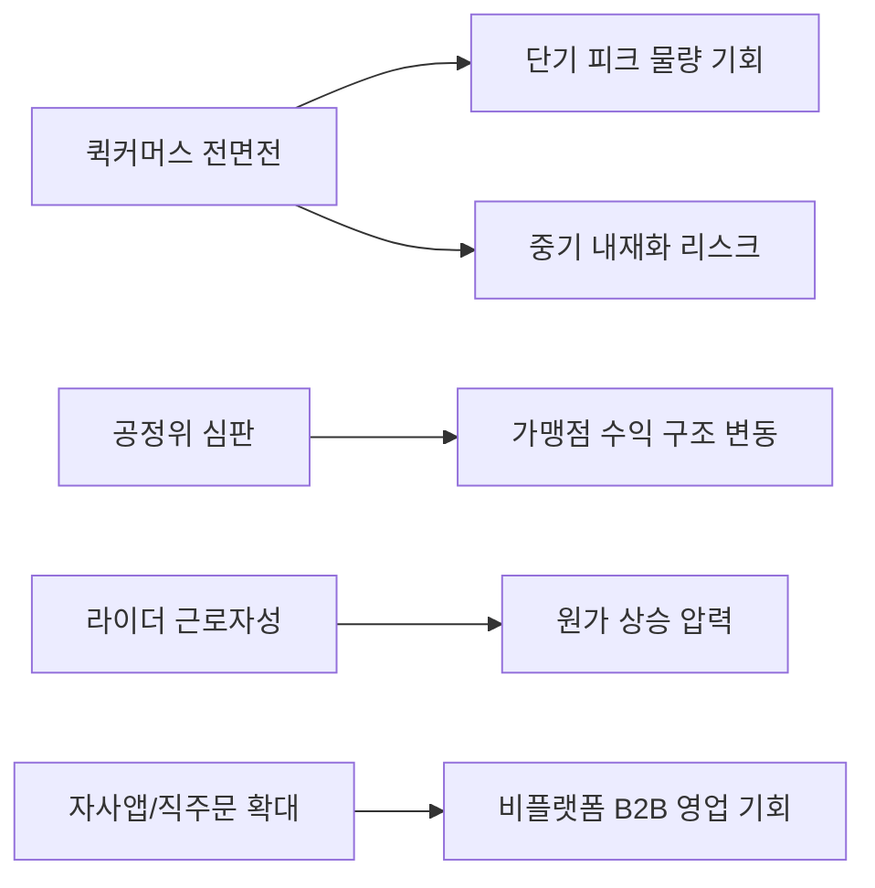

# 마켓 대시보드 이번주 인사이트 요약

**작성일**: 2026-07-31
**Task Type**: research-report
**활성 멤버**: alpha(조사) · gamma(팩트체크) · delta(시각화) · beta(보고서)
**사이클**: 1 / 3
**승인**: 사용자 승인 완료 (2026-07-31 16:08 후속 지시 `완료 처리` 반영)

## 요약

- `2026-W31` 마켓 대시보드 리포트는 아직 게시되지 않았다.
- 이번 보고는 `이번 주 기준 최신 게시본`인 `2026-W30`을 기준으로 정리했다.
- 최신 게시본이 가리키는 핵심 변화는 `퀵커머스 전면전`, `규제·노동 이중 압력`, `플랫폼 락인과 직주문 채널 확대의 동시 진행`이다.

## 이번 주 기준선과 한계

| 항목 | 확인 결과 | 근거 |
|---|---|---|
| 이번 주 리포트 상태 | `2026-W31` 미게시 | `api/report?week=2026-W31&locale=kr` -> `Report not found` |
| 실질 기준선 | `2026-W30` | API 응답 `isLatest=true`, `alreadyConfirmed=true` |
| 비교 기준 | `2026-W29` | 직전 주차 리포트와의 연속성 확인 |
| 보조 분류 체계 | `api/keywords?locale=kr` | `quick_commerce`, `platform_labor_law`, `b2b_logistics` 등 |

- 따라서 본 문서는 `실시간 주간 브리핑`이 아니라 `최신 게시본 기준 인사이트 요약`이다.
- `W31` 리포트가 게시되면 퀵커머스 경쟁 강도, 규제 이벤트, 신규 키워드 유입 여부를 다시 확인해야 한다.

## 핵심 인사이트

### 1. 시장의 주전장은 배달앱 프로모션에서 퀵커머스 운영으로 이동했다

- W30 1위 이슈는 `쿠팡나우`와 `배민 B마트`의 정면 대결이다.
- 이는 가격 경쟁보다 `재고 보유`, `거점 운영`, `즉시배송 피크 대응` 역량이 중요해졌다는 뜻이다.
- 바로고에는 단기적으로 피크 물량 대응 기회가 있지만, 중기적으로는 플랫폼 자체 운영 내재화 리스크가 커진다.

### 2. 규제와 노동 변수는 동시에 비용과 수요를 흔든다

- W29는 `배달 대행사 라이더 근로자 첫 판결`, W30은 `공정위 정식 제재 심판`을 상위 이슈로 제시했다.
- 앞의 이슈는 원가 구조를, 뒤의 이슈는 가맹점 수익 구조와 주문 흐름을 흔든다.
- 즉 지금은 `수요 둔화 리스크`와 `원가 상승 리스크`를 분리해서 보면 안 되는 국면이다.

### 3. 플랫폼 락인 강화와 탈플랫폼 직주문 확대가 동시에 진행 중이다

- W30은 배민·쿠팡이츠·요기요의 `독점 콘텐츠 경쟁`을 강조했다.
- 동시에 외식업체와 편의점은 `자사앱`, `멤버십`, `24시간 즉시배송`으로 직접 주문 채널을 키우고 있다.
- 바로고는 플랫폼 편중 거래처 방어와 직주문 채널 신규 영업을 별도 트랙으로 운영할 필요가 있다.

## 시각 요약

| 축 | W29 | W30 | 의미 |
|---|---|---|---|
| 경쟁 전선 | 쿠팡나우 + 로켓페이 | 쿠팡나우 vs B마트 | 퀵커머스가 핵심 전선으로 고착 |
| 규제/노동 | 대행사 라이더 근로자 첫 판결 | 공정위 정식 심판 | 수요와 원가를 동시에 흔드는 압력 |
| 영업 기회 | 월드컵 특수 | 자사앱/직주문, 편의점 즉시배송 | 플랫폼 밖 B2B 수주 가능성 확대 |

## 추천 사항

1. `영업팀`은 `2026-08-03`까지 퀵커머스 관련 기존 거래처와 잠재 거래처를 분리하고, 상위 5개 거점에 `피크 전담 운영 모델` 제안 여부를 확정한다.
2. `운영기획`은 `2026-08-05`까지 거래처별 플랫폼 편중도 지표를 만들고, 편중도 80% 이상 거래처를 별도 모니터링 대상으로 지정한다.
3. `전략/재무`는 `2026-08-08`까지 `공정위 제재 x 라이더 비용 증가` 2x2 시나리오 메모를 작성해 수요와 원가를 함께 보는 기준안을 만든다.
4. `영업팀`은 `2026-08-08`까지 자사앱 또는 직주문 채널을 운영하는 프랜차이즈/편의점 후보군을 정리하고, 플랫폼 비의존형 직계약 제안 문구를 표준화한다.
