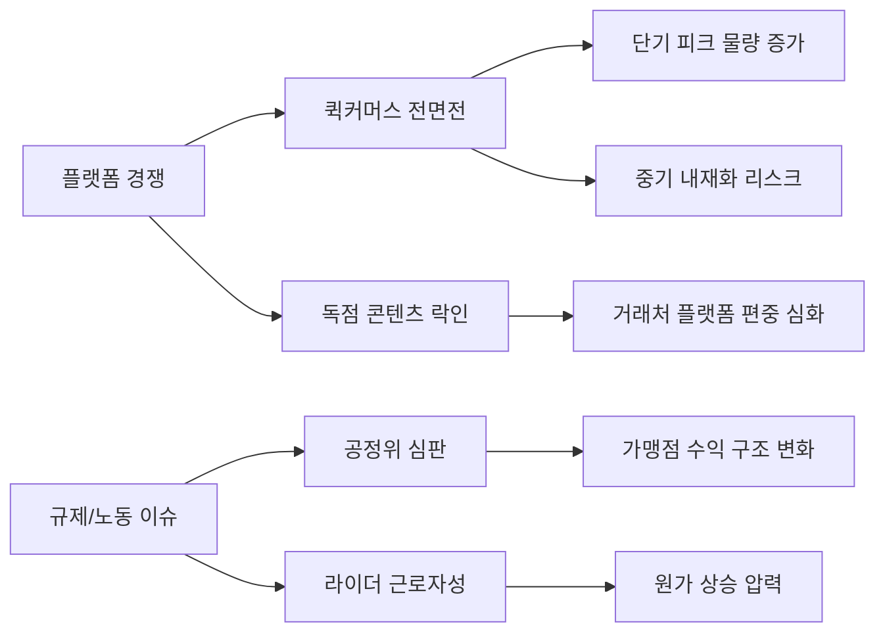
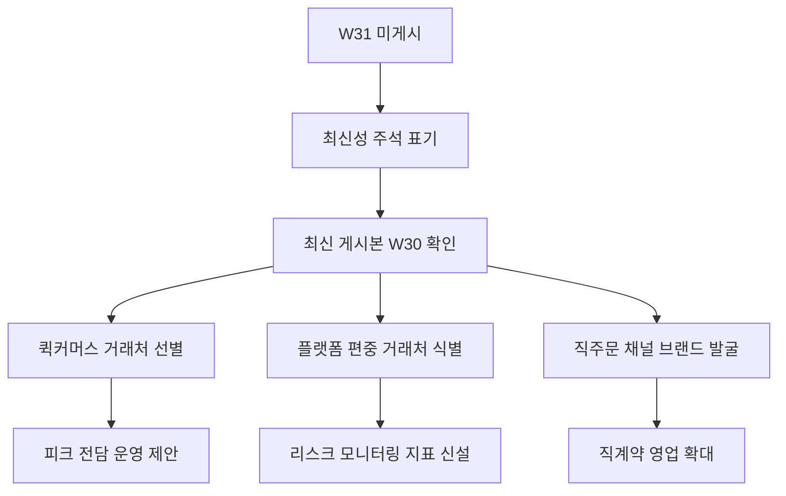

Creator: member-delta
Created: 2026-07-31T15:49:03
Version: 1.0

# 시각자료 개요

- 이번 시각화는 `이번 주 기준 최신 게시본(W30)`에서 읽히는 시장 전선을 한눈에 보여주는 데 목적이 있다.
- 검토 시점에 `2026-W31` 리포트가 미게시 상태였으므로, 본 문서는 `W30`을 이번 주의 실질 기준선으로 사용한다.
- 첫 번째 다이어그램은 시장 압력의 구조, 두 번째 다이어그램은 바로고 대응 흐름을 정리한다.
- 표는 W29와 W30 사이에 이어진 핵심 주제와 영향도를 요약한다.
- 선정 근거:
  - `퀵커머스 전면전`: W30 KR 리포트 1위 이슈 `쿠팡나우` vs `배민 B마트`
  - `규제/노동`: W30 KR 리포트 3위 이슈 `공정위 정식 제재 심판`, W29 KR 리포트 핵심 요약 `대행사 라이더 근로자 첫 판결`
  - `직주문 채널`: W30 KR 리포트 5위 이슈 `외식업계 자사앱 회원 확보 경쟁`
- 영향도 판단 기준: 대시보드가 직접 `임팩트: 최상/상/중`으로 표기한 항목과, 두 주차(W29, W30)에 반복 등장한 주제를 우선 반영했다.

# Mermaid 다이어그램

W30 기준 시장 전선 이동 구조

아래 다이어그램의 상위 이슈 노드는 대시보드 원문 항목이고, 하위 영향 노드는 W29/W30 이슈에서 도출한 분석 해석이다.

지원 메모: 위 구조는 W30 KR 리포트의 `퀵커머스 전면전`, `공정위 정식 제재 심판`과 W29 KR 리포트의 `대행사 라이더 근로자 첫 판결`을 묶어 재구성한 해석도다.

바로고 실무 대응 우선순위

아래 다이어그램의 액션 노드는 대시보드 원문을 그대로 옮긴 값이 아니라, W29/W30 핵심 이슈를 운영 과제로 번역한 해석 결과다.

지원 메모: 이 흐름은 본 문서와 W29/W30 대시보드에서 확인된 세 결론, 즉 `퀵커머스 제안 선점`, `수요-원가 동시 변동 관리`, `플랫폼 의존 거래처와 직주문 채널의 분리 대응`을 시각화한 것이다.

# 핵심 수치 테이블

| 항목 | W29 | W30 | 출처 | 시사점 |
|---|---:|---:|---|---|
| 수집 기사 수 | 11건 | 18건 | W29 KR 리포트 헤더 / W30 KR 리포트 헤더 | W30이 더 넓은 이슈 묶음을 다룸 |
| 최신 게시 여부 | 직전 주차 | `isLatest=true`, `alreadyConfirmed=true` | W30 API 응답 필드 | 이번 주 요약의 실제 기준본은 W30 |
| 핵심 경쟁 축 | 쿠팡나우 + 로켓페이 | 쿠팡나우 vs B마트 전면전 | W29 핵심 요약 / W30 1위 이슈 | 퀵커머스가 핵심 전선으로 고착 |
| 규제/노동 포인트 | 대행사 라이더 근로자 첫 판결 | 공정위 정식 제재 심판 | W29 핵심 요약 / W30 3위 이슈 | 수요와 원가를 동시에 흔드는 압력 |
| 신규 영업 기회 | 월드컵 특수, 인바운드 수요 | 자사앱/직주문, 편의점 즉시배송 | W29 인사이트 3 / W30 5위 이슈 | 플랫폼 밖 B2B 수주 기회 확대 |

지원 키워드 분류 표

| 키워드 묶음 | 대표 용어 | 출처 | 활용 포인트 |
|---|---|---|---|
| 퀵커머스 | `quick_commerce`, `dark_store` | `api/keywords?locale=kr` | 피크 대응, 거점 운영, 다크스토어 수요 |
| 노동/규제 | `rider_rights`, `platform_labor_law`, `platform_act` | `api/keywords?locale=kr` | 비용 구조, 계약 구조, 리스크 시나리오 |
| 거래처 전략 | `b2b_logistics`, `local_commerce` | `api/keywords?locale=kr` | 직계약 영업, 비플랫폼 채널 확보 |
| 수수료 환경 | `delivery_fee_cap`, `fair_trade_delivery` | `api/keywords?locale=kr` | 가맹점 정산 변화 대응 |
