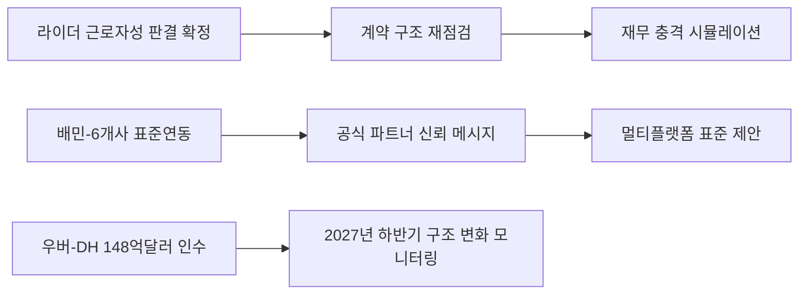

# 마켓 인텔리전스 이번 주 리포트

**작성일**: 2026-08-05
**Task Type**: research-report
**활성 멤버**: alpha(조사) · gamma(팩트체크) · delta(시각화) · beta(보고서)
**사이클**: 1 / 3
**승인**: human_approval=false (자동 완료)

## 요약

- `2026-W32` 마켓 인텔리전스 리포트는 지난주 W31의 `배달앱 규제 안전지대` 프레임에서 벗어나, 바로고와 같은 배달대행 사업자 자체의 법무·비용 리스크를 전면에 올렸다.
- 이번 주 가장 큰 변화는 서울고법 라이더 근로자성 판결 최종 확정이 `배달대행 플랫폼업체`를 직접 겨냥한 선례로 제시됐다는 점이다.
- 동시에 배민이 바로고를 포함한 배달대행 6개사와 위치추적 표준연동을 완료한 사실은, 바로고를 `검증된 공식 연동 파트너`로 설명할 수 있는 드문 영업 레퍼런스다.
- 근거 원문:
  - W32: `https://barogo-intel.vercel.app/api/report?week=2026-W32&locale=kr`
  - W31: `https://barogo-intel.vercel.app/api/report?week=2026-W31&locale=kr`

## 이번 주 기준선

| 항목 | 확인 결과 | 근거 |
|---|---|---|
| 기준 주차 | `2026-W32` | W32 API 응답 `isLatest=true` |
| 생성 시점 | `2026-08-03 13:30 +09:00` | W32 API 응답 `generatedAt` |
| 기사 수 | `15건` | W32 API 응답 `articleCount` |
| 직전 비교 주차 | `2026-W31` | W31 API 응답 `generatedAt=2026-07-27`, `articleCount=16` |
| 키워드 체계 | `platform_labor_law`, `rider_rights`, `ai_optimization`, `ma_acquisition`, `fair_trade_delivery` 등 | `api/keywords?locale=kr` |

## 핵심 인사이트

### 1. 이번 주 우선순위 1위는 법무·재무 방어다

- W32 1위 이슈는 라이더 근로자성 판결 최종 확정의 피고가 `배달대행 플랫폼업체`였다는 점을 전면에 둔다.
- 이 때문에 W31에서 유효했던 `배달앱 규제의 반사수혜` 프레임은 이번 주 1순위 해석이 아니다.
- 바로고 전문 라이더 `4만 명 이상`의 계약 구조가 직접 리스크로 연결된 만큼, 이번 주는 성장 담론보다 비용 충격 시뮬레이션과 계약 구조 대조가 우선이다.
- 출처: W32 1위 이슈 본문, `member-gamma/fact-check-log.md`

### 2. 표준연동 이슈는 종속이 아니라 영업 레퍼런스로 번역해야 한다

- W32 2위 이슈는 배민이 바로고를 포함한 배달대행 6개사와 위치추적 표준연동을 완료했다고 명시한다.
- 이는 단순 운영 뉴스가 아니라, 바로고가 이미 배민 표준을 통과한 사업자라는 공개 증빙이다.
- 따라서 영업 현장에서는 이를 `공식 표준을 충족한 검증 파트너` 메시지로 전환하고, 쿠팡이츠·요기요에도 같은 표준 제안을 확장하는 것이 합리적이다.
- 출처: W32 2위 이슈 본문, `member-alpha/analysis-report.md`

### 3. 경쟁사 효율 지표와 글로벌 구조 변화는 별도 트랙으로 관리해야 한다

- 부릉 AI 배차 사례는 이동시간 `12.7분→9.2분`, `30% 단축`이라는 공개 수치를 남겼다. 이는 바로고 내부 AI 배차와 SLA를 동일 지표로 재측정해야 한다는 뜻이다.
- 우버의 딜리버리히어로 148억달러 인수 확정은 2027년 하반기 배민 지배구조 변화 가능성을 구체화한다. 다만 이는 이번 주 즉시 실행 과제보다 분기 모니터링 과제에 가깝다.
- `배달대행비 -40%`와 `배달앱 이용료 +40.9~59%` 데이터는 가맹점 커뮤니케이션 자료에 즉시 활용 가능한 수치 근거다.
- 출처: W32 3위, 4위, 5위 이슈 본문, `member-delta/visuals.md`

## 시각 요약

| 지표 | 수치 | 사실 설명 | 근거 |
|---|---|---|---|
| 부릉 AI 배차 이동시간 | `12.7분→9.2분` | W32 4위 이슈가 제시한 경쟁사 운영 효율 수치 | W32 4위 이슈 본문 |
| 부릉 AI 배차 개선율 | `30% 단축` | 이동시간 변화와 같은 문단에서 제시된 개선율 | W32 4위 이슈 본문 |
| 배달대행비 변화 | `-40%` | 월평균 배달대행비 변화 | W32 5위 이슈 본문 |
| 배달앱 이용료 변화 | `+40.9%~59%` | 업종별 배달앱 이용료 증가 범위 | W32 5위 이슈 본문 |
| 바로고 라이더 규모 | `4만 명 이상` | 근로자성 리스크 노출 범위 | W32 1위 이슈 본문 |
| 우버-DH 거래 규모 | `148억달러` | 배민 지배구조 변화 맥락의 거래 금액 | W32 3위 이슈 본문 |

## 추천 사항

1. `법무/재무`는 이번 주 안에 근로자성 판결문 판단 기준과 바로고 라이더 계약 구조를 대조하고, 비용 충격 3개 시나리오를 작성한다.
   근거: W32 1위 이슈가 `이번 주 즉시 착수`를 권고했고, 이번 주 최상위 리스크가 바로고 사업 구조 자체로 이동했다.
2. `영업`은 배민 표준연동 참여 사실을 `검증된 공식 연동 파트너` 메시지로 바꿔 가맹점 제안서와 세일즈 토크에 즉시 반영한다.
   근거: W32 2위 이슈가 바로고 포함 6개사 표준연동 완료를 공개 확인했다.
3. `운영/프로덕트`는 부릉 사례와 같은 단위로 바로고 AI 배차 이동시간, SLA, 위치정보 정확도를 재산출해 내부 벤치마크를 만든다.
   근거: W32 4위 이슈가 `12.7분→9.2분`, `30% 단축`을 공개 벤치마크로 제시했다.
4. `마케팅/대외협력`은 `배달대행비 -40% vs 배달앱 이용료 +40.9~59%` 비교표를 만들어 가맹점 대상 커뮤니케이션 자료에 삽입한다.
   근거: W32 5위 이슈가 업종별 비용 변화 수치를 직접 제시했다.
