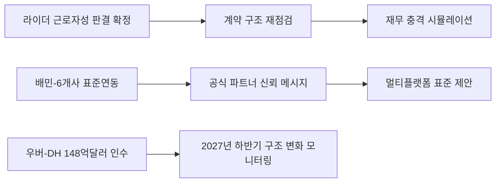
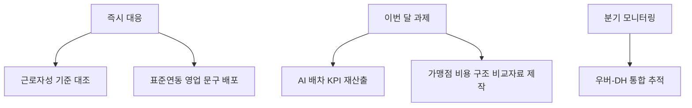

Creator: member-delta
Created: 2026-08-05 12:09
Version: 1.1

# 시각자료 개요

- 목적: `2026-W32` 주간 리포트의 핵심 리스크와 실행 우선순위를 한눈에 파악할 수 있게 정리한다.
- 입력 기준: `member-alpha/analysis-report.md`의 수치와 구조만 사용했다.
- 시각화 초점: `직접 리스크`, `표준연동 기회`, `장기 구조 변화`의 3축을 분리한다.

# Mermaid 다이어그램

이번 주 핵심 이슈가 바로고 의사결정으로 이어지는 흐름

근거: W32 1위 이슈의 `지금 해야 할 것 1가지`가 `법무팀 긴급 소집`과 `재무 충격 시뮬레이션`을 직접 권고한다. W32 2위 이슈는 바로고 포함 `배달대행 6개사` 표준연동 완료와 `멀티플랫폼 표준 주도자` 전환을 제안한다. W32 3위 이슈는 `148억달러` 거래와 `2027년 하반기` 종결 전망을 제시한다.

즉시 대응 과제와 후속 과제의 우선순위 구분

근거: alpha 보고서 결론은 `근로자성 리스크 시뮬레이션 즉시 착수`, `표준연동 영업 메시지 배포`, `AI 배차/SLA 내부 벤치마크 재산출` 순으로 우선순위를 제시한다. W32 5위 이슈는 `배달대행비 -40%`와 `배달앱 이용료 +40.9~59%` 수치를 커뮤니케이션 자료로 활용하라고 권고한다.

# 핵심 수치 테이블

| 항목 | W31 | W32 | 관찰 내용 | 근거 |
|---|---|---|---|---|
| 기사 수 | 16건 | 15건 | 두 주차 모두 게시 완료된 확정본이 존재한다 | W31/W32 `api/report` JSON `articleCount` |
| 최상위 프레임 | 배달앱 규제 안전지대 | 배달대행사 직접 리스크 | W31 한 줄 요약과 W32 1위 이슈의 강조점이 다르다 | W31/W32 `api/report` 본문 |
| 배민 연동 범위 | 미표기 | 배달대행 6개사 | W32에서 바로고 포함 6개사가 처음 구체적으로 언급된다 | W32 2위 이슈 본문 |
| 글로벌 구조 변화 | 심사 전략 분석 | 우버-DH 148억달러 인수 확정 | W32는 거래 규모와 종결 예상 시점을 더 구체적으로 제시한다 | W31 2위 이슈, W32 3위 이슈 |

| 지표 | 수치 | 사실 설명 | 근거 |
|---|---|---|---|
| 부릉 AI 배차 이동시간 | `12.7분→9.2분` | W32 4위 이슈가 제시한 경쟁사 운영 효율 수치 | W32 4위 이슈 본문 |
| 부릉 AI 배차 개선율 | `30% 단축` | 위 이동시간 변화와 같은 문단에서 제시된 개선율 | W32 4위 이슈 본문 |
| 배달대행비 변화 | `-40%` | 피자·햄버거·샌드위치 전문점 월평균 배달대행비 변화 | W32 5위 이슈 본문 |
| 배달앱 이용료 변화 | `+40.9%~59%` | 업종별 배달앱 이용료 증가 범위 | W32 5위 이슈 본문 |
| 바로고 라이더 규모 | `4만 명 이상` | W32 1위 이슈가 직접 언급한 리스크 노출 범위 | W32 1위 이슈 본문 |
| 우버-DH 거래 규모 | `148억달러` | 배민 지배구조 변화 맥락의 거래 금액 | W32 3위 이슈 본문 |
