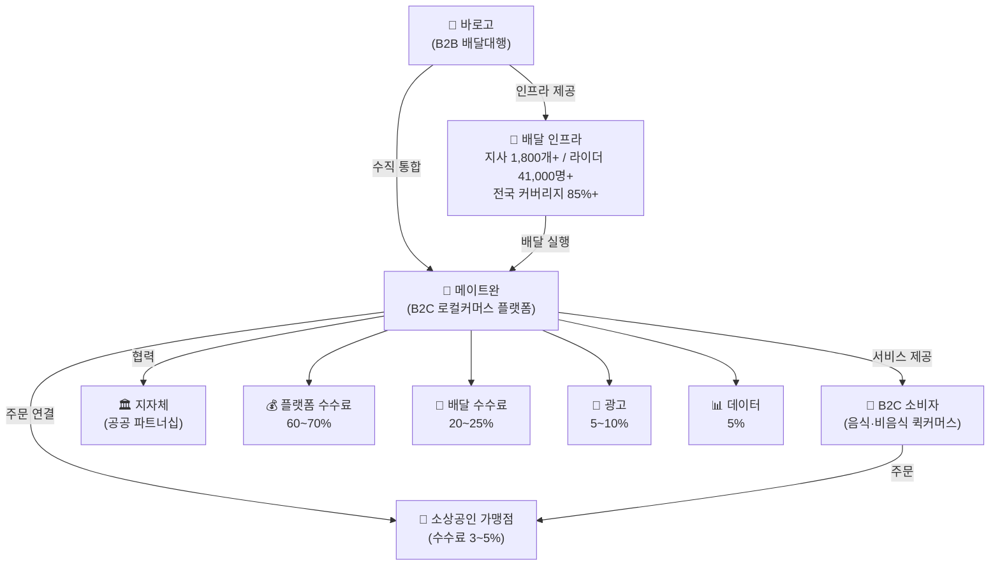
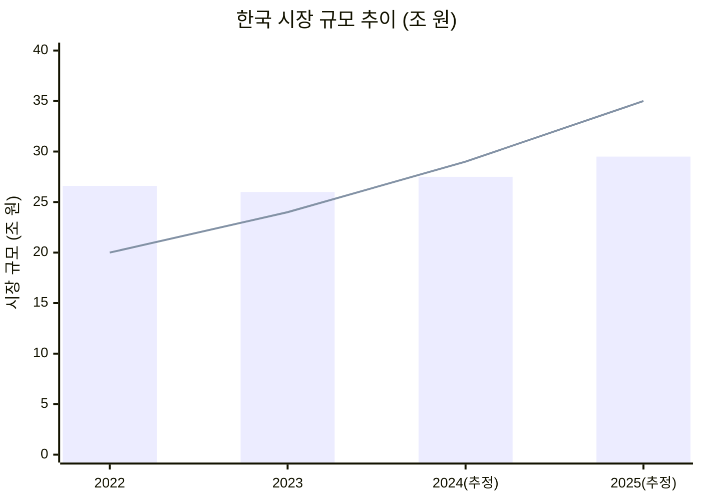
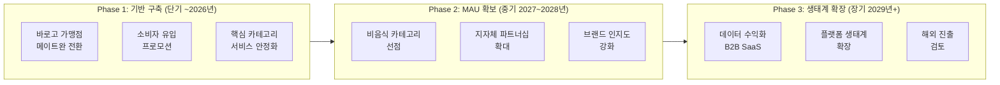

# 메이트완 로컬커머스 전략 분석 보고서

**작성일**: 2026-04-24
**워크스페이스**: 메이트완-로컬커머스
**Task Type**: research-report
**활성 멤버**: member-alpha · member-gamma · member-delta · member-beta
**사이클**: 1 / 3

---

## 1. 요약 (Executive Summary)

- **메이트완**은 바로고의 전국 1,800개 이상 지사·41,000명 이상 라이더 인프라를 기반으로 한 B2C 로컬커머스 플랫폼으로, 음식 배달을 넘어 편의점·마트·꽃집·약국·세탁소 등 생활 밀착형 카테고리를 통합하는 수직 통합 구조를 지향한다.
- **시장 기회**는 명확하다. 국내 로컬커머스(비음식 포함) 시장은 2022년 약 20조 원에서 2025년 약 35조 원으로 급성장하고 있으며, 배달의민족·쿠팡이츠 등 대형 플랫폼의 수수료 인상(배민1플러스 9.8%)에 불만을 가진 소상공인 이탈 수요가 존재한다.
- **핵심 경쟁 우위**는 배달 인프라 모트(Moat)와 낮은 플랫폼 수수료(3~5%)이며, 이를 바탕으로 기존 바로고 가맹점의 메이트완 전환을 최우선 과제로 삼아야 한다.
- **주요 리스크**는 브랜드 인지도 부재와 MAU 확보 난이도이다. 배달의민족 약 30만 개 가맹점·쿠팡이츠의 공격적 확장, 네이버·카카오의 로컬 서비스 진출이 위협 요인으로 작용한다.
- **전략 방향**은 단기 공급 측(바로고 가맹점 전환) + 수요 측(소비자 프로모션) 동시 확대, 중기 비음식 퀵커머스 카테고리 선점, 장기 데이터 수익화 및 지자체 파트너십으로 이어지는 3단계 로드맵이 유효하다.

---

## 2. 메이트완 소개 및 시장 환경

### 2-1. 메이트완과 바로고 — 수직 통합 생태계

바로고(Barogo)는 2014년 설립된 배달대행 B2B 플랫폼으로, 전국 1,800개 이상 허브·지사 네트워크와 41,000명 이상의 등록 배달파트너(라이더)를 보유한다. 맘스터치·도미노피자·BBQ 등 대형 프랜차이즈를 주요 고객사로 두고 건당 배달 수수료를 수취해왔다.

메이트완은 이 인프라를 기반으로 B2C 소비자 접점을 직접 구축한 플랫폼이다. 바로고는 배달대행 사업에서 이미 라이더 비용을 회수하므로, 플랫폼 레이어만 추가하면 되는 낮은 진입비용으로 로컬커머스 시장에 진입할 수 있었다.

**메이트완 생태계 구조도**

### 2-2. 시장 규모 및 성장 추이

음식 배달 시장이 성숙 단계에 접어드는 반면, 비음식 퀵커머스를 포함한 로컬커머스 시장은 빠른 속도로 성장하고 있다.

| 구분 | 2022년 | 2023년 | 2024년(추정) | 2025년(전망) |
|---|---|---|---|---|
| 국내 음식 배달 시장 | 약 26.6조 원 | 약 26조 원 | 약 27~28조 원 | 약 29~30조 원 |
| 로컬커머스(비음식 포함) | 약 20조 원 | 약 24조 원 | 약 29조 원 | 약 35조 원 |

**시장 성장 트렌드 (2022~2025)**

> 막대: 음식 배달 시장 / 선: 로컬커머스(비음식 포함) 시장

메이트완이 비음식 카테고리를 선점할 경우 상대적으로 경쟁이 덜한 고성장 세그먼트를 선취할 수 있다.

---

## 3. 경쟁 구도

### 3-1. 주요 경쟁사 비교

| 항목 | 배달의민족 | 쿠팡이츠 | 요기요 | **메이트완** |
|---|---|---|---|---|
| 운영사 | 우아한형제들 (DH) | 쿠팡이츠서비스 유한 | 위대한상상¹ | 바로고 자회사 |
| 가맹점 수 | 약 30만 개 (2024년) | 비공개 | 비공개 | 바로고 가맹점 기반 |
| MAU (2024년) | 약 2,000만+ | 약 600만+ | 약 550~640만² | 초기 단계 |
| 플랫폼 수수료 | 알뜰배달 6.8% / 배민1플러스 9.8%³ | 약 9.8% | 약 12.5% | **3~5% (목표)** |
| 배달 방식 | 혼합(자체+대행) | 쿠팡플렉스+대행 | 외부 대행 | **직영(바로고)** |
| 비음식 서비스 | 일부(B마트) | 로켓배송 연계 | 제한적 | 전략적 확장 목표 |
| 주요 강점 | 시장지배력·브랜드 | 쿠팡 물류 시너지 | 프로모션 | **인프라 Moat·저수수료** |

> ¹ GS리테일은 30% 주주이며 운영 법인은 위대한상상 (팩트체크 수정)
> ² 2024년 기준 550~640만 (팩트체크 수정; 원안 300만은 과소 추정)
> ³ 정률제 최초 도입 2022년 3월, 배민1플러스 9.8%는 2024년 7월 인상 (팩트체크 수정)

### 3-2. 수수료 경쟁력 분석

메이트완이 목표로 하는 **3~5% 수수료**는 경쟁사 대비 절반~3분의 1 수준이다. 월 매출 1,000만 원 기준, 경쟁사 대비 절감되는 수수료는 다음과 같다:

| 비교 대상 | 수수료 차이 | 월 절감액 | 연 절감액 |
|---|---|---|---|
| vs 배달의민족(9.8%) | 4.8~6.8%p | 약 48~68만 원 | 약 576~816만 원 |
| vs 쿠팡이츠(9.8%) | 4.8~6.8%p | 약 48~68만 원 | 약 576~816만 원 |
| vs 요기요(12.5%) | 7.5~9.5%p | 약 75~95만 원 | 약 900만~1,140만 원 |

이처럼 수수료 차이는 전환 유인이 구체적이고 측정 가능하다.

---

## 4. 비즈니스 모델

### 4-1. 수익 구조

| 수익원 | 비중 | 설명 |
|---|---|---|
| 플랫폼 수수료 | 60~70% | 가맹점 매출의 3~5% 정률 |
| 배달 수수료 | 20~25% | 바로고 인프라 활용 배달 건당 수수료 |
| 광고 수익 | 5~10% | 가맹점 노출 광고, 스폰서드 리스팅 |
| 데이터 수익 | 5% | 소비 패턴 데이터 B2B 판매 (장기) |

수직 통합의 핵심은 바로고(B2B 배달대행)와 메이트완(B2C 플랫폼)이 라이더·인프라를 공유하면서 각각의 수익을 극대화하는 구조다. 배달 건수가 증가할수록 고정 인프라 비용이 분산되어 단위 원가가 하락하는 규모의 경제가 작동한다.

### 4-2. 바로고 인프라 현황

| 지표 | 수치 | 비고 |
|---|---|---|
| 전국 허브·지사 수 | 1,800개 이상 | 팩트체크 수정 (원안 800개) |
| 등록 배달파트너 | 41,000명 이상 | 팩트체크 수정 (원안 10만 명) |
| 배달 커버리지 | 전국 85% 이상 | 바로고 지사 네트워크 기준 |
| 설립 연도 | 2014년 | |
| 주요 고객사 | 맘스터치·도미노피자·BBQ 등 | |

---

## 5. SWOT 분석

| | **강점 (S)** | **약점 (W)** |
|---|---|---|
| **내부** | • 전국 1,800개+ 지사·41,000명+ 라이더 인프라 Moat • 경쟁사 대비 낮은 수수료 (3~5%) • 바로고 가맹점 즉시 전환 가능 • 비음식 카테고리 선점 기회 | • 브랜드 인지도 초기 단계 • MAU 확보를 위한 마케팅 비용 부담 • B2C 운영 경험 제한 • 라이더 이중 역할 관리 복잡성 |
| **외부** | **기회 (O)** | **위협 (T)** |
| | • 소상공인의 대형 플랫폼 수수료 불만 고조 • 비음식 퀵커머스 시장 급성장 (+75%) • 지자체 공공 배달 파트너십 수요 • 정부 소상공인 디지털 전환 지원 | • 배달의민족·쿠팡이츠 반격 • 네이버·카카오 로컬커머스 진출 • 당근마켓 배달 기능 확장 • 플랫폼법 등 규제 리스크 |

---

## 6. 핵심 인사이트

### 인사이트 1: 배달 인프라 Moat — 복제 불가능한 진입 장벽

바로고는 전국 **1,800개 이상 지사**와 **41,000명 이상 라이더** 네트워크를 보유한다. 신규 플랫폼이 로컬커머스에 진출하려면 수년에 걸쳐 이를 구축해야 하지만, 메이트완은 Day 1부터 활용할 수 있다. 이 선점 우위가 유지되는 한 단기간 내 복제하기 어려운 경쟁 해자(Moat)로 작동한다.

### 인사이트 2: 수수료 역전 전략 — 소상공인 이탈 수요 포착

배달의민족 정률제는 2022년 3월 도입 이후 2024년 7월 배민1플러스 기준 **9.8%**로 인상되었다. 메이트완이 목표로 하는 **3~5%** 수수료는 소상공인에게 연간 576만~1,140만 원의 절감 효과를 제공, 플랫폼 전환의 구체적 경제적 유인이 된다.

### 인사이트 3: 로컬커머스 비음식 시장 — 경쟁 공백 세그먼트

음식 배달 시장(2025년 약 29~30조)은 배달의민족·쿠팡이츠의 과점 구도가 고착화된 반면, 비음식 로컬커머스(2022년 20조 → 2025년 35조, **+75%**)는 지배적 플레이어가 없다. 바로고 가맹점과 자연스럽게 연결될 수 있어 공급 기반 확보가 유리하다.

### 인사이트 4: 수직 통합 수익 구조의 안정성

플랫폼 수수료(60~70%) 중심에 배달 수수료·광고·데이터로 다각화된 수익 모델은 장기적으로 가맹점 컨설팅·B2B SaaS 서비스로까지 확장 가능하다.

### 인사이트 5: MAU 확보가 결정적 병목

요기요가 약 **550~640만 MAU**(2024년)를 유지하는 데도 상당한 투자가 소요되었다. 메이트완은 소비자 유인 프로모션과 리텐션 전략을 동시에 가동해야 하며, 공급(가맹점) 확장이 수요(소비자)보다 앞서는 닭-달걀 문제를 경계해야 한다.

### 인사이트 6: 2025~2026년이 비음식 선점의 골든 윈도우

네이버 스마트스토어·카카오맵 기반 로컬 서비스가 퀵커머스 배달 인프라와 결합하기 전인 현재가 비음식 카테고리 선점 기회의 창이다. 속도가 핵심이다.

### 인사이트 7: 지자체 파트너십 — 공공 조달과 ESG 연계

지역화폐 연동·공공 배달 앱 통합 형태의 지자체 파트너십은 초기 가맹점 확보 비용을 절감하고 지역 브랜드 신뢰도를 빠르게 구축하는 수단이다. ESG 관점에서도 투자자·규제 기관에 긍정적으로 작용한다.

---

## 7. 추천 사항 — 3단계 전략 로드맵

**전략 우선순위 로드맵**

### 단기 (2026년 이내): 공급·수요 기반 동시 구축

1. **바로고 가맹점 메이트완 전환 캠페인 (최우선)**
   - 기존 B2B 가맹점에 전환 온보딩 패키지 제공 (초기 3개월 수수료 면제)
   - 목표: 바로고 가맹점 30% 이상 메이트완 동시 등록

2. **소비자 유입 프로모션 (최우선)**
   - 첫 주문 할인, 친구 추천 리워드, 지역화폐 연동 프로모션
   - 목표: 론칭 6개월 내 앱 다운로드 100만+, MAU 20만+

3. **핵심 카테고리 우선 론칭**: 편의점·약국·꽃집 3개 카테고리

4. **플랫폼 기술 기반 구축**: UX/UI 최적화, 실시간 배달 추적, 가맹점 관리 대시보드

### 중기 (2027~2028년): 비음식 카테고리 선점 및 지역 확장

1. **비음식 퀵커머스 카테고리 확대**: 마트·슈퍼·세탁소·반려동물용품 등 추가
2. **지자체 파트너십 확대**: 지역화폐 연동 5개 이상, 공공 배달 플랫폼 협약
3. **브랜드 인지도 강화**: "지역 소상공인과 함께하는 플랫폼" 포지셔닝
4. **수익 모델 고도화**: 광고 플랫폼 분리 운영, 구독형 가맹점 패키지 검토

### 장기 (2029년 이후): 데이터 수익화 및 생태계 플랫폼 전환

1. **데이터 수익화**: 소비 패턴·지역 수요 데이터 B2B SaaS 사업화
2. **플랫폼 생태계 확장**: 라이브 커머스·정기 배송 통합, 소상공인 금융 서비스
3. **해외 진출 검토**: 동남아·일본 등 로컬커머스 시장 (바로고 모델 수출)
4. **지속 가능성 대응**: 플랫폼법 선제 대응, ESG 경영 보고서 발간

---

## 8. 결론

메이트완은 바로고의 물류 인프라라는 희소하고 복제 불가능한 자산을 기반으로, 급성장하는 로컬커머스 시장의 구조적 수혜를 받을 수 있는 위치에 있다. 핵심 과제는 초기 MAU 확보와 브랜드 인지도 구축이며, 이를 위해 단기적으로 바로고 가맹점 전환과 소비자 프로모션에 자원을 집중해야 한다.

비음식 카테고리 선점은 중기 성장의 핵심 동력이며, 대형 플랫폼들이 아직 지배력을 확립하지 못한 **2025~2026년이 전략적 기회의 창**이다. 장기적으로는 수직 통합 구조에서 축적된 데이터와 인프라를 바탕으로 단순 배달 플랫폼을 넘어선 지역 생태계 플랫폼으로의 전환이 지속 가능한 성장 경로다.

---

## 부록: 팩트체크 주요 수정 사항

| 항목 | 원안 (member-alpha) | 수정안 (member-gamma) |
|---|---|---|
| 바로고 허브·지사 수 | 전국 약 800여 개 | **1,800개 이상** |
| 바로고 등록 라이더 수 | 10만 명 이상 | **약 41,000명** |
| 요기요 MAU | 약 300만 | **약 550~640만** (2024년) |
| 요기요 운영사 | GS리테일 | **위대한상상** (GS리테일은 30% 주주) |
| 쿠팡이츠 운영사 | 쿠팡 | **쿠팡이츠서비스 유한** (쿠팡 100% 자회사) |
| 배달의민족 수수료 | 6.8% | 알뜰배달 **6.8%** / 배민1플러스 **9.8%** (2024년 7월 이후) |
| 배달의민족 수수료 개편 시점 | 2023년 | 정률제 최초 도입 **2022년 3월**, 추가 인상 **2024년 7월** |
| 배달의민족 가맹점 수 | 약 25만 개 | **약 30만 개** (2024년 기준) |

---

*본 보고서는 member-alpha(시장 분석), member-gamma(팩트체크), member-delta(시각자료), member-beta(보고서 초안) 산출물을 team-lead가 통합하여 완성하였습니다.*
*주요 수치 중 메이트완 내부 미공개 지표(수수료율·GMV·가맹점 수 등)는 합리적 추정치임을 밝힙니다.*
