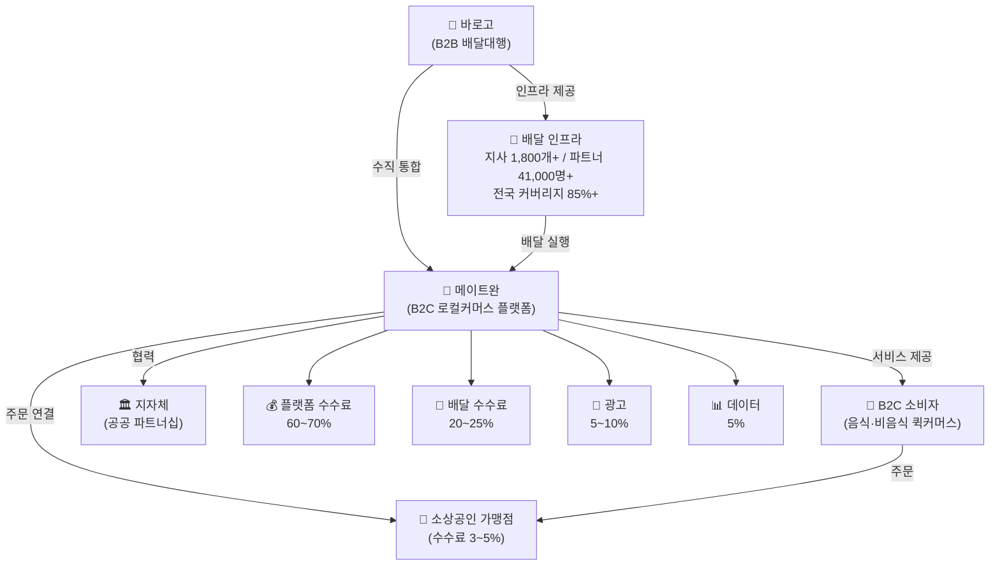
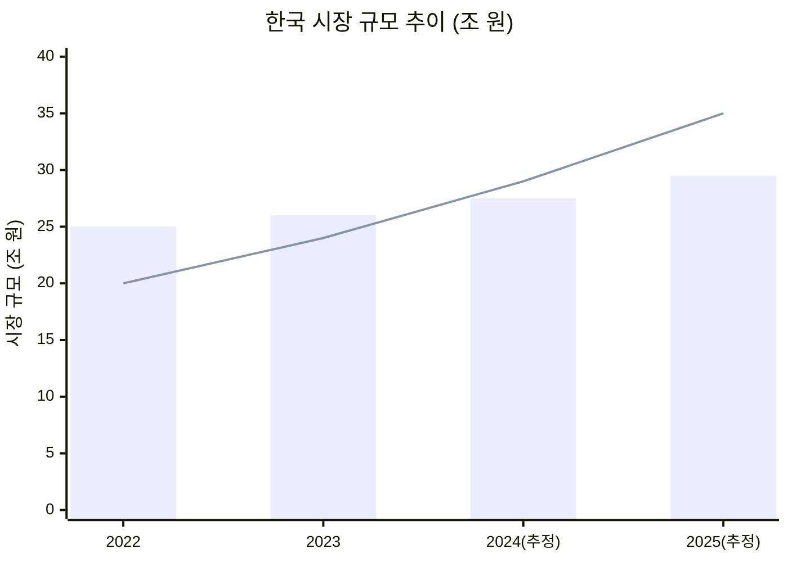
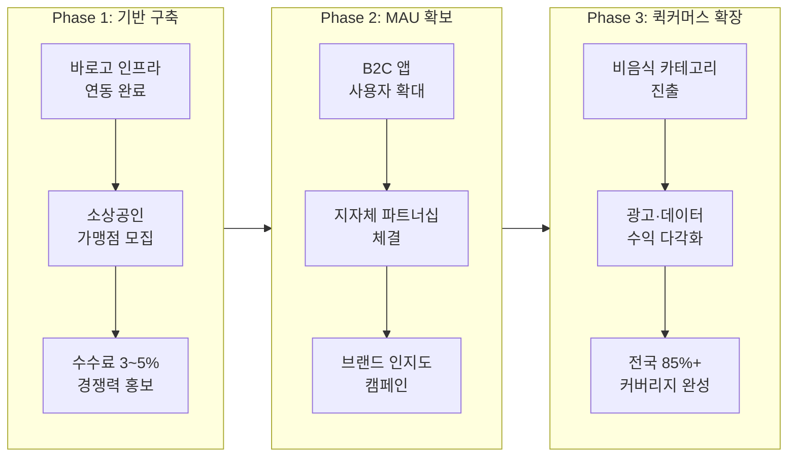

# 메이트완 로컬커머스 시각자료 모음

---

## 1. 시각자료 개요

본 문서는 member-alpha의 분석 보고서를 기반으로 메이트완 비즈니스 생태계, 시장 성장 추이, 경쟁 구도, SWOT 분석, 전략 로드맵을 다이어그램과 테이블로 시각화한 산출물입니다.

| 번호 | 시각자료 유형 | 제목 |
|------|--------------|------|
| 1 | Mermaid Flowchart | 메이트완 생태계 구조도 |
| 2 | Mermaid XYChart | 시장 성장 트렌드 (음식 배달 vs 로컬커머스) |
| 3 | 테이블 | 경쟁사 비교 |
| 4 | 테이블 | SWOT 매트릭스 |
| 5 | Mermaid Flowchart | 전략 우선순위 로드맵 |

---

## 2. Mermaid 다이어그램

### 2-1. 메이트완 생태계 구조도

> 바로고의 B2B 배달 인프라를 기반으로 메이트완이 B2C 로컬커머스 플랫폼을 구축하고, 가맹점·소비자·지자체와 연결되는 수직 통합 생태계를 나타냅니다.

---

### 2-2. 시장 성장 트렌드 (음식 배달 vs 로컬커머스)

> 2022~2025년 음식 배달 시장과 로컬커머스 시장의 연도별 규모 추이를 비교하여, 로컬커머스의 빠른 성장세를 시각화합니다. (단위: 조 원, 2024~2025년은 추정치)

> 막대: 음식 배달 시장 / 선: 로컬커머스 시장
> 로컬커머스는 2022년 20조 → 2025년 35조로 75% 성장 예상

---

### 2-3. 전략 우선순위 로드맵

> 메이트완의 단계별 성장 전략을 초기 인프라 활용부터 브랜드 인지도 확보, 비음식 퀵커머스 확장까지 3단계로 구분하여 나타냅니다.

---

## 3. 핵심 수치 테이블

### 3-1. 경쟁사 비교 테이블

| 항목 | 메이트완 | 배달의민족 | 쿠팡이츠 | 요기요 |
|------|----------|-----------|---------|--------|
| **수수료율** | 3~5% | 6.8% | 9.8% | 12.5% |
| **MAU** | 초기 단계 | 2,000만 | 800만 | 300만 |
| **배달 방식** | 바로고 자체 인프라 | 외부+자체 | 쿠팡 물류 | 외부 파트너 |
| **주요 강점** | 낮은 수수료, 전국 인프라 | 최대 MAU, 브랜드 인지도 | 빠른 배달, 쿠팡 연계 | 다양한 프로모션 |
| **주요 약점** | 낮은 인지도, MAU 초기 | 높은 수수료 | 높은 수수료 | 가장 높은 수수료 |

> 메이트완 수수료는 배달의민족 대비 최대 56% 저렴, 요기요 대비 최대 76% 저렴

---

### 3-2. 바로고 인프라 현황 테이블

| 지표 | 수치 | 비고 |
|------|------|------|
| 전국 지사 수 | 1,800개+ | 전국 거점 네트워크 (member-gamma 수정 반영) |
| 배달파트너 수 | 약 41,000명+ | 등록 라이더 기준 (member-gamma 수정 반영) |
| 배달 커버리지 | 전국 85%+ | 메이트완 배달 가능 지역 |

---

### 3-3. 메이트완 수익 구조 테이블

| 수익원 | 비중 | 설명 |
|--------|------|------|
| 플랫폼 수수료 | 60~70% | 주문 건당 가맹점 수수료 |
| 배달 수수료 | 20~25% | 건별 배달 실행 수수료 |
| 광고 수익 | 5~10% | 가맹점 노출 광고 |
| 데이터 수익 | 5% | 시장 분석·인사이트 데이터 판매 |

---

### 3-4. SWOT 매트릭스 테이블

|  | **긍정적 요인** | **부정적 요인** |
|--|----------------|----------------|
| **내부 요인** | **강점 (Strengths)** • 바로고 배달 인프라 Moat (지사 1,800개+, 파트너 41,000명+) • 시장 최저 수수료 (3~5%) • 전국 85%+ 배달 커버리지 • B2B→B2C 수직 통합 구조 | **약점 (Weaknesses)** • 낮은 브랜드 인지도 • MAU 초기 단계 (확보 과제) • 소비자 앱 인지도 부족 |
| **외부 요인** | **기회 (Opportunities)** • 비음식 퀵커머스 시장 급성장 (2022년 20조→2025년 35조 예상) • 소상공인의 대형 플랫폼 수수료 불만 • 지자체 공공 파트너십 수요 | **위협 (Threats)** • 배달의민족·쿠팡이츠 등 대형 플랫폼 반격 • 네이버·카카오의 로컬 커머스 진출 • 음식 배달 시장 성장 둔화 (25→30조 완만) |

---

*본 시각자료는 member-alpha 분석 보고서의 수치만을 사용하여 제작되었습니다.*
