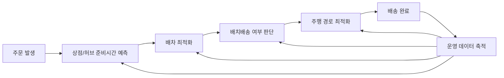

# 물류 최적화 개념 정의 및 국내/해외 사례 기반 바로고 방향성 보고서
**작성일**: 2026-08-18
**Task Type**: research-report
**활성 멤버**: alpha(조사) · gamma(팩트체크) · delta(시각화) · beta(보고서)
**사이클**: 1 / 3
**승인**: human_approval=false (AUTO 모드 자동 완료)

**Creator**: team-lead
**Created**: 2026-08-18 12:55
**Version**: 1.1

## 요약

국내외 사례는 모두 배차만이 아니라 준비, 허브 처리, 배송 단계를 함께 다룬다 (확인됨, [출처1][출처2][출처3][출처4][출처5][출처6]). 이를 바로고 관점으로 해석하면, 물류 최적화는 `주문-준비-배차-주행`을 예측 가능하게 연결하는 운영 체계로 보는 편이 맞다 (추정). 국내 사례에서는 CJ대한통운이 자동배차 성공률 `80% 이상`을 공개했고 (확인됨, [출처1]), SSG닷컴은 처리량 `450 -> 3000건` 확대를 제시했으며 (확인됨, [출처2]), 롯데마트는 최대 `3만3000건` 처리와 `24시간 13회차` 배송 체계를 공개했다 (확인됨, [출처3]).

해외 사례에서는 Amazon이 적치 `최대 75%` 고속화와 주문 처리시간 `최대 25%` 단축을 제시했고 (확인됨, [출처4]), Ocado는 `50품목 5분 피킹`과 `초당 1억 건` 최적화 계산을 설명했으며 (확인됨, [출처5]), JD Logistics는 피킹 효율 `3배 이상`과 보관밀도 `2.5배`를 공개했다 (확인됨, [출처6]). UPS ORION의 연 `1억 마일` 절감 수치는 이번 세션에서 원문 재확인이 되지 않아 `확인 필요`로 유지한다 ([출처7]).

이 사례들을 바로고 관점으로 번역하면 우선순위는 `상점 준비시간 예측`, `공차거리 관리`, `권역별 배치배송`, `도심 소형 허브 실험` 순서가 적절하다 (추정). 이 순서는 `배달 직전 병목 개선 -> 배달 중 효율 개선 -> 확장용 인프라 실험` 순으로 투자 난이도와 즉시성을 고려한 것이다 (추정).

## 핵심 인사이트

### 1. 물류 최적화의 핵심은 `배차 단일 개선`이 아니라 `운영 연결`이다

국내외 사례는 공통적으로 배차 이전 단계의 준비, 허브 처리, 배송 슬롯을 함께 다뤘다 (추정, [출처1][출처2][출처3][출처4][출처5][출처6]). 바로고도 라이더 배차만 고도화해선 체감 품질 개선이 제한될 가능성이 크다 (추정).

### 2. 바로고에는 `준비시간 예측`이 가장 먼저 붙어야 한다

SSG와 롯데 사례는 피킹 완료 시점과 배송 시점을 맞추는 구조가 중요하다는 점을 보여준다 (추정, [출처2][출처3]). 음식배달에서도 상점별 준비시간 편차가 크다면, 준비시간 예측은 ETA 보정이 아니라 핵심 수익성 변수일 수 있다 (추정).

### 3. `공차거리`와 `배차 성공률`은 바로고의 핵심 KPI가 될 수 있다

CJ대한통운 사례는 배차 성공률 자체가 서비스 경쟁력의 일부가 될 수 있음을 보여준다 (추정, [출처1]). UPS 사례는 수치 재확인이 필요하지만, 경로 최적화가 비용 구조를 바꾼다는 방향성 자체는 참고 가치가 있다 (확인 필요, [출처7]).

### 4. 허브형 운영을 강화할수록 `허브 내부 처리시간`이 중요해진다

Amazon, Ocado, JD 사례는 모두 허브 내부 처리속도와 라스트마일을 한 시스템으로 연결했다 (확인됨, [출처4][출처5][출처6]). 바로고가 퀵커머스나 B2B 즉시배송으로 확장하면, 라이더 숫자보다 허브 처리시간이 더 중요한 병목이 될 수 있다 (추정).

### 참고 시각자료

| 사례 | 최적화 대상 | 공개 효과 |
|---|---|---|
| CJ대한통운 더 운반 | 화주-차주 배차 | 자동배차 성공률 `80% 이상 (확인됨, [출처1])` |
| SSG PP센터 | 점포 피킹·패킹 | 처리량 `450 -> 3000건 (확인됨, [출처2])` |
| 롯데 제타 스마트센터 | CFC·콜드체인·슬롯 | 최대 `3만3000건 (확인됨, [출처3])`, `24시간 13회차 (확인됨, [출처3])` |
| UPS ORION | 배송 경로 | 연 `1억 마일 절감 (확인 필요, [출처7])` |
| Amazon Sequoia | 센터 입고·적치 | 적치 `최대 75% (확인됨, [출처4])`, 처리시간 `최대 25% 단축 (확인됨, [출처4])` |
| Ocado OSP | 장보기 end-to-end | `50품목 5분 피킹 (확인됨, [출처5])` |
| JD Zhilang | 창고 피킹·보관 | 피킹 `3배 이상 (확인됨, [출처6])`, 보관밀도 `2.5배 (확인됨, [출처6])` |

## 추천 사항

### 1. 상점 준비시간 예측을 배차 엔진에 연결한다

상점별 평균 준비시간과 시간대 편차를 반영하면 라이더 대기시간을 줄일 가능성이 높다 (추정, [출처2][출처3]). 바로고의 첫 KPI는 `라이더 대기시간`, `준비 완료 후 미배차 시간`, `예상 대비 실제 픽업 오차`가 적절하다 (추정).

### 2. 권역별 배치배송과 시간대 SLA를 제한적으로 실험한다

밀도가 높은 권역만 대상으로 배치배송과 시간대 SLA를 실험하는 편이 품질 리스크를 낮춘다 (추정, [출처5][출처7]). 일괄 정책보다 권역별 운영 규칙이 현실적이다 (추정).

### 3. 리테일·B2B용 도심 소형 허브 모델을 검토한다

대형 자동화보다 회수기간이 짧은 경량 허브 모델이 바로고에 더 현실적일 수 있다 (추정, [출처3][출처4][출처6]). 음식배달 외 물량으로 확장할수록 피킹 완료 시점과 라이더 도착 시점을 맞추는 구조가 중요해진다 (추정).

### 4. 대외 메시지를 `빠름`보다 `예측 가능성` 중심으로 바꾼다

배달시간보다 `정시 도착률`, `배차 성공률`, `공차거리 감소`를 강조하는 편이 바로고의 운영 역량을 설명하기에 유리할 수 있다 (추정, [출처1][출처7]).

## 팩트체크 요약 (member-gamma)

- CJ, SSG, 롯데 관련 수치는 국내 기사 본문 기준으로 직접 확인했다 (확인됨).
- Amazon, Ocado, JD 수치는 각사 공식 소개 페이지 기준으로 직접 확인했다 (확인됨).
- UPS ORION 관련 수치는 이번 세션에서 원문 재확인이 되지 않아 `확인 필요`로 유지했다.
- 따라서 전략 제안 문장은 `추정`, 수치 문장은 `확인됨` 또는 `확인 필요`로 구분했다.

## 출처 메모

- [출처1] https://biz.heraldcorp.com/article/10817369
- [출처2] https://www.betanews.net/article/view/beta202111040018
- [출처3] https://www.etoday.co.kr/news/view/2612325
- [출처4] https://www.aboutamazon.com/news/operations/amazon-introduces-new-robotics-solutions
- [출처5] https://www.ocadogroup.com/about-us/our-technology
- [출처6] https://jdcorporateblog.com/jd-logistics-introduces-zhilang-intelligent-warehousing-solution-at-cemat-asia-2024/
- [출처7] https://www.forbes.com/sites/peterhigh/2019/12/11/ups-tech-chief-wins-forbes-cio-innovation-award-by-developing-a-global-smart-logistics-network/
