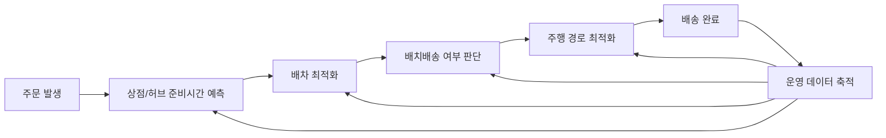

**Creator**: member-delta  
**Created**: 2026-08-18 12:55  
**Version**: 1.1

# 시각자료 개요

아래 시각자료는 `주문-준비-배차-주행` 흐름과 사례별 최적화 포인트를 정리한 것이다. Mermaid 구조도와 로드맵은 공개 사례를 바탕으로 한 분석자 종합 표현이므로 `추정`으로 본다. 표 안의 수치에는 가능한 범위에서 `확인됨`, `추정`, `확인 필요`를 직접 표기했다.

# Mermaid 다이어그램

## 1. 물류 최적화 작동 구조 (추정)

## 2. 바로고 적용 로드맵 (추정)

# 핵심 수치 테이블

## 1. 사례 비교 요약

| 사례 | 최적화 대상 | 핵심 방식 | 공개 효과 |
|---|---|---|---|
| CJ대한통운 더 운반 | 화주-차주 배차 | AI 자동배차 | 자동배차 성공률 `80% 이상 (확인됨, [출처1])` |
| SSG PP센터 | 점포 피킹·패킹 | 자동화 소터, DAS, 동선 최적화 | 생산성 `20% 증가 (확인됨, [출처2])`, 처리량 `450 -> 3000건 (확인됨, [출처2])` |
| 롯데 제타 스마트센터 | CFC·콜드체인·슬롯 | OSP, 로봇, 다회차 배송 | 최대 `3만3000건 (확인됨, [출처3])`, `24시간 13회차 (확인됨, [출처3])` |
| UPS ORION | 배송 경로 | 경로 최적화 알고리즘 | 연 `1억 마일 절감 (확인 필요, [출처7])` |
| Amazon Sequoia | 센터 입고·적치 | 통합 로봇 시스템 | 적치 `최대 75% (확인됨, [출처4])`, 처리시간 `최대 25% 단축 (확인됨, [출처4])` |
| Ocado OSP | 장보기 end-to-end | AI, CFC, 라우팅, 시뮬레이션 | `50품목 5분 피킹 (확인됨, [출처5])`, `초당 1억 건 계산 (확인됨, [출처5])` |
| JD Zhilang | 창고 피킹·보관 | GTP, AGV, 버퍼 알고리즘 | 피킹 `3배 이상 (확인됨, [출처6])`, 보관밀도 `2.5배 (확인됨, [출처6])` |

## 2. 바로고 우선순위 정리

| 우선순위 | 바로고 과제 | 기대효과 | 근거 |
|---|---|---|---|
| 1 | 상점 준비시간 예측 + 공차거리 관리 | 대기시간 축소 (추정) | [출처1][출처2] 기반 해석 |
| 2 | 권역별 배치배송 + 시간대 SLA | 처리량 안정화 (추정) | [출처5][출처7] 기반 해석 |
| 3 | 도심 소형 허브 + 리테일/B2B | 확장성 확보 (추정) | [출처3][출처4][출처6] 기반 해석 |

## 3. 해석 메모

| 관찰 | 의미 |
|---|---|
| 선도사는 배차만 최적화하지 않음 | 준비-출고-배송 연결이 중요하다는 뜻 (추정) |
| 수치 성과는 운영 데이터 축적 뒤 발생 | 바로고도 데이터 구조화가 선행돼야 함 (추정) |
| 자동화는 크기보다 회수기간이 중요 | 바로고는 소형·모듈형 실험이 현실적일 수 있음 (추정) |

## 출처 링크

- [출처1] https://biz.heraldcorp.com/article/10817369
- [출처2] https://www.betanews.net/article/view/beta202111040018
- [출처3] https://www.etoday.co.kr/news/view/2612325
- [출처4] https://www.aboutamazon.com/news/operations/amazon-introduces-new-robotics-solutions
- [출처5] https://www.ocadogroup.com/about-us/our-technology
- [출처6] https://jdcorporateblog.com/jd-logistics-introduces-zhilang-intelligent-warehousing-solution-at-cemat-asia-2024/
- [출처7] https://www.forbes.com/sites/peterhigh/2019/12/11/ups-tech-chief-wins-forbes-cio-innovation-award-by-developing-a-global-smart-logistics-network/
