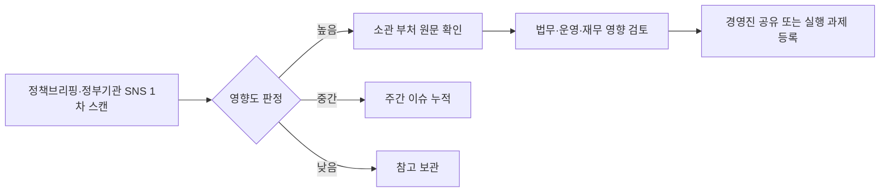

# 바로고의 정부 정책·기관 대응 모니터링 채널 조사

**작성일**: 2026-07-29
**Task Type**: research-report
**활성 멤버**: alpha · gamma · delta · beta
**사이클**: 1 / 3
**승인**: human_approval=false (AUTO 모드 자동 완료)

## 요약

- 바로고가 정부 정책 및 기관 대응을 위해 기본 모니터링해야 할 외부 공식 채널은 11개다.
- 이 중 8개는 매일 확인하는 우선 채널, 3개는 주기 점검형 보조 채널로 운영하는 구성이 효율적이다.
- 핵심 리스크 축은 `입법/법령`, `플랫폼·거래 규제`, `노동·물류 운영`, `개인정보·세무`의 4개다.

| 채널 | 우선순위 | 공식 URL | 바로고 관점의 의미 |
|---|---|---|---|
| 국민참여입법센터 | 우선 | https://opinion.lawmaking.go.kr/ | 정부입법 단계 조기 감지 |
| 국회입법예고 | 우선 | https://pal.assembly.go.kr/ | 의원입법·상임위 흐름 추적 |
| 국가법령정보센터 최신법령소식 | 우선 | https://www.law.go.kr/lsSc.do?menuId=1&subMenuId=23&tabMenuId=121 | 공포·시행 단계 최종 확인 |
| 대한민국 정책브리핑 | 우선 | https://www.korea.kr/ | 전 부처 보도자료 허브 |
| 정책브리핑 정부기관 SNS | 우선 | https://www.korea.kr/etc/deptSns.do | 부처 블로그·SNS 실시간 스캔 |
| 국토교통부 공식 블로그/SNS | 우선 | https://www.korea.kr/etc/deptSns.do?deptNo=19 | 생활물류·교통·도심물류 정책 신호 |
| 고용노동부 | 우선 | https://www.moel.go.kr/news/enews/report/enewsList.do | 라이더·택배·안전 이슈 핵심 |
| 공정거래위원회 | 우선 | https://www.ftc.go.kr/ | 플랫폼 약관·수수료·전자상거래 규제 |
| 개인정보보호위원회 | 보조 | https://www.pipc.go.kr/ | 주문·위치·회원 데이터 규제 |
| 국세청 | 보조 | https://www.nts.go.kr/ | 정산·세무·전자세금계산서 영향 |
| 규제정보포털 | 보조 | https://www.better.go.kr/ | 다부처 규제 현황 일괄 스캔 |

## 핵심 인사이트

### 1. 입법예고 채널이 가장 빠른 선행 경보다

`국민참여입법센터`는 `통합입법예고`, `입법진행현황`, `입법정보 발송신청`을 제공하고, `국회입법예고`는 `진행 중 입법예고`, `위원회별 입법예고`, `RSS`를 제공한다. 따라서 언론 기사나 부처 발표 이전 단계에서 제도 변경 가능성을 먼저 확인하는 용도로 가장 중요하다.

### 2. 정책브리핑은 넓게, 소관 부처는 깊게 보는 구조가 맞다

`대한민국 정책브리핑`은 전 부처 보도자료와 정책 뉴스를 한 곳에 모아주고, `정책브리핑 정부기관 SNS`는 부처 공식 블로그·SNS 업데이트를 빠르게 노출한다. 실무 운영은 이 두 채널로 1차 스캔한 뒤, 이슈별로 고용노동부·공정거래위원회·국토교통부·개인정보보호위원회·국세청 원문으로 내려가는 방식이 효율적이다.

### 3. 바로고 실무 영향이 큰 기관은 노동, 거래규제, 물류, 데이터 축에 몰려 있다

- 고용노동부: 라이더, 택배, 물류 현장 안전, 행정해석
- 공정거래위원회: 플랫폼 수수료, 약관, 소비자보호, 전자상거래
- 국토교통부: 생활물류, 교통, 도심물류 제도
- 개인정보보호위원회: 위치정보, 주문정보, 회원데이터 처리
- 국세청: 부가가치세, 사업자등록, 전자세금계산서

### 4. 최소 운영안은 `우선 8개 / 보조 3개` 체계다

| 운영 구분 | 채널 수 | 권장 주기 |
|---|---:|---|
| 우선 모니터링 | 8 | 매일 |
| 보조 모니터링 | 3 | 주 2~3회 또는 주 1회 |
| 전체 리스크 축 | 4 | 입법/법령, 플랫폼·거래, 노동·물류, 개인정보·세무 |

## 추천 사항

1. 바로고 정책 모니터링 체계를 `우선 8개 / 보조 3개`로 즉시 고정한다.
2. 매일 아침 `국민참여입법센터`, `국회입법예고`, `국가법령정보센터`, `정책브리핑`, `정책브리핑 정부기관 SNS`, `고용노동부`, `공정거래위원회`, `국토교통부`를 1차 확인한다.
3. `정책/대외협력`이 1차 스캔을 맡고, `법무/컴플라이언스`, `운영`, `재무`가 이슈별 후속 검토를 분담한다.
4. 알림은 `높음`, `중간`, `낮음` 3단계만 쓰고, `높음`만 즉시 보고 대상으로 올린다.
5. 보조 채널은 `개인정보보호위원회`와 `국세청`은 주 2~3회, `규제정보포털`은 주 1회 정기 점검한다.

### 초기 도입 시 가장 먼저 붙일 5개 채널

| 채널 | 이유 |
|---|---|
| 국민참여입법센터 | 정부입법 조기 감지 |
| 국회입법예고 | 의원입법 조기 감지 |
| 정책브리핑 | 범정부 발표 허브 |
| 고용노동부 | 라이더·택배·안전 이슈 핵심 |
| 공정거래위원회 | 플랫폼 규제 핵심 |

### 출처 메모

- 법제처 국민참여입법센터, 2026-07-29, https://opinion.lawmaking.go.kr/
- 국회입법예고, 2026-07-29, https://pal.assembly.go.kr/
- 국가법령정보센터, 2026-07-29, https://www.law.go.kr/lsSc.do?menuId=1&subMenuId=23&tabMenuId=121
- 대한민국 정책브리핑, 2026-07-29, https://www.korea.kr/
- 대한민국 정책브리핑 정부기관 SNS, 2026-07-29, https://www.korea.kr/etc/deptSns.do
- 정책브리핑 정부기관 SNS-국토교통부, 2026-07-29, https://www.korea.kr/etc/deptSns.do?deptNo=19
- 고용노동부, 2026-07-29, https://www.moel.go.kr/news/enews/report/enewsList.do
- 공정거래위원회, 2026-07-29, https://www.ftc.go.kr/
- 개인정보보호위원회, 2026-07-29, https://www.pipc.go.kr/
- 국세청, 2026-07-29, https://www.nts.go.kr/
- 규제정보포털, 2026-07-29, https://www.better.go.kr/
