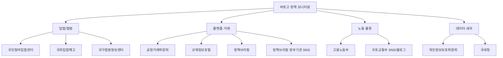
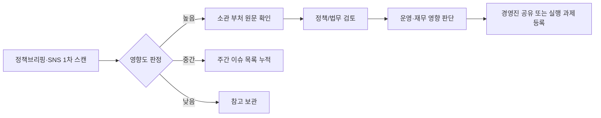

Creator: member-delta
Created: 2026-07-29 18:44
Version: 1.0

# 시각자료 개요

- 바로고 정책 모니터링 채널 11개를 `입법/법령`, `플랫폼·거래`, `노동·물류`, `데이터·세무`의 4개 축으로 시각화했다.
- 운영상 우선순위는 `우선 모니터링 8개`, `보조 모니터링 3개` 구조로 정리했다.
- 근거 출처는 `member-alpha/analysis-report.md`의 `채널별 근거와 포함 이유` 표와 `member-gamma/fact-check-log.md`의 공식 메뉴·원문 발췌다.
- 우선/보조 구분 기준은 `입법예고·보도자료·실시간 SNS처럼 신호가 빠르고 운영 영향이 직접적인가` 여부다.

# Mermaid 다이어그램

채널 분류와 우선순위 구조

모니터링 운영 흐름

# 핵심 수치 테이블

| 구분 | 채널 수 | 선정 근거 | 채널 |
|---|---:|---|---|
| 전체 권장 채널 | 11 | alpha가 11개 공식 채널을 4개 리스크 축으로 정리했고, gamma가 각 채널의 공식 메뉴/원문 발췌를 수집함 | 국민참여입법센터, 국회입법예고, 국가법령정보센터, 규제정보포털, 정책브리핑, 정책브리핑 정부기관 SNS, 국토교통부 SNS/블로그, 고용노동부, 공정거래위원회, 개인정보보호위원회, 국세청 |
| 우선 모니터링 | 8 | alpha 기준상 `입법예고`, `전 부처 보도자료`, `실시간 SNS`, `택배·플랫폼 직접 규제` 채널 | 국민참여입법센터, 국회입법예고, 국가법령정보센터, 정책브리핑, 정책브리핑 정부기관 SNS, 고용노동부, 공정거래위원회, 국토교통부 SNS/블로그 |
| 보조 모니터링 | 3 | alpha 기준상 전문 규제·세무·개인정보 영역으로 주기 점검형 채널 | 개인정보보호위원회, 국세청, 규제정보포털 |

| 리스크 축 | 포함 채널 수 | 근거 채널 예시 | 점검 주기 |
|---|---:|---|---|
| 입법/법령 | 3 | `통합입법예고`, `진행 중 입법예고`, `최신법령소식` | 매일 |
| 플랫폼·거래 | 4 | `전자상거래에서 소비자 보호`, `규제법령 정보`, `전 부처 보도자료`, `부처 블로그 실시간 제공` | 매일~주 1회 |
| 노동·물류 | 2 | `택배물류 현장의 무더위`, 국토교통부 공식 블로그 노출 게시물 | 매일 |
| 데이터·세무 | 2 | `기업정책 자료실`, `부가가치세`, `전자(세금)계산서` | 주 2~3회 |

| 주기 유형 | 채널 수 | 설명 |
|---|---:|---|
| 매일 | 8 | 바로고 운영에 직접 영향이 큰 채널 |
| 주 2~3회 | 2 | 데이터·세무 성격의 전문 채널 |
| 주 1회 | 1 | 범부처 규제 스캔용 채널 |
