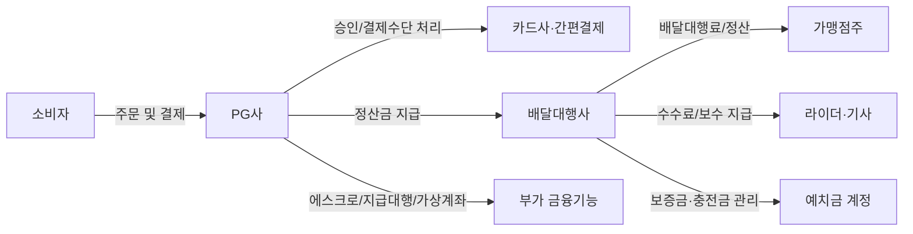
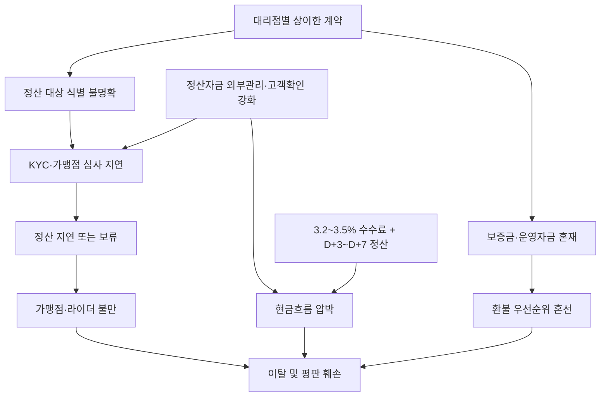

# 배달대행사 PG사 이슈 분석
**작성일**: 2026-07-29
**Task Type**: research-report
**활성 멤버**: alpha · gamma · delta · beta
**사이클**: 1 / 3
**승인**: human_approval=false (자동 완료)

# 요약

배달대행사와 PG사 사이의 핵심 이슈는 `결제 연동`보다 `정산과 자금보호 체계`에 있다. 토스페이먼츠와 페이플 자료에 따르면 PG는 결제 승인 외에도 정산, 에스크로, 지급대행, 가상계좌, 관리자 기능까지 담당한다. 따라서 배달대행사가 PG를 붙이는 순간 결제 성공률만이 아니라 정산 주기, 자금보호, 고객확인, 가상계좌 통제, 예치금 관리까지 함께 관리해야 한다.

공개 자료상 일반 카드 수수료는 3.2~3.5%, 정산 체감 범위는 D+3~D+7 수준이다. 배달대행업은 소액 고빈도 거래와 빠른 기사·점주 정산이 특징이므로, 이 구조는 일반 커머스보다 더 큰 운전자금 압박을 만든다. 동시에 2026년 기사 제목 스캔에서는 정산자금 외부관리, 고객확인 의무, 가상계좌 관리 강화 방향이 반복 관측돼, PG 연동의 진입 장벽이 운영 편의가 아니라 내부통제 수준으로 옮겨가고 있다.

결론적으로 배달대행사는 `PG를 도입할지`보다 `어떤 자금을 어떤 통제로 굴릴지`를 먼저 정해야 한다. 보증금, 충전금, 배달대행료, 일반 매출대금을 섞어 관리하면 작은 정산 지연도 곧바로 평판 문제로 확대될 가능성이 높다.

# 핵심 이슈

## 1. 정산 지연과 수수료 부담이 손익을 직접 흔든다

포트원(2025-12-04)은 일반 카드 수수료 3.2~3.5%, 정산 주기 D+4~5를 제시하고, 페이업(2025-11-17)은 정산 체크 범위를 D+3~D+7로 제시한다. 배달대행업에서는 기사 정산과 점주 정산이 주문 이후 짧은 주기로 이어지기 때문에, 같은 수치라도 일반 쇼핑몰보다 충격이 크다. 결국 배달대행사가 PG 정산속도만 믿고 운전자금을 최소화하면 성장기나 사고 시점에 유동성 리스크가 먼저 드러난다.

## 2. 고객확인과 가상계좌 통제는 확장 속도의 병목이 될 수 있다

2026년 Google News RSS 제목 스캔에서는 `PG사, 제3자 지급 정산에도 고객확인 의무`, `PG사 관리의무 신설`, `가상계좌 재판매 기준 도입` 같은 보도가 반복 확인된다. 본문을 모두 확보한 것은 아니므로 확정 규정으로 단정할 수는 없지만, 적어도 정책 방향이 `자금 흐름 추적 강화` 쪽으로 이동하는 정황은 명확하다. 대리점, 점주, 라이더, 예치금, 가상계좌가 복합적으로 얽힌 배달대행 구조에서는 이 변화가 바로 심사 지연과 정산 보류 리스크로 연결될 수 있다.

## 3. 배달대행료 카드화는 성장 기회이자 비용 증가 요인이다

2023~2024년 기사 제목 스캔에서는 `배달대행료 카드결제 서비스 MOU`, `배달대행용 제휴카드 출시`, `점주 배달비 카드결제 서비스 전국 확대` 같은 흐름이 반복 관측된다. 이는 점주 입장에서 카드 결제 기반의 배달비 처리 수요가 존재함을 보여준다. 다만 카드화가 확대될수록 PG 수수료, 취소/환불 처리, 세무 정합성, 정산 데이터 매칭 비용이 함께 증가하므로, 배달대행사는 편의성과 비용을 동시에 관리해야 한다.

## 4. 예치금과 보증금은 일반 매출대금과 분리해야 한다

`신용카드로 결제한 배달보증금` 보호 사각 우려가 기사 제목 수준에서라도 확인되는 점은, 배달대행업의 민감 자금이 일반 결제대금과 다른 보호 논리를 가져야 함을 시사한다. 기사 보증금, 점주 충전금, 광고성 예수금, 일반 배달대행료가 한 계정과 한 원장에 섞이면 환불 우선순위와 자금 귀속 설명이 어려워진다. 이 문제는 법률 리스크 이전에 먼저 신뢰 리스크로 폭발할 가능성이 높다.

# 시각자료

배달대행사와 PG사의 기본 거래/정산 구조

규제 강화와 운영 미비가 결합될 때의 리스크 확대 경로

| 항목 | 수치 | 의미 | 출처 |
|---|---:|---|---|
| 국내 등록 PG사 수 | 150여 개 | 공급자는 많지만 시장은 분산돼 있지 않음 | PortOne |
| 상위 4개 PG 점유율 | 65~70% | 실질 협상력은 대형 PG에 집중 | PortOne |
| 일반 카드 수수료 | 3.2~3.5% | 소액 고빈도인 배달대행료에 부담 가능 | PortOne |
| 일반 정산 주기 | D+4~5 | 주문 실시간성 대비 현금 유입은 지연 | PortOne |
| 정산 체크 범위 | D+3~D+7 | PG 선택 시 운영 체감 차이가 큼 | PayUp |
| PG 경유 일평균 결제 건수 | 3,314만 건 | PG 의존도가 높은 시장 환경 | PayUp |
| PG 경유 일평균 결제 금액 | 1조 5천억 원 | 대행업도 PG 체계 편입 압력 확대 | PayUp |

# 추천 사항

1. 30일 내
   - 자금 원장을 `매출대금`, `배달대행료`, `보증금`, `충전금`으로 분리한다.
   - 현재 PG 계약 기준 수수료율과 정산주기를 재정리해 손익 영향표를 만든다.

2. 60일 내
   - 대리점, 점주, 라이더 온보딩에서 실명확인, 계좌확인, 정산 대상 식별 규칙을 통일한다.
   - 가상계좌와 예치금 계정을 운영자금과 분리하고 환불 우선순위를 문서화한다.

3. 90일 내
   - PG사 재협상 항목을 `정산주기`, `보류 사유 통지`, `사고 시 자금 보호 방식`, `선정산/에스크로 가능 여부`로 묶어 관리한다.
   - 카드결제 확대는 전체 일괄 전환보다 지역/가맹점군 단위 시범 적용으로 시작한다.

4. 상시
   - 규제 기사나 공문은 제목 수준 확인과 본문 확인을 구분해 관리한다.
   - `정산 지연`, `환불 지연`, `예치금 문의`를 월 단위 운영 리스크 지표로 둔다.

# 출처 및 한계

주요 출처:
- 토스페이먼츠 서비스 페이지: PG 제공 기능 범위 확인
- 페이플 `PG가 뭐에요?`: PG 역할과 정산 대행 설명
- 페이업 `결제대행업체(PG사) 총정리` (2025-11-17): PG 거래 규모, 정산 주기 체크포인트
- 포트원 `2026년 국내 PG사 비교!` (2025-12-04): PG 수수료, 정산 주기, 시장 집중도
- Google News RSS 제목 스캔 (2023-06-21, 2023-06-25, 2024-03-26, 2026-01-10, 2026-04-29, 2026-06-19): 규제·배달대행료 카드화·예치금 이슈 정황 확인

한계:
- 일부 규제와 사건성 이슈는 기사 본문이 아니라 제목 수준에서만 1차 확인했다.
- 따라서 `확정 규정`이 아니라 `정책 방향` 또는 `시장 정황`으로만 해석해야 한다.
- 특정 회사의 개별 사고 원인 분석이 아니라 업계 공통 구조 리스크 중심의 보고서다.
