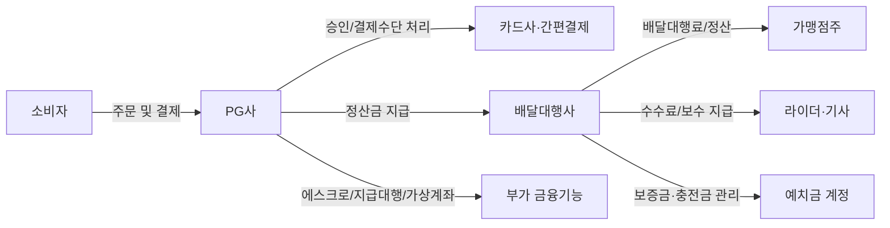
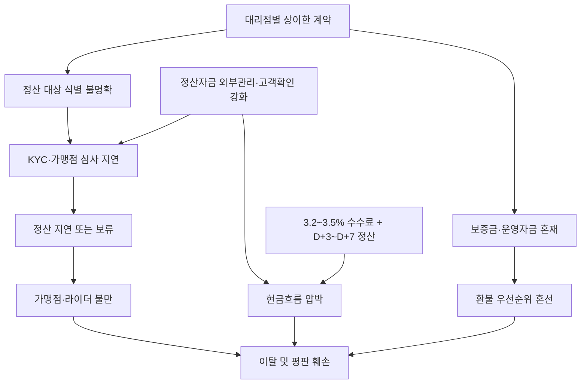

Creator: member-delta
Created: 2026-07-29 17:13
Version: 1.0

# 시각자료 개요

이 문서는 배달대행사 PG 이슈를 `거래 흐름`, `리스크 확대 경로`, `핵심 수치`로 빠르게 파악할 수 있도록 구성했다. 수치는 모두 upstream 산출물에 이미 등장한 값만 사용했다.

# Mermaid 다이어그램

배달대행사와 PG사의 기본 거래/정산 구조

규제 강화와 운영 미비가 결합될 때의 리스크 확대 경로

# 핵심 수치 테이블

| 항목 | 수치 | 의미 | 출처 |
|---|---:|---|---|
| 국내 등록 PG사 수 | 150여 개 | 공급자는 많지만 시장은 분산돼 있지 않음 | PortOne |
| 상위 4개 PG 점유율 | 65~70% | 실질 협상력은 대형 PG에 집중 | PortOne |
| 일반 카드 수수료 | 3.2~3.5% | 소액 고빈도인 배달대행료에 부담 가능 | PortOne |
| 일반 정산 주기 | D+4~5 | 주문 실시간성 대비 현금 유입은 지연 | PortOne |
| 정산 체크 범위 | D+3~D+7 | PG 선택 시 운영 체감 차이가 큼 | PayUp |
| PG 경유 일평균 결제 건수 | 3,314만 건 | PG 의존도가 높은 시장 환경 | PayUp |
| PG 경유 일평균 결제 금액 | 1조 5천억 원 | 대행업도 PG 체계 편입 압력 확대 | PayUp |
