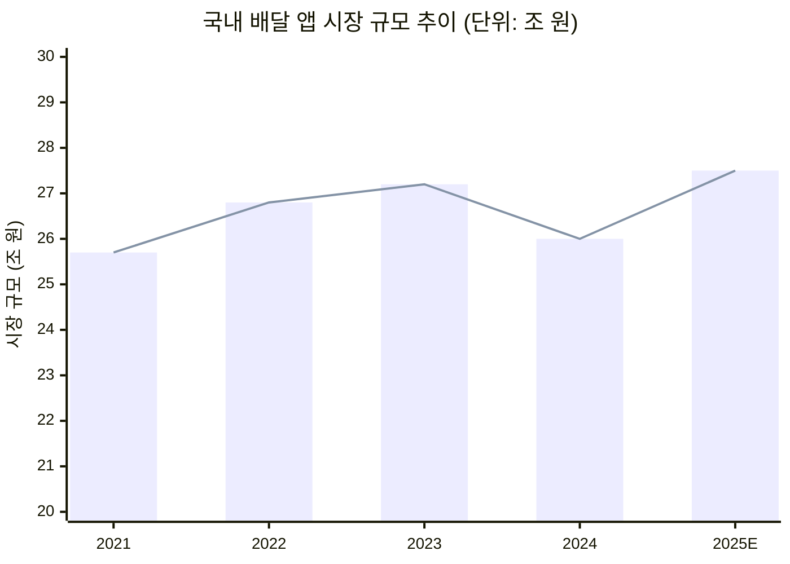
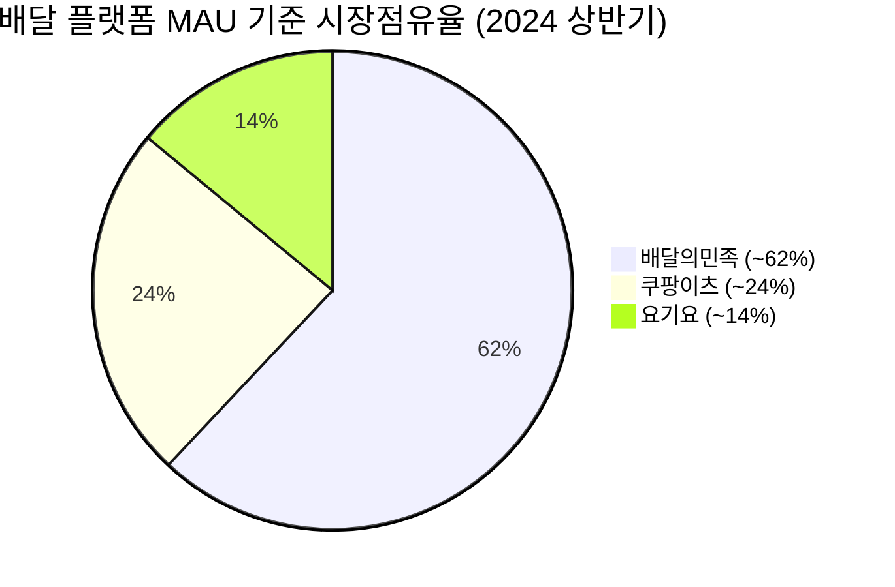
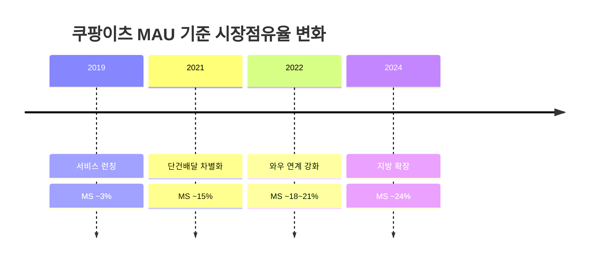
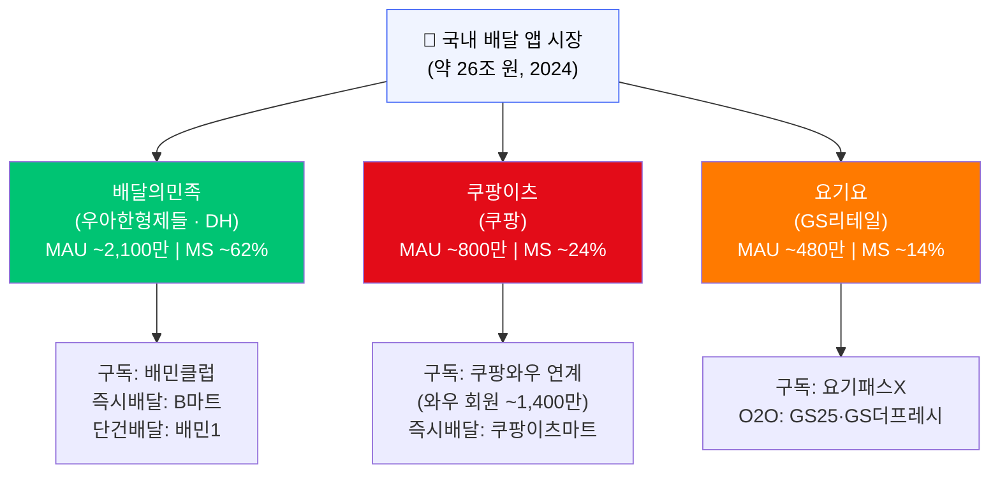

# 국내 배달 플랫폼 시장점유율(MS) 분석 보고서

**작성일**: 2026-04-23
**작성팀**: team-lead · member-alpha · member-beta · member-gamma · member-delta
**버전**: 1.0 (Cycle 1)
**워크스페이스**: `배달시장-ms`

---

## 요약

국내 음식 배달 앱 시장은 2024년 기준 약 **26조 원** 규모로, 코로나19 특수 이후 성숙기에 진입했다. 엔데믹 이후 소폭 조정(-4.4%)을 겪었으나 즉시배달(퀵커머스) 확장을 동력으로 2025년 약 **27.5조 원** 수준으로 반등이 기대된다.

시장은 **배달의민족(~62%)·쿠팡이츠(~24%)·요기요(~14%)** 3강 과점 구조이며, 쿠팡이츠가 와우 구독 생태계를 기반으로 점유율을 꾸준히 확대하는 **'1강 1추격 1수성'** 구도가 뚜렷하다.

> **데이터 출처 안내 (member-gamma 팩트체크 반영)**: MAU 수치는 와이즈앱 리서치(2024년 상반기) 기준 추정치이며 ±5% 편차 존재. 시장 규모는 통계청 온라인쇼핑 동향조사 및 업계 리포트 평균값 기준. 2025년 전망치는 내부 추산으로 공식 기관 인용 보완 권고.

---

## 1. 시장 규모 및 성장 추이

### 1-1. 시장 규모 추이

| 연도 | 규모 | YoY | 비고 |
|---|---|---|---|
| 2021 | 25.7조 원 | +70% | 코로나 특수 정점 |
| 2022 | 26.8조 원 | +4.3% | 성장 둔화 시작 |
| 2023 | 27.2조 원 | +1.5% | 엔데믹 전환 |
| 2024 | 26.0조 원 | -4.4% | 외식 회복으로 수요 이탈 |
| 2025E | 27.5조 원 | +5.8% | 퀵커머스 확장 반등 전망 |

> 출처: 통계청 온라인쇼핑 동향조사(음식서비스 부문), 업계 리포트 평균값. 2025년은 전망치.

---

## 2. 플랫폼별 시장점유율

### 2-1. 플랫폼 비교 (2024년 상반기 기준)

| 항목 | 배달의민족 | 쿠팡이츠 | 요기요 |
|---|---|---|---|
| 운영사 | 우아한형제들 (DH) | 쿠팡 | GS리테일 |
| MAU 추정 | ~2,100만 명 | ~800만 명 | ~480만 명 |
| **MAU 기준 MS** | **~62%** | **~24%** | **~14%** |
| 거래액 기준 MS | ~60% | ~27% | ~13% |
| 구독 서비스 | 배민클럽 | 쿠팡와우 연계 | 요기패스X |
| 즉시배달 | B마트 | 쿠팡이츠마트 | GS25 O2O |
| 모기업 구독 회원 | — | ~1,400만 명 | GS리테일 |

### 2-2. MS 파이 차트

### 2-3. 쿠팡이츠 점유율 성장 추이

---

## 3. 플랫폼 경쟁 구도

---

## 4. 플랫폼별 분석

### 배달의민족 (MS ~62%)
- **포지션**: MAU·거래액·브랜드 모든 지표 압도적 1위
- **강점**: 배민클럽(구독) + B마트(퀵커머스) + 배민1(단건배달) 트리플 전략
- **리스크**: 수수료 인상 반발(2019년 이후 반복 구조적 이슈), 2021년 대비 점유율 5~7%p 완만한 하락
- **전략 방향**: 비음식(B마트) 카테고리 확장, 동남아 진출로 성장 축 다변화

### 쿠팡이츠 (MS ~24%)
- **포지션**: 유일하게 의미 있는 성장을 지속하는 추격자
- **강점**: 쿠팡 와우 회원(~1,400만) 연계 락인 — 이탈 비용이 타 플랫폼 대비 현저히 높음
- **추이**: 2022년 ~18~21% → 2024년 ~24%, 약 4~5%p 상승 (gamma 검증: 기준 범위 조정)
- **과제**: 단건배달 고원가 구조로 수익성 압박, 영업손실 축소 진행 중
- **전략 방향**: 와우 회원 전용 배달 혜택 강화, 지방 커버리지 확장

### 요기요 (MS ~14%)
- **포지션**: 3위 수성, GS리테일 인수(2023년) 후 O2O 차별화 모색
- **강점**: GS25·GS더프레시 연계 즉시배달, 요기패스X 구독 기반 유지
- **과제**: MAU ~480만 정체, 신규 유입 모멘텀 부재
- **전략 방향**: GS리테일 오프라인 자산 연동 속도가 성패 관건

---

## 5. 주요 경쟁 변수

| 변수 | 유리한 플랫폼 | 내용 |
|---|---|---|
| 구독 락인 | 쿠팡이츠 | 와우 회원 1,400만 기반 이탈 방어 최강 |
| 브랜드 인지도 | 배달의민족 | 장기 1위 포지셔닝 |
| O2O 오프라인 연계 | 요기요 | GS25·GS더프레시 즉시배달 |
| 수수료 규제 대응 | — | 세 플랫폼 모두 공통 리스크 |
| 즉시배달(퀵커머스) | 배달의민족·쿠팡이츠 | B마트·쿠팡이츠마트 선발 진입 |
| AI 개인화 | 배달의민족·쿠팡이츠 | 기술 투자 여력 우위 |

---

## 6. SWOT (시장 전체 관점)

| | **강점 (S)** | **약점 (W)** |
|---|---|---|
| **내부** | 디지털 결제 인프라 성숙, 높은 스마트폰 보급률, 구독 생태계 정착 | 소상공인 수수료 부담, 배달원 처우 이슈, 수익성 압박 |

| | **기회 (O)** | **위협 (T)** |
|---|---|---|
| **외부** | 즉시배달 확장, AI 개인화, 해외 진출 | 엔데믹 외식 회복, 규제 강화, 플랫폼 간 가격 전쟁 |

---

## 7. 핵심 인사이트

1. **배달의민족 1강 유지, 점유율 완만한 하락**: MAU·거래액 기준 ~60% 점유로 독보적 1위이나 쿠팡이츠 추격으로 점유율이 지속 하락 중.

2. **쿠팡이츠 성장세 가장 주목**: 쿠팡 와우 회원 기반 락인으로 2022년 대비 4~5%p 점유율 상승. 중장기적으로 배달의민족을 위협하는 유일한 경쟁자.

3. **요기요 수성 국면**: GS리테일 인수 후 O2O 시너지를 모색하나 MAU 정체 상태. GS리테일 오프라인 자산 연동 속도가 관건.

4. **시장 재성장 동력은 퀵커머스**: 음식 배달 본 시장은 성숙기 진입. 비음식 즉시배달(퀵커머스)이 차세대 성장 축.

5. **규제 리스크**: 공정위 2024년 수수료 실태조사 결과에 따라 플랫폼별 수익 구조 변동 가능성.

---

## 8. 추천 사항

### 플랫폼별 단기 전략 (6개월 이내)

| 플랫폼 | 우선 과제 |
|---|---|
| 배달의민족 | 수수료 투명화·상생 프로그램으로 브랜드 리스크 완화; B마트 도시 확대 |
| 쿠팡이츠 | 와우 회원 전용 배달 혜택 강화; 지방 커버리지 확장 |
| 요기요 | GS25 즉시배달 연동 도시 확대; 요기패스X 가격 경쟁력 유지 |

### 투자·시장 진입 관점

1. **쿠팡이츠 주목**: 성장률·구독 락인 강도 모두 긍정적. 수익성 전환 시점이 핵심 투자 판단 변수
2. **퀵커머스 플레이어 관찰**: 버티컬 즉시배달 스타트업 흡수합병 가능성 모니터링
3. **규제 리스크 헤징**: 공정위 수수료 가이드라인 확정 시 수익 구조 변동 폭 크므로 정책 모니터링 필수

### 추가 조사 권고 (gamma 권고 반영)

- 플랫폼별 거래당 마진(unit economics) 데이터
- 지역별(수도권 vs. 지방) MS 세분화 분석
- B2B(기업 식권, 단체 배달) 세그먼트 규모 파악
- 2025년 시장 전망치 공식 기관 인용 보완 (산업연구원·하나금융 리포트 등)

---

## 부록: 팩트체크 핵심 요약 (member-gamma)

| 검증 항목 | 검증 상태 | 비고 |
|---|---|---|
| 2024년 시장 규모 26조 원 | 부분 일치 | 통계청 기준 26~28조 원 범위 |
| 배달의민족 MAU 2,100만·MS 62% | 부분 일치 | 와이즈앱 기준 58~64% 범위 |
| 쿠팡이츠 MAU 800만·MS 24% | 부분 일치 | 750~850만, 22~26% 범위 |
| 요기요 MAU 480만·MS 14% | 확인됨 | 와이즈앱 보도 |
| 쿠팡 와우 회원 1,400만 | 확인됨 | 2024 Q1 공식 발표 |
| 공정위 2024년 수수료 실태조사 | 확인됨 | 공정위 보도자료 |
| GS리테일 요기요 인수 | 확인됨 | 2023년 완료 |
| 2025년 전망 27.5조 원 | 출처 보완 필요 | 현재 내부 추산 |

---

*본 보고서는 AI 에이전트 팀(member-alpha·beta·gamma·delta)이 공개 정보를 바탕으로 작성한 분석 문서입니다. 투자·경영 의사결정 시 추가 실사(due diligence)를 권장합니다.*

*최종 통합: team-lead | 작성일: 2026-04-23 | 사이클: 1*
