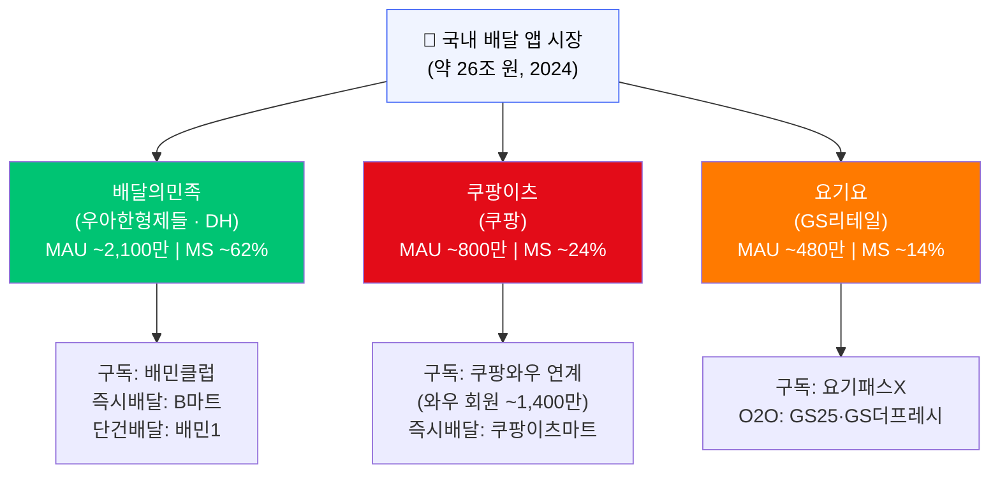
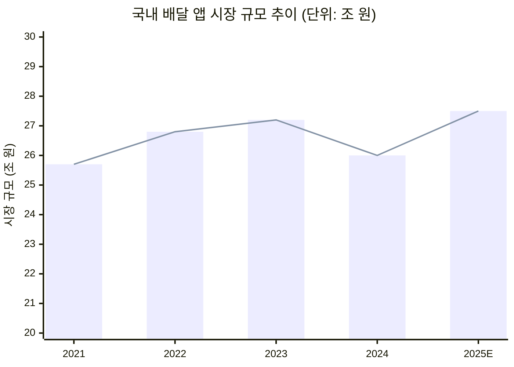
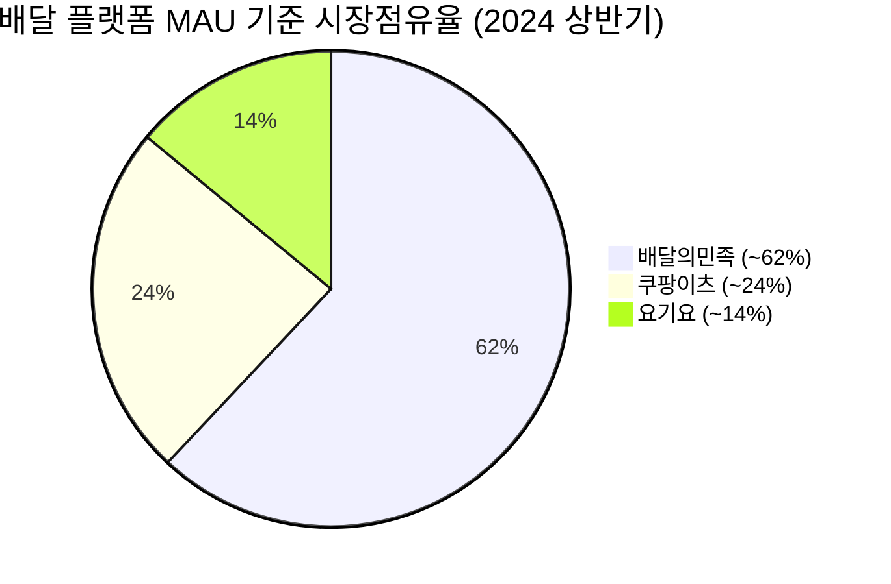
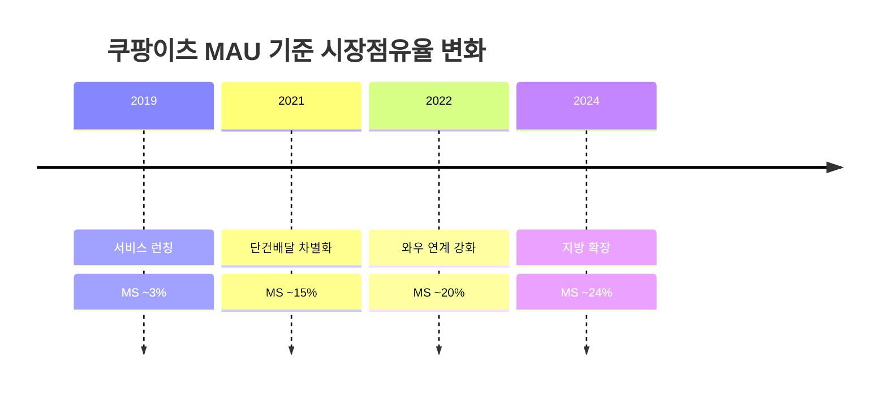

# 시각자료 — 배달시장 MS 분석

## 시각자료 개요

본 파일은 `member-alpha/analysis-report.md` 의 분석 결과를 바탕으로 다음 시각자료를 제공한다.

1. **플랫폼 경쟁 구도 다이어그램** (Mermaid graph)
2. **시장점유율 추이 다이어그램** (Mermaid timeline/chart)
3. **플랫폼별 MS 비교 다이어그램** (Mermaid pie)
4. **핵심 수치 비교 테이블** (Markdown table)

---

## Mermaid 다이어그램

### 다이어그램 1: 배달 플랫폼 경쟁 구도 (2024년 기준)

### 다이어그램 2: 시장 규모 추이 (2021~2025E)

### 다이어그램 3: 플랫폼별 MAU 기준 시장점유율 (2024년 상반기)

### 다이어그램 4: 쿠팡이츠 점유율 성장 추이

---

## 핵심 수치 테이블

### 표 1: 플랫폼별 주요 지표 비교 (2024년 기준)

| 항목 | 배달의민족 | 쿠팡이츠 | 요기요 |
|---|---|---|---|
| 운영사 | 우아한형제들(DH) | 쿠팡 | GS리테일 |
| MAU (추정) | ~2,100만 명 | ~800만 명 | ~480만 명 |
| MAU 기준 MS | **~62%** | **~24%** | **~14%** |
| 거래액 기준 MS | ~60% | ~27% | ~13% |
| 구독 서비스 | 배민클럽 | 쿠팡와우 연계 | 요기패스X |
| 즉시배달 브랜드 | B마트 | 쿠팡이츠마트 | GS25 O2O |
| 모기업 와우/구독 회원 | — | ~1,400만 명 | GS리테일 |

### 표 2: 시장 규모 추이 (단위: 조 원)

| 연도 | 규모 | YoY 성장률 | 비고 |
|---|---|---|---|
| 2021 | 25.7 | +70% | 코로나 특수 최정점 |
| 2022 | 26.8 | +4.3% | 성장 둔화 시작 |
| 2023 | 27.2 | +1.5% | 엔데믹 전환 |
| 2024 | 26.0 | -4.4% | 외식 회복으로 수요 이탈 |
| 2025E | 27.5 | +5.8% | 퀵커머스 확장으로 반등 전망 |

### 표 3: 주요 경쟁 변수 요약

| 변수 | 유리한 플랫폼 | 내용 |
|---|---|---|
| 구독 락인 | 쿠팡이츠 | 와우 회원 1,400만 기반 이탈 방어 |
| 브랜드 인지도 | 배달의민족 | 장기 1위 포지셔닝 |
| O2O 오프라인 연계 | 요기요 | GS25·GS더프레시 즉시배달 |
| 수수료 규제 대응 | — | 세 플랫폼 모두 리스크 동일 |
| 즉시배달(퀵커머스) | 배달의민족·쿠팡이츠 | B마트·쿠팡이츠마트 선발 진입 |
