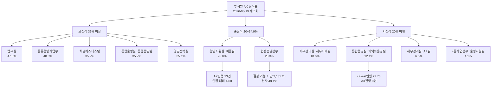
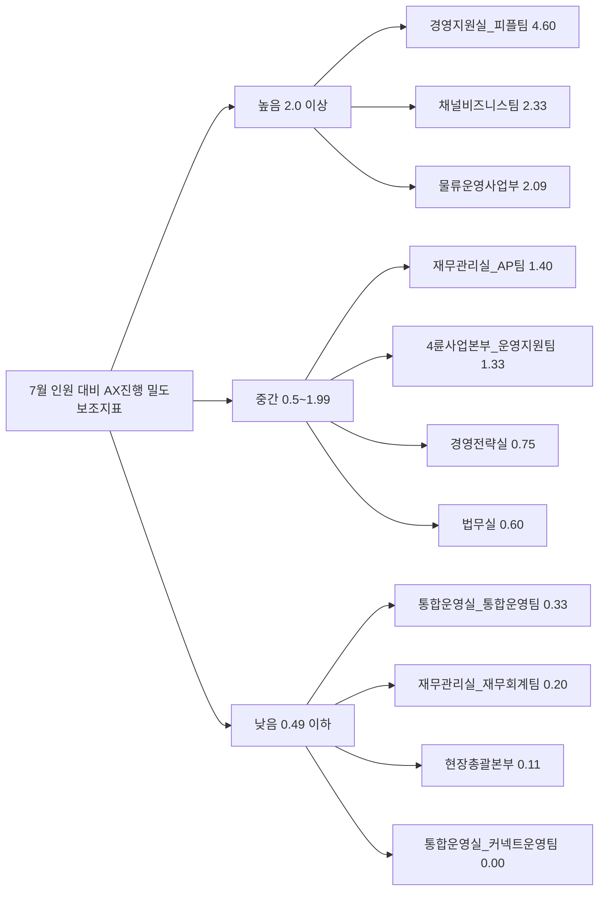

# 부서별 AX 진척율 분석

Creator: team-lead
Created: 2026-08-19 10:13
Version: 1.1

**작성일**: 2026-08-19
**Task Type**: research-report
**활성 멤버**: alpha(조사) · gamma(팩트체크) · delta(시각화) · beta(보고서)
**사이클**: 1 / 3
**승인**: human_approval=false (자동 완료, 후속 지시로 AX 재조회 성공본 반영)

# 요약
- 확인됨(2026-08-19 재조회): AX 원문 `cases` / `reports` / `departments`를 다시 조회했고 세 엔드포인트가 모두 성공했다.
- 확인됨(2026-08-19 재조회): 전사 AX 케이스는 `427건`, 대상 부서는 `11개`, 총 월간 업무시간은 `14,982.72시간`, 가중 평균 절감률은 `29.7%`, 환산 절감 가능 시간은 `4,443.6시간`이다.
- 확인됨(2026-08-19 재조회): 평균 진척률 상위권은 `법무실 47.8%`, `물류운영사업부 40.0%`, `채널비즈니스팀 35.2%`, `통합운영실_통합운영팀 35.2%`, `경영전략실 35.1%`다.
- 확인됨(2026-08-19 재조회): 하위권은 `통합운영실_커넥트운영팀 12.1%`, `재무관리실_AP팀 6.5%`, `4륜사업본부_운영지원팀 4.1%`다.
- 확인됨(2026-08-19 재조회): `현장총괄본부`는 평균 진척률이 `23.3%`지만 절감 가능 시간 `2,135.2시간`으로 전사 영향도 1위이며, `경영지원실_피플팀`은 `AX진행/7월 인원 4.60`으로 인원 대비 실행 밀도가 가장 높다.

# 핵심 지표
| 순위 | 부서 | 평균 진행률 | AX진행 | 완료 | 7월 인원 | AX진행/인원 | 절감 가능 시간 | 신뢰도 | 운영 메모 |
|---|---|---:|---:|---:|---:|---:|---:|---|---|
| 1 | 법무실 | 47.8% | 3 | 8 | 5 | 0.60 | 346.3 | 확인됨(2026-08-19 재조회) | 고진척·고완료 전환 |
| 2 | 물류운영사업부 | 40.0% | 23 | 4 | 11 | 2.09 | 348.4 | 확인됨(2026-08-19 재조회) | 대형 실행 파이프라인 |
| 공동 3위 | 채널비즈니스팀 | 35.2% | 7 | 4 | 3 | 2.33 | 266.0 | 확인됨(2026-08-19 재조회) | 소수 인원 대비 실행 밀도 높음 |
| 공동 3위 | 통합운영실_통합운영팀 | 35.2% | 4 | 11 | 12 | 0.33 | 280.2 | 확인됨(2026-08-19 재조회) | 완료 전환 양호 |
| 5 | 경영전략실 | 35.1% | 3 | 15 | 4 | 0.75 | 228.5 | 확인됨(2026-08-19 재조회) | 완료 전환 우수, 보고서 누락 |
| 6 | 경영지원실_피플팀 | 25.0% | 23 | 0 | 5 | 4.60 | 277.7 | 확인됨(2026-08-19 재조회) | 인원 대비 병목 밀도 1위 |
| 7 | 현장총괄본부 | 23.3% | 2 | 5 | 18 | 0.11 | 2,135.2 | 확인됨(2026-08-19 재조회) | 진척률보다 영향도 우선 관리 |
| 8 | 재무관리실_재무회계팀 | 18.6% | 1 | 3 | 5 | 0.20 | 48.5 | 확인됨(2026-08-19 재조회) | 저영향 저진척 |
| 9 | 통합운영실_커넥트운영팀 | 12.1% | 0 | 11 | 4 | 0.00 | 214.9 | 확인됨(2026-08-19 재조회) | 대형 백로그 대비 신규 실행 부재 |
| 10 | 재무관리실_AP팀 | 6.5% | 7 | 0 | 5 | 1.40 | 223.7 | 확인됨(2026-08-19 재조회) | 완료 전환 없는 저진척 백로그 |
| 11 | 4륜사업본부_운영지원팀 | 4.1% | 4 | 0 | 3 | 1.33 | 74.2 | 확인됨(2026-08-19 재조회) | 초기 단계 |

| 추가 체크 | 수치 | 신뢰도 | 의미 |
|---|---:|---|---|
| 전사 AX 케이스 | 427건 | 확인됨(2026-08-19 재조회) | 기존 재사용본 대비 `+2건` |
| `통합운영실_커넥트운영팀` `cases/7월 인원` | 22.75 | 확인됨(2026-08-19 재조회) | `91건 / 4명`, 대형 백로그 대비 실행 전환 부족 |
| 단계 분포 | 일반업무 230 / AX진행 77 / 완료 61 / 예정 41 / 중단 18 | 확인됨(2026-08-19 재조회) | 실행 구간 총량은 유지, 일반업무만 소폭 증가 |
| `progress_rate=100` 미종결 | 7건 | 확인됨(2026-08-19 재조회) | 종료 처리 지연으로 KPI 신뢰도 저하 |
| `경영전략실` 보고서 누락 | 1개 부서 | 확인됨(2026-08-19 재조회) | 정성 설명 커버리지 불완전 |
| 최신 케이스 수정 시각 | 2026-08-18 05:47:45 | 확인됨(2026-08-19 재조회) | `통합운영실_커넥트운영팀` 최근 수정 |
| 최신 보고서 작성 시각 | 2026-07-03 11:07:59 | 확인됨(2026-08-19 재조회) | 정성 보고 체계는 최신성 낮음 |

# 핵심 인사이트
## 1. 이번 재조회로 최신 수치를 확보했지만, 부서별 진척률의 전체 구조는 유지됐다
- 확인됨(2026-08-19 재조회): 상위권은 여전히 `법무실`과 `물류운영사업부`가 이끌고, `채널비즈니스팀`, `통합운영실_통합운영팀`, `경영전략실`이 `35%` 안팎에서 촘촘히 뒤를 잇는다.
- 확인됨(2026-08-19 재조회): 전사 AX 케이스는 `427건`으로, 기존 재사용 스냅샷 대비 `+2건` 늘었다.
- 추정(운영 해석): 전반적인 우선순위는 바뀌지 않았지만, 상위권 내부에서는 `완료 전환`과 `정성 보고 보강`이 순위를 가르는 핵심 요소가 됐다.

## 2. 진척률 1등 부서와 영향도 1등 부서는 다르며, `현장총괄본부`는 별도 관리가 맞다
- 확인됨(2026-08-19 재조회): `현장총괄본부`는 평균 진척률 `23.3%`에 그치지만 절감 가능 시간 `2,135.2시간`으로 전사 총량의 `48.1%`를 차지한다.
- 추정(운영 해석): 경영 보고에서는 `진척률 상위 부서`와 `절감효과 상위 부서`를 같은 축으로 평가하면 안 되며, 이번 스냅샷에서 별도 관리 대상은 `현장총괄본부`다.

## 3. 실행 파이프라인이 큰 부서일수록 완료 전환 관리가 중요하고, `인원 대비 밀도`가 병목을 더 분명하게 보여준다
- 확인됨(2026-08-19 재조회): `물류운영사업부`와 `경영지원실_피플팀`은 각각 `AX진행 23건`이다.
- 확인됨(2026-08-19 재조회): `경영지원실_피플팀`은 `AX진행/7월 인원 4.60`으로 가장 높고, `채널비즈니스팀 2.33`, `물류운영사업부 2.09`가 뒤를 잇는다.
- 추정(해석 주의): `AX진행/인원`은 실제 참여 인원이 아니라 `부서 인원 대비 진행 중 케이스 밀도` 보조지표다.
- 추정(운영 해석): `피플팀`은 완료 기준 단순화와 우선순위 정리가, `물류운영사업부`는 완료 전환 가속이, `채널비즈니스팀`은 적은 인원 대비 높은 실행 부하 관리가 핵심 과제다.

## 4. 최신 재조회 성공과 별개로 운영 거버넌스 이슈는 그대로 남아 있다
- 확인됨(2026-08-19 재조회): `progress_rate=100`인데 `완료`로 닫히지 않은 케이스가 `7건`이다.
- 확인됨(2026-08-19 재조회): `경영전략실`은 여전히 `reports`가 누락돼 있다.
- 확인됨(2026-08-19 재조회): `reports` 최신 작성 시점은 `2026-07-03`, `cases` 최신 수정 시점은 `2026-08-18`이다.
- 추정(운영 해석): 오늘 재조회가 성공했다고 해서 모든 부서의 운영 상태가 최근까지 균일하게 관리되고 있다는 뜻은 아니다. 월간 성과 확정판에는 `cases`를 기준선으로 쓰고, `reports`는 보조 근거로 제한하는 편이 안전하다.

# 시각 요약
부서별 진척률과 영향도 구조도.

아래 두 다이어그램의 수치와 날짜는 별도 표기가 없는 한 모두 `확인됨(2026-08-19 재조회)` 기준이다.

인원 대비 실행 밀도와 운영 포인트.

# 추천 사항
1. 추정(2026-08-19 재조회 기준): `현장총괄본부`는 평균 진척률보다 `절감 가능 시간`과 `완료 유지율`을 핵심 KPI로 별도 관리한다.
2. 추정(2026-08-19 재조회 기준): `물류운영사업부`와 `경영지원실_피플팀`은 `AX진행 23건` 파이프라인을 우선 점검해 완료 전환 병목을 줄인다.
3. 추정(2026-08-19 재조회 기준): `통합운영실_커넥트운영팀`, `재무관리실_AP팀`, `4륜사업본부_운영지원팀`은 신규 발굴 확대보다 `업무 정의`, `절감률 입력`, `실행 단계 전환`부터 재설계한다.
4. 확인됨(운영 보강 필요): `progress_rate=100` 미종결 7건과 `경영전략실` 보고서 누락을 정리해 부서별 진척률 KPI의 신뢰도를 높인다.
