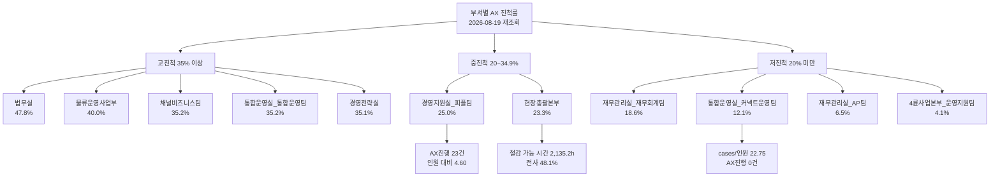
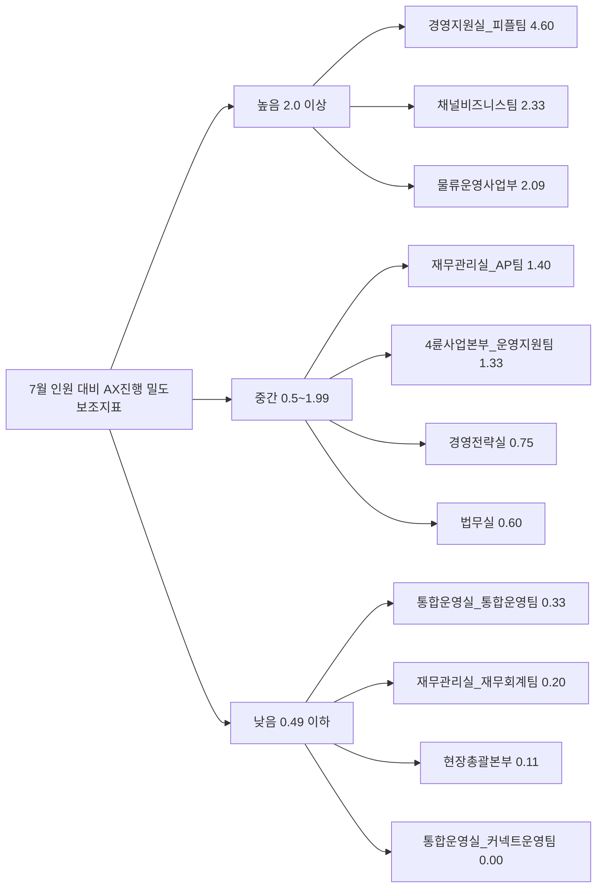

Creator: member-delta
Created: 2026-08-19 10:13
Version: 1.1

# 시각자료 개요
- 부서별 AX 진척률을 `진척률`, `절감 효과`, `인원 대비 파이프라인 밀도` 세 축으로 빠르게 읽도록 재구성했다.
- 수치는 `output/부서별-ax-진척율/member-alpha/analysis-report.md`와 최신 AX 원문 재조회 결과 기준이다.
- 확인됨: `2026-08-19 10:13` AX `cases` / `reports` / `departments` 재조회가 모두 성공했다.
- 확인 필요(해석): `AX진행/7월 인원`은 실제 참여 인원이 아니라 `부서 인원 대비 진행 중 케이스 밀도` 보조지표다.

# Mermaid 다이어그램
부서별 진척률과 영향도 구조도.

인원 대비 실행 밀도와 운영 포인트.

아래 다이어그램의 수치와 날짜는 별도 표기가 없는 한 모두 `확인됨(2026-08-19 재조회)` 기준이다.

# 핵심 수치 테이블
| 부서 | 평균 진행률 | AX진행 | 완료 | 7월 인원 | AX진행/인원 | 절감 가능 시간 | 신뢰도 | 운영 판독 |
|---|---:|---:|---:|---:|---:|---:|---|---|
| 법무실 | 47.8% | 3 | 8 | 5 | 0.60 | 346.3 | 확인됨(2026-08-19 재조회) | 추정: 가장 성숙한 고효율 부서 |
| 물류운영사업부 | 40.0% | 23 | 4 | 11 | 2.09 | 348.4 | 확인됨(2026-08-19 재조회) | 추정: 대형 실행 파이프라인 |
| 채널비즈니스팀 | 35.2% | 7 | 4 | 3 | 2.33 | 266.0 | 확인됨(2026-08-19 재조회) | 추정: 소수 인원 대비 실행 밀도 높음 |
| 통합운영실_통합운영팀 | 35.2% | 4 | 11 | 12 | 0.33 | 280.2 | 확인됨(2026-08-19 재조회) | 추정: 완료 전환 양호 |
| 경영전략실 | 35.1% | 3 | 15 | 4 | 0.75 | 228.5 | 확인됨(2026-08-19 재조회) | 추정: 완료 전환 우수, 보고서 누락 보완 필요 |
| 경영지원실_피플팀 | 25.0% | 23 | 0 | 5 | 4.60 | 277.7 | 확인됨(2026-08-19 재조회) | 추정: 미완료 병목 집중 |
| 현장총괄본부 | 23.3% | 2 | 5 | 18 | 0.11 | 2,135.2 | 확인됨(2026-08-19 재조회) | 추정: 영향도 최상위, 별도 관리 필요 |
| 재무관리실_재무회계팀 | 18.6% | 1 | 3 | 5 | 0.20 | 48.5 | 확인됨(2026-08-19 재조회) | 추정: 저영향 저진척 |
| 통합운영실_커넥트운영팀 | 12.1% | 0 | 11 | 4 | 0.00 | 214.9 | 확인됨(2026-08-19 재조회) | 추정: 대형 백로그 대비 신규 실행 부재 |
| 재무관리실_AP팀 | 6.5% | 7 | 0 | 5 | 1.40 | 223.7 | 확인됨(2026-08-19 재조회) | 추정: 대형 백로그 재설계 필요 |
| 4륜사업본부_운영지원팀 | 4.1% | 4 | 0 | 3 | 1.33 | 74.2 | 확인됨(2026-08-19 재조회) | 추정: 초기 단계 |

| 별도 체크 항목 | 수치 | 의미 |
|---|---:|---|
| 전사 AX 케이스 | 427건 | 확인됨(2026-08-19 재조회): 이전 재사용본 대비 `+2건` |
| `통합운영실_커넥트운영팀` `cases/7월 인원` | 22.75 | 확인됨: `91건 / 4명`, 대형 백로그 대비 실행 전환 부족 |
| `progress_rate=100` 미종결 | 7건 | 확인됨: 종료 처리 지연으로 KPI 신뢰도 훼손 |
| 최신 케이스 수정 시각 | 2026-08-18 05:47:45 | 확인됨: `통합운영실_커넥트운영팀` 최근 업데이트 |
| 최신 보고서 작성 시각 | 2026-07-03 11:07:59 | 확인됨: 정성 보고 체계는 최신성 낮음 |
| 보고서 누락 부서 | 1개 (`경영전략실`) | 확인됨: `cases`와 `reports` 커버리지 불일치 |
