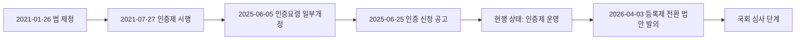

# 소화물 인증 등록제 조사
**작성일**: 2026-07-30
**Task Type**: research-report
**활성 멤버**: alpha · gamma · delta · beta
**사이클**: 1 / 3
**승인**: human_approval=false (자동 완료)

## 요약
- 현행 소화물배송대행서비스사업 제도는 `등록제`가 아니라 `인증제`다.
- 국토교통부는 2025년에도 인증요령을 개정하고 인증 신청 공고를 게시해 현재 제도가 여전히 인증 체계로 운용되고 있음을 보여줬다.
- 공개 확인 가능한 최신 국토교통부 정책보도자료 기준 인증사업자는 총 `10개사`이며, 2025-09-29 `카카오모빌리티`가 신규 인증을 받았다.
- `등록제`는 2026년 발의된 `생활물류서비스산업발전법 일부개정법률안`의 핵심 제안으로, 현행 제도와는 구분해서 해석해야 한다.
- 등록제 발의안은 `제2218086호`, `맹성규의원 대표발의`이며, 공개 확인 범위에서는 `국토교통위원회 소관위 심사` 단계다.

## 핵심 인사이트
- 인증제는 우수 사업자를 선별해 안전성, 신뢰성, 운영 체계를 갖춘 사업자를 정책적으로 유도하는 장치다.
- 정부는 2025년에 인증 신청 공고와 신규 인증사업자 선정 발표를 모두 진행해 인증제가 실제 운용 중인 제도임을 재확인했다.
- 등록제 전환 논의는 시장 전체에 최소 안전기준과 관리의무를 강제하려는 방향으로 읽힌다.
- 따라서 사업자 관점에서는 인증 취득 여부만 볼 것이 아니라, 인증 심사 요소를 미래 규제 체크리스트로 해석할 필요가 있다.
- 근거 자료:
  - 찾기쉬운 생활법령정보: 사업자가 국토교통부장관에게 인증을 신청할 수 있다고 설명
  - 규제정보포털: 인증 기준 공포일 2021-01-26, 시행일 2021-07-27 명시
  - 국가물류통합정보센터: 2025-06-25 인증 신청 공고 게시
  - 국가물류통합정보센터 정책보도자료: 2025-10-01 기준 총 10개 인증사업자 공개
  - 국민참여입법센터: 2026-04-03 발의안이 등록제 도입을 주요내용으로 제시

## 현행 인증제 구조
- 법적 근거: `생활물류서비스산업발전법` 제17조
- 제도 상태: 사업자가 국토교통부장관에게 인증을 신청할 수 있는 구조
- 운영 근거 업데이트:
  - 2021-01-26: 법 제정
  - 2021-07-27: 인증 기준 시행
  - 2025-06-05: 인증요령 일부개정
  - 2025-06-25: 소화물배송대행서비스사업자 인증 신청 공고
  - 2025-09-29: 카카오모빌리티 신규 인증 결정
  - 2025-10-01: 국토교통부 정책보도자료로 총 10개 인증사업자 현황 공개
- 정책 목적: 안전한 서비스 제공, 배달종사자 보호, 품질관리, 신뢰성 있는 운영체계 유도

## 인증제 운영 현황 및 인증 업체
- 운영 현황:
  - 2025-06-25 공고 기준 국토교통부는 인증 신청을 계속 받고 있다.
  - 2025-10-01 정책보도자료 기준 국토교통부는 심사대행기관 `한국교통연구원` 및 민간전문가 심사를 거쳐 신규 인증사업자를 추가 선정했다.
  - 따라서 현행 제도는 명목상 제도가 아니라 실제 신청, 심사, 선정이 작동하는 운영 중 제도다.
- 공개 확인된 인증사업자 현황:
  - 기존 9개사: `(주)우아한청년들`, `(유)플라이앤컴퍼니`, `쿠팡이츠서비스(유)`, `(주)바로고`, `(주)부릉`, `(주)래티브`, `(주)로지올`, `인성데이타(주)`, `(주)디씨핀솔루션`
  - 신규 1개사: `(주)카카오모빌리티`
  - 합계: 총 `10개사`
- 유의사항: 위 업체 명단은 `2025-10-01 국토교통부 정책보도자료`에서 공개 확인된 최신 전체 명단 기준이다. 이번 조사 범위에서는 이를 대체하는 더 최신의 전체 공개 명단은 확인하지 못했다.

## 등록제 전환 논의
- 2026-04-03 발의 개정안은 인증을 받지 않은 사업자에 대한 관리 사각지대를 문제로 제기했다.
- 제안 방향은 등록 의무 부여, 영업점 관리, 종사자 본인 일치 확인, 보험 가입 확인, 교육 이수 의무 확대다.
- 의안접수번호는 `제2218086호`이며, 의안정보시스템 기준 대표발의의원은 `맹성규의원`이다.
- 법안 핵심은 `개인형 이동장치 추가`, `소화물배송대행서비스사업 등록제 전환`, `등록 결격사유·등록취소·휴폐업 신고 규정 신설`, `영업점 관리 의무`, `보험·교육·본인확인 의무의 전체 사업자 확대`다.
- 대표의원실 공식 공개 정보는 `의원회관 918호`, `02-784-6181`, `032-466-9100`이다.
- 국민참여입법센터 공개 화면 기준 진행 단계는 `소관위 심사`이며 `국토교통위원회`에 `2026-04-06` 회부된 상태다. 현재 확인 범위에서는 법사위 심사, 본회의 의결, 공포 이력은 확인되지 않는다.
- 따라서 아직 현행 제도로 단정할 수 없다.

## 시각 자료

| 항목 | 수치/일자 | 의미 |
|------|-----------|------|
| 법 공포일 | 2021-01-26 | 인증제 법적 근거 출발점 |
| 인증 기준 시행일 | 2021-07-27 | 현행 제도 운영 시작 |
| 인증요령 일부개정 | 2025-06-05 | 최근 제도 정비 시점 |
| 인증 신청 공고 | 2025-06-25 | 현재도 인증 신청 체계 유지 |
| 공개 확인된 인증사업자 수 | 10개사 | 2025-10-01 정책보도자료 기준 전체 명단 |
| 최근 신규 인증 | 2025-09-29 카카오모빌리티 | 운영 중 제도라는 점을 보여주는 최신 공개 사례 |
| 등록제 전환 법안 발의 | 2026-04-03 | 등록제는 입법 제안 단계 |
| 의안접수번호 | 제2218086호 | 등록제 전환 법안 식별자 |
| 소관위 회부 | 2026-04-06 | 국토교통위원회 심사 단계 진입 |
| 대표의원실 | 의원회관 918호 / 02-784-6181 | 대표발의 의원실 공식 공개 정보 |

## 추천 사항
- 문서와 커뮤니케이션에서는 `현행 인증제`와 `등록제 전환 논의`를 반드시 분리해 표기한다.
- 인증 업체 명단을 대외 문서에 적을 때는 `2025-10-01 공개 확인 기준 총 10개사`처럼 기준 시점을 함께 표기한다.
- 사업 운영 체계는 종사자 본인확인, 보험, 교육, 영업점 통제 중심으로 선제 정비한다.
- 정책 모니터링은 2026년 발의 법안의 위원회 심사와 후속 하위법령 논의까지 포함해 추적한다.

## 출처
- 찾기쉬운 생활법령정보: https://www.easylaw.go.kr/CSP/OnhunqueansInfoRetrieve.laf?onhunqnaAstSeq=82&onhunqueSeq=5790
- 규제정보포털: https://www.better.go.kr/ba.rgst.RegulCardSlPopup?s_ref_no=0000091194&s_ref_renew_no=00
- 국가물류통합정보센터: https://www.nlic.go.kr/nlic/noticeBoardView.action?BBSCTT_ID=bord000394&command=VIEW&PAGE_CUR=1
- 국가물류통합정보센터 정책보도자료: https://www.nlic.go.kr/nlic/logpolDt.action?fldLogpolRefSeq=1684&command=VIEW&tr_page=1
- 국민참여입법센터: https://opinion.lawmaking.go.kr/gcom/nsmLmSts/out/2218086/detailRP?yType=I
- 대한민국 국회 의안정보시스템: http://likms.assembly.go.kr/bill/billDetail.do?billId=PRC_C2B6Z0F4G0O1N1L7K2G2H0G6E8D2L9&ageFrom=22&ageTo=22
- 대한민국 국회 국회의원 맹성규 페이지: https://www.assembly.go.kr/members/22nd/MAENGSUNGKYU
- 한국교통연구원: https://www.koti.re.kr/user/bbs/anytmRsrchReprtView.do?bbs_no=1150
